# Component Library

<cite>
**Referenced Files in This Document**
- [Navbar.tsx](file://restaurant-frontend/src/components/Navbar.tsx)
- [RestaurantContextSync.tsx](file://restaurant-frontend/src/components/RestaurantContextSync.tsx)
- [RestaurantStaffGuard.tsx](file://restaurant-frontend/src/components/RestaurantStaffGuard.tsx)
- [SecurePaymentProcessor.tsx](file://restaurant-frontend/src/components/SecurePaymentProcessor.tsx)
- [RestaurantCard.tsx](file://restaurant-frontend/src/app/_components/RestaurantCard.tsx)
- [RestaurantGrid.tsx](file://restaurant-frontend/src/app/_components/RestaurantGrid.tsx)
- [MenuItemsSection.tsx](file://restaurant-frontend/src/app/menu/MenuItemsSection.tsx)
- [page.tsx](file://restaurant-frontend/src/app/page.tsx)
- [menu/page.tsx](file://restaurant-frontend/src/app/menu/page.tsx)
- [auth.ts](file://restaurant-frontend/src/store/auth.ts)
- [cart.ts](file://restaurant-frontend/src/store/cart.ts)
- [api-client.ts](file://restaurant-frontend/src/lib/api-client.ts)
- [currency.ts](file://restaurant-frontend/src/lib/currency.ts)
- [layout.tsx](file://restaurant-frontend/src/app/layout.tsx)
- [checkout/page.tsx](file://restaurant-frontend/src/app/checkout/page.tsx)
- [cart/page.tsx](file://restaurant-frontend/src/app/cart/page.tsx)
</cite>

## Update Summary
**Changes Made**
- Added comprehensive documentation for new restaurant browsing components: RestaurantCard, RestaurantGrid, and MenuItemsSection
- Enhanced component library coverage with modern UI patterns including glassmorphism effects and interactive elements
- Updated architecture diagrams to include restaurant discovery and menu interaction flows
- Expanded component analysis with detailed styling approaches, responsive design patterns, and performance optimizations
- Added new sections covering restaurant card visual design, menu item display with cart integration, and advanced filtering capabilities

## Table of Contents
1. [Introduction](#introduction)
2. [Project Structure](#project-structure)
3. [Core Components](#core-components)
4. [Architecture Overview](#architecture-overview)
5. [Detailed Component Analysis](#detailed-component-analysis)
6. [Dependency Analysis](#dependency-analysis)
7. [Performance Considerations](#performance-considerations)
8. [Troubleshooting Guide](#troubleshooting-guide)
9. [Conclusion](#conclusion)
10. [Appendices](#appendices)

## Introduction
This document describes the reusable UI component library for DeQ-Bite's restaurant ordering platform. It focuses on seven primary components:
- Navbar: A responsive navigation bar integrating authentication state, restaurant-aware routing, and mobile bottom navigation.
- RestaurantContextSync: A context synchronization component that manages restaurant slug selection and table context across browser tabs and windows.
- RestaurantStaffGuard: A staff access control component that enforces restaurant membership permissions and redirects unauthorized staff users.
- SecurePaymentProcessor: A secure payment flow component that initializes Razorpay checkout, handles verification, and manages UX states during payment.
- RestaurantCard: A visually appealing restaurant card component displaying restaurant information, ratings, pricing, and status badges with interactive hover effects and glassmorphism styling.
- RestaurantGrid: A responsive grid container that displays multiple restaurant cards with adaptive column layouts, skeleton loading, and empty state handling.
- MenuItemsSection: A comprehensive menu display component that groups items by categories, applies advanced filters, manages cart interactions, provides spice level indicators, and features sophisticated visual design patterns.

These components work together to provide a modern, responsive restaurant discovery and ordering experience with enhanced user interface patterns and performance optimizations.

## Project Structure
The component library resides in the Next.js frontend under restaurant-frontend/src/components and restaurant-frontend/src/app/_components. Supporting stores and utilities are located under src/store and src/lib respectively. The Navbar is included globally via the root layout, while RestaurantContextSync and RestaurantStaffGuard provide cross-component context management and access control. RestaurantCard and RestaurantGrid handle restaurant discovery and browsing with modern UI patterns, while MenuItemsSection manages menu display and cart interactions with advanced filtering capabilities. SecurePaymentProcessor is composed inside the checkout flow.

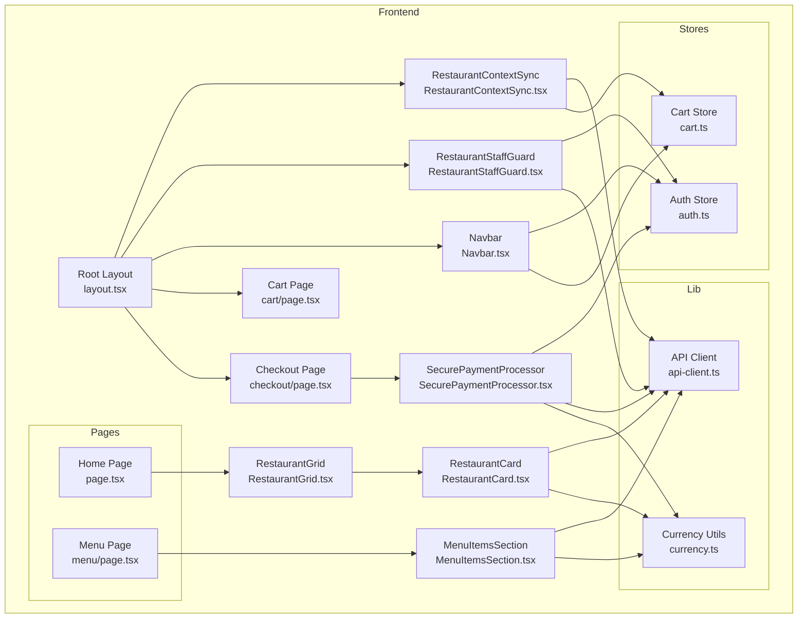
```mermaid
graph TB
subgraph "Frontend"
L["Root Layout<br/>layout.tsx"]
N["Navbar<br/>Navbar.tsx"]
RCS["RestaurantContextSync<br/>RestaurantContextSync.tsx"]
RSG["RestaurantStaffGuard<br/>RestaurantStaffGuard.tsx"]
RC["RestaurantCard<br/>RestaurantCard.tsx"]
RG["RestaurantGrid<br/>RestaurantGrid.tsx"]
MIS["MenuItemsSection<br/>MenuItemsSection.tsx"]
C["Cart Page<br/>cart/page.tsx"]
CO["Checkout Page<br/>checkout/page.tsx"]
SPP["SecurePaymentProcessor<br/>SecurePaymentProcessor.tsx"]
subgraph "Pages"
HP["Home Page<br/>page.tsx"]
MP["Menu Page<br/>menu/page.tsx"]
end
subgraph "Stores"
A["Auth Store<br/>auth.ts"]
CS["Cart Store<br/>cart.ts"]
end
subgraph "Lib"
AC["API Client<br/>api-client.ts"]
CUR["Currency Utils<br/>currency.ts"]
end
end
L --> RCS
L --> RSG
L --> N
HP --> RG
RG --> RC
MP --> MIS
L --> C
L --> CO
CO --> SPP
N --> A
N --> CS
SPP --> A
SPP --> AC
SPP --> CUR
RCS --> AC
RCS --> CS
RSG --> A
RSG --> AC
RC --> AC
RC --> CUR
MIS --> AC
MIS --> CUR
```

**Diagram sources**
- [layout.tsx:20-50](file://restaurant-frontend/src/app/layout.tsx#L20-L50)
- [Navbar.tsx:11-197](file://restaurant-frontend/src/components/Navbar.tsx#L11-L197)
- [RestaurantContextSync.tsx:34-85](file://restaurant-frontend/src/components/RestaurantContextSync.tsx#L34-L85)
- [RestaurantStaffGuard.tsx:70-154](file://restaurant-frontend/src/components/RestaurantStaffGuard.tsx#L70-L154)
- [RestaurantCard.tsx:8-17](file://restaurant-frontend/src/app/_components/RestaurantCard.tsx#L8-L17)
- [RestaurantGrid.tsx:5-7](file://restaurant-frontend/src/app/_components/RestaurantGrid.tsx#L5-L7)
- [MenuItemsSection.tsx:8-16](file://restaurant-frontend/src/app/menu/MenuItemsSection.tsx#L8-L16)
- [page.tsx:5,7](file://restaurant-frontend/src/app/page.tsx#L5,L6)
- [menu/page.tsx:12-14](file://restaurant-frontend/src/app/menu/page.tsx#L12-L14)
- [cart/page.tsx:9-160](file://restaurant-frontend/src/app/cart/page.tsx#L9-L160)
- [checkout/page.tsx:13-557](file://restaurant-frontend/src/app/checkout/page.tsx#L13-L557)
- [SecurePaymentProcessor.tsx:72-347](file://restaurant-frontend/src/components/SecurePaymentProcessor.tsx#L72-L347)
- [auth.ts:24-177](file://restaurant-frontend/src/store/auth.ts#L24-L177)
- [cart.ts:26-92](file://restaurant-frontend/src/store/cart.ts#L26-L92)
- [api-client.ts:194-800](file://restaurant-frontend/src/lib/api-client.ts#L194-L800)
- [currency.ts:1-12](file://restaurant-frontend/src/lib/currency.ts#L1-L12)

**Section sources**
- [layout.tsx:20-50](file://restaurant-frontend/src/app/layout.tsx#L20-L50)
- [Navbar.tsx:11-197](file://restaurant-frontend/src/components/Navbar.tsx#L11-L197)
- [RestaurantContextSync.tsx:34-85](file://restaurant-frontend/src/components/RestaurantContextSync.tsx#L34-L85)
- [RestaurantStaffGuard.tsx:70-154](file://restaurant-frontend/src/components/RestaurantStaffGuard.tsx#L70-L154)
- [RestaurantCard.tsx:8-17](file://restaurant-frontend/src/app/_components/RestaurantCard.tsx#L8-L17)
- [RestaurantGrid.tsx:5-7](file://restaurant-frontend/src/app/_components/RestaurantGrid.tsx#L5-L7)
- [MenuItemsSection.tsx:8-16](file://restaurant-frontend/src/app/menu/MenuItemsSection.tsx#L8-L16)
- [page.tsx:5,7](file://restaurant-frontend/src/app/page.tsx#L5,L6)
- [menu/page.tsx:12-14](file://restaurant-frontend/src/app/menu/page.tsx#L12-L14)
- [SecurePaymentProcessor.tsx:72-347](file://restaurant-frontend/src/components/SecurePaymentProcessor.tsx#L72-L347)
- [auth.ts:24-177](file://restaurant-frontend/src/store/auth.ts#L24-L177)
- [cart.ts:26-92](file://restaurant-frontend/src/store/cart.ts#L26-L92)
- [api-client.ts:194-800](file://restaurant-frontend/src/lib/api-client.ts#L194-L800)
- [currency.ts:1-12](file://restaurant-frontend/src/lib/currency.ts#L1-L12)

## Core Components
- Navbar
  - Purpose: Provides top and bottom navigation, cart badge, authentication actions, and restaurant-aware routing.
  - Key behaviors: Responsive desktop links, mobile bottom navigation, cart item count badge, conditional admin/kitchen links, and logout flow.
  - Stores used: Auth store for user and authentication state; Cart store for cart item count.
  - Utilities: API client for restaurant-aware paths and slug selection.
- RestaurantContextSync
  - Purpose: Synchronizes restaurant context across browser tabs and windows, manages table context, and ensures cart consistency.
  - Key behaviors: Extracts restaurant slug from pathname, synchronizes with cart store, handles storage events, and manages table context via URL parameters.
  - Stores/utilities: Cart store for active restaurant slug and cart clearing; API client for restaurant slug management.
- RestaurantStaffGuard
  - Purpose: Enforces staff access control based on restaurant memberships and user roles.
  - Key behaviors: Detects staff users, fetches restaurant memberships, validates access permissions, and redirects unauthorized users.
  - Stores/utilities: Auth store for authentication state; API client for restaurant membership data.
- RestaurantCard
  - Purpose: Displays individual restaurant information with modern visual design including glassmorphism effects, hover animations, and interactive elements.
  - Key behaviors: Framer Motion hover animations, fallback image handling with gradient backgrounds, status badges with backdrop blur effects, and local storage integration for restaurant selection.
  - Props: RestaurantCardProps with id, name, slug, address, logoUrl, rating, priceForTwo, and status.
  - Styling: Advanced glassmorphism badges, responsive typography with line clamping, interactive hover effects, and modern card design with shadows and borders.
- RestaurantGrid
  - Purpose: Container component for displaying multiple restaurant cards in a responsive grid layout with skeleton loading and empty state handling.
  - Key behaviors: Adaptive column sizing (1-4 columns), skeleton loading with animated pulse effects, empty state handling with informative messaging, and seamless integration with RestaurantCard.
  - Props: RestaurantGridProps with restaurants array.
  - Styling: CSS Grid with responsive breakpoints, consistent spacing, and modern card styling with rounded corners and shadows.
- MenuItemsSection
  - Purpose: Comprehensive menu display component with category grouping, advanced filtering, cart integration, and sophisticated visual design patterns.
  - Key behaviors: Category-based item grouping with rotation effects, spice level indicators with emoji badges, cart quantity management with add/remove controls, dietary tags with color-coded indicators, and lazy loading for images.
  - Props: MenuItemsSectionProps with filteredItems, categories, selectedCategory, and cart interaction handlers.
  - Features: Responsive grid layout (1-3 columns), category separators with item counts, sophisticated cart integration, dietary indicators, spice level badges, and comprehensive filtering options.
- SecurePaymentProcessor
  - Purpose: Manages secure payment flow with Razorpay, including order creation, checkout initialization, and verification.
  - Key behaviors: Dynamic provider selection, lazy script loading, verification timeout handling, and success/failure messaging.
  - Props: order, onPaymentSuccess, onPaymentError.
  - Stores/utilities: Auth store for user; API client for payment endpoints; currency formatter.

**Section sources**
- [Navbar.tsx:11-197](file://restaurant-frontend/src/components/Navbar.tsx#L11-L197)
- [RestaurantContextSync.tsx:34-85](file://restaurant-frontend/src/components/RestaurantContextSync.tsx#L34-L85)
- [RestaurantStaffGuard.tsx:70-154](file://restaurant-frontend/src/components/RestaurantStaffGuard.tsx#L70-L154)
- [RestaurantCard.tsx:8-17](file://restaurant-frontend/src/app/_components/RestaurantCard.tsx#L8-L17)
- [RestaurantGrid.tsx:5-7](file://restaurant-frontend/src/app/_components/RestaurantGrid.tsx#L5-L7)
- [MenuItemsSection.tsx:8-16](file://restaurant-frontend/src/app/menu/MenuItemsSection.tsx#L8-L16)
- [SecurePaymentProcessor.tsx:66-76](file://restaurant-frontend/src/components/SecurePaymentProcessor.tsx#L66-L76)
- [auth.ts:24-177](file://restaurant-frontend/src/store/auth.ts#L24-L177)
- [cart.ts:26-92](file://restaurant-frontend/src/store/cart.ts#L26-L92)
- [api-client.ts:380-441](file://restaurant-frontend/src/lib/api-client.ts#L380-L441)
- [currency.ts:1-12](file://restaurant-frontend/src/lib/currency.ts#L1-L12)

## Architecture Overview
The Navbar integrates with Zustand stores and the API client to compute navigation links and badges. RestaurantContextSync and RestaurantStaffGuard provide cross-component context management and access control respectively. RestaurantCard and RestaurantGrid handle restaurant discovery and browsing functionality with modern UI patterns, while MenuItemsSection manages menu display and cart interactions with advanced filtering capabilities. The SecurePaymentProcessor orchestrates backend payment creation, Razorpay checkout, and verification, emitting success/error callbacks to the parent checkout page.

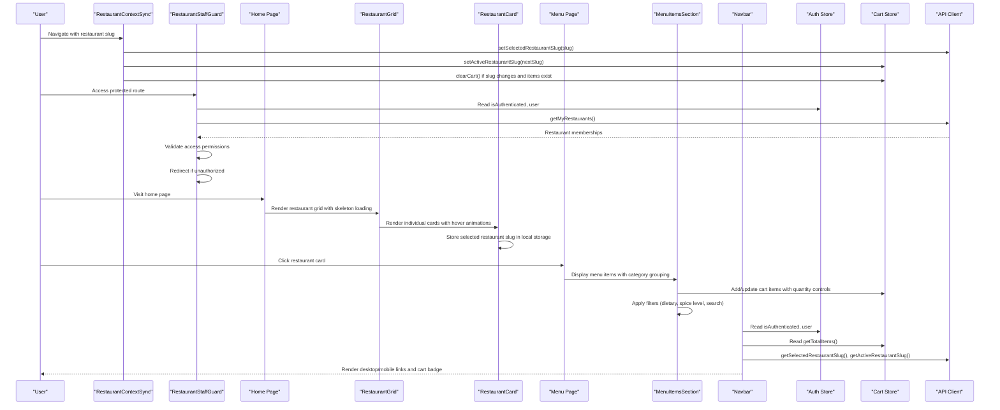
```mermaid
sequenceDiagram
participant U as "User"
participant RCS as "RestaurantContextSync"
participant RSG as "RestaurantStaffGuard"
participant HP as "Home Page"
participant RG as "RestaurantGrid"
participant RC as "RestaurantCard"
participant MP as "Menu Page"
participant MIS as "MenuItemsSection"
participant Nav as "Navbar"
participant Auth as "Auth Store"
participant Cart as "Cart Store"
participant API as "API Client"
U->>RCS : Navigate with restaurant slug
RCS->>API : setSelectedRestaurantSlug(slug)
RCS->>Cart : setActiveRestaurantSlug(nextSlug)
RCS->>Cart : clearCart() if slug changes and items exist
U->>RSG : Access protected route
RSG->>Auth : Read isAuthenticated, user
RSG->>API : getMyRestaurants()
API-->>RSG : Restaurant memberships
RSG->>RSG : Validate access permissions
RSG->>RSG : Redirect if unauthorized
U->>HP : Visit home page
HP->>RG : Render restaurant grid with skeleton loading
RG->>RC : Render individual cards with hover animations
RC->>RC : Store selected restaurant slug in local storage
U->>MP : Click restaurant card
MP->>MIS : Display menu items with category grouping
MIS->>Cart : Add/update cart items with quantity controls
MIS->>MIS : Apply filters (dietary, spice level, search)
Nav->>Auth : Read isAuthenticated, user
Nav->>Cart : Read getTotalItems()
Nav->>API : getSelectedRestaurantSlug(), getActiveRestaurantSlug()
Nav-->>U : Render desktop/mobile links and cart badge
```

**Diagram sources**
- [RestaurantContextSync.tsx:39-74](file://restaurant-frontend/src/components/RestaurantContextSync.tsx#L39-L74)
- [RestaurantStaffGuard.tsx:81-150](file://restaurant-frontend/src/components/RestaurantStaffGuard.tsx#L81-L150)
- [page.tsx:94-156](file://restaurant-frontend/src/app/page.tsx#L94-L156)
- [RestaurantGrid.tsx:9-25](file://restaurant-frontend/src/app/_components/RestaurantGrid.tsx#L9-L25)
- [RestaurantCard.tsx:19-101](file://restaurant-frontend/src/app/_components/RestaurantCard.tsx#L19-L101)
- [menu/page.tsx:77-200](file://restaurant-frontend/src/app/menu/page.tsx#L77-L200)
- [MenuItemsSection.tsx:18-191](file://restaurant-frontend/src/app/menu/MenuItemsSection.tsx#L18-L191)
- [Navbar.tsx:11-197](file://restaurant-frontend/src/components/Navbar.tsx#L11-L197)
- [auth.ts:24-177](file://restaurant-frontend/src/store/auth.ts#L24-L177)
- [cart.ts:26-92](file://restaurant-frontend/src/store/cart.ts#L26-L92)
- [api-client.ts:266-303](file://restaurant-frontend/src/lib/api-client.ts#L266-L303)

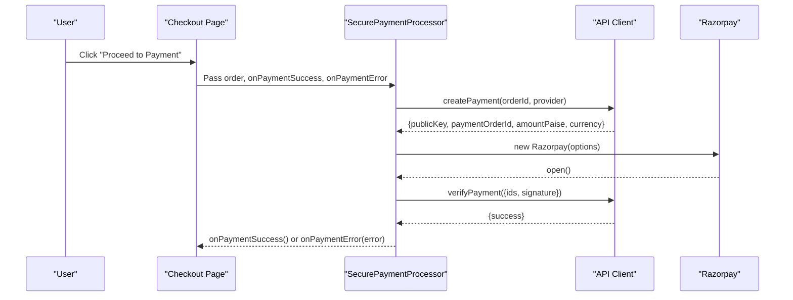
```mermaid
sequenceDiagram
participant U as "User"
participant CO as "Checkout Page"
participant SPP as "SecurePaymentProcessor"
participant API as "API Client"
participant RP as "Razorpay"
U->>CO : Click "Proceed to Payment"
CO->>SPP : Pass order, onPaymentSuccess, onPaymentError
SPP->>API : createPayment(orderId, provider)
API-->>SPP : {publicKey, paymentOrderId, amountPaise, currency}
SPP->>RP : new Razorpay(options)
RP-->>SPP : open()
SPP->>API : verifyPayment({ids, signature})
API-->>SPP : {success}
SPP-->>CO : onPaymentSuccess() or onPaymentError(error)
```

**Diagram sources**
- [checkout/page.tsx:321-343](file://restaurant-frontend/src/app/checkout/page.tsx#L321-L343)
- [SecurePaymentProcessor.tsx:83-152](file://restaurant-frontend/src/components/SecurePaymentProcessor.tsx#L83-L152)
- [SecurePaymentProcessor.tsx:154-206](file://restaurant-frontend/src/components/SecurePaymentProcessor.tsx#L154-L206)
- [api-client.ts:380-441](file://restaurant-frontend/src/lib/api-client.ts#L380-L441)

## Detailed Component Analysis

### Navbar Component
- Responsibilities
  - Build desktop and mobile navigation menus based on authentication and user roles.
  - Compute cart item count and show badge on cart link.
  - Provide restaurant-aware routing helpers.
  - Handle logout and redirect to sign-in.
- Props and Composition
  - No props required; consumes stores and utilities internally.
  - Uses Next.js navigation hooks and Lucide icons.
- Responsive Behavior
  - Desktop: horizontal links with active state styling.
  - Mobile: bottom navigation bar with icons and badges, plus a profile link for authenticated users.
- Authentication Integration
  - Reads isAuthenticated, user, and calls getProfile if restaurantRole is missing.
  - Provides logout action that clears auth state and redirects.
- Mobile Menu Functionality
  - Mobile bottom navigation limits to four items; profile is handled separately in top bar.
  - Uses active state detection via pathname comparison.
- Styling and Accessibility
  - Uses Tailwind classes; focus-visible and active states for interactive elements.
  - Icons provide visual affordances; ensure sufficient contrast and label alternatives where needed.
- Usage Example
  - Included in root layout; no explicit usage required elsewhere.

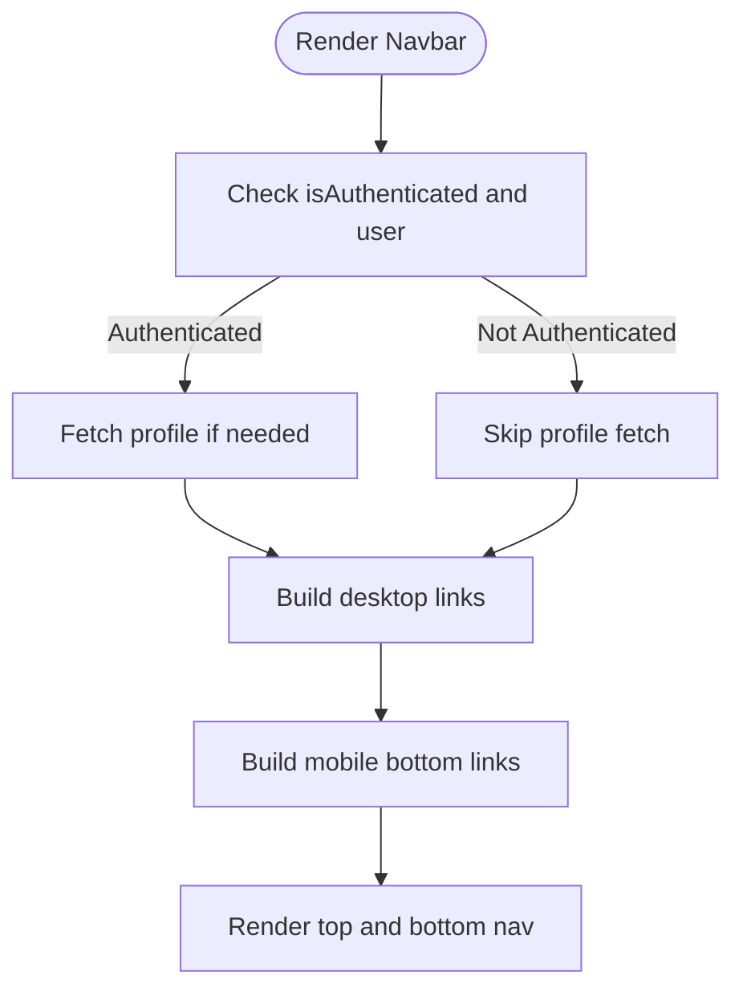
```mermaid
flowchart TD
Start(["Render Navbar"]) --> CheckAuth["Check isAuthenticated and user"]
CheckAuth --> |Authenticated| FetchProfile["Fetch profile if needed"]
CheckAuth --> |Not Authenticated| SkipProfile["Skip profile fetch"]
FetchProfile --> BuildDesktop["Build desktop links"]
SkipProfile --> BuildDesktop
BuildDesktop --> BuildMobile["Build mobile bottom links"]
BuildMobile --> Render["Render top and bottom nav"]
```

**Diagram sources**
- [Navbar.tsx:21-25](file://restaurant-frontend/src/components/Navbar.tsx#L21-L25)
- [Navbar.tsx:40-60](file://restaurant-frontend/src/components/Navbar.tsx#L40-L60)
- [Navbar.tsx:64-193](file://restaurant-frontend/src/components/Navbar.tsx#L64-L193)

**Section sources**
- [Navbar.tsx:11-197](file://restaurant-frontend/src/components/Navbar.tsx#L11-L197)
- [auth.ts:95-115](file://restaurant-frontend/src/store/auth.ts#L95-L115)
- [cart.ts:78-84](file://restaurant-frontend/src/store/cart.ts#L78-L84)
- [api-client.ts:266-303](file://restaurant-frontend/src/lib/api-client.ts#L266-L303)

### RestaurantContextSync Component
- Responsibilities
  - Extract restaurant slug from URL pathname and synchronize with API client.
  - Maintain consistency between active restaurant slug and cart items across browser tabs.
  - Handle table context via URL search parameters.
  - Listen for storage events and restaurant context updates.
- Props and Composition
  - No props required; consumes stores and utilities internally.
  - Uses Next.js navigation hooks and React effects.
- Context Management
  - Extracts slug from first path segment, validates against blocked segments, and sets as selected restaurant.
  - Clears cart when restaurant context changes to prevent cross-restaurant ordering.
  - Synchronizes with cart store for active restaurant slug.
- Cross-Tab Synchronization
  - Listens for 'restaurant-context-updated' custom events and 'storage' events.
  - Handles concurrent tab interactions and prevents inconsistent state.
- Table Context
  - Reads 'table' parameter from URL and sets as selected table number.
- Performance Considerations
  - Uses memoization for slug extraction and blocked segment validation.
  - Efficient event listener cleanup and conditional effect execution.
- Usage Example
  - Automatically included in root layout; no explicit usage required elsewhere.

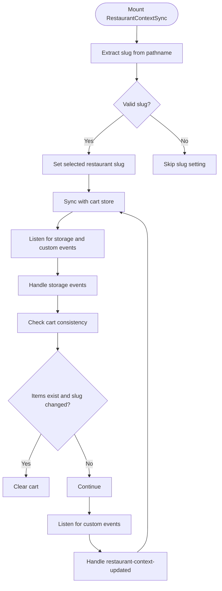
```mermaid
flowchart TD
Start(["Mount RestaurantContextSync"]) --> ExtractSlug["Extract slug from pathname"]
ExtractSlug --> ValidateSlug{"Valid slug?"}
ValidateSlug --> |Yes| SetSelected["Set selected restaurant slug"]
ValidateSlug --> |No| Skip["Skip slug setting"]
SetSelected --> SyncCart["Sync with cart store"]
SyncCart --> ListenEvents["Listen for storage and custom events"]
ListenEvents --> HandleStorage["Handle storage events"]
HandleStorage --> CheckConsistency["Check cart consistency"]
CheckConsistency --> ClearCart{"Items exist and slug changed?"}
ClearCart --> |Yes| ClearCartAction["Clear cart"]
ClearCart --> |No| Continue["Continue"]
Continue --> ListenCustom["Listen for custom events"]
ListenCustom --> HandleCustom["Handle restaurant-context-updated"]
HandleCustom --> SyncCart
```

**Diagram sources**
- [RestaurantContextSync.tsx:39-74](file://restaurant-frontend/src/components/RestaurantContextSync.tsx#L39-L74)
- [RestaurantContextSync.tsx:60-73](file://restaurant-frontend/src/components/RestaurantContextSync.tsx#L60-L73)

**Section sources**
- [RestaurantContextSync.tsx:34-85](file://restaurant-frontend/src/components/RestaurantContextSync.tsx#L34-L85)
- [cart.ts:26-92](file://restaurant-frontend/src/store/cart.ts#L26-L92)
- [api-client.ts:266-303](file://restaurant-frontend/src/lib/api-client.ts#L266-L303)

### RestaurantStaffGuard Component
- Responsibilities
  - Enforce staff access control based on restaurant memberships and user roles.
  - Redirect unauthorized staff users to appropriate locations.
  - Handle staff user detection and membership validation.
- Props and Composition
  - No props required; consumes stores and utilities internally.
  - Uses Next.js navigation hooks and React effects.
- Staff Detection
  - Identifies staff users by checking user role against STAFF_ROLES set.
  - Supports OWNER, ADMIN, STAFF, and KITCHEN_STAFF roles.
- Membership Management
  - Fetches restaurant memberships via API client getMyRestaurants().
  - Validates access permissions based on allowed identifiers.
  - Picks preferred restaurant slug when multiple memberships exist.
- Access Control Logic
  - Prevents access to blocked root segments for staff users.
  - Redirects staff users to '/kitchen' or restaurant admin pages.
  - Handles restaurants public pages and identifier validation.
- Redirection Strategy
  - STAFF and KITCHEN_STAFF users redirected to '/kitchen'.
  - Other staff users redirected to `/${preferredSlug}/admin`.
  - Prevents infinite redirection loops with pathname comparison.
- Error Handling
  - Graceful handling of API errors and loading states.
  - Prevents memory leaks with cleanup functions in effects.
- Usage Example
  - Automatically included in root layout; no explicit usage required elsewhere.

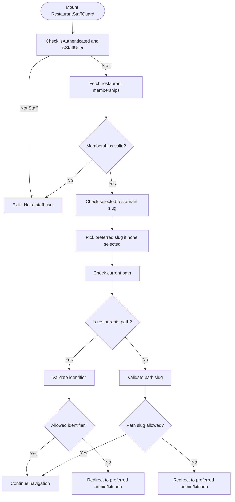
```mermaid
flowchart TD
Start(["Mount RestaurantStaffGuard"]) --> CheckAuth["Check isAuthenticated and isStaffUser"]
CheckAuth --> |Not Staff| Exit["Exit - Not a staff user"]
CheckAuth --> |Staff| FetchMemberships["Fetch restaurant memberships"]
FetchMemberships --> ValidateMemberships{"Memberships valid?"}
ValidateMemberships --> |No| Exit
ValidateMemberships --> |Yes| CheckSelected["Check selected restaurant slug"]
CheckSelected --> PickPreferred["Pick preferred slug if none selected"]
PickPreferred --> CheckPath["Check current path"]
CheckPath --> IsRestaurants{"Is restaurants path?"}
IsRestaurants --> |Yes| ValidateIdentifier["Validate identifier"]
ValidateIdentifier --> Allowed{"Allowed identifier?"}
Allowed --> |Yes| Continue["Continue navigation"]
Allowed --> |No| RedirectRestaurants["Redirect to preferred admin/kitchen"]
IsRestaurants --> |No| ValidatePathSlug["Validate path slug"]
ValidatePathSlug --> PathAllowed{"Path slug allowed?"}
PathAllowed --> |Yes| Continue
PathAllowed --> |No| RedirectPath["Redirect to preferred admin/kitchen"]
```

**Diagram sources**
- [RestaurantStaffGuard.tsx:81-150](file://restaurant-frontend/src/components/RestaurantStaffGuard.tsx#L81-L150)
- [RestaurantStaffGuard.tsx:111-149](file://restaurant-frontend/src/components/RestaurantStaffGuard.tsx#L111-L149)

**Section sources**
- [RestaurantStaffGuard.tsx:70-154](file://restaurant-frontend/src/components/RestaurantStaffGuard.tsx#L70-L154)
- [auth.ts:24-177](file://restaurant-frontend/src/store/auth.ts#L24-L177)
- [api-client.ts:732-738](file://restaurant-frontend/src/lib/api-client.ts#L732-L738)

### RestaurantCard Component
- Responsibilities
  - Display individual restaurant information in an attractive card layout with modern visual design.
  - Handle restaurant selection via click and store slug in local storage.
  - Show fallback images when restaurant logo is unavailable.
  - Display status badges, ratings, pricing, and address information with glassmorphism effects.
- Props and Composition
  - RestaurantCardProps: id, name, slug, address, logoUrl, rating, priceForTwo, status.
  - Uses Next.js Image for optimized image loading and fallback placeholders.
  - Integrates with Framer Motion for hover animations.
- Visual Design
  - Aspect ratio 16:9 for consistent card appearance.
  - Glassmorphism status badge with backdrop blur effect and semi-transparent background.
  - Responsive typography with line clamping for long names and addresses.
  - Hover animation with subtle upward movement (y: -5) for interactive feel.
  - Modern card design with rounded corners, borders, and shadow transitions.
- Interactive Features
  - Local storage integration for selected restaurant slug persistence.
  - Link navigation to restaurant-specific slug path.
  - Fallback image with gradient background and initial letter display.
  - Smooth hover transitions with easing for polished feel.
- Accessibility and Styling
  - Proper alt text for images and fallback content.
  - Sufficient color contrast for text and badges.
  - Responsive design with appropriate spacing and sizing.
  - Touch-friendly hover targets for mobile devices.
- Usage Example
  - Used within RestaurantGrid for restaurant browsing experience.

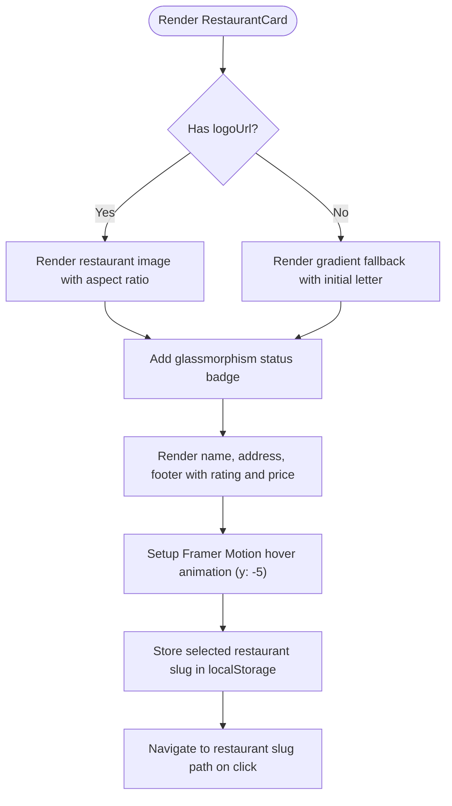
```mermaid
flowchart TD
Start(["Render RestaurantCard"]) --> CheckLogo{"Has logoUrl?"}
CheckLogo --> |Yes| RenderImage["Render restaurant image with aspect ratio"]
CheckLogo --> |No| RenderFallback["Render gradient fallback with initial letter"]
RenderImage --> AddBadge["Add glassmorphism status badge"]
RenderFallback --> AddBadge
AddBadge --> RenderContent["Render name, address, footer with rating and price"]
RenderContent --> SetupHover["Setup Framer Motion hover animation (y: -5)"]
SetupHover --> LocalStorage["Store selected restaurant slug in localStorage"]
LocalStorage --> Navigate["Navigate to restaurant slug path on click"]
```

**Diagram sources**
- [RestaurantCard.tsx:38-62](file://restaurant-frontend/src/app/_components/RestaurantCard.tsx#L38-L62)
- [RestaurantCard.tsx:64-96](file://restaurant-frontend/src/app/_components/RestaurantCard.tsx#L64-L96)
- [RestaurantCard.tsx:24-28](file://restaurant-frontend/src/app/_components/RestaurantCard.tsx#L24-L28)

**Section sources**
- [RestaurantCard.tsx:8-17](file://restaurant-frontend/src/app/_components/RestaurantCard.tsx#L8-L17)
- [RestaurantCard.tsx:19-101](file://restaurant-frontend/src/app/_components/RestaurantCard.tsx#L19-L101)

### RestaurantGrid Component
- Responsibilities
  - Container component for displaying multiple restaurant cards in a responsive grid with skeleton loading.
  - Handle empty state when no restaurants are available.
  - Provide adaptive column layouts based on screen size with skeleton loading.
- Props and Composition
  - RestaurantGridProps: restaurants array of RestaurantCardProps.
  - Uses RestaurantCard for individual item rendering.
  - Implements CSS Grid with responsive breakpoints and skeleton loading.
- Responsive Design
  - 1 column on mobile, 2 on small screens, 3 on medium, 4 on large screens.
  - Consistent spacing with sm:gap-6 for improved readability on larger screens.
  - Skeleton loading with animated pulse effects for better perceived performance.
- Empty State Handling
  - Displays informative message with white background and rounded corners.
  - Provides visual indication of no available restaurants with centered text.
- Performance Considerations
  - Efficient rendering of restaurant cards in a grid layout.
  - Skeleton loading reduces perceived loading time.
  - Minimal state management with direct props passing.
- Usage Example
  - Used on the home page for restaurant discovery with loading states.

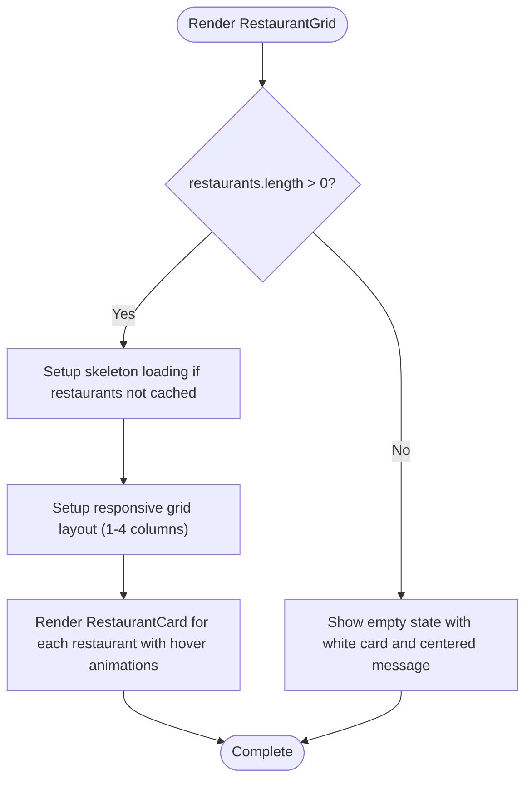
```mermaid
flowchart TD
Start(["Render RestaurantGrid"]) --> CheckLength{"restaurants.length > 0?"}
CheckLength --> |No| ShowEmpty["Show empty state with white card and centered message"]
CheckLength --> |Yes| SetupSkeleton["Setup skeleton loading if restaurants not cached"]
SetupSkeleton --> SetupGrid["Setup responsive grid layout (1-4 columns)"]
SetupGrid --> RenderCards["Render RestaurantCard for each restaurant with hover animations"]
RenderCards --> End(["Complete"])
ShowEmpty --> End
```

**Diagram sources**
- [RestaurantGrid.tsx:10-16](file://restaurant-frontend/src/app/_components/RestaurantGrid.tsx#L10-L16)
- [RestaurantGrid.tsx:18-24](file://restaurant-frontend/src/app/_components/RestaurantGrid.tsx#L18-L24)

**Section sources**
- [RestaurantGrid.tsx:5-7](file://restaurant-frontend/src/app/_components/RestaurantGrid.tsx#L5-L7)
- [RestaurantGrid.tsx:9-25](file://restaurant-frontend/src/app/_components/RestaurantGrid.tsx#L9-L25)

### MenuItemsSection Component
- Responsibilities
  - Display menu items in a responsive grid layout with category organization and advanced filtering.
  - Apply multiple filters including category, search, dietary preferences, and spice levels.
  - Manage cart interactions with add to cart and quantity adjustment functionality.
  - Show spice level indicators with emoji badges and dietary tags for each menu item.
- Props and Composition
  - MenuItemsSectionProps: filteredItems, categories, selectedCategory, cart handlers, and spice level display function.
  - Uses MenuItem and Category interfaces from API client.
  - Integrates with currency formatting utilities.
- Filtering and Organization
  - Category-based filtering with 'all' option for comprehensive display.
  - Dynamic category grouping preserving original category order.
  - Item rotation when showing all categories for visual variety.
  - Comprehensive filtering including dietary restrictions (veg, vegan, gluten-free) and spice levels.
- Cart Integration
  - Get cart item quantity for each menu item.
  - Add to cart functionality with authentication check.
  - Quantity adjustment with increment/decrement buttons.
  - Visual feedback through quantity badges and button states.
- Visual Design
  - Responsive grid layout with 1-3 columns based on screen size.
  - Card-based design with shadow and overflow handling.
  - Dietary tags with color-coded indicators (green for veg, red for non-veg).
  - Spice level badges with emoji-based indicators (🌶️, 🌶️🌶️, 🌶️🌶️🌶️).
  - Glassmorphism effects and modern card styling.
- Empty State Handling
  - Chef hat icon and descriptive message when no items match filters.
  - Appropriate spacing and typography for empty state presentation.
- Performance Considerations
  - Efficient category grouping and item filtering.
  - Lazy loading for menu images to improve initial load performance.
  - Memoized cart quantity calculations.
  - Skeleton loading for better perceived performance.
- Usage Example
  - Used within the menu page for comprehensive menu display and interaction.

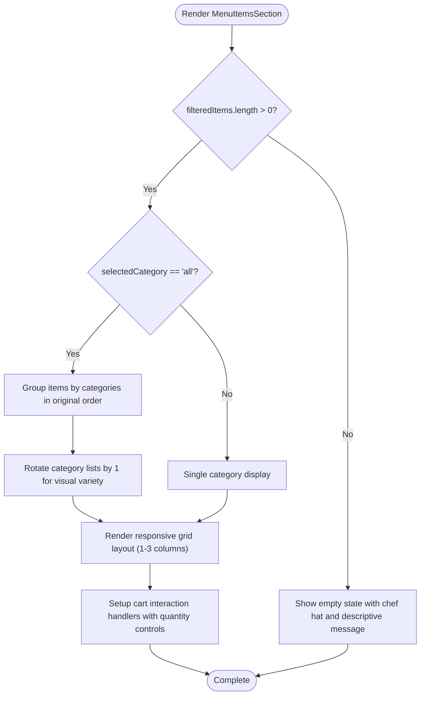
```mermaid
flowchart TD
Start(["Render MenuItemsSection"]) --> CheckItems{"filteredItems.length > 0?"}
CheckItems --> |No| ShowEmpty["Show empty state with chef hat and descriptive message"]
CheckItems --> |Yes| CheckCategory{"selectedCategory == 'all'?"}
CheckCategory --> |Yes| GroupByCategory["Group items by categories in original order"]
CheckCategory --> |No| SingleCategory["Single category display"]
GroupByCategory --> RotateItems["Rotate category lists by 1 for visual variety"]
RotateItems --> RenderGrid["Render responsive grid layout (1-3 columns)"]
SingleCategory --> RenderGrid
RenderGrid --> SetupCart["Setup cart interaction handlers with quantity controls"]
SetupCart --> End(["Complete"])
ShowEmpty --> End
```

**Diagram sources**
- [MenuItemsSection.tsx:27-36](file://restaurant-frontend/src/app/menu/MenuItemsSection.tsx#L27-L36)
- [MenuItemsSection.tsx:38-68](file://restaurant-frontend/src/app/menu/MenuItemsSection.tsx#L38-L68)
- [MenuItemsSection.tsx:86-185](file://restaurant-frontend/src/app/menu/MenuItemsSection.tsx#L86-L185)

**Section sources**
- [MenuItemsSection.tsx:8-16](file://restaurant-frontend/src/app/menu/MenuItemsSection.tsx#L8-L16)
- [MenuItemsSection.tsx:18-191](file://restaurant-frontend/src/app/menu/MenuItemsSection.tsx#L18-L191)

### SecurePaymentProcessor Component
- Responsibilities
  - Initiate secure payment via backend, initialize Razorpay checkout, and verify payment outcomes.
  - Manage loading, verifying, success, and failure states with user feedback.
- Props
  - order: Order object containing identifiers, totals, and table info.
  - onPaymentSuccess: Callback invoked upon successful verification.
  - onPaymentError: Callback invoked on failure or cancellation.
- Event Handlers
  - initiateSecurePayment: Creates payment, loads Razorpay script if needed, opens checkout.
  - handlePaymentSuccess: Verifies payment with backend and triggers success callback.
- Payment Flow
  - Backend creates payment and returns provider details.
  - Razorpay checkout is opened with prefilled customer details.
  - Verification race with timeout ensures robustness.
- Error Handling
  - Specific error messages for signature failures, not found, timeouts, and unsuccessful payments.
  - Cancellation handled via modal dismiss callback.
- Styling and Accessibility
  - Uses icons for status and security features; ensure readable labels and ARIA attributes where needed.
  - Disabled states during loading and verification.

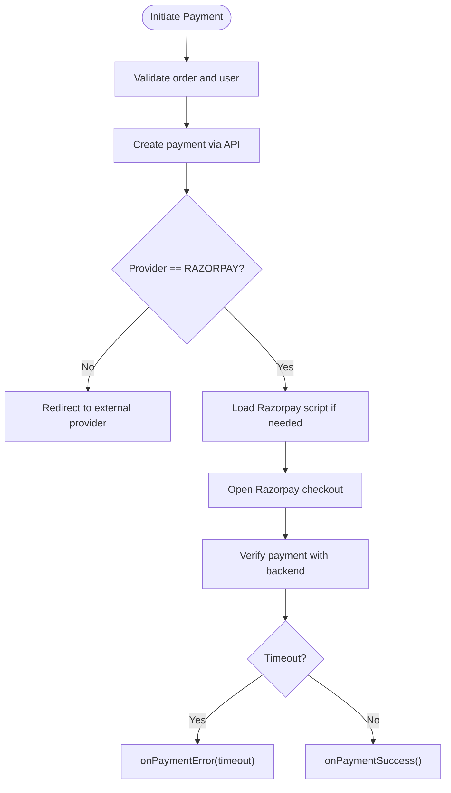
```mermaid
flowchart TD
Enter(["Initiate Payment"]) --> Validate["Validate order and user"]
Validate --> Create["Create payment via API"]
Create --> Provider{"Provider == RAZORPAY?"}
Provider --> |No| Redirect["Redirect to external provider"]
Provider --> |Yes| LoadScript["Load Razorpay script if needed"]
LoadScript --> OpenCheckout["Open Razorpay checkout"]
OpenCheckout --> Verify["Verify payment with backend"]
Verify --> Timeout{"Timeout?"}
Timeout --> |Yes| Error["onPaymentError(timeout)"]
Timeout --> |No| Success["onPaymentSuccess()"]
```

**Diagram sources**
- [SecurePaymentProcessor.tsx:83-152](file://restaurant-frontend/src/components/SecurePaymentProcessor.tsx#L83-L152)
- [SecurePaymentProcessor.tsx:154-206](file://restaurant-frontend/src/components/SecurePaymentProcessor.tsx#L154-L206)
- [api-client.ts:380-441](file://restaurant-frontend/src/lib/api-client.ts#L380-L441)

**Section sources**
- [SecurePaymentProcessor.tsx:66-76](file://restaurant-frontend/src/components/SecurePaymentProcessor.tsx#L66-L76)
- [SecurePaymentProcessor.tsx:83-206](file://restaurant-frontend/src/components/SecurePaymentProcessor.tsx#L83-L206)
- [api-client.ts:380-441](file://restaurant-frontend/src/lib/api-client.ts#L380-L441)
- [currency.ts:1-12](file://restaurant-frontend/src/lib/currency.ts#L1-L12)

## Dependency Analysis
- Navbar depends on:
  - Auth store for user and authentication state.
  - Cart store for cart item count.
  - API client for restaurant-aware paths and slug resolution.
- RestaurantContextSync depends on:
  - Cart store for active restaurant slug and cart clearing.
  - API client for restaurant slug management and table context.
  - Next.js navigation hooks for pathname and search parameter access.
- RestaurantStaffGuard depends on:
  - Auth store for user authentication and role information.
  - API client for restaurant membership data and restaurant operations.
  - Next.js navigation hooks for pathname and router access.
- RestaurantCard depends on:
  - API client for restaurant data integration.
  - Currency utility for price formatting.
  - Next.js Image for optimized image loading.
  - Framer Motion for hover animations.
- RestaurantGrid depends on:
  - RestaurantCard for individual restaurant display.
  - Responsive design utilities for grid layout.
- MenuItemsSection depends on:
  - API client for menu data and category information.
  - Currency utility for price formatting.
  - Cart store for cart item management.
  - Next.js Image for lazy loading.
- SecurePaymentProcessor depends on:
  - Auth store for user details.
  - API client for payment creation and verification.
  - Currency utility for formatting amounts.
- Global inclusion:
  - All components are rendered in the root layout with Suspense boundaries.
  - Razorpay script is preloaded in the root layout head.

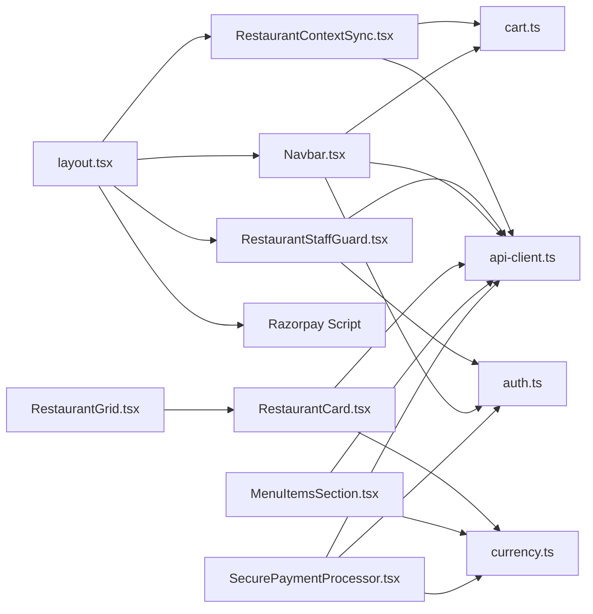
```mermaid
graph LR
Layout["layout.tsx"] --> RCS["RestaurantContextSync.tsx"]
Layout --> RSG["RestaurantStaffGuard.tsx"]
Layout --> Navbar["Navbar.tsx"]
Layout --> Razorpay["Razorpay Script"]
RCS --> Cart["cart.ts"]
RCS --> API["api-client.ts"]
RSG --> Auth["auth.ts"]
RSG --> API
Navbar --> Auth
Navbar --> Cart
Navbar --> API
RC["RestaurantCard.tsx"] --> API
RC --> CUR["currency.ts"]
RG["RestaurantGrid.tsx"] --> RC
MIS["MenuItemsSection.tsx"] --> API
MIS --> CUR
SPP["SecurePaymentProcessor.tsx"] --> Auth
SPP --> API
SPP --> CUR
```

**Diagram sources**
- [layout.tsx:20-50](file://restaurant-frontend/src/app/layout.tsx#L20-L50)
- [RestaurantContextSync.tsx:34-85](file://restaurant-frontend/src/components/RestaurantContextSync.tsx#L34-L85)
- [RestaurantStaffGuard.tsx:70-154](file://restaurant-frontend/src/components/RestaurantStaffGuard.tsx#L70-L154)
- [Navbar.tsx:11-197](file://restaurant-frontend/src/components/Navbar.tsx#L11-L197)
- [RestaurantCard.tsx:8-17](file://restaurant-frontend/src/app/_components/RestaurantCard.tsx#L8-L17)
- [RestaurantGrid.tsx:5-7](file://restaurant-frontend/src/app/_components/RestaurantGrid.tsx#L5-L7)
- [MenuItemsSection.tsx:8-16](file://restaurant-frontend/src/app/menu/MenuItemsSection.tsx#L8-L16)
- [SecurePaymentProcessor.tsx:72-347](file://restaurant-frontend/src/components/SecurePaymentProcessor.tsx#L72-L347)
- [auth.ts:24-177](file://restaurant-frontend/src/store/auth.ts#L24-L177)
- [cart.ts:26-92](file://restaurant-frontend/src/store/cart.ts#L26-L92)
- [api-client.ts:194-800](file://restaurant-frontend/src/lib/api-client.ts#L194-L800)
- [currency.ts:1-12](file://restaurant-frontend/src/lib/currency.ts#L1-L12)

**Section sources**
- [layout.tsx:20-50](file://restaurant-frontend/src/app/layout.tsx#L20-L50)
- [RestaurantContextSync.tsx:34-85](file://restaurant-frontend/src/components/RestaurantContextSync.tsx#L34-L85)
- [RestaurantStaffGuard.tsx:70-154](file://restaurant-frontend/src/components/RestaurantStaffGuard.tsx#L70-L154)
- [Navbar.tsx:11-197](file://restaurant-frontend/src/components/Navbar.tsx#L11-L197)
- [RestaurantCard.tsx:8-17](file://restaurant-frontend/src/app/_components/RestaurantCard.tsx#L8-L17)
- [RestaurantGrid.tsx:5-7](file://restaurant-frontend/src/app/_components/RestaurantGrid.tsx#L5-L7)
- [MenuItemsSection.tsx:8-16](file://restaurant-frontend/src/app/menu/MenuItemsSection.tsx#L8-L16)
- [SecurePaymentProcessor.tsx:72-347](file://restaurant-frontend/src/components/SecurePaymentProcessor.tsx#L72-L347)
- [auth.ts:24-177](file://restaurant-frontend/src/store/auth.ts#L24-L177)
- [cart.ts:26-92](file://restaurant-frontend/src/store/cart.ts#L26-L92)
- [api-client.ts:194-800](file://restaurant-frontend/src/lib/api-client.ts#L194-L800)
- [currency.ts:1-12](file://restaurant-frontend/src/lib/currency.ts#L1-L12)

## Performance Considerations
- Navbar
  - Uses memoized cart item count via store getter to avoid unnecessary re-renders.
  - Conditional profile fetch prevents redundant API calls.
- RestaurantContextSync
  - Efficient slug extraction using Set-based blocked segment validation.
  - Cleanup functions prevent memory leaks from event listeners.
  - Conditional effect execution reduces unnecessary computations.
- RestaurantStaffGuard
  - Loading state prevents redundant API calls during membership fetching.
  - Memoized identifier sets improve performance for permission checks.
  - Cleanup functions prevent memory leaks and infinite loops.
- RestaurantCard
  - Lazy loading for images improves initial render performance.
  - Fallback images prevent layout shift and improve perceived performance.
  - Local storage operations are lightweight and non-blocking.
  - Framer Motion animations are optimized with simple transforms.
- RestaurantGrid
  - Skeleton loading with animated pulse effects improves perceived performance.
  - Efficient grid layout with CSS Grid for optimal rendering performance.
  - Minimal state management reduces re-render cycles.
- MenuItemsSection
  - Lazy loading for menu images significantly improves initial load time.
  - Efficient category grouping and item filtering algorithms.
  - Memoized cart quantity calculations prevent unnecessary re-renders.
  - Skeleton loading for better perceived performance during data fetch.
- SecurePaymentProcessor
  - Lazy script loading avoids blocking initial render.
  - Timeout-based verification prevents hanging UI.
  - Disabled states during loading reduce accidental double-submissions.
- Recommendations
  - Consider caching restaurant slug and user roles to minimize repeated API calls.
  - Debounce or throttle navigation updates if dynamic slugs change frequently.
  - Implement rate limiting for membership fetching to prevent excessive API calls.
  - Optimize image sizes and consider WebP format for better compression.
  - Implement component-level caching for frequently accessed menu data.

## Troubleshooting Guide
- Navbar
  - If cart badge does not appear, verify getTotalItems returns a number and user is authenticated.
  - If restaurant-aware links are incorrect, check getActiveRestaurantSlug and withRestaurant helper.
- RestaurantContextSync
  - If restaurant context not syncing across tabs, verify storage events are firing and event listeners are attached.
  - If cart not clearing on restaurant change, check blocked segments and slug extraction logic.
  - If table context not working, verify URL parameter parsing and setSelectedTableNumber.
- RestaurantStaffGuard
  - If staff users still accessing blocked routes, verify membership fetching and identifier validation.
  - If unauthorized users not redirected, check router replacement and pathname comparison logic.
  - If preferred slug not selected, verify getMyRestaurants API response and pickPreferredSlug logic.
- RestaurantCard
  - If images don't load, verify logoUrl format and fallback mechanism.
  - If hover animations don't work, check Framer Motion installation and version compatibility.
  - If local storage errors occur, verify browser storage permissions and quota limits.
  - If glassmorphism badges appear incorrectly, check backdrop blur CSS properties.
- RestaurantGrid
  - If grid layout breaks, verify CSS Grid support and responsive breakpoint values.
  - If empty state not showing, check restaurants array length and prop passing.
  - If skeleton loading not working, verify dynamic imports and suspense boundaries.
- MenuItemsSection
  - If items don't filter correctly, verify filter functions and prop validation.
  - If cart interactions fail, check authentication state and cart store integration.
  - If spice level badges don't display, verify spice level values and display function.
  - If category rotation not working, check array manipulation logic.
- SecurePaymentProcessor
  - If payment fails immediately, inspect backend createPayment response and provider configuration.
  - If verification times out, ensure network connectivity and backend availability.
  - If Razorpay does not open, confirm the script is loaded and options are correctly formed.
- Global
  - If authentication state appears stale, ensure auth store persistence and token handling are intact.
  - If cross-tab synchronization issues occur, check for console errors in event listeners.

**Section sources**
- [RestaurantContextSync.tsx:34-85](file://restaurant-frontend/src/components/RestaurantContextSync.tsx#L34-L85)
- [RestaurantStaffGuard.tsx:70-154](file://restaurant-frontend/src/components/RestaurantStaffGuard.tsx#L70-L154)
- [RestaurantCard.tsx:19-101](file://restaurant-frontend/src/app/_components/RestaurantCard.tsx#L19-L101)
- [RestaurantGrid.tsx:9-25](file://restaurant-frontend/src/app/_components/RestaurantGrid.tsx#L9-L25)
- [MenuItemsSection.tsx:18-191](file://restaurant-frontend/src/app/menu/MenuItemsSection.tsx#L18-L191)
- [Navbar.tsx:11-197](file://restaurant-frontend/src/components/Navbar.tsx#L11-L197)
- [SecurePaymentProcessor.tsx:83-206](file://restaurant-frontend/src/components/SecurePaymentProcessor.tsx#L83-L206)
- [auth.ts:24-177](file://restaurant-frontend/src/store/auth.ts#L24-L177)
- [api-client.ts:380-441](file://restaurant-frontend/src/lib/api-client.ts#L380-L441)

## Conclusion
The Navbar, RestaurantContextSync, RestaurantStaffGuard, RestaurantCard, RestaurantGrid, MenuItemsSection, and SecurePaymentProcessor components form the comprehensive backbone of DeQ-Bite's restaurant ordering platform. They integrate authentication, cart state, restaurant memberships, menu data, and backend APIs seamlessly, with responsive behavior, robust error handling, cross-component synchronization, and modern UI patterns. The addition of RestaurantCard and RestaurantGrid enables efficient restaurant discovery with sophisticated visual design including glassmorphism effects and hover animations, while MenuItemsSection provides a comprehensive menu browsing and ordering experience with advanced filtering capabilities and cart integration. Following the composition patterns and best practices outlined here will help maintain and evolve these components effectively.

## Appendices

### Component Props and Events Reference
- Navbar
  - No props required.
  - Consumes stores and utilities internally.
- RestaurantContextSync
  - No props required.
  - Consumes stores and utilities internally.
- RestaurantStaffGuard
  - No props required.
  - Consumes stores and utilities internally.
- RestaurantCard
  - Props: RestaurantCardProps
    - id: string
    - name: string
    - slug: string
    - address: string | null
    - logoUrl: string | null
    - rating: number | undefined
    - priceForTwo: number | undefined
    - status: string | undefined
- RestaurantGrid
  - Props: RestaurantGridProps
    - restaurants: RestaurantCardProps[]
- MenuItemsSection
  - Props: MenuItemsSectionProps
    - filteredItems: MenuItem[]
    - categories: Category[]
    - selectedCategory: string
    - getCartItemQuantity: (itemId: string) => number
    - onAddToCart: (item: MenuItem) => void
    - onUpdateQuantity: (item: MenuItem, newQuantity: number) => void
    - getSpiceLevelDisplay: (level: string) => string | null
- SecurePaymentProcessor
  - Props:
    - order: Order object with id, totals, table, items, and optional paymentProvider.
    - onPaymentSuccess: () => void
    - onPaymentError: (error: string) => void

**Section sources**
- [RestaurantCard.tsx:8-17](file://restaurant-frontend/src/app/_components/RestaurantCard.tsx#L8-L17)
- [RestaurantGrid.tsx:5-7](file://restaurant-frontend/src/app/_components/RestaurantGrid.tsx#L5-L7)
- [MenuItemsSection.tsx:8-16](file://restaurant-frontend/src/app/menu/MenuItemsSection.tsx#L8-L16)
- [SecurePaymentProcessor.tsx:66-76](file://restaurant-frontend/src/components/SecurePaymentProcessor.tsx#L66-L76)
- [RestaurantContextSync.tsx:34-85](file://restaurant-frontend/src/components/RestaurantContextSync.tsx#L34-L85)
- [RestaurantStaffGuard.tsx:70-154](file://restaurant-frontend/src/components/RestaurantStaffGuard.tsx#L70-L154)
- [Navbar.tsx:11-197](file://restaurant-frontend/src/components/Navbar.tsx#L11-L197)

### Usage Examples and Integration Patterns
- Navbar
  - Included automatically in the root layout; no explicit usage required.
- RestaurantContextSync
  - Included automatically in the root layout with Suspense boundary.
  - Handles cross-tab synchronization and table context management.
- RestaurantStaffGuard
  - Included automatically in the root layout with Suspense boundary.
  - Enforces staff access control and redirects unauthorized users.
- RestaurantCard
  - Used within RestaurantGrid for individual restaurant display.
  - Handles restaurant selection and navigation to restaurant slug path.
  - Integrates with local storage for persistent restaurant selection.
  - Features Framer Motion hover animations and glassmorphism status badges.
- RestaurantGrid
  - Used on the home page for restaurant browsing experience.
  - Provides responsive grid layout with adaptive column counts.
  - Handles empty state when no restaurants are available.
  - Implements skeleton loading for better perceived performance.
- MenuItemsSection
  - Used within the menu page for comprehensive menu display.
  - Integrates with cart store for add to cart and quantity management.
  - Supports multiple filtering options including dietary restrictions and spice levels.
  - Features sophisticated visual design with glassmorphism effects.
- SecurePaymentProcessor
  - Integrated in the checkout page; receives order and callbacks from the parent.
  - Supports multiple payment providers; redirects for non-Razorpay providers.

**Section sources**
- [layout.tsx:20-50](file://restaurant-frontend/src/app/layout.tsx#L20-L50)
- [page.tsx:94-156](file://restaurant-frontend/src/app/page.tsx#L94-L156)
- [menu/page.tsx:77-200](file://restaurant-frontend/src/app/menu/page.tsx#L77-L200)
- [RestaurantCard.tsx:19-101](file://restaurant-frontend/src/app/_components/RestaurantCard.tsx#L19-L101)
- [RestaurantGrid.tsx:9-25](file://restaurant-frontend/src/app/_components/RestaurantGrid.tsx#L9-L25)
- [MenuItemsSection.tsx:18-191](file://restaurant-frontend/src/app/menu/MenuItemsSection.tsx#L18-L191)
- [checkout/page.tsx:321-343](file://restaurant-frontend/src/app/checkout/page.tsx#L321-L343)
- [RestaurantContextSync.tsx:34-85](file://restaurant-frontend/src/components/RestaurantContextSync.tsx#L34-L85)
- [RestaurantStaffGuard.tsx:70-154](file://restaurant-frontend/src/components/RestaurantStaffGuard.tsx#L70-L154)
- [SecurePaymentProcessor.tsx:83-152](file://restaurant-frontend/src/components/SecurePaymentProcessor.tsx#L83-L152)

### Accessibility and UX Notes
- Navbar
  - Ensure keyboard navigation and focus indicators for links and buttons.
  - Provide aria-labels for icon-only links where helpful.
- RestaurantContextSync
  - Monitor for cross-tab synchronization issues via console logging.
  - Ensure storage events are properly handled and cleaned up.
- RestaurantStaffGuard
  - Provide clear redirect messages for unauthorized access attempts.
  - Ensure staff users understand why they're being redirected.
- RestaurantCard
  - Ensure proper alt text for restaurant images and fallback content.
  - Verify sufficient color contrast for status badges and text elements.
  - Test hover animations with reduced motion preferences enabled.
  - Check glassmorphism effects meet accessibility contrast requirements.
- RestaurantGrid
  - Maintain consistent spacing and visual hierarchy across grid items.
  - Ensure empty state messages are accessible to screen readers.
  - Verify skeleton loading provides meaningful progress indication.
- MenuItemsSection
  - Announce category changes and item additions to assistive technologies.
  - Provide clear visual feedback for cart interactions and quantity changes.
  - Ensure spice level indicators are announced appropriately by screen readers.
  - Verify color contrast meets WCAG guidelines for dietary tags.
- SecurePaymentProcessor
  - Announce status changes (verifying, success, failed) to assistive technologies.
  - Provide clear error messages and retry options.

### Testing Strategies and Storybook Integration
- Unit tests
  - Mock stores and API client to isolate component behavior.
  - Test navigation rendering under different auth and role states.
  - Test RestaurantContextSync slug extraction and cart synchronization logic.
  - Test RestaurantStaffGuard membership validation and redirection scenarios.
  - Test RestaurantCard hover animations and local storage integration.
  - Test RestaurantGrid responsive layout and empty state handling.
  - Test MenuItemsSection filtering logic and cart interaction handlers.
  - Test payment flow with mocked backend responses and timeouts.
- Storybook
  - Create stories for Navbar with different auth states and roles.
  - Create stories for RestaurantContextSync with different slug scenarios.
  - Create stories for RestaurantStaffGuard with various membership states.
  - Create stories for RestaurantCard with different image states, status badges, and hover states.
  - Create stories for RestaurantGrid with various restaurant arrays, empty states, and loading states.
  - Create stories for MenuItemsSection with different filter combinations, cart states, and visual effects.
  - Create stories for SecurePaymentProcessor with various order states and error conditions.
- E2E tests
  - Validate end-to-end payment flow with a test provider mode if available.
  - Test cross-tab synchronization with multiple browser instances.
  - Test staff access control with different role combinations.
  - Test restaurant browsing flow from home page to menu and cart.
  - Test menu filtering and cart management across multiple sessions.
  - Test responsive behavior across different device sizes and orientations.

### Maintenance Guidelines
- Keep stores and utilities cohesive; avoid prop drilling by centralizing state.
- Centralize environment variables and configuration for payment providers.
- Regularly review and update dependencies to ensure security and compatibility.
- Monitor cross-component communication patterns and optimize event handling.
- Implement comprehensive error logging for staff access control and context synchronization.
- Test cross-browser compatibility for storage events and custom event dispatching.
- Optimize image loading and lazy loading strategies for improved performance.
- Consider implementing component-level caching for frequently accessed data.
- Maintain consistent design tokens and theme variables across all components.
- Document component APIs and prop types to facilitate future development and maintenance.
- Ensure accessibility compliance with WCAG guidelines for all interactive elements.
- Test performance metrics including LCP, FID, and CLS for critical user journeys.
- Implement proper error boundaries and graceful degradation for component failures.