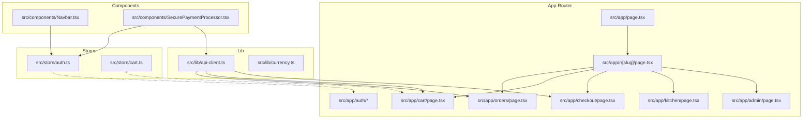
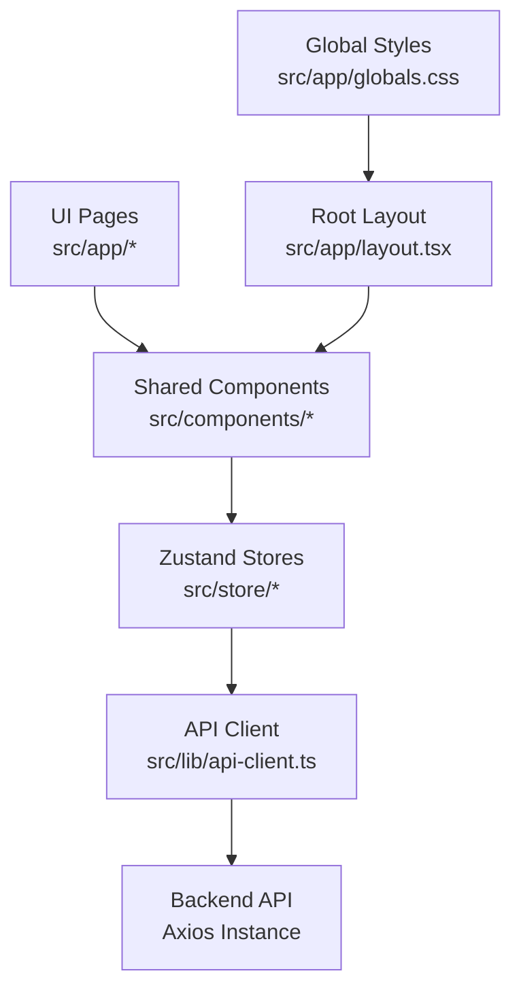
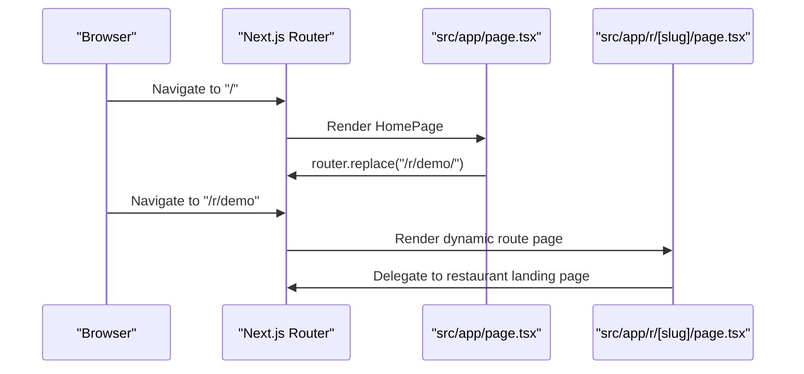
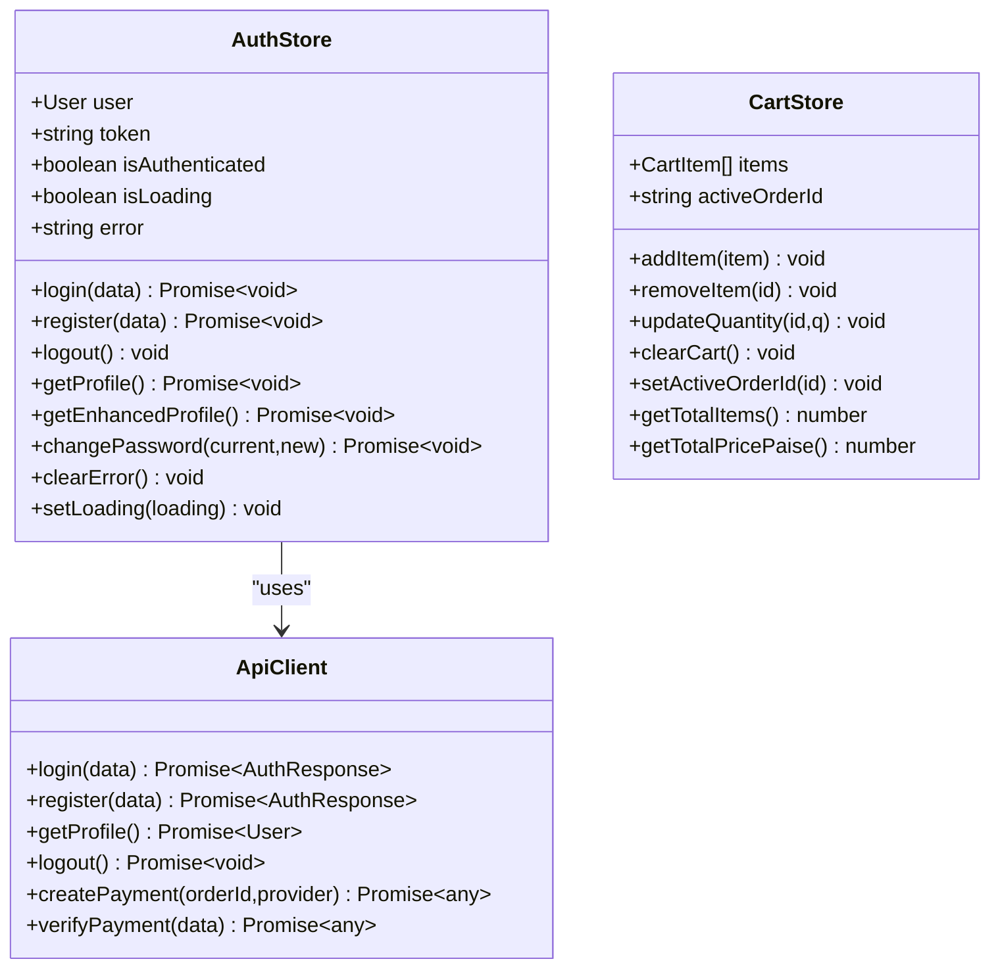
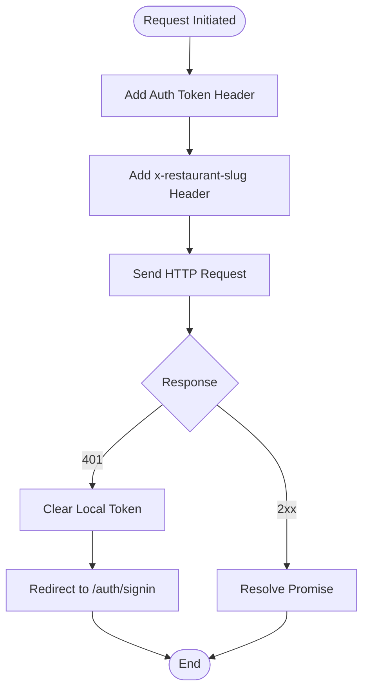
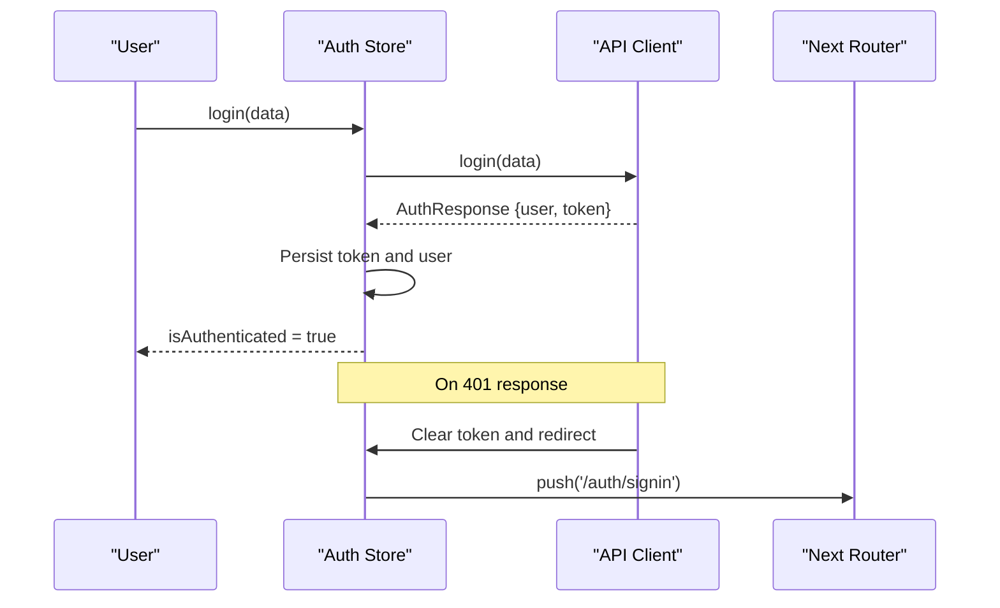
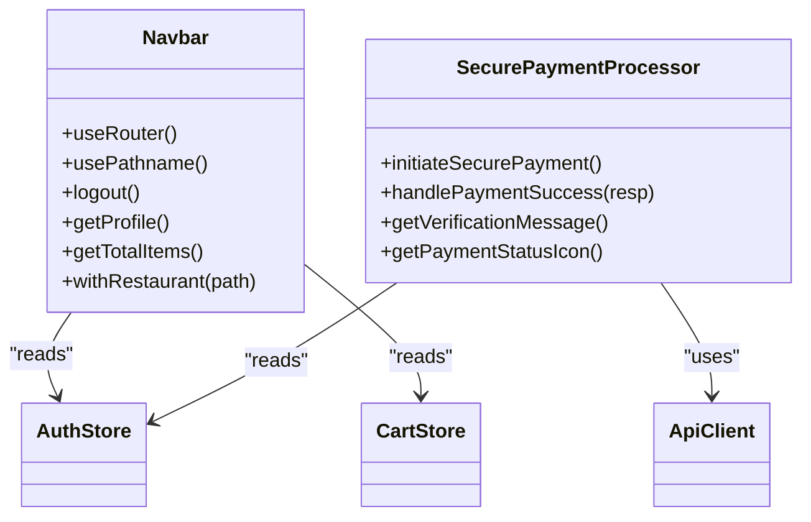
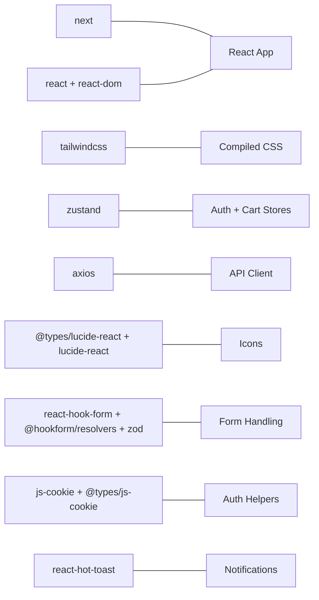

# Frontend System

<cite>
**Referenced Files in This Document**
- [package.json](file://restaurant-frontend/package.json)
- [tsconfig.json](file://restaurant-frontend/tsconfig.json)
- [tailwind.config.js](file://restaurant-frontend/tailwind.config.js)
- [next.config.js](file://restaurant-frontend/next.config.js)
- [src/app/layout.tsx](file://restaurant-frontend/src/app/layout.tsx)
- [src/app/globals.css](file://restaurant-frontend/src/app/globals.css)
- [src/store/auth.ts](file://restaurant-frontend/src/store/auth.ts)
- [src/store/cart.ts](file://restaurant-frontend/src/store/cart.ts)
- [src/lib/api-client.ts](file://restaurant-frontend/src/lib/api-client.ts)
- [src/components/Navbar.tsx](file://restaurant-frontend/src/components/Navbar.tsx)
- [src/components/SecurePaymentProcessor.tsx](file://restaurant-frontend/src/components/SecurePaymentProcessor.tsx)
- [src/app/page.tsx](file://restaurant-frontend/src/app/page.tsx)
- [src/app/r/[slug]/page.tsx](file://restaurant-frontend/src/app/r/[slug]/page.tsx)
- [src/lib/currency.ts](file://restaurant-frontend/src/lib/currency.ts)
</cite>

## Table of Contents
1. [Introduction](#introduction)
2. [Project Structure](#project-structure)
3. [Core Components](#core-components)
4. [Architecture Overview](#architecture-overview)
5. [Detailed Component Analysis](#detailed-component-analysis)
6. [Dependency Analysis](#dependency-analysis)
7. [Performance Considerations](#performance-considerations)
8. [Troubleshooting Guide](#troubleshooting-guide)
9. [Conclusion](#conclusion)
10. [Appendices](#appendices)

## Introduction
This document describes the frontend system for DeQ-Bite’s Next.js React application. It covers project structure, TypeScript configuration, Tailwind CSS styling, routing with the Next.js App Router, state management with Zustand stores, reusable UI components, API client configuration, request/response handling and error management, authentication flow and protected routes, the component library, form handling with React Hook Form, validation strategies, responsive design patterns, accessibility considerations, and performance optimizations including code splitting and lazy loading.

## Project Structure
The frontend is organized under the restaurant-frontend directory with the following high-level structure:
- App Router pages under src/app (including nested dynamic routes)
- Reusable UI components under src/components
- Shared logic under src/lib (API client, currency helpers)
- Global state stores under src/store (authentication, cart)
- Global styles under src/app/globals.css
- Build and framework configuration files (next.config.js, tsconfig.json, tailwind.config.js)

**Diagram sources**
- [src/app/page.tsx](file://restaurant-frontend/src/app/page.tsx#L1-L24)
- [src/app/r/[slug]/page.tsx](file://restaurant-frontend/src/app/r/[slug]/page.tsx#L1-L6)
- [src/components/Navbar.tsx](file://restaurant-frontend/src/components/Navbar.tsx#L1-L197)
- [src/components/SecurePaymentProcessor.tsx](file://restaurant-frontend/src/components/SecurePaymentProcessor.tsx#L1-L347)
- [src/store/auth.ts](file://restaurant-frontend/src/store/auth.ts#L1-L177)
- [src/store/cart.ts](file://restaurant-frontend/src/store/cart.ts#L1-L92)
- [src/lib/api-client.ts](file://restaurant-frontend/src/lib/api-client.ts#L1-L894)
- [src/lib/currency.ts](file://restaurant-frontend/src/lib/currency.ts#L1-L12)

**Section sources**
- [package.json](file://restaurant-frontend/package.json#L1-L54)
- [next.config.js](file://restaurant-frontend/next.config.js#L1-L22)
- [tsconfig.json](file://restaurant-frontend/tsconfig.json#L1-L34)
- [tailwind.config.js](file://restaurant-frontend/tailwind.config.js#L1-L31)

## Core Components
- Root layout and global styles: Defines metadata, viewport, global CSS, and the root layout wrapper with a shared navbar and toast notifications.
- Navigation bar: Provides responsive desktop and mobile navigation, cart badge, and user actions with role-aware visibility.
- Secure payment processor: Integrates with the backend to create and verify payments, supports Razorpay, and displays real-time verification status.
- API client: Centralized Axios-based client with tenant-aware endpoints, auth token injection, and robust error handling.
- Zustand stores: Authentication store with persisted session and cart store with persisted items.

**Section sources**
- [src/app/layout.tsx](file://restaurant-frontend/src/app/layout.tsx#L1-L50)
- [src/app/globals.css](file://restaurant-frontend/src/app/globals.css#L1-L146)
- [src/components/Navbar.tsx](file://restaurant-frontend/src/components/Navbar.tsx#L1-L197)
- [src/components/SecurePaymentProcessor.tsx](file://restaurant-frontend/src/components/SecurePaymentProcessor.tsx#L1-L347)
- [src/lib/api-client.ts](file://restaurant-frontend/src/lib/api-client.ts#L1-L894)
- [src/store/auth.ts](file://restaurant-frontend/src/store/auth.ts#L1-L177)
- [src/store/cart.ts](file://restaurant-frontend/src/store/cart.ts#L1-L92)

## Architecture Overview
The frontend follows a layered architecture:
- Presentation layer: Next.js App Router pages and shared components
- State layer: Zustand stores for auth and cart
- Service layer: API client encapsulating HTTP requests and tenant routing
- Infrastructure: Next.js configuration, TypeScript compiler options, and Tailwind CSS

**Diagram sources**
- [src/app/layout.tsx](file://restaurant-frontend/src/app/layout.tsx#L1-L50)
- [src/components/Navbar.tsx](file://restaurant-frontend/src/components/Navbar.tsx#L1-L197)
- [src/components/SecurePaymentProcessor.tsx](file://restaurant-frontend/src/components/SecurePaymentProcessor.tsx#L1-L347)
- [src/store/auth.ts](file://restaurant-frontend/src/store/auth.ts#L1-L177)
- [src/store/cart.ts](file://restaurant-frontend/src/store/cart.ts#L1-L92)
- [src/lib/api-client.ts](file://restaurant-frontend/src/lib/api-client.ts#L1-L894)

## Detailed Component Analysis

### Routing Strategy with Next.js App Router
- Root redirection: The home page redirects to a demo restaurant route for immediate UX.
- Dynamic restaurant slug route: A catch-all dynamic route under r/[slug] delegates to the restaurant landing page implementation.
- Tenant-aware navigation: The navbar and API client compute tenant-specific URLs based on the current restaurant slug.

**Diagram sources**
- [src/app/page.tsx](file://restaurant-frontend/src/app/page.tsx#L1-L24)
- [src/app/r/[slug]/page.tsx](file://restaurant-frontend/src/app/r/[slug]/page.tsx#L1-L6)

**Section sources**
- [src/app/page.tsx](file://restaurant-frontend/src/app/page.tsx#L1-L24)
- [src/app/r/[slug]/page.tsx](file://restaurant-frontend/src/app/r/[slug]/page.tsx#L1-L6)
- [src/components/Navbar.tsx](file://restaurant-frontend/src/components/Navbar.tsx#L33-L38)
- [src/lib/api-client.ts](file://restaurant-frontend/src/lib/api-client.ts#L305-L322)

### State Management with Zustand
- Authentication store: Manages user, token, authentication state, loading, and errors; persists minimal subset to localStorage; integrates with the API client for login, register, logout, profile retrieval, and password change.
- Cart store: Manages items, active order ID, and derived totals; persists items and active order ID.

**Diagram sources**
- [src/store/auth.ts](file://restaurant-frontend/src/store/auth.ts#L1-L177)
- [src/store/cart.ts](file://restaurant-frontend/src/store/cart.ts#L1-L92)
- [src/lib/api-client.ts](file://restaurant-frontend/src/lib/api-client.ts#L194-L440)

**Section sources**
- [src/store/auth.ts](file://restaurant-frontend/src/store/auth.ts#L1-L177)
- [src/store/cart.ts](file://restaurant-frontend/src/store/cart.ts#L1-L92)

### API Client Configuration and Error Handling
- Base URL and interceptors: Configures Axios instance with base URL from environment, request interceptor injects Authorization and tenant slug headers, response interceptor handles 401 by clearing token and redirecting to sign-in.
- Tenant routing: Builds tenant-aware endpoints using the active restaurant slug, with fallbacks to environment variables and path detection.
- Comprehensive endpoints: Authentication, payments, invoices, menu, categories, tables, orders, coupons, restaurants, and offers.

**Diagram sources**
- [src/lib/api-client.ts](file://restaurant-frontend/src/lib/api-client.ts#L197-L240)

**Section sources**
- [src/lib/api-client.ts](file://restaurant-frontend/src/lib/api-client.ts#L194-L440)
- [src/lib/api-client.ts](file://restaurant-frontend/src/lib/api-client.ts#L266-L299)
- [src/lib/api-client.ts](file://restaurant-frontend/src/lib/api-client.ts#L305-L322)

### Authentication Flow and Protected Routes
- Session persistence: Auth store persists user, token, and authentication state; on hydration, sets token in localStorage for backend requests.
- Role-aware navigation: Navbar conditionally renders admin and kitchen links based on restaurant role.
- Protected navigation: Unauthorized users are redirected to sign-in when encountering protected routes.

**Diagram sources**
- [src/store/auth.ts](file://restaurant-frontend/src/store/auth.ts#L33-L56)
- [src/lib/api-client.ts](file://restaurant-frontend/src/lib/api-client.ts#L224-L239)
- [src/components/Navbar.tsx](file://restaurant-frontend/src/components/Navbar.tsx#L17-L25)

**Section sources**
- [src/store/auth.ts](file://restaurant-frontend/src/store/auth.ts#L162-L176)
- [src/lib/api-client.ts](file://restaurant-frontend/src/lib/api-client.ts#L224-L239)
- [src/components/Navbar.tsx](file://restaurant-frontend/src/components/Navbar.tsx#L17-L25)

### Component Library and Reusable UI
- Navbar: Responsive desktop/mobile navigation, cart badge, conditional auth actions, and role-aware admin/kitchen links.
- SecurePaymentProcessor: Encapsulates payment initiation, Razorpay integration, and verification with real-time status updates.

**Diagram sources**
- [src/components/Navbar.tsx](file://restaurant-frontend/src/components/Navbar.tsx#L1-L197)
- [src/components/SecurePaymentProcessor.tsx](file://restaurant-frontend/src/components/SecurePaymentProcessor.tsx#L1-L347)
- [src/store/auth.ts](file://restaurant-frontend/src/store/auth.ts#L1-L177)
- [src/store/cart.ts](file://restaurant-frontend/src/store/cart.ts#L1-L92)
- [src/lib/api-client.ts](file://restaurant-frontend/src/lib/api-client.ts#L194-L440)

**Section sources**
- [src/components/Navbar.tsx](file://restaurant-frontend/src/components/Navbar.tsx#L1-L197)
- [src/components/SecurePaymentProcessor.tsx](file://restaurant-frontend/src/components/SecurePaymentProcessor.tsx#L1-L347)

### Form Handling and Validation Strategies
- Form library: React Hook Form is included as a dependency; typical usage involves defining a resolver (e.g., Zod) and managing form state with field-level validation.
- Validation alignment: Zod is present in dependencies, enabling strong typing and runtime validation for forms.

Note: Specific form pages and components are not included in the current snapshot; the presence of dependencies indicates readiness for form handling.

**Section sources**
- [package.json](file://restaurant-frontend/package.json#L15-L29)

### Responsive Design Patterns and Accessibility
- Tailwind configuration: Extends breakpoints and spacing; includes responsive text utilities and safe area insets for mobile.
- Global styles: Smooth scrolling, anti-aliased fonts, and mobile touch-friendly hover states.
- Accessibility: Semantic HTML, focus-friendly interactions, and role-aware rendering in the navbar.

**Section sources**
- [tailwind.config.js](file://restaurant-frontend/tailwind.config.js#L1-L31)
- [src/app/globals.css](file://restaurant-frontend/src/app/globals.css#L1-L146)
- [src/components/Navbar.tsx](file://restaurant-frontend/src/components/Navbar.tsx#L161-L191)

### Performance Optimizations
- Next.js configuration: Strict mode enabled, remote image patterns for HTTPS, environment variables exposed to client, and output file tracing root.
- Code splitting: Next.js App Router naturally splits pages and components; use dynamic imports for heavy components.
- Lazy loading: Image optimization via Next/image; consider dynamic imports for modals and heavy widgets.
- Toast notifications: react-hot-toast provides lightweight, non-blocking feedback.

**Section sources**
- [next.config.js](file://restaurant-frontend/next.config.js#L1-L22)
- [src/app/layout.tsx](file://restaurant-frontend/src/app/layout.tsx#L36-L45)

## Dependency Analysis
The frontend depends on Next.js 15, React 18, Tailwind CSS, Zustand for state, Axios for HTTP, and various UI libraries. TypeScript configuration enables strict checks and path aliases.

**Diagram sources**
- [package.json](file://restaurant-frontend/package.json#L12-L31)

**Section sources**
- [package.json](file://restaurant-frontend/package.json#L12-L31)
- [tsconfig.json](file://restaurant-frontend/tsconfig.json#L22-L30)

## Performance Considerations
- Prefer server components and static generation where possible; use client directives selectively.
- Split large components with dynamic imports to reduce initial bundle size.
- Leverage Next.js image optimization and CDN-backed assets.
- Minimize re-renders by structuring Zustand slices efficiently and avoiding unnecessary selector recomputations.
- Use React Suspense boundaries for data fetching where applicable.

## Troubleshooting Guide
- Authentication failures: 401 responses trigger token clearing and redirect to sign-in; verify environment variables and token persistence.
- Payment verification timeouts: The payment processor enforces a 25-second verification timeout; network issues or backend delays can cause failures.
- Tenant routing issues: Ensure the restaurant slug is set in localStorage or present in the URL; otherwise, tenant endpoints will not be prefixed.

**Section sources**
- [src/lib/api-client.ts](file://restaurant-frontend/src/lib/api-client.ts#L224-L239)
- [src/components/SecurePaymentProcessor.tsx](file://restaurant-frontend/src/components/SecurePaymentProcessor.tsx#L158-L162)
- [src/lib/api-client.ts](file://restaurant-frontend/src/lib/api-client.ts#L266-L299)

## Conclusion
The DeQ-Bite frontend leverages Next.js App Router for structured routing, Zustand for efficient local state, and a centralized API client for tenant-aware HTTP communication. The UI is built with reusable components, Tailwind CSS for styling, and responsive patterns. Robust error handling, authentication flow, and payment processing are integrated to deliver a secure and scalable user experience.

## Appendices

### TypeScript Configuration Highlights
- Strict mode enabled with no emit for type checking during development.
- Path aliases for cleaner imports across components, hooks, lib, store, and utils.
- Bundler module resolution for modern builds.

**Section sources**
- [tsconfig.json](file://restaurant-frontend/tsconfig.json#L1-L34)

### Tailwind CSS Setup
- Content scanning for pages, components, and app directories.
- Extended screens and spacing; responsive text utilities; safe area support.

**Section sources**
- [tailwind.config.js](file://restaurant-frontend/tailwind.config.js#L1-L31)

### Currency Utilities
- INR formatting and conversion helpers for paise to rupees.

**Section sources**
- [src/lib/currency.ts](file://restaurant-frontend/src/lib/currency.ts#L1-L12)