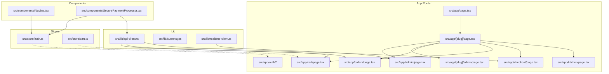
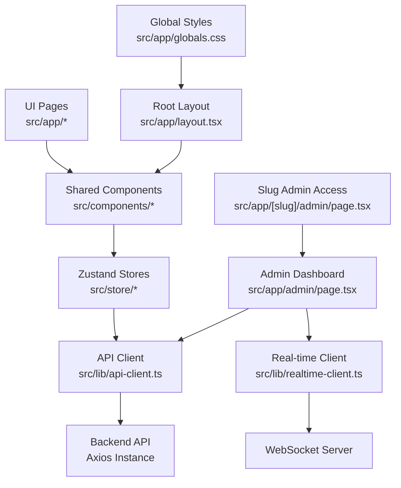
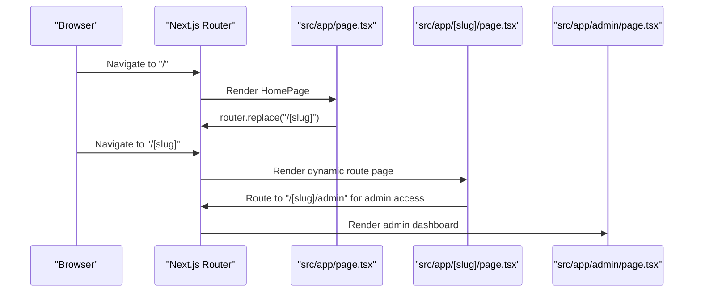
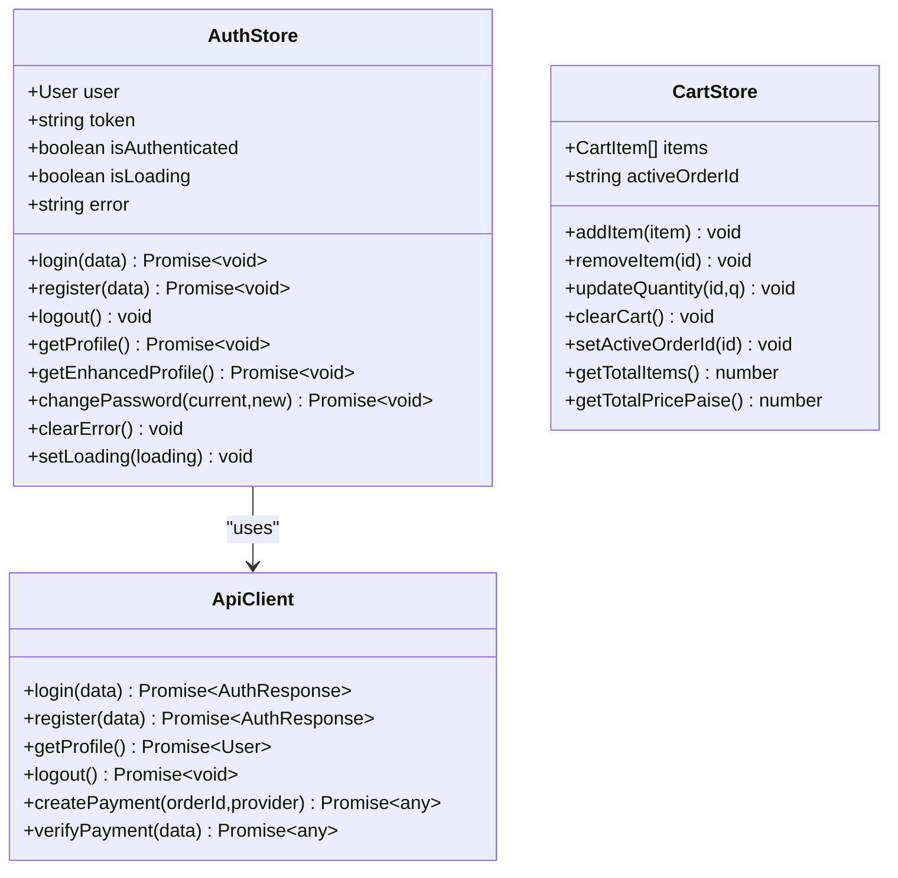
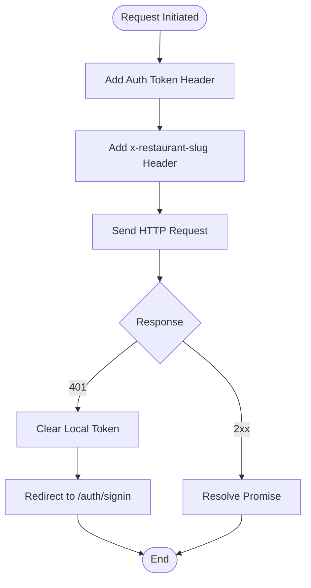
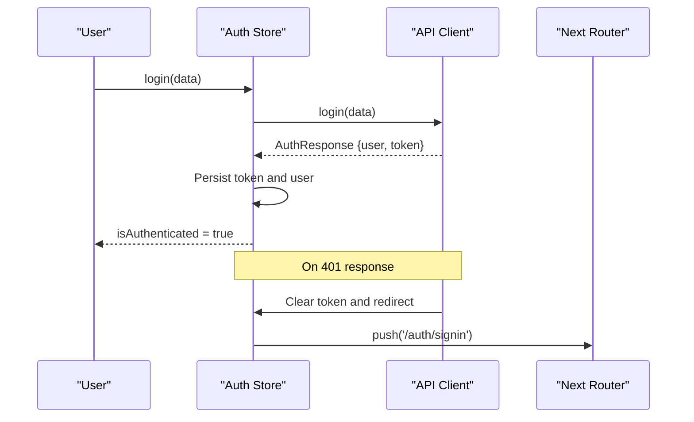
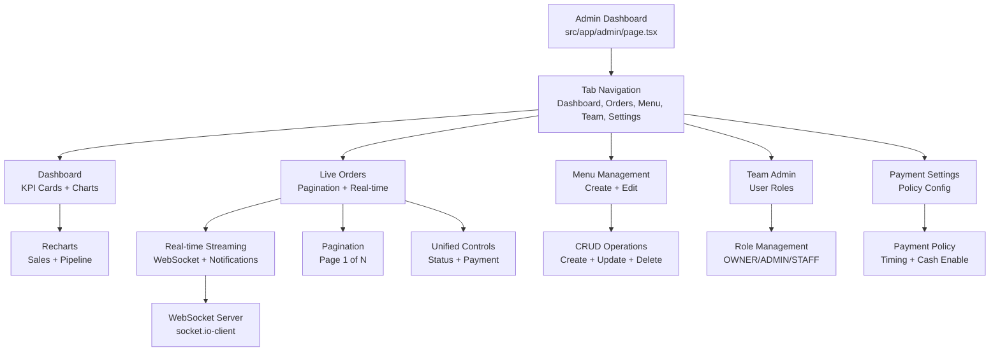
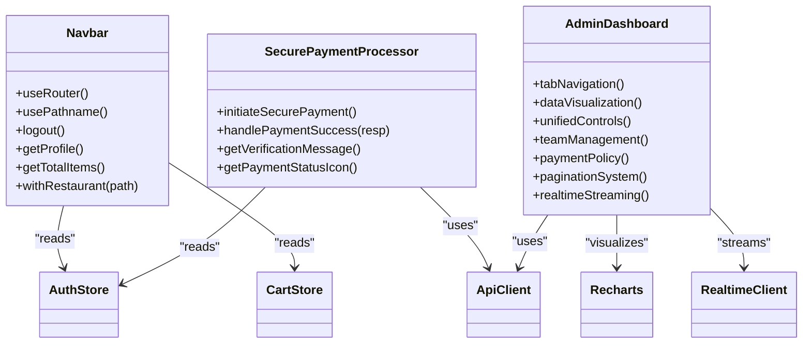
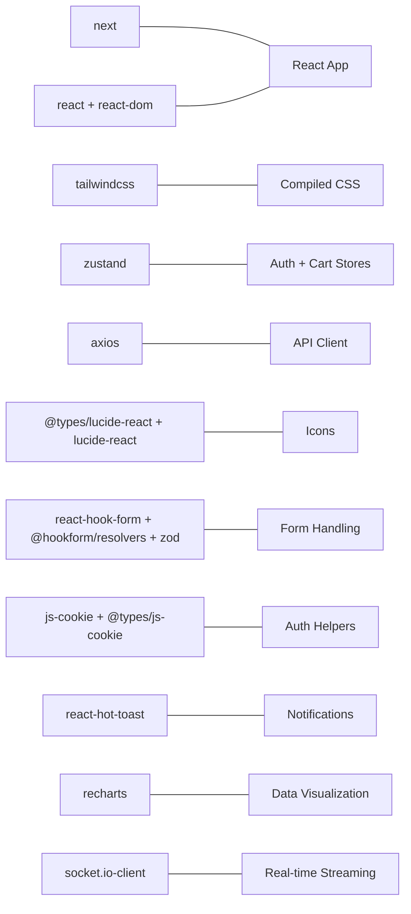

# Frontend System

<cite>
**Referenced Files in This Document**
- [package.json](file://restaurant-frontend/package.json)
- [tsconfig.json](file://restaurant-frontend/tsconfig.json)
- [tailwind.config.js](file://restaurant-frontend/tailwind.config.js)
- [next.config.js](file://restaurant-frontend/next.config.js)
- [src/app/layout.tsx](file://restaurant-frontend/src/app/layout.tsx)
- [src/app/globals.css](file://restaurant-frontend/src/app/globals.css)
- [src/store/auth.ts](file://restaurant-frontend/src/store/auth.ts)
- [src/store/cart.ts](file://restaurant-frontend/src/store/cart.ts)
- [src/lib/api-client.ts](file://restaurant-frontend/src/lib/api-client.ts)
- [src/components/Navbar.tsx](file://restaurant-frontend/src/components/Navbar.tsx)
- [src/components/SecurePaymentProcessor.tsx](file://restaurant-frontend/src/components/SecurePaymentProcessor.tsx)
- [src/app/page.tsx](file://restaurant-frontend/src/app/page.tsx)
- [src/app/[slug]/page.tsx](file://restaurant-frontend/src/app/[slug]/page.tsx)
- [src/app/admin/page.tsx](file://restaurant-frontend/src/app/admin/page.tsx)
- [src/app/[slug]/admin/page.tsx](file://restaurant-frontend/src/app/[slug]/admin/page.tsx)
- [src/lib/currency.ts](file://restaurant-frontend/src/lib/currency.ts)
- [src/lib/realtime-client.ts](file://restaurant-frontend/src/lib/realtime-client.ts)
</cite>

## Update Summary
**Changes Made**
- Enhanced admin dashboard with comprehensive order management pagination system
- Added real-time order streaming with WebSocket integration for live updates
- Implemented unified order and payment management controls with partial payment support
- Expanded UI components with mobile-optimized navigation and notification system
- Added cash payment approval workflow and enhanced team management features
- Updated API client with new pagination endpoints and real-time event handling

## Table of Contents
1. [Introduction](#introduction)
2. [Project Structure](#project-structure)
3. [Core Components](#core-components)
4. [Architecture Overview](#architecture-overview)
5. [Detailed Component Analysis](#detailed-component-analysis)
6. [Dependency Analysis](#dependency-analysis)
7. [Performance Considerations](#performance-considerations)
8. [Troubleshooting Guide](#troubleshooting-guide)
9. [Conclusion](#conclusion)
10. [Appendices](#appendices)

## Introduction
This document describes the frontend system for DeQ-Bite's Next.js React application. It covers project structure, TypeScript configuration, Tailwind CSS styling, routing with the Next.js App Router, state management with Zustand stores, reusable UI components, API client configuration, request/response handling and error management, authentication flow and protected routes, the component library, form handling with React Hook Form, validation strategies, responsive design patterns, accessibility considerations, and performance optimizations including code splitting and lazy loading.

**Updated** Enhanced with comprehensive admin dashboard documentation featuring real-time order streaming, pagination system, unified order/payment management, and advanced UI components with mobile optimization.

## Project Structure
The frontend is organized under the restaurant-frontend directory with the following high-level structure:
- App Router pages under src/app (including nested dynamic routes and slug-based admin access)
- Reusable UI components under src/components
- Shared logic under src/lib (API client, currency helpers, real-time client)
- Global state stores under src/store (authentication, cart)
- Global styles under src/app/globals.css
- Build and framework configuration files (next.config.js, tsconfig.json, tailwind.config.js)

```mermaid
graph TB
subgraph "App Router"
P["src/app/page.tsx"]
Slug["src/app/[slug]/page.tsx"]
Admin["src/app/admin/page.tsx"]
SlugAdmin["src/app/[slug]/admin/page.tsx"]
Auth["src/app/auth/*"]
Orders["src/app/orders/page.tsx"]
Cart["src/app/cart/page.tsx"]
Checkout["src/app/checkout/page.tsx"]
Kitchen["src/app/kitchen/page.tsx"]
end
subgraph "Components"
Nav["src/components/Navbar.tsx"]
SecPay["src/components/SecurePaymentProcessor.tsx"]
end
subgraph "Stores"
AuthStore["src/store/auth.ts"]
CartStore["src/store/cart.ts"]
end
subgraph "Lib"
Api["src/lib/api-client.ts"]
Cur["src/lib/currency.ts"]
RT["src/lib/realtime-client.ts"]
end
P --> Slug
Slug --> Admin
Slug --> SlugAdmin
Slug --> Orders
Slug --> Cart
Slug --> Checkout
Slug --> Kitchen
Nav --> AuthStore
SecPay --> AuthStore
SecPay --> Api
CartStore -.-> Cart
AuthStore -.-> Auth
Api --> Orders
Api --> Cart
Api --> Checkout
RT --> Admin
```

**Diagram sources**
- [src/app/page.tsx:1-24](file://restaurant-frontend/src/app/page.tsx#L1-L24)
- [src/app/[slug]/page.tsx](file://restaurant-frontend/src/app/[slug]/page.tsx#L1-L6)
- [src/app/admin/page.tsx:1-1074](file://restaurant-frontend/src/app/admin/page.tsx#L1-L1074)
- [src/app/[slug]/admin/page.tsx](file://restaurant-frontend/src/app/[slug]/admin/page.tsx#L1-L6)
- [src/components/Navbar.tsx:1-197](file://restaurant-frontend/src/components/Navbar.tsx#L1-L197)
- [src/components/SecurePaymentProcessor.tsx:1-347](file://restaurant-frontend/src/components/SecurePaymentProcessor.tsx#L1-L347)
- [src/store/auth.ts:1-177](file://restaurant-frontend/src/store/auth.ts#L1-L177)
- [src/store/cart.ts:1-92](file://restaurant-frontend/src/store/cart.ts#L1-L92)
- [src/lib/api-client.ts:1-958](file://restaurant-frontend/src/lib/api-client.ts#L1-L958)
- [src/lib/currency.ts:1-12](file://restaurant-frontend/src/lib/currency.ts#L1-L12)
- [src/lib/realtime-client.ts:1-116](file://restaurant-frontend/src/lib/realtime-client.ts#L1-L116)

**Section sources**
- [package.json:1-54](file://restaurant-frontend/package.json#L1-L54)
- [next.config.js:1-22](file://restaurant-frontend/next.config.js#L1-L22)
- [tsconfig.json:1-34](file://restaurant-frontend/tsconfig.json#L1-L34)
- [tailwind.config.js:1-31](file://restaurant-frontend/tailwind.config.js#L1-L31)

## Core Components
- Root layout and global styles: Defines metadata, viewport, global CSS, and the root layout wrapper with a shared navbar and toast notifications.
- Navigation bar: Provides responsive desktop and mobile navigation, cart badge, and user actions with role-aware visibility.
- Secure payment processor: Integrates with the backend to create and verify payments, supports Razorpay, and displays real-time verification status.
- API client: Centralized Axios-based client with tenant-aware endpoints, auth token injection, and robust error handling.
- Zustand stores: Authentication store with persisted session and cart store with persisted items.
- **Admin Dashboard**: Comprehensive restaurant management console with real-time order streaming, pagination system, unified order/payment management, and enhanced UI components.

**Updated** Added comprehensive admin dashboard component with real-time order streaming, pagination system, unified order/payment management, mobile-optimized navigation, and advanced notification system.

**Section sources**
- [src/app/layout.tsx:1-50](file://restaurant-frontend/src/app/layout.tsx#L1-L50)
- [src/app/globals.css:1-146](file://restaurant-frontend/src/app/globals.css#L1-L146)
- [src/components/Navbar.tsx:1-197](file://restaurant-frontend/src/components/Navbar.tsx#L1-L197)
- [src/components/SecurePaymentProcessor.tsx:1-347](file://restaurant-frontend/src/components/SecurePaymentProcessor.tsx#L1-L347)
- [src/lib/api-client.ts:1-958](file://restaurant-frontend/src/lib/api-client.ts#L1-L958)
- [src/store/auth.ts:1-177](file://restaurant-frontend/src/store/auth.ts#L1-L177)
- [src/store/cart.ts:1-92](file://restaurant-frontend/src/store/cart.ts#L1-L92)
- [src/app/admin/page.tsx:1-1074](file://restaurant-frontend/src/app/admin/page.tsx#L1-L1074)
- [src/lib/realtime-client.ts:1-116](file://restaurant-frontend/src/lib/realtime-client.ts#L1-L116)

## Architecture Overview
The frontend follows a layered architecture:
- Presentation layer: Next.js App Router pages and shared components
- State layer: Zustand stores for auth and cart
- Service layer: API client encapsulating HTTP requests and tenant routing
- Infrastructure: Next.js configuration, TypeScript compiler options, and Tailwind CSS

```mermaid
graph TB
UI["UI Pages<br/>src/app/*"] --> Comp["Shared Components<br/>src/components/*"]
Comp --> Store["Zustand Stores<br/>src/store/*"]
Store --> API["API Client<br/>src/lib/api-client.ts"]
API --> BE["Backend API<br/>Axios Instance"]
RT["Real-time Client<br/>src/lib/realtime-client.ts"] --> WS["WebSocket Server"]
Layout["Root Layout<br/>src/app/layout.tsx"] --> Comp
Styles["Global Styles<br/>src/app/globals.css"] --> Layout
Admin["Admin Dashboard<br/>src/app/admin/page.tsx"] --> API
Admin --> RT
SlugAdmin["Slug Admin Access<br/>src/app/[slug]/admin/page.tsx"] --> Admin
```

**Diagram sources**
- [src/app/layout.tsx:1-50](file://restaurant-frontend/src/app/layout.tsx#L1-L50)
- [src/components/Navbar.tsx:1-197](file://restaurant-frontend/src/components/Navbar.tsx#L1-L197)
- [src/components/SecurePaymentProcessor.tsx:1-347](file://restaurant-frontend/src/components/SecurePaymentProcessor.tsx#L1-L347)
- [src/store/auth.ts:1-177](file://restaurant-frontend/src/store/auth.ts#L1-L177)
- [src/store/cart.ts:1-92](file://restaurant-frontend/src/store/cart.ts#L1-L92)
- [src/lib/api-client.ts:1-958](file://restaurant-frontend/src/lib/api-client.ts#L1-L958)
- [src/lib/realtime-client.ts:1-116](file://restaurant-frontend/src/lib/realtime-client.ts#L1-L116)
- [src/app/admin/page.tsx:1-1074](file://restaurant-frontend/src/app/admin/page.tsx#L1-L1074)
- [src/app/[slug]/admin/page.tsx](file://restaurant-frontend/src/app/[slug]/admin/page.tsx#L1-L6)

## Detailed Component Analysis

### Routing Strategy with Next.js App Router
- Root redirection: The home page redirects to a demo restaurant route for immediate UX.
- Dynamic restaurant slug route: A catch-all dynamic route under [slug] delegates to the restaurant landing page implementation.
- **Slug-based admin access**: Dedicated admin route under [slug]/admin provides tenant-specific admin functionality.
- Tenant-aware navigation: The navbar and API client compute tenant-specific URLs based on the current restaurant slug.

```mermaid
sequenceDiagram
participant Browser as "Browser"
participant Next as "Next.js Router"
participant Home as "src/app/page.tsx"
participant Slug as "src/app/[slug]/page.tsx"
participant Admin as "src/app/admin/page.tsx"
Browser->>Next : Navigate to "/"
Next->>Home : Render HomePage
Home->>Next : router.replace("/[slug]")
Browser->>Next : Navigate to "/[slug]"
Next->>Slug : Render dynamic route page
Slug->>Next : Route to "/[slug]/admin" for admin access
Next->>Admin : Render admin dashboard
```

**Diagram sources**
- [src/app/page.tsx:1-24](file://restaurant-frontend/src/app/page.tsx#L1-L24)
- [src/app/[slug]/page.tsx](file://restaurant-frontend/src/app/[slug]/page.tsx#L1-L6)
- [src/app/[slug]/admin/page.tsx](file://restaurant-frontend/src/app/[slug]/admin/page.tsx#L1-L6)

**Section sources**
- [src/app/page.tsx:1-24](file://restaurant-frontend/src/app/page.tsx#L1-L24)
- [src/app/[slug]/page.tsx](file://restaurant-frontend/src/app/[slug]/page.tsx#L1-L6)
- [src/app/[slug]/admin/page.tsx](file://restaurant-frontend/src/app/[slug]/admin/page.tsx#L1-L6)
- [src/components/Navbar.tsx:33-38](file://restaurant-frontend/src/components/Navbar.tsx#L33-L38)
- [src/lib/api-client.ts:305-322](file://restaurant-frontend/src/lib/api-client.ts#L305-L322)

### State Management with Zustand
- Authentication store: Manages user, token, authentication state, loading, and errors; persists minimal subset to localStorage; integrates with the API client for login, register, logout, profile retrieval, and password change.
- Cart store: Manages items, active order ID, and derived totals; persists items and active order ID.

```mermaid
classDiagram
class AuthStore {
+User user
+string token
+boolean isAuthenticated
+boolean isLoading
+string error
+login(data) Promise~void~
+register(data) Promise~void~
+logout() void
+getProfile() Promise~void~
+getEnhancedProfile() Promise~void~
+changePassword(current,new) Promise~void~
+clearError() void
+setLoading(loading) void
}
class CartStore {
+CartItem[] items
+string activeOrderId
+addItem(item) void
+removeItem(id) void
+updateQuantity(id,q) void
+clearCart() void
+setActiveOrderId(id) void
+getTotalItems() number
+getTotalPricePaise() number
}
class ApiClient {
+login(data) Promise~AuthResponse~
+register(data) Promise~AuthResponse~
+getProfile() Promise~User~
+logout() Promise~void~
+createPayment(orderId,provider) Promise~any~
+verifyPayment(data) Promise~any~
}
AuthStore --> ApiClient : "uses"
```

**Diagram sources**
- [src/store/auth.ts:1-177](file://restaurant-frontend/src/store/auth.ts#L1-L177)
- [src/store/cart.ts:1-92](file://restaurant-frontend/src/store/cart.ts#L1-L92)
- [src/lib/api-client.ts:194-440](file://restaurant-frontend/src/lib/api-client.ts#L194-L440)

**Section sources**
- [src/store/auth.ts:1-177](file://restaurant-frontend/src/store/auth.ts#L1-L177)
- [src/store/cart.ts:1-92](file://restaurant-frontend/src/store/cart.ts#L1-L92)

### API Client Configuration and Error Handling
- Base URL and interceptors: Configures Axios instance with base URL from environment, request interceptor injects Authorization and tenant slug headers, response interceptor handles 401 by clearing token and redirecting to sign-in.
- Tenant routing: Builds tenant-aware endpoints using the active restaurant slug, with fallbacks to environment variables and path detection.
- **Enhanced admin endpoints**: Comprehensive pagination support with getRestaurantOrdersPage(), unified order/payment management with updatePaymentStatus(), and real-time event handling.
- **Real-time updates**: Server-Sent Events support for live order notifications and automatic dashboard refresh.

```mermaid
flowchart TD
Start(["Request Initiated"]) --> AddAuth["Add Auth Token Header"]
AddAuth --> AddTenant["Add x-restaurant-slug Header"]
AddTenant --> Send["Send HTTP Request"]
Send --> Resp{"Response"}
Resp --> |2xx| Success["Resolve Promise"]
Resp --> |401| ClearToken["Clear Local Token"]
ClearToken --> Redirect["Redirect to /auth/signin"]
Redirect --> End(["End"])
Success --> End
```

**Diagram sources**
- [src/lib/api-client.ts:197-240](file://restaurant-frontend/src/lib/api-client.ts#L197-L240)

**Section sources**
- [src/lib/api-client.ts:194-440](file://restaurant-frontend/src/lib/api-client.ts#L194-L440)
- [src/lib/api-client.ts:266-299](file://restaurant-frontend/src/lib/api-client.ts#L266-L299)
- [src/lib/api-client.ts:305-322](file://restaurant-frontend/src/lib/api-client.ts#L305-L322)
- [src/lib/api-client.ts:662-683](file://restaurant-frontend/src/lib/api-client.ts#L662-L683)
- [src/lib/api-client.ts:839-849](file://restaurant-frontend/src/lib/api-client.ts#L839-L849)
- [src/lib/api-client.ts:831-837](file://restaurant-frontend/src/lib/api-client.ts#L831-L837)

### Authentication Flow and Protected Routes
- Session persistence: Auth store persists user, token, and authentication state; on hydration, sets token in localStorage for backend requests.
- Role-aware navigation: Navbar conditionally renders admin and kitchen links based on restaurant role.
- **Protected admin access**: Admin routes are accessible only to users with OWNER or ADMIN roles, with automatic redirection for unauthorized access.
- Protected navigation: Unauthorized users are redirected to sign-in when encountering protected routes.

```mermaid
sequenceDiagram
participant User as "User"
participant Store as "Auth Store"
participant API as "API Client"
participant Router as "Next Router"
User->>Store : login(data)
Store->>API : login(data)
API-->>Store : AuthResponse {user, token}
Store->>Store : Persist token and user
Store-->>User : isAuthenticated = true
Note over API,Store : On 401 response
API->>Store : Clear token and redirect
Store->>Router : push('/auth/signin')
```

**Diagram sources**
- [src/store/auth.ts:33-56](file://restaurant-frontend/src/store/auth.ts#L33-L56)
- [src/lib/api-client.ts:224-239](file://restaurant-frontend/src/lib/api-client.ts#L224-L239)
- [src/components/Navbar.tsx:17-25](file://restaurant-frontend/src/components/Navbar.tsx#L17-L25)

**Section sources**
- [src/store/auth.ts:162-176](file://restaurant-frontend/src/store/auth.ts#L162-L176)
- [src/lib/api-client.ts:224-239](file://restaurant-frontend/src/lib/api-client.ts#L224-L239)
- [src/components/Navbar.tsx:17-25](file://restaurant-frontend/src/components/Navbar.tsx#L17-L25)

### Admin Dashboard: Comprehensive Restaurant Management Console

**Updated** The admin dashboard is a sophisticated restaurant management console featuring five distinct tabs with comprehensive functionality and real-time order streaming:

#### Tabbed Navigation System
- **Dashboard**: Overview statistics, revenue charts, and action alerts
- **Live Orders**: Unified order management with kitchen status and payment status controls, pagination system
- **Menu**: Complete menu management with availability controls and dish creation
- **Team**: Staff management and user administration
- **Settings**: Payment policies and cash collection management

#### Real-time Order Streaming
- **WebSocket Integration**: Real-time order updates via socket.io with automatic reconnection
- **Live Notifications**: Browser notifications for order status changes and payment updates
- **Automatic Refresh**: Seamless updates without page reloads
- **Event Handling**: Supports order.created and order.updated events with payload merging

#### Pagination System
- **Server-side Pagination**: getRestaurantOrdersPage() with configurable page size (default 20)
- **Progressive Loading**: Efficient loading of order history with pagination controls
- **Total Count Tracking**: Accurate order counts and page calculation
- **Performance Optimization**: Prevents memory issues with large order volumes

#### Unified Order and Payment Management
- **Single Interface**: Combined kitchen status and payment status controls per order
- **Bulk Operations**: Draft-based updates with atomic transaction handling
- **Partial Payments**: Support for PARTIALLY_PAID status with amount validation
- **Cash Collection**: Dedicated approval workflow for cash payments with confirmation dialogs

#### Enhanced UI Components
- **Mobile-First Design**: Edge-to-edge scrollable navigation with pill-style tabs
- **Notification System**: Persistent notification storage with browser permission handling
- **Status Badges**: Color-coded status indicators with hover effects
- **Responsive Layout**: Adaptive grid system for different screen sizes

#### Menu Management
- **Real-time Creation**: Modal-based dish creation with validation
- **Availability Control**: Toggle switches for menu item activation
- **Category Organization**: Dropdown-based categorization
- **Mobile Optimization**: Separate modal interface for mobile devices

#### Team Administration
- **Role Management**: Three-tier access control (OWNER, ADMIN, STAFF)
- **Email Integration**: Direct user invitation via email
- **Visual Role Indicators**: Color-coded role badges

#### Payment Policy Configuration
- **Collection Timing**: BEFORE_MEAL vs AFTER_MEAL settings
- **Cash Enablement**: Toggle for cash payment acceptance
- **Real-time Updates**: Immediate policy application

```mermaid
graph TB
Admin["Admin Dashboard<br/>src/app/admin/page.tsx"] --> Tabs["Tab Navigation<br/>Dashboard, Orders, Menu, Team, Settings"]
Tabs --> Dashboard["Dashboard<br/>KPI Cards + Charts"]
Tabs --> Orders["Live Orders<br/>Pagination + Real-time"]
Tabs --> Menu["Menu Management<br/>Create + Edit"]
Tabs --> Team["Team Admin<br/>User Roles"]
Tabs --> Settings["Payment Settings<br/>Policy Config"]
Dashboard --> Charts["Recharts<br/>Sales + Pipeline"]
Orders --> RT["Real-time Streaming<br/>WebSocket + Notifications"]
Orders --> Pagination["Pagination<br/>Page 1 of N"]
Orders --> Unified["Unified Controls<br/>Status + Payment"]
Menu --> CRUD["CRUD Operations<br/>Create + Update + Delete"]
Team --> Roles["Role Management<br/>OWNER/ADMIN/STAFF"]
Settings --> Policy["Payment Policy<br/>Timing + Cash Enable"]
RT --> WS["WebSocket Server<br/>socket.io-client"]
```

**Diagram sources**
- [src/app/admin/page.tsx:100-113](file://restaurant-frontend/src/app/admin/page.tsx#L100-L113)
- [src/app/admin/page.tsx:145-159](file://restaurant-frontend/src/app/admin/page.tsx#L145-L159)
- [src/app/admin/page.tsx:188-291](file://restaurant-frontend/src/app/admin/page.tsx#L188-L291)
- [src/lib/realtime-client.ts:86-115](file://restaurant-frontend/src/lib/realtime-client.ts#L86-L115)
- [src/lib/api-client.ts:662-683](file://restaurant-frontend/src/lib/api-client.ts#L662-L683)

**Section sources**
- [src/app/admin/page.tsx:1-1074](file://restaurant-frontend/src/app/admin/page.tsx#L1-L1074)
- [src/lib/api-client.ts:662-683](file://restaurant-frontend/src/lib/api-client.ts#L662-L683)
- [src/lib/api-client.ts:839-849](file://restaurant-frontend/src/lib/api-client.ts#L839-L849)
- [src/lib/realtime-client.ts:1-116](file://restaurant-frontend/src/lib/realtime-client.ts#L1-L116)

### Component Library and Reusable UI
- Navbar: Responsive desktop/mobile navigation, cart badge, conditional auth actions, and role-aware admin/kitchen links.
- SecurePaymentProcessor: Encapsulates payment initiation, Razorpay integration, and verification with real-time status updates.
- **Admin Dashboard**: Comprehensive management interface with real-time order streaming, pagination system, unified controls, and enhanced UI components.

```mermaid
classDiagram
class Navbar {
+useRouter()
+usePathname()
+logout()
+getProfile()
+getTotalItems()
+withRestaurant(path)
}
class SecurePaymentProcessor {
+initiateSecurePayment()
+handlePaymentSuccess(resp)
+getVerificationMessage()
+getPaymentStatusIcon()
}
class AdminDashboard {
+tabNavigation()
+dataVisualization()
+unifiedControls()
+teamManagement()
+paymentPolicy()
+paginationSystem()
+realtimeStreaming()
}
Navbar --> AuthStore : "reads"
Navbar --> CartStore : "reads"
SecurePaymentProcessor --> AuthStore : "reads"
SecurePaymentProcessor --> ApiClient : "uses"
AdminDashboard --> ApiClient : "uses"
AdminDashboard --> Recharts : "visualizes"
AdminDashboard --> RealtimeClient : "streams"
```

**Diagram sources**
- [src/components/Navbar.tsx:1-197](file://restaurant-frontend/src/components/Navbar.tsx#L1-L197)
- [src/components/SecurePaymentProcessor.tsx:1-347](file://restaurant-frontend/src/components/SecurePaymentProcessor.tsx#L1-L347)
- [src/store/auth.ts:1-177](file://restaurant-frontend/src/store/auth.ts#L1-L177)
- [src/store/cart.ts:1-92](file://restaurant-frontend/src/store/cart.ts#L1-L92)
- [src/lib/api-client.ts:194-440](file://restaurant-frontend/src/lib/api-client.ts#L194-L440)
- [src/app/admin/page.tsx:1-1074](file://restaurant-frontend/src/app/admin/page.tsx#L1-L1074)
- [src/lib/realtime-client.ts:1-116](file://restaurant-frontend/src/lib/realtime-client.ts#L1-L116)

**Section sources**
- [src/components/Navbar.tsx:1-197](file://restaurant-frontend/src/components/Navbar.tsx#L1-L197)
- [src/components/SecurePaymentProcessor.tsx:1-347](file://restaurant-frontend/src/components/SecurePaymentProcessor.tsx#L1-L347)
- [src/app/admin/page.tsx:1-1074](file://restaurant-frontend/src/app/admin/page.tsx#L1-L1074)
- [src/lib/realtime-client.ts:1-116](file://restaurant-frontend/src/lib/realtime-client.ts#L1-L116)

### Form Handling and Validation Strategies
- Form library: React Hook Form is included as a dependency; typical usage involves defining a resolver (e.g., Zod) and managing form state with field-level validation.
- Validation alignment: Zod is present in dependencies, enabling strong typing and runtime validation for forms.
- **Admin form validation**: Comprehensive input validation for menu creation, user management, and payment policy updates.

Note: Specific form pages and components are not included in the current snapshot; the presence of dependencies indicates readiness for form handling.

**Section sources**
- [package.json:15-29](file://restaurant-frontend/package.json#L15-L29)

### Responsive Design Patterns and Accessibility
- Tailwind configuration: Extends breakpoints and spacing; includes responsive text utilities and safe area insets for mobile.
- Global styles: Smooth scrolling, anti-aliased fonts, and mobile touch-friendly hover states.
- Accessibility: Semantic HTML, focus-friendly interactions, and role-aware rendering in the navbar.
- **Admin accessibility**: Mobile-first design with edge-to-edge scrollable navigation and touch-friendly controls.

**Section sources**
- [tailwind.config.js:1-31](file://restaurant-frontend/tailwind.config.js#L1-L31)
- [src/app/globals.css:1-146](file://restaurant-frontend/src/app/globals.css#L1-L146)
- [src/components/Navbar.tsx:161-191](file://restaurant-frontend/src/components/Navbar.tsx#L161-L191)
- [src/app/admin/page.tsx:579-605](file://restaurant-frontend/src/app/admin/page.tsx#L579-L605)

### Performance Optimizations
- Next.js configuration: Strict mode enabled, remote image patterns for HTTPS, environment variables exposed to client, and output file tracing root.
- Code splitting: Next.js App Router naturally splits pages and components; use dynamic imports for heavy components.
- Lazy loading: Image optimization via Next/image; consider dynamic imports for modals and heavy widgets.
- Toast notifications: react-hot-toast provides lightweight, non-blocking feedback.
- **Admin performance**: Memoized calculations for charts and order analytics, concurrent loading of admin data, and efficient real-time event handling.

**Section sources**
- [next.config.js:1-22](file://restaurant-frontend/next.config.js#L1-L22)
- [src/app/layout.tsx:36-45](file://restaurant-frontend/src/app/layout.tsx#L36-L45)
- [src/app/admin/page.tsx:102-128](file://restaurant-frontend/src/app/admin/page.tsx#L102-L128)

## Dependency Analysis
The frontend depends on Next.js 15, React 18, Tailwind CSS, Zustand for state, Axios for HTTP, and various UI libraries. TypeScript configuration enables strict checks and path aliases.

```mermaid
graph LR
Next["next"] --- App["React App"]
React["react + react-dom"] --- App
Tailwind["tailwindcss"] --- CSS["Compiled CSS"]
Zustand["zustand"] --- State["Auth + Cart Stores"]
Axios["axios"] --- Api["API Client"]
Lucide["@types/lucide-react + lucide-react"] --- UI["Icons"]
RHF["react-hook-form + @hookform/resolvers + zod"] --- Forms["Form Handling"]
Cookies["js-cookie + @types/js-cookie"] --- Auth["Auth Helpers"]
Toast["react-hot-toast"] --- UX["Notifications"]
Recharts["recharts"] --- Analytics["Data Visualization"]
SocketIO["socket.io-client"] --- Realtime["Real-time Streaming"]
```

**Diagram sources**
- [package.json:12-31](file://restaurant-frontend/package.json#L12-L31)

**Section sources**
- [package.json:12-31](file://restaurant-frontend/package.json#L12-L31)
- [tsconfig.json:22-30](file://restaurant-frontend/tsconfig.json#L22-L30)

## Performance Considerations
- Prefer server components and static generation where possible; use client directives selectively.
- Split large components with dynamic imports to reduce initial bundle size.
- Leverage Next.js image optimization and CDN-backed assets.
- Minimize re-renders by structuring Zustand slices efficiently and avoiding unnecessary selector recomputations.
- Use React Suspense boundaries for data fetching where applicable.
- **Admin optimization**: Memoization for complex calculations, concurrent data loading, efficient chart rendering, and optimized real-time event handling.

## Troubleshooting Guide
- Authentication failures: 401 responses trigger token clearing and redirect to sign-in; verify environment variables and token persistence.
- Payment verification timeouts: The payment processor enforces a 25-second verification timeout; network issues or backend delays can cause failures.
- Tenant routing issues: Ensure the restaurant slug is set in localStorage or present in the URL; otherwise, tenant endpoints will not be prefixed.
- **Admin access denied**: Verify user role is OWNER or ADMIN; unauthorized access attempts redirect to home page.
- **Real-time updates failure**: Check WebSocket connection and token validity for live order notifications; verify socket.io server connectivity.
- **Pagination issues**: Ensure proper page and limit parameters are passed to getRestaurantOrdersPage(); verify backend pagination implementation.

**Section sources**
- [src/lib/api-client.ts:224-239](file://restaurant-frontend/src/lib/api-client.ts#L224-L239)
- [src/components/SecurePaymentProcessor.tsx:158-162](file://restaurant-frontend/src/components/SecurePaymentProcessor.tsx#L158-L162)
- [src/lib/api-client.ts:266-299](file://restaurant-frontend/src/lib/api-client.ts#L266-L299)
- [src/app/admin/page.tsx:71-75](file://restaurant-frontend/src/app/admin/page.tsx#L71-L75)
- [src/lib/realtime-client.ts:24-40](file://restaurant-frontend/src/lib/realtime-client.ts#L24-L40)

## Conclusion
The DeQ-Bite frontend leverages Next.js App Router for structured routing, Zustand for efficient local state, and a centralized API client for tenant-aware HTTP communication. The UI is built with reusable components, Tailwind CSS for styling, and responsive patterns. Robust error handling, authentication flow, and payment processing are integrated to deliver a secure and scalable user experience.

**Updated** The enhanced admin dashboard provides comprehensive restaurant management capabilities with real-time order streaming, pagination system, unified order/payment management, mobile-optimized UI, and advanced notification system, making it a complete solution for restaurant operators.

## Appendices

### TypeScript Configuration Highlights
- Strict mode enabled with no emit for type checking during development.
- Path aliases for cleaner imports across components, hooks, lib, store, and utils.
- Bundler module resolution for modern builds.

**Section sources**
- [tsconfig.json:1-34](file://restaurant-frontend/tsconfig.json#L1-L34)

### Tailwind CSS Setup
- Content scanning for pages, components, and app directories.
- Extended screens and spacing; responsive text utilities; safe area support.

**Section sources**
- [tailwind.config.js:1-31](file://restaurant-frontend/tailwind.config.js#L1-L31)

### Currency Utilities
- INR formatting and conversion helpers for paise to rupees.

**Section sources**
- [src/lib/currency.ts:1-12](file://restaurant-frontend/src/lib/currency.ts#L1-L12)

### Admin API Endpoints
- **Menu Management**: getAdminMenuItems(), createMenuItem(), updateMenuAvailability(), deleteMenuItem()
- **Order Processing**: getRestaurantOrders(), getRestaurantOrdersPage(), updateOrderStatus(), updatePaymentStatus()
- **User Administration**: getRestaurantUsers(), addRestaurantUser()
- **Payment Configuration**: getRestaurantPaymentPolicy(), updateRestaurantPaymentPolicy(), confirmCashPayment()

**Section sources**
- [src/lib/api-client.ts:565-616](file://restaurant-frontend/src/lib/api-client.ts#L565-L616)
- [src/lib/api-client.ts:676-683](file://restaurant-frontend/src/lib/api-client.ts#L676-L683)
- [src/lib/api-client.ts:690-693](file://restaurant-frontend/src/lib/api-client.ts#L690-L693)
- [src/lib/api-client.ts:839-849](file://restaurant-frontend/src/lib/api-client.ts#L839-L849)
- [src/lib/api-client.ts:781-794](file://restaurant-frontend/src/lib/api-client.ts#L781-L794)
- [src/lib/api-client.ts:812-829](file://restaurant-frontend/src/lib/api-client.ts#L812-L829)
- [src/lib/api-client.ts:831-837](file://restaurant-frontend/src/lib/api-client.ts#L831-L837)

### Real-time Client Configuration
- **WebSocket Integration**: socket.io-client with automatic token-based authentication
- **Event Subscription**: subscribeToOrderEvents() with restaurant-scoped channels
- **Connection Management**: Automatic reconnection and room joining/leaving
- **Event Types**: order.created, order.updated with payload merging

**Section sources**
- [src/lib/realtime-client.ts:1-116](file://restaurant-frontend/src/lib/realtime-client.ts#L1-L116)
- [src/app/admin/page.tsx:99-113](file://restaurant-frontend/src/app/admin/page.tsx#L99-L113)