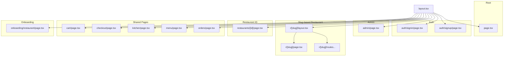
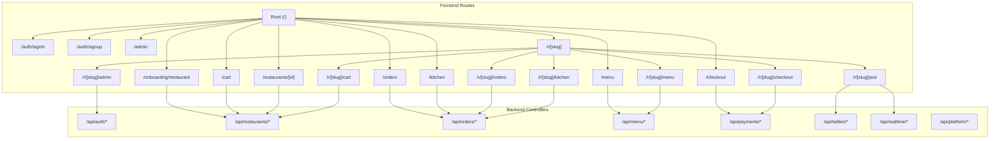
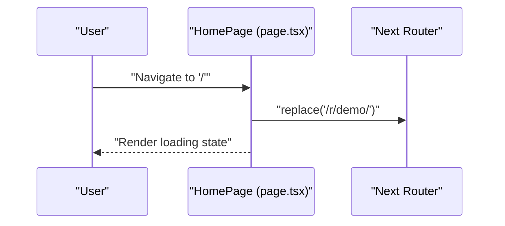
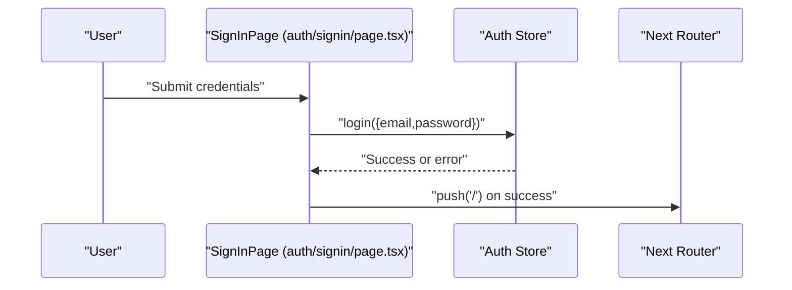
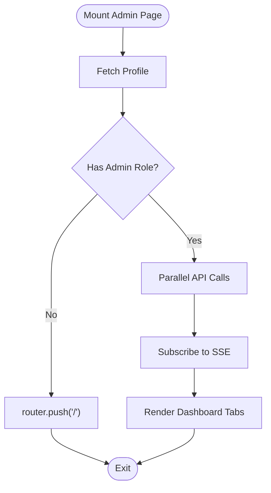
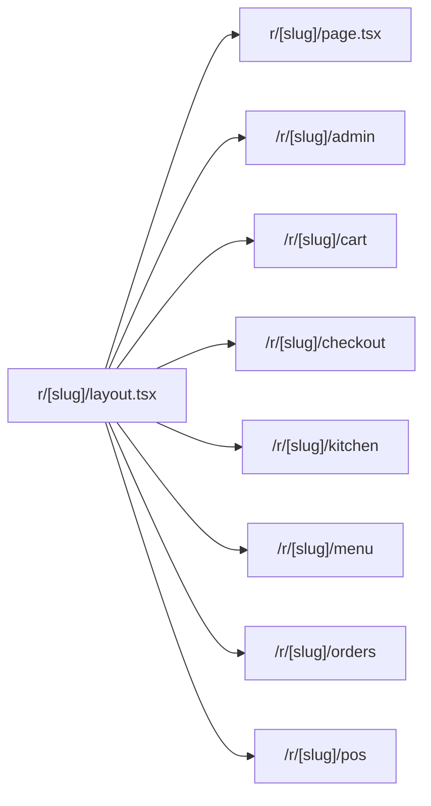
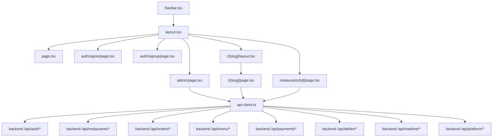

# Routing Architecture

<cite>
**Referenced Files in This Document**
- [layout.tsx](file://restaurant-frontend/src/app/layout.tsx)
- [page.tsx](file://restaurant-frontend/src/app/page.tsx)
- [admin/page.tsx](file://restaurant-frontend/src/app/admin/page.tsx)
- [auth/signin/page.tsx](file://restaurant-frontend/src/app/auth/signin/page.tsx)
- [auth/signup/page.tsx](file://restaurant-frontend/src/app/auth/signup/page.tsx)
- [r[slug]/layout.tsx](file://restaurant-frontend/src/app/r/[slug]/layout.tsx)
- [r[slug]/page.tsx](file://restaurant-frontend/src/app/r/[slug]/page.tsx)
- [restaurants[id]/page.tsx](file://restaurant-frontend/src/app/restaurants/[id]/page.tsx)
- [cart/page.tsx](file://restaurant-frontend/src/app/cart/page.tsx)
- [checkout/page.tsx](file://restaurant-frontend/src/app/checkout/page.tsx)
- [kitchen/page.tsx](file://restaurant-frontend/src/app/kitchen/page.tsx)
- [menu/page.tsx](file://restaurant-frontend/src/app/menu/page.tsx)
- [orders/page.tsx](file://restaurant-frontend/src/app/orders/page.tsx)
- [onboarding/restaurant/page.tsx](file://restaurant-frontend/src/app/onboarding/restaurant/page.tsx)
- [Navbar.tsx](file://restaurant-frontend/src/components/Navbar.tsx)
- [api-client.ts](file://restaurant-frontend/src/lib/api-client.ts)
- [auth.ts](file://restaurant-backend/src/middleware/auth.ts)
- [restaurant.ts](file://restaurant-backend/src/middleware/restaurant.ts)
- [restaurants.ts](file://restaurant-backend/src/routes/restaurants.ts)
- [orders.ts](file://restaurant-backend/src/routes/orders.ts)
- [auth.ts](file://restaurant-backend/src/routes/auth.ts)
- [menu.ts](file://restaurant-backend/src/routes/menu.ts)
- [tables.ts](file://restaurant-backend/src/routes/tables.ts)
- [payments.ts](file://restaurant-backend/src/routes/payments.ts)
- [platform.ts](file://restaurant-backend/src/routes/platform.ts)
- [realtime.ts](file://restaurant-backend/src/routes/realtime.ts)
</cite>

## Table of Contents
1. [Introduction](#introduction)
2. [Project Structure](#project-structure)
3. [Core Components](#core-components)
4. [Architecture Overview](#architecture-overview)
5. [Detailed Component Analysis](#detailed-component-analysis)
6. [Dependency Analysis](#dependency-analysis)
7. [Performance Considerations](#performance-considerations)
8. [Troubleshooting Guide](#troubleshooting-guide)
9. [Conclusion](#conclusion)

## Introduction
This document describes the routing architecture of DeQ-Bite’s Next.js application using the App Router’s file-system-based routing. It explains the hierarchical route structure, including static routes (admin, auth, home) and dynamic routes (r/[slug], restaurants/[id]), route groups, nested layouts, shared components, slug-based restaurant navigation, parameter extraction, route protection, authentication-aware routing, conditional rendering by user roles, route transitions, prefetching strategies, performance optimizations, and the integration between frontend routes and backend API endpoints.

## Project Structure
The frontend follows Next.js App Router conventions with a strict file-system hierarchy under src/app. Key routing segments include:
- Root layout and home page
- Authentication pages (signin, signup)
- Admin dashboard
- Slug-based restaurant pages (r/[slug])
- Restaurant-specific pages (restaurants/[id])
- Shared pages (cart, checkout, kitchen, menu, orders)
- Onboarding flow

**Diagram sources**
- [layout.tsx](file://restaurant-frontend/src/app/layout.tsx#L1-L50)
- [page.tsx](file://restaurant-frontend/src/app/page.tsx#L1-L24)
- [auth/signin/page.tsx](file://restaurant-frontend/src/app/auth/signin/page.tsx#L1-L163)
- [auth/signup/page.tsx](file://restaurant-frontend/src/app/auth/signup/page.tsx#L1-L225)
- [admin/page.tsx](file://restaurant-frontend/src/app/admin/page.tsx#L1-L770)
- [r[slug]/layout.tsx](file://restaurant-frontend/src/app/r/[slug]/layout.tsx)
- [r[slug]/page.tsx](file://restaurant-frontend/src/app/r/[slug]/page.tsx)
- [restaurants[id]/page.tsx](file://restaurant-frontend/src/app/restaurants/[id]/page.tsx)
- [cart/page.tsx](file://restaurant-frontend/src/app/cart/page.tsx)
- [checkout/page.tsx](file://restaurant-frontend/src/app/checkout/page.tsx)
- [kitchen/page.tsx](file://restaurant-frontend/src/app/kitchen/page.tsx)
- [menu/page.tsx](file://restaurant-frontend/src/app/menu/page.tsx)
- [orders/page.tsx](file://restaurant-frontend/src/app/orders/page.tsx)
- [onboarding/restaurant/page.tsx](file://restaurant-frontend/src/app/onboarding/restaurant/page.tsx)

**Section sources**
- [layout.tsx](file://restaurant-frontend/src/app/layout.tsx#L1-L50)
- [page.tsx](file://restaurant-frontend/src/app/page.tsx#L1-L24)

## Core Components
- Root layout and metadata: Defines global metadata, viewport, and the shared root wrapper with Navbar and toast provider.
- Home page: Redirects to a demo restaurant route immediately after mount.
- Authentication pages: Sign-in and sign-up forms with client-side validation and navigation.
- Admin dashboard: Role-gated access (OWNER/ADMIN) with real-time updates via server-sent events and API-driven data.
- Slug-based restaurant pages: Nested layout and page under r/[slug] supporting sub-routes like admin, cart, checkout, kitchen, menu, orders, and pos.
- Restaurant ID pages: Dynamic route for restaurants/[id].
- Shared pages: Cart, checkout, kitchen, menu, orders.
- Onboarding: Restaurant onboarding flow.

**Section sources**
- [layout.tsx](file://restaurant-frontend/src/app/layout.tsx#L1-L50)
- [page.tsx](file://restaurant-frontend/src/app/page.tsx#L1-L24)
- [auth/signin/page.tsx](file://restaurant-frontend/src/app/auth/signin/page.tsx#L1-L163)
- [auth/signup/page.tsx](file://restaurant-frontend/src/app/auth/signup/page.tsx#L1-L225)
- [admin/page.tsx](file://restaurant-frontend/src/app/admin/page.tsx#L1-L770)
- [r[slug]/layout.tsx](file://restaurant-frontend/src/app/r/[slug]/layout.tsx)
- [r[slug]/page.tsx](file://restaurant-frontend/src/app/r/[slug]/page.tsx)
- [restaurants[id]/page.tsx](file://restaurant-frontend/src/app/restaurants/[id]/page.tsx)
- [cart/page.tsx](file://restaurant-frontend/src/app/cart/page.tsx)
- [checkout/page.tsx](file://restaurant-frontend/src/app/checkout/page.tsx)
- [kitchen/page.tsx](file://restaurant-frontend/src/app/kitchen/page.tsx)
- [menu/page.tsx](file://restaurant-frontend/src/app/menu/page.tsx)
- [orders/page.tsx](file://restaurant-frontend/src/app/orders/page.tsx)
- [onboarding/restaurant/page.tsx](file://restaurant-frontend/src/app/onboarding/restaurant/page.tsx)

## Architecture Overview
The routing architecture leverages Next.js App Router’s file-system routing:
- Static routes: admin, auth/signin, auth/signup, restaurants/[id], cart, checkout, kitchen, menu, orders, onboarding/restaurant.
- Dynamic routes: r/[slug] for slug-based restaurant navigation with nested sub-pages.
- Layouts: Root layout wraps all pages; r/[slug] has its own nested layout for consistent restaurant context.
- Shared components: Navbar is rendered at the root level for cross-route navigation.
- Route protection: Admin page enforces role-based access; authentication-aware navigation occurs in auth pages.
- Backend mapping: Frontend routes integrate with backend controllers via the API client.

**Diagram sources**
- [layout.tsx](file://restaurant-frontend/src/app/layout.tsx#L1-L50)
- [admin/page.tsx](file://restaurant-frontend/src/app/admin/page.tsx#L1-L770)
- [auth/signin/page.tsx](file://restaurant-frontend/src/app/auth/signin/page.tsx#L1-L163)
- [auth/signup/page.tsx](file://restaurant-frontend/src/app/auth/signup/page.tsx#L1-L225)
- [r[slug]/layout.tsx](file://restaurant-frontend/src/app/r/[slug]/layout.tsx)
- [r[slug]/page.tsx](file://restaurant-frontend/src/app/r/[slug]/page.tsx)
- [restaurants[id]/page.tsx](file://restaurant-frontend/src/app/restaurants/[id]/page.tsx)
- [cart/page.tsx](file://restaurant-frontend/src/app/cart/page.tsx)
- [checkout/page.tsx](file://restaurant-frontend/src/app/checkout/page.tsx)
- [kitchen/page.tsx](file://restaurant-frontend/src/app/kitchen/page.tsx)
- [menu/page.tsx](file://restaurant-frontend/src/app/menu/page.tsx)
- [orders/page.tsx](file://restaurant-frontend/src/app/orders/page.tsx)
- [onboarding/restaurant/page.tsx](file://restaurant-frontend/src/app/onboarding/restaurant/page.tsx)
- [auth.ts](file://restaurant-backend/src/routes/auth.ts)
- [restaurants.ts](file://restaurant-backend/src/routes/restaurants.ts)
- [orders.ts](file://restaurant-backend/src/routes/orders.ts)
- [menu.ts](file://restaurant-backend/src/routes/menu.ts)
- [payments.ts](file://restaurant-backend/src/routes/payments.ts)
- [tables.ts](file://restaurant-backend/src/routes/tables.ts)
- [realtime.ts](file://restaurant-backend/src/routes/realtime.ts)
- [platform.ts](file://restaurant-backend/src/routes/platform.ts)

## Detailed Component Analysis

### Root Layout and Home Page
- Root layout sets global metadata, viewport, injects Razorpay script, renders Navbar, and wraps children with a toast provider.
- Home page redirects to a demo restaurant route immediately after mounting to provide a quick entry point.

**Diagram sources**
- [page.tsx](file://restaurant-frontend/src/app/page.tsx#L1-L24)

**Section sources**
- [layout.tsx](file://restaurant-frontend/src/app/layout.tsx#L1-L50)
- [page.tsx](file://restaurant-frontend/src/app/page.tsx#L1-L24)

### Authentication Routes
- Sign-in page: Handles form submission, toggles password visibility, displays test credentials, and navigates on successful login.
- Sign-up page: Validates password confirmation, collects user details, and navigates on successful registration.

**Diagram sources**
- [auth/signin/page.tsx](file://restaurant-frontend/src/app/auth/signin/page.tsx#L1-L163)

**Section sources**
- [auth/signin/page.tsx](file://restaurant-frontend/src/app/auth/signin/page.tsx#L1-L163)
- [auth/signup/page.tsx](file://restaurant-frontend/src/app/auth/signup/page.tsx#L1-L225)

### Admin Dashboard and Route Protection
- Admin page enforces role-based access (OWNER/ADMIN). On mount, it fetches profile and redirects unauthenticated or unauthorized users to home.
- Real-time updates: Subscribes to server-sent events for order updates and manages local notifications.
- Data fetching: Parallel loads for menu, categories, users, orders, and payment policy.
- Conditional rendering: Tabs for dashboard, orders, menu, users, payments; role-gated actions.

**Diagram sources**
- [admin/page.tsx](file://restaurant-frontend/src/app/admin/page.tsx#L1-L770)

**Section sources**
- [admin/page.tsx](file://restaurant-frontend/src/app/admin/page.tsx#L1-L770)

### Slug-Based Restaurant Navigation (r/[slug])
- Nested layout and page under r/[slug] provide a consistent restaurant context.
- Sub-routes include admin, cart, checkout, kitchen, menu, orders, and pos.
- Parameter extraction: The [slug] segment is available to the page and layout via Next.js App Router conventions.
- Shared components: Navbar remains consistent across slug-based pages.

**Diagram sources**
- [r[slug]/layout.tsx](file://restaurant-frontend/src/app/r/[slug]/layout.tsx)
- [r[slug]/page.tsx](file://restaurant-frontend/src/app/r/[slug]/page.tsx)

**Section sources**
- [r[slug]/layout.tsx](file://restaurant-frontend/src/app/r/[slug]/layout.tsx)
- [r[slug]/page.tsx](file://restaurant-frontend/src/app/r/[slug]/page.tsx)

### Restaurant ID Route (restaurants/[id])
- Dynamic route restaurants/[id] serves as a restaurant-specific page. The [id] parameter can be extracted and used for API calls.

**Section sources**
- [restaurants[id]/page.tsx](file://restaurant-frontend/src/app/restaurants/[id]/page.tsx)

### Shared Pages Under Root
- cart, checkout, kitchen, menu, orders: These pages are siblings to the root-level routes and share the root layout.
- They likely integrate with backend controllers via the API client.

**Section sources**
- [cart/page.tsx](file://restaurant-frontend/src/app/cart/page.tsx)
- [checkout/page.tsx](file://restaurant-frontend/src/app/checkout/page.tsx)
- [kitchen/page.tsx](file://restaurant-frontend/src/app/kitchen/page.tsx)
- [menu/page.tsx](file://restaurant-frontend/src/app/menu/page.tsx)
- [orders/page.tsx](file://restaurant-frontend/src/app/orders/page.tsx)

### Onboarding Flow
- onboarding/restaurant/page.tsx provides a dedicated onboarding experience integrated into the routing tree.

**Section sources**
- [onboarding/restaurant/page.tsx](file://restaurant-frontend/src/app/onboarding/restaurant/page.tsx)

### Backend Integration and API Mapping
- Frontend API client integrates with backend controllers:
  - Authentication: /api/auth/*
  - Restaurants: /api/restaurants/*
  - Orders: /api/orders/*
  - Menu: /api/menu/*
  - Payments: /api/payments/*
  - Tables: /api/tables/*
  - Realtime: /api/realtime/*
  - Platform: /api/platform/*

**Section sources**
- [api-client.ts](file://restaurant-frontend/src/lib/api-client.ts)
- [auth.ts](file://restaurant-backend/src/routes/auth.ts)
- [restaurants.ts](file://restaurant-backend/src/routes/restaurants.ts)
- [orders.ts](file://restaurant-backend/src/routes/orders.ts)
- [menu.ts](file://restaurant-backend/src/routes/menu.ts)
- [payments.ts](file://restaurant-backend/src/routes/payments.ts)
- [tables.ts](file://restaurant-backend/src/routes/tables.ts)
- [realtime.ts](file://restaurant-backend/src/routes/realtime.ts)
- [platform.ts](file://restaurant-backend/src/routes/platform.ts)

## Dependency Analysis
- Frontend routing depends on Next.js App Router conventions and shared components (Navbar).
- Admin page depends on the auth store and API client for profile, orders, menu, users, and payment policy.
- Slug-based routes depend on the API client for restaurant-specific resources.
- Backend middleware protects routes and enforces restaurant context.

**Diagram sources**
- [Navbar.tsx](file://restaurant-frontend/src/components/Navbar.tsx)
- [layout.tsx](file://restaurant-frontend/src/app/layout.tsx#L1-L50)
- [page.tsx](file://restaurant-frontend/src/app/page.tsx#L1-L24)
- [auth/signin/page.tsx](file://restaurant-frontend/src/app/auth/signin/page.tsx#L1-L163)
- [auth/signup/page.tsx](file://restaurant-frontend/src/app/auth/signup/page.tsx#L1-L225)
- [admin/page.tsx](file://restaurant-frontend/src/app/admin/page.tsx#L1-L770)
- [r[slug]/layout.tsx](file://restaurant-frontend/src/app/r/[slug]/layout.tsx)
- [r[slug]/page.tsx](file://restaurant-frontend/src/app/r/[slug]/page.tsx)
- [restaurants[id]/page.tsx](file://restaurant-frontend/src/app/restaurants/[id]/page.tsx)
- [api-client.ts](file://restaurant-frontend/src/lib/api-client.ts)
- [auth.ts](file://restaurant-backend/src/routes/auth.ts)
- [restaurants.ts](file://restaurant-backend/src/routes/restaurants.ts)
- [orders.ts](file://restaurant-backend/src/routes/orders.ts)
- [menu.ts](file://restaurant-backend/src/routes/menu.ts)
- [payments.ts](file://restaurant-backend/src/routes/payments.ts)
- [tables.ts](file://restaurant-backend/src/routes/tables.ts)
- [realtime.ts](file://restaurant-backend/src/routes/realtime.ts)
- [platform.ts](file://restaurant-backend/src/routes/platform.ts)

**Section sources**
- [admin/page.tsx](file://restaurant-frontend/src/app/admin/page.tsx#L1-L770)
- [api-client.ts](file://restaurant-frontend/src/lib/api-client.ts)
- [auth.ts](file://restaurant-backend/src/middleware/auth.ts)
- [restaurant.ts](file://restaurant-backend/src/middleware/restaurant.ts)

## Performance Considerations
- Parallel data fetching: Admin page uses Promise.all for concurrent API calls to reduce load time.
- Local storage snapshots: Admin page caches order snapshots to minimize repeated notifications and re-renders.
- Real-time updates: Server-sent events avoid polling overhead and keep the UI fresh.
- Lazy script loading: Razorpay SDK is loaded asynchronously in the root layout head.
- Route transitions: Client-side navigation via Next Router avoids full-page reloads.

[No sources needed since this section provides general guidance]

## Troubleshooting Guide
- Authentication failures: Verify credentials and ensure the auth store handles errors gracefully; check network requests to backend auth endpoints.
- Admin access denied: Confirm user role and restaurant membership; the admin page redirects non-admins to home.
- SSE connection issues: Ensure the event stream URL is correct and the token is present; handle connection errors and retries.
- Slug navigation: Confirm the [slug] parameter is passed correctly to restaurant-specific APIs; verify backend restaurant middleware.
- API timeouts: Implement retry logic and user feedback in the API client; monitor backend controller endpoints.

**Section sources**
- [admin/page.tsx](file://restaurant-frontend/src/app/admin/page.tsx#L1-L770)
- [auth/signin/page.tsx](file://restaurant-frontend/src/app/auth/signin/page.tsx#L1-L163)
- [auth/signup/page.tsx](file://restaurant-frontend/src/app/auth/signup/page.tsx#L1-L225)
- [api-client.ts](file://restaurant-frontend/src/lib/api-client.ts)

## Conclusion
DeQ-Bite’s routing architecture combines Next.js App Router’s file-system routing with role-based access control and real-time updates. Static and dynamic routes coexist under a shared root layout, while slug-based restaurant routes encapsulate nested functionality. The frontend integrates tightly with backend controllers through a centralized API client, enabling seamless navigation, robust authentication-aware routing, and efficient data fetching strategies.