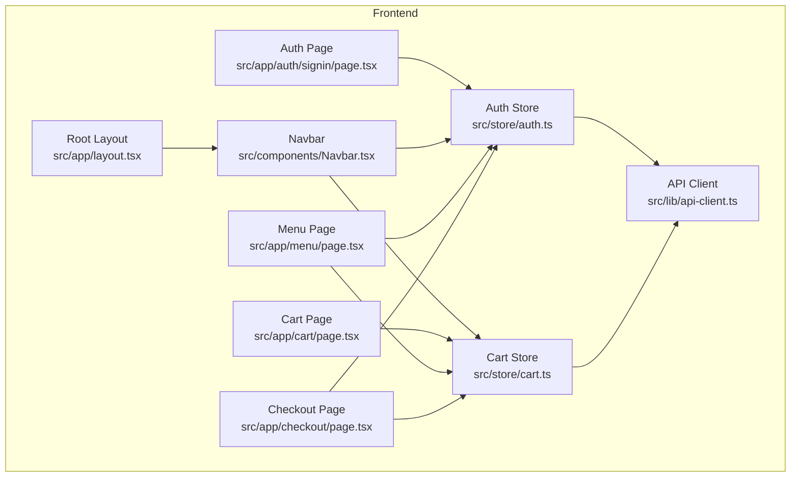
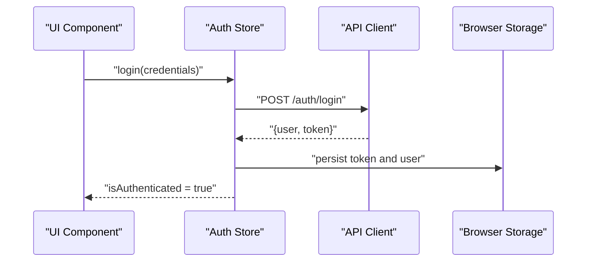
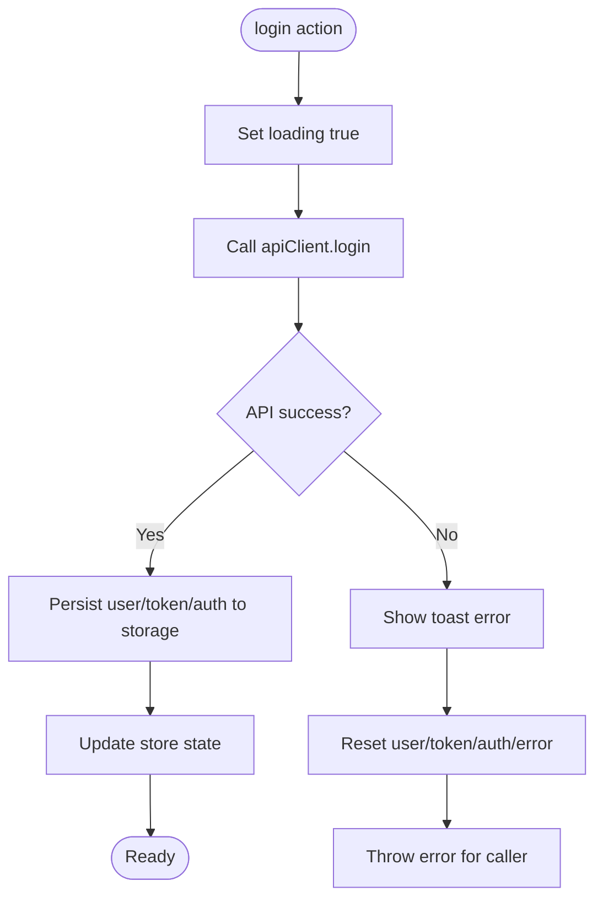
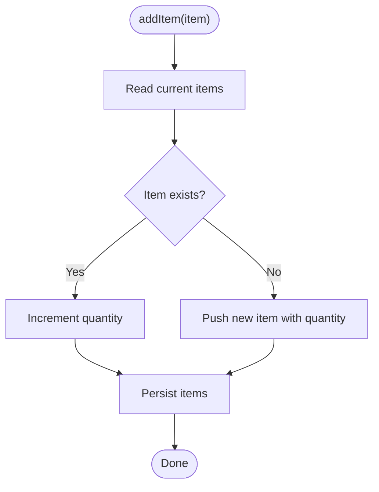
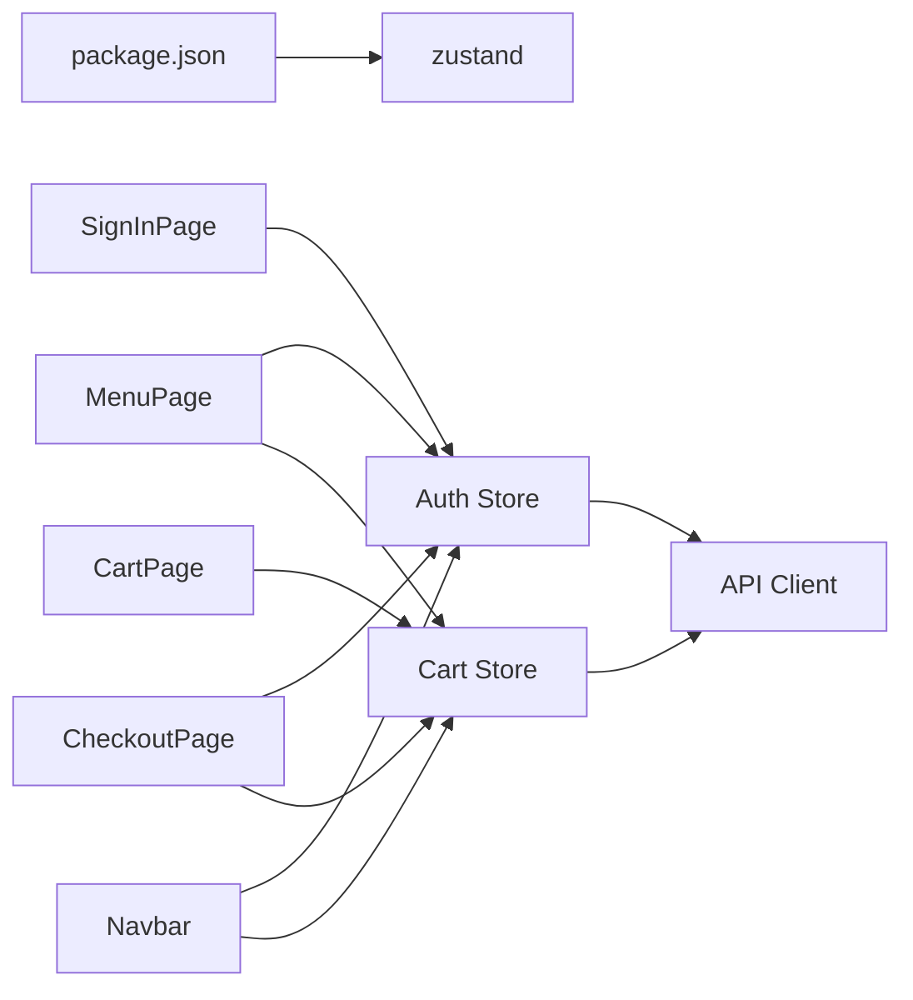

# State Management

<cite>
**Referenced Files in This Document**
- [auth.ts](file://restaurant-frontend/src/store/auth.ts)
- [cart.ts](file://restaurant-frontend/src/store/cart.ts)
- [api-client.ts](file://restaurant-frontend/src/lib/api-client.ts)
- [SignInPage.tsx](file://restaurant-frontend/src/app/auth/signin/page.tsx)
- [CartPage.tsx](file://restaurant-frontend/src/app/cart/page.tsx)
- [MenuPage.tsx](file://restaurant-frontend/src/app/menu/page.tsx)
- [CheckoutPage.tsx](file://restaurant-frontend/src/app/checkout/page.tsx)
- [Navbar.tsx](file://restaurant-frontend/src/components/Navbar.tsx)
- [RootLayout.tsx](file://restaurant-frontend/src/app/layout.tsx)
- [package.json](file://restaurant-frontend/package.json)
</cite>

## Table of Contents
1. [Introduction](#introduction)
2. [Project Structure](#project-structure)
3. [Core Components](#core-components)
4. [Architecture Overview](#architecture-overview)
5. [Detailed Component Analysis](#detailed-component-analysis)
6. [Dependency Analysis](#dependency-analysis)
7. [Performance Considerations](#performance-considerations)
8. [Troubleshooting Guide](#troubleshooting-guide)
9. [Conclusion](#conclusion)
10. [Appendices](#appendices)

## Introduction
This document explains the state management implementation for the DeQ-Bite frontend using Zustand stores. It covers:
- Authentication state store: user data, token lifecycle, login/logout flows, and session persistence
- Cart state store: item management, quantity updates, totals calculation, and persistence
- Store composition patterns, middleware integration, and selectors for performance
- Integration between auth and cart stores, including how authentication affects cart persistence across sessions
- Client-side hydration, error handling, and debugging techniques
- Examples of store usage in components, subscription patterns, and state update strategies
- Memory management and cleanup for subscriptions

## Project Structure
The state management is implemented in two Zustand stores located under the store directory, with supporting utilities and components that subscribe to and mutate state.

**Diagram sources**
- [auth.ts:1-177](file://restaurant-frontend/src/store/auth.ts#L1-L177)
- [cart.ts:1-92](file://restaurant-frontend/src/store/cart.ts#L1-L92)
- [api-client.ts:194-894](file://restaurant-frontend/src/lib/api-client.ts#L194-L894)
- [SignInPage.tsx:1-165](file://restaurant-frontend/src/app/auth/signin/page.tsx#L1-L165)
- [CartPage.tsx:1-160](file://restaurant-frontend/src/app/cart/page.tsx#L1-L160)
- [MenuPage.tsx:1-418](file://restaurant-frontend/src/app/menu/page.tsx#L1-L418)
- [CheckoutPage.tsx:1-557](file://restaurant-frontend/src/app/checkout/page.tsx#L1-L557)
- [Navbar.tsx:1-197](file://restaurant-frontend/src/components/Navbar.tsx#L1-L197)
- [RootLayout.tsx:1-50](file://restaurant-frontend/src/app/layout.tsx#L1-L50)

**Section sources**
- [auth.ts:1-177](file://restaurant-frontend/src/store/auth.ts#L1-L177)
- [cart.ts:1-92](file://restaurant-frontend/src/store/cart.ts#L1-L92)
- [api-client.ts:194-894](file://restaurant-frontend/src/lib/api-client.ts#L194-L894)
- [SignInPage.tsx:1-165](file://restaurant-frontend/src/app/auth/signin/page.tsx#L1-L165)
- [CartPage.tsx:1-160](file://restaurant-frontend/src/app/cart/page.tsx#L1-L160)
- [MenuPage.tsx:1-418](file://restaurant-frontend/src/app/menu/page.tsx#L1-L418)
- [CheckoutPage.tsx:1-557](file://restaurant-frontend/src/app/checkout/page.tsx#L1-L557)
- [Navbar.tsx:1-197](file://restaurant-frontend/src/components/Navbar.tsx#L1-L197)
- [RootLayout.tsx:1-50](file://restaurant-frontend/src/app/layout.tsx#L1-L50)

## Core Components
- Auth Store
  - Manages user, token, authentication status, loading, and errors
  - Provides actions for login, register, logout, profile retrieval, password change, and error/loading controls
  - Persists user, token, and authentication state to storage
- Cart Store
  - Manages cart items, active order ID, and totals
  - Provides actions for adding/removing/updating items, clearing cart, setting active order, and computing totals
  - Persists items and active order ID to storage

Key integration points:
- Auth store persists token and sets Authorization header via the API client
- Cart store persists items and active order ID for continuity across sessions
- Components subscribe to both stores to reflect state changes and drive UI

**Section sources**
- [auth.ts:6-22](file://restaurant-frontend/src/store/auth.ts#L6-L22)
- [auth.ts:24-176](file://restaurant-frontend/src/store/auth.ts#L24-L176)
- [cart.ts:12-24](file://restaurant-frontend/src/store/cart.ts#L12-L24)
- [cart.ts:26-91](file://restaurant-frontend/src/store/cart.ts#L26-L91)

## Architecture Overview
The stores are composed with the persist middleware to synchronize state with browser storage. The API client centralizes HTTP interactions and token handling, ensuring consistent auth headers and global 401 handling.

**Diagram sources**
- [auth.ts:33-56](file://restaurant-frontend/src/store/auth.ts#L33-L56)
- [api-client.ts:332-339](file://restaurant-frontend/src/lib/api-client.ts#L332-L339)
- [api-client.ts:207-240](file://restaurant-frontend/src/lib/api-client.ts#L207-L240)

## Detailed Component Analysis

### Authentication State Store
Responsibilities:
- Hold user identity, token, authentication flag, loading state, and error
- Perform login, registration, logout, profile retrieval, and password change
- Persist minimal auth state to storage and hydrate on startup
- Clear sensitive state on logout

Implementation highlights:
- Actions encapsulate async flows and surface user-friendly errors via notifications
- Middleware partializes only user, token, and authentication state for persistence
- Hydration writes token to localStorage for the API client’s request interceptor

**Diagram sources**
- [auth.ts:33-56](file://restaurant-frontend/src/store/auth.ts#L33-L56)
- [auth.ts:162-174](file://restaurant-frontend/src/store/auth.ts#L162-L174)

**Section sources**
- [auth.ts:6-22](file://restaurant-frontend/src/store/auth.ts#L6-L22)
- [auth.ts:24-176](file://restaurant-frontend/src/store/auth.ts#L24-L176)
- [api-client.ts:332-339](file://restaurant-frontend/src/lib/api-client.ts#L332-L339)
- [api-client.ts:207-240](file://restaurant-frontend/src/lib/api-client.ts#L207-L240)

### Cart State Store
Responsibilities:
- Track cart items, quantities, and active order ID
- Compute total items and total price in paise
- Persist items and active order ID to storage

Implementation highlights:
- addItem handles duplicates by incrementing quantity
- updateQuantity removes items when quantity drops to zero
- getTotalItems and getTotalPricePaise are pure computations over current state
- Middleware persists only items and active order ID

**Diagram sources**
- [cart.ts:32-49](file://restaurant-frontend/src/store/cart.ts#L32-L49)
- [cart.ts:86-89](file://restaurant-frontend/src/store/cart.ts#L86-L89)

**Section sources**
- [cart.ts:12-24](file://restaurant-frontend/src/store/cart.ts#L12-L24)
- [cart.ts:26-91](file://restaurant-frontend/src/store/cart.ts#L26-L91)

### Store Composition Patterns and Middleware
- Both stores use the persist middleware with:
  - name: unique storage keys
  - partialize: selective serialization of state fields
  - onRehydrateStorage (auth only): cross-field synchronization (e.g., storing token in localStorage for the API client)
- This ensures:
  - Minimal persisted footprint
  - Consistent hydration across sessions
  - Decoupled persistence from store internals

**Section sources**
- [auth.ts:162-174](file://restaurant-frontend/src/store/auth.ts#L162-L174)
- [cart.ts:86-89](file://restaurant-frontend/src/store/cart.ts#L86-L89)

### Integration Between Auth and Cart Stores
- Auth store token enables authenticated requests via the API client
- Cart store persists items and active order ID independently
- Components coordinate both stores to:
  - Gate actions requiring authentication (e.g., adding items)
  - Carry forward cart state across sessions
  - Manage order continuity using active order ID

Examples in components:
- Menu page adds items to cart after verifying authentication
- Checkout page reads cart totals and clears cart upon order completion
- Navbar subscribes to both stores to reflect authentication and cart count

**Section sources**
- [MenuPage.tsx:108-143](file://restaurant-frontend/src/app/menu/page.tsx#L108-L143)
- [CheckoutPage.tsx:142-222](file://restaurant-frontend/src/app/checkout/page.tsx#L142-L222)
- [Navbar.tsx:14-16](file://restaurant-frontend/src/components/Navbar.tsx#L14-L16)

### State Hydration on Client Side
- Auth store hydration:
  - Reads persisted token and user fields
  - If present, writes token to localStorage for the API client’s request interceptor
- Cart store hydration:
  - Restores items and active order ID from storage
- Hydration occurs automatically when stores are initialized

**Section sources**
- [auth.ts:169-174](file://restaurant-frontend/src/store/auth.ts#L169-L174)
- [cart.ts:86-89](file://restaurant-frontend/src/store/cart.ts#L86-L89)

### Error Handling in State Operations
- Auth store:
  - Catches errors during login/register/profile/password operations
  - Displays user-facing notifications and resets state appropriately
- Cart store:
  - No explicit try/catch in actions; errors propagate from component-level try/catch
- API client:
  - Centralized request/response interceptors handle token presence and 401 responses
  - Clears token and redirects to sign-in on unauthorized responses

**Section sources**
- [auth.ts:44-55](file://restaurant-frontend/src/store/auth.ts#L44-L55)
- [auth.ts:69-80](file://restaurant-frontend/src/store/auth.ts#L69-L80)
- [auth.ts:104-114](file://restaurant-frontend/src/store/auth.ts#L104-L114)
- [auth.ts:143-151](file://restaurant-frontend/src/store/auth.ts#L143-L151)
- [api-client.ts:224-239](file://restaurant-frontend/src/lib/api-client.ts#L224-L239)

### Debugging Techniques
- Enable logging around store actions and API calls to trace state transitions
- Inspect browser storage keys for auth-storage and cart-storage to verify persistence
- Use React DevTools to observe component re-renders caused by store updates
- Leverage toasts for immediate feedback on store operation outcomes

[No sources needed since this section provides general guidance]

### Store Usage Examples in Components
- Authentication flow in sign-in page:
  - Subscribes to error and clearError
  - Calls login action and navigates on success
- Cart operations in cart and menu pages:
  - Subscribe to items, updateQuantity, removeItem, getTotalPricePaise
  - Guard actions behind authentication checks
- Navbar integration:
  - Subscribes to isAuthenticated, user, and getTotalItems
  - Uses cart count badge and logout handler

**Section sources**
- [SignInPage.tsx:15-32](file://restaurant-frontend/src/app/auth/signin/page.tsx#L15-L32)
- [CartPage.tsx:9-17](file://restaurant-frontend/src/app/cart/page.tsx#L9-L17)
- [MenuPage.tsx:16-17](file://restaurant-frontend/src/app/menu/page.tsx#L16-L17)
- [Navbar.tsx:14-16](file://restaurant-frontend/src/components/Navbar.tsx#L14-L16)

### Subscription Patterns and State Update Strategies
- Subscribe to slices of state to minimize re-renders (e.g., items and getTotalPricePaise)
- Prefer direct action calls over manual state merging
- Use selectors for derived computations (e.g., getTotalItems, getTotalPricePaise)
- Keep store actions synchronous where possible; keep async logic centralized in stores

**Section sources**
- [CartPage.tsx:9-17](file://restaurant-frontend/src/app/cart/page.tsx#L9-L17)
- [cart.ts:78-84](file://restaurant-frontend/src/store/cart.ts#L78-L84)

### Memory Management and Cleanup
- Zustand subscriptions are lightweight; no explicit unsubscribe hooks are required in typical Next.js components
- When using effects or timers inside components, ensure cleanup to avoid stale closures
- Avoid holding large objects in state; prefer normalized structures if growth becomes significant

[No sources needed since this section provides general guidance]

## Dependency Analysis
- Zustand version is declared in dependencies
- Auth store depends on API client for network operations and localStorage for token persistence
- Cart store depends on API client indirectly via components and on localStorage for persistence
- Components depend on both stores for UI state and orchestrate actions

**Diagram sources**
- [package.json:30-30](file://restaurant-frontend/package.json#L30-L30)
- [auth.ts:1-4](file://restaurant-frontend/src/store/auth.ts#L1-L4)
- [cart.ts:1-2](file://restaurant-frontend/src/store/cart.ts#L1-L2)
- [api-client.ts:194-894](file://restaurant-frontend/src/lib/api-client.ts#L194-L894)
- [SignInPage.tsx:1-165](file://restaurant-frontend/src/app/auth/signin/page.tsx#L1-L165)
- [CartPage.tsx:1-160](file://restaurant-frontend/src/app/cart/page.tsx#L1-L160)
- [MenuPage.tsx:1-418](file://restaurant-frontend/src/app/menu/page.tsx#L1-L418)
- [CheckoutPage.tsx:1-557](file://restaurant-frontend/src/app/checkout/page.tsx#L1-L557)
- [Navbar.tsx:1-197](file://restaurant-frontend/src/components/Navbar.tsx#L1-L197)

**Section sources**
- [package.json:12-30](file://restaurant-frontend/package.json#L12-L30)
- [auth.ts:1-4](file://restaurant-frontend/src/store/auth.ts#L1-L4)
- [cart.ts:1-2](file://restaurant-frontend/src/store/cart.ts#L1-L2)
- [api-client.ts:194-894](file://restaurant-frontend/src/lib/api-client.ts#L194-L894)

## Performance Considerations
- Persist only essential fields to reduce storage overhead and hydration costs
- Use selectors for derived computations to avoid recomputing on every render
- Batch UI updates by grouping state changes within a single action
- Avoid unnecessary re-renders by subscribing to narrow slices of state

[No sources needed since this section provides general guidance]

## Troubleshooting Guide
Common issues and resolutions:
- Token not applied to requests
  - Verify auth-storage hydration and token presence in localStorage
  - Confirm request interceptor reads token and attaches Authorization header
- 401 Unauthorized redirect loop
  - Check response interceptor clears token and redirects to sign-in
- Cart not persisting across sessions
  - Confirm cart-storage hydration and partialize fields
- Toast notifications not appearing
  - Ensure Toaster is mounted in the root layout

**Section sources**
- [auth.ts:169-174](file://restaurant-frontend/src/store/auth.ts#L169-L174)
- [api-client.ts:207-240](file://restaurant-frontend/src/lib/api-client.ts#L207-L240)
- [cart.ts:86-89](file://restaurant-frontend/src/store/cart.ts#L86-L89)
- [RootLayout.tsx:36-45](file://restaurant-frontend/src/app/layout.tsx#L36-L45)

## Conclusion
DeQ-Bite’s frontend employs two focused Zustand stores with the persist middleware to manage authentication and cart state efficiently. The API client centralizes token handling and HTTP concerns, while components subscribe to the stores to render UI and trigger actions. The design emphasizes:
- Minimal persistence footprints
- Clear separation of concerns
- Robust error handling and user feedback
- Seamless hydration and continuity across sessions

[No sources needed since this section summarizes without analyzing specific files]

## Appendices
- API client request/response interceptors and token management
- Store initialization and middleware configuration
- Component-level usage patterns for auth and cart stores

**Section sources**
- [api-client.ts:194-240](file://restaurant-frontend/src/lib/api-client.ts#L194-L240)
- [auth.ts:162-174](file://restaurant-frontend/src/store/auth.ts#L162-L174)
- [cart.ts:86-89](file://restaurant-frontend/src/store/cart.ts#L86-L89)
- [MenuPage.tsx:108-143](file://restaurant-frontend/src/app/menu/page.tsx#L108-L143)
- [CheckoutPage.tsx:142-222](file://restaurant-frontend/src/app/checkout/page.tsx#L142-L222)
- [Navbar.tsx:14-16](file://restaurant-frontend/src/components/Navbar.tsx#L14-L16)