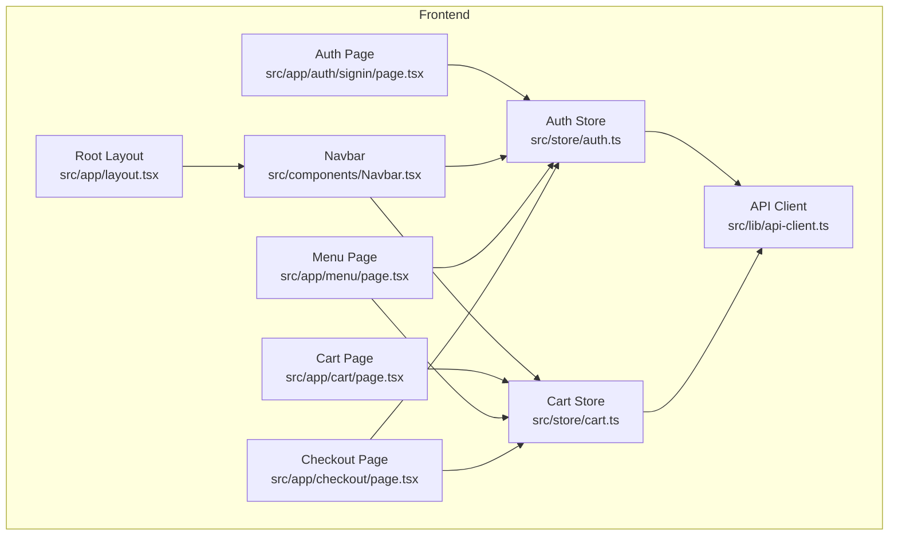
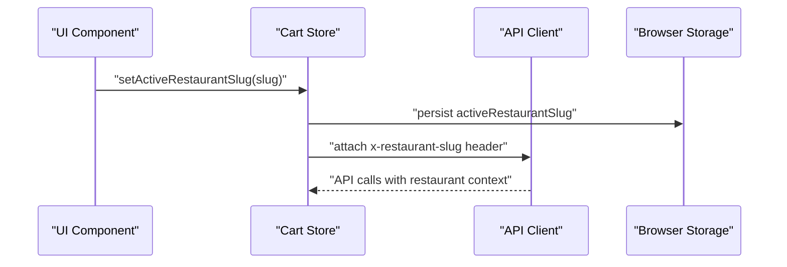
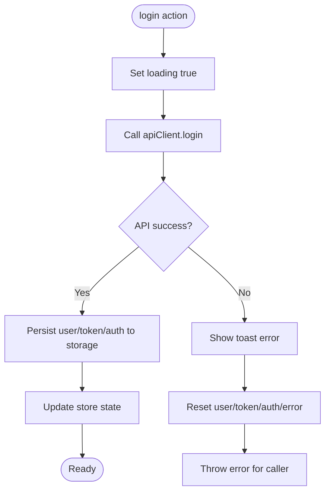
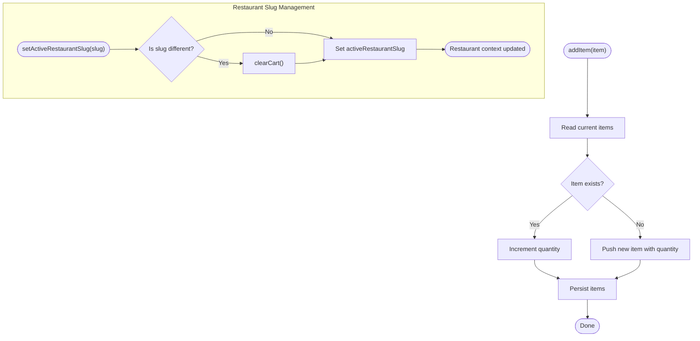
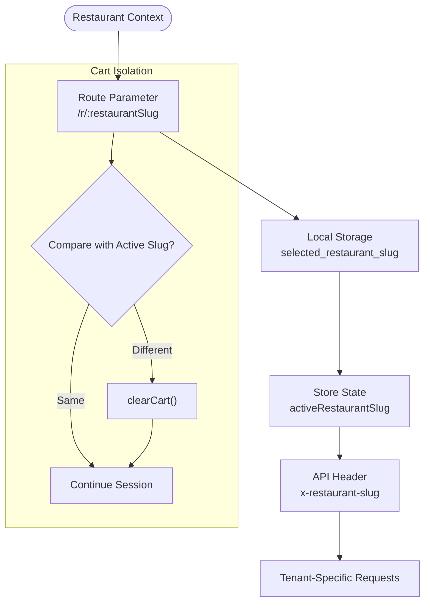
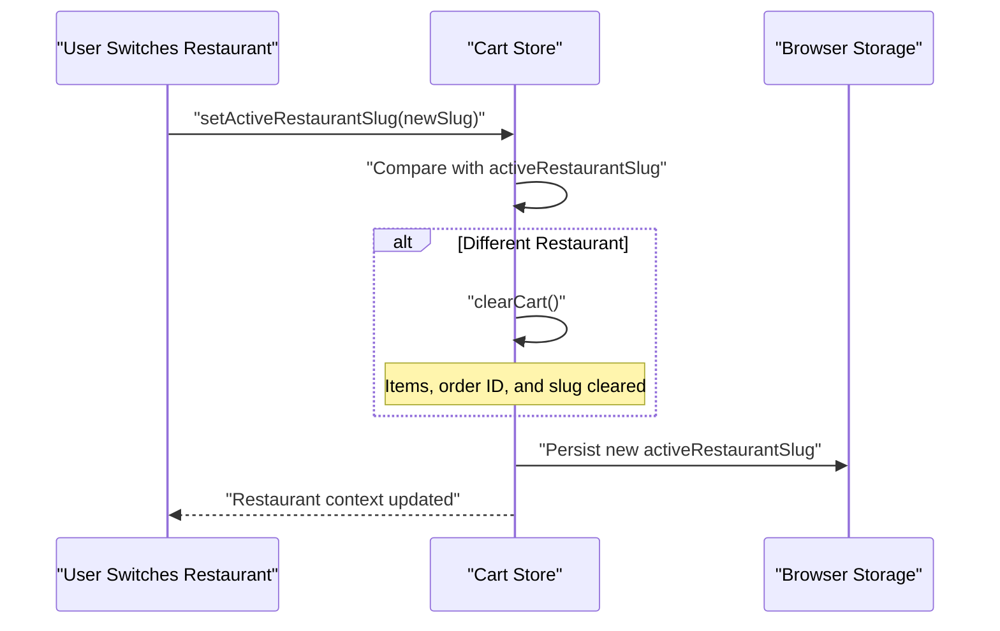
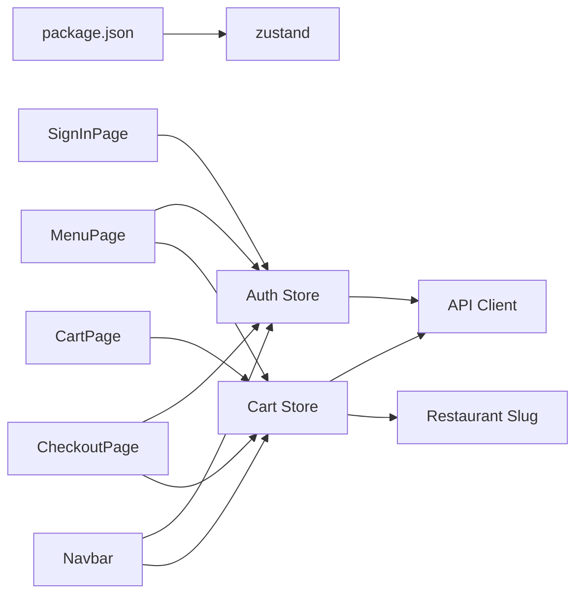

# State Management

<cite>
**Referenced Files in This Document**
- [auth.ts](file://restaurant-frontend/src/store/auth.ts)
- [cart.ts](file://restaurant-frontend/src/store/cart.ts)
- [api-client.ts](file://restaurant-frontend/src/lib/api-client.ts)
- [SignInPage.tsx](file://restaurant-frontend/src/app/auth/signin/page.tsx)
- [CartPage.tsx](file://restaurant-frontend/src/app/cart/page.tsx)
- [MenuPage.tsx](file://restaurant-frontend/src/app/menu/page.tsx)
- [CheckoutPage.tsx](file://restaurant-frontend/src/app/checkout/page.tsx)
- [Navbar.tsx](file://restaurant-frontend/src/components/Navbar.tsx)
- [RootLayout.tsx](file://restaurant-frontend/src/app/layout.tsx)
- [package.json](file://restaurant-frontend/package.json)
</cite>

## Update Summary
**Changes Made**
- Enhanced cart store with new activeRestaurantSlug state for tracking restaurant context across sessions
- Added comprehensive restaurant slug management capabilities for multi-restaurant support
- Updated cart state handling to support proper cart isolation between different restaurants
- Integrated restaurant slug persistence and validation logic across components
- Enhanced cart clearing mechanism based on restaurant slug changes
- Added restaurant slug validation in API client for tenant-specific requests

## Table of Contents
1. [Introduction](#introduction)
2. [Project Structure](#project-structure)
3. [Core Components](#core-components)
4. [Architecture Overview](#architecture-overview)
5. [Detailed Component Analysis](#detailed-component-analysis)
6. [Restaurant Slug Management](#restaurant-slug-management)
7. [Dependency Analysis](#dependency-analysis)
8. [Performance Considerations](#performance-considerations)
9. [Troubleshooting Guide](#troubleshooting-guide)
10. [Conclusion](#conclusion)
11. [Appendices](#appendices)

## Introduction
This document explains the state management implementation for the DeQ-Bite frontend using Zustand stores. It covers:
- Authentication state store: user data, token lifecycle, login/logout flows, and session persistence
- Cart state store: item management, quantity updates, totals calculation, restaurant slug tracking, and persistence
- Store composition patterns, middleware integration, and selectors for performance
- Integration between auth and cart stores, including how authentication affects cart persistence across sessions
- Restaurant slug management for multi-restaurant support
- Client-side hydration, error handling, and debugging techniques
- Examples of store usage in components, subscription patterns, and state update strategies
- Memory management and cleanup procedures for store subscriptions

## Project Structure
The state management is implemented in two Zustand stores located under the store directory, with supporting utilities and components that subscribe to and mutate state. The cart store now includes enhanced restaurant slug management capabilities for multi-restaurant scenarios.

```mermaid
graph TB
subgraph "Frontend"
A["Auth Store<br/>src/store/auth.ts"]
B["Cart Store<br/>src/store/cart.ts"]
C["API Client<br/>src/lib/api-client.ts"]
D["Auth Page<br/>src/app/auth/signin/page.tsx"]
E["Cart Page<br/>src/app/cart/page.tsx"]
F["Menu Page<br/>src/app/menu/page.tsx"]
G["Checkout Page<br/>src/app/checkout/page.tsx"]
H["Navbar<br/>src/components/Navbar.tsx"]
L["Root Layout<br/>src/app/layout.tsx"]
end
D --> A
H --> A
H --> B
E --> B
F --> A
F --> B
G --> A
G --> B
A --> C
B --> C
L --> H
```

**Diagram sources**
- [auth.ts:1-177](file://restaurant-frontend/src/store/auth.ts#L1-L177)
- [cart.ts:1-103](file://restaurant-frontend/src/store/cart.ts#L1-L103)
- [api-client.ts:194-894](file://restaurant-frontend/src/lib/api-client.ts#L194-L894)
- [SignInPage.tsx:1-165](file://restaurant-frontend/src/app/auth/signin/page.tsx#L1-L165)
- [CartPage.tsx:1-252](file://restaurant-frontend/src/app/cart/page.tsx#L1-L252)
- [MenuPage.tsx:1-518](file://restaurant-frontend/src/app/menu/page.tsx#L1-L518)
- [CheckoutPage.tsx:1-475](file://restaurant-frontend/src/app/checkout/page.tsx#L1-L475)
- [Navbar.tsx:1-197](file://restaurant-frontend/src/components/Navbar.tsx#L1-L197)
- [RootLayout.tsx:1-50](file://restaurant-frontend/src/app/layout.tsx#L1-L50)

**Section sources**
- [auth.ts:1-177](file://restaurant-frontend/src/store/auth.ts#L1-L177)
- [cart.ts:1-103](file://restaurant-frontend/src/store/cart.ts#L1-L103)
- [api-client.ts:194-894](file://restaurant-frontend/src/lib/api-client.ts#L194-L894)
- [SignInPage.tsx:1-165](file://restaurant-frontend/src/app/auth/signin/page.tsx#L1-L165)
- [CartPage.tsx:1-252](file://restaurant-frontend/src/app/cart/page.tsx#L1-L252)
- [MenuPage.tsx:1-518](file://restaurant-frontend/src/app/menu/page.tsx#L1-L518)
- [CheckoutPage.tsx:1-475](file://restaurant-frontend/src/app/checkout/page.tsx#L1-L475)
- [Navbar.tsx:1-197](file://restaurant-frontend/src/components/Navbar.tsx#L1-L197)
- [RootLayout.tsx:1-50](file://restaurant-frontend/src/app/layout.tsx#L1-L50)

## Core Components
- Auth Store
  - Manages user, token, authentication status, loading, and errors
  - Provides actions for login, register, logout, profile retrieval, password change, and error/loading controls
  - Persists user, token, and authentication state to storage
- Cart Store
  - Manages cart items, active order ID, active restaurant slug, and totals
  - Provides actions for adding/removing/updating items, clearing cart, setting active order, setting active restaurant slug, and computing totals
  - Persists items, active order ID, and active restaurant slug to storage

Key integration points:
- Auth store persists token and sets Authorization header via the API client
- Cart store persists items, active order ID, and active restaurant slug for continuity across sessions
- Restaurant slug management ensures cart isolation between different restaurants
- Components subscribe to both stores to reflect state changes and drive UI

**Section sources**
- [auth.ts:6-22](file://restaurant-frontend/src/store/auth.ts#L6-L22)
- [auth.ts:24-176](file://restaurant-frontend/src/store/auth.ts#L24-L176)
- [cart.ts:12-26](file://restaurant-frontend/src/store/cart.ts#L12-L26)
- [cart.ts:28-103](file://restaurant-frontend/src/store/cart.ts#L28-L103)

## Architecture Overview
The stores are composed with the persist middleware to synchronize state with browser storage. The API client centralizes HTTP interactions and token handling, ensuring consistent auth headers and global 401 handling. The cart store now includes restaurant slug management for multi-restaurant support.

```mermaid
sequenceDiagram
participant UI as "UI Component"
participant Cart as "Cart Store"
participant API as "API Client"
participant Storage as "Browser Storage"
UI->>Cart : "setActiveRestaurantSlug(slug)"
Cart->>Storage : "persist activeRestaurantSlug"
Cart->>API : "attach x-restaurant-slug header"
API-->>Cart : "API calls with restaurant context"
```

**Diagram sources**
- [cart.ts:81-83](file://restaurant-frontend/src/store/cart.ts#L81-L83)
- [api-client.ts:213-216](file://restaurant-frontend/src/lib/api-client.ts#L213-L216)
- [cart.ts:95-99](file://restaurant-frontend/src/store/cart.ts#L95-L99)

## Detailed Component Analysis

### Authentication State Store
Responsibilities:
- Hold user identity, token, authentication flag, loading state, and error
- Perform login, registration, logout, profile retrieval, and password change
- Persist minimal auth state to storage and hydrate on startup
- Clear sensitive state on logout

Implementation highlights:
- Actions encapsulate async flows and surface user-friendly errors via notifications
- Middleware partializes only user, token, and authentication state for persistence
- Hydration writes token to localStorage for the API client's request interceptor

```mermaid
flowchart TD
Start(["login action"]) --> SetLoading["Set loading true"]
SetLoading --> CallAPI["Call apiClient.login"]
CallAPI --> Success{"API success?"}
Success --> |Yes| Persist["Persist user/token/auth to storage"]
Persist --> UpdateState["Update store state"]
UpdateState --> End(["Ready"])
Success --> |No| Notify["Show toast error"]
Notify --> ResetState["Reset user/token/auth/error"]
ResetState --> ThrowErr["Throw error for caller"]
```

**Diagram sources**
- [auth.ts:33-56](file://restaurant-frontend/src/store/auth.ts#L33-L56)
- [auth.ts:162-174](file://restaurant-frontend/src/store/auth.ts#L162-L174)

**Section sources**
- [auth.ts:6-22](file://restaurant-frontend/src/store/auth.ts#L6-L22)
- [auth.ts:24-176](file://restaurant-frontend/src/store/auth.ts#L24-L176)
- [api-client.ts:332-339](file://restaurant-frontend/src/lib/api-client.ts#L332-L339)
- [api-client.ts:207-240](file://restaurant-frontend/src/lib/api-client.ts#L207-L240)

### Enhanced Cart State Store
**Updated** Enhanced with restaurant slug management for multi-restaurant support

Responsibilities:
- Track cart items, quantities, active order ID, and active restaurant slug
- Compute total items and total price in paise
- Persist items, active order ID, and active restaurant slug to storage
- Manage restaurant context isolation for cart items

Implementation highlights:
- addItem handles duplicates by incrementing quantity
- updateQuantity removes items when quantity drops to zero
- getTotalItems and getTotalPricePaise are pure computations over current state
- Middleware persists items, active order ID, and active restaurant slug
- setActiveRestaurantSlug manages restaurant context
- clearCart clears all cart data including restaurant slug when switching restaurants

```mermaid
flowchart TD
Start(["addItem(item)"]) --> Fetch["Read current items"]
Fetch --> Exists{"Item exists?"}
Exists --> |Yes| Inc["Increment quantity"]
Exists --> |No| Push["Push new item with quantity"]
Inc --> Save["Persist items"]
Push --> Save
Save --> End(["Done"])
subgraph "Restaurant Slug Management"
RSStart(["setActiveRestaurantSlug(slug)"]) --> Check{"Is slug different?"}
Check --> |Yes| Clear["clearCart()"]
Check --> |No| Set["Set activeRestaurantSlug"]
Clear --> Set
Set --> RSEnd(["Restaurant context updated"])
end
```

**Diagram sources**
- [cart.ts:35-52](file://restaurant-frontend/src/store/cart.ts#L35-L52)
- [cart.ts:81-83](file://restaurant-frontend/src/store/cart.ts#L81-L83)
- [cart.ts:73-75](file://restaurant-frontend/src/store/cart.ts#L73-L75)

**Section sources**
- [cart.ts:12-26](file://restaurant-frontend/src/store/cart.ts#L12-L26)
- [cart.ts:28-103](file://restaurant-frontend/src/store/cart.ts#L28-L103)

### Store Composition Patterns and Middleware
- Both stores use the persist middleware with:
  - name: unique storage keys
  - partialize: selective serialization of state fields
  - onRehydrateStorage (auth only): cross-field synchronization (e.g., storing token in localStorage for the API client)
- Cart store now persists activeRestaurantSlug for restaurant context management
- This ensures:
  - Minimal persisted footprint
  - Consistent hydration across sessions
  - Restaurant context isolation
  - Decoupled persistence from store internals

**Section sources**
- [auth.ts:162-174](file://restaurant-frontend/src/store/auth.ts#L162-L174)
- [cart.ts:95-99](file://restaurant-frontend/src/store/cart.ts#L95-L99)

### Integration Between Auth and Cart Stores
- Auth store token enables authenticated requests via the API client
- Cart store persists items, active order ID, and active restaurant slug independently
- Restaurant slug management ensures cart isolation between different restaurants
- Components coordinate both stores to:
  - Gate actions requiring authentication (e.g., adding items)
  - Carry forward cart state across sessions
  - Manage order continuity using active order ID
  - Isolate cart data when switching restaurants

Examples in components:
- Menu page adds items to cart after verifying authentication
- Checkout page reads cart totals and clears cart upon order completion
- Cart page validates restaurant slug and clears cart when switching restaurants
- Navbar subscribes to both stores to reflect authentication and cart count

**Section sources**
- [MenuPage.tsx:118-166](file://restaurant-frontend/src/app/menu/page.tsx#L118-L166)
- [CheckoutPage.tsx:170-200](file://restaurant-frontend/src/app/checkout/page.tsx#L170-L200)
- [CartPage.tsx:31-37](file://restaurant-frontend/src/app/cart/page.tsx#L31-L37)
- [Navbar.tsx:14-16](file://restaurant-frontend/src/components/Navbar.tsx#L14-L16)

### State Hydration on Client Side
- Auth store hydration:
  - Reads persisted token and user fields
  - If present, writes token to localStorage for the API client's request interceptor
- Cart store hydration:
  - Restores items, active order ID, and active restaurant slug from storage
- Restaurant slug hydration ensures proper context restoration
- Hydration occurs automatically when stores are initialized

**Section sources**
- [auth.ts:169-174](file://restaurant-frontend/src/store/auth.ts#L169-L174)
- [cart.ts:95-99](file://restaurant-frontend/src/store/cart.ts#L95-L99)

### Error Handling in State Operations
- Auth store:
  - Catches errors during login/register/profile/password operations
  - Displays user-facing notifications and resets state appropriately
- Cart store:
  - No explicit try/catch in actions; errors propagate from component-level try/catch
  - Restaurant slug validation prevents cross-restaurant cart contamination
- API client:
  - Centralized request/response interceptors handle token presence and 401 responses
  - Clears token and redirects to sign-in on unauthorized responses
  - Attaches x-restaurant-slug header for tenant-specific requests

**Section sources**
- [auth.ts:44-55](file://restaurant-frontend/src/store/auth.ts#L44-L55)
- [auth.ts:69-80](file://restaurant-frontend/src/store/auth.ts#L69-L80)
- [auth.ts:104-114](file://restaurant-frontend/src/store/auth.ts#L104-L114)
- [auth.ts:143-151](file://restaurant-frontend/src/store/auth.ts#L143-L151)
- [api-client.ts:224-239](file://restaurant-frontend/src/lib/api-client.ts#L224-L239)
- [api-client.ts:213-216](file://restaurant-frontend/src/lib/api-client.ts#L213-L216)

### Debugging Techniques
- Enable logging around store actions and API calls to trace state transitions
- Inspect browser storage keys for auth-storage, cart-storage, and selected_restaurant_slug to verify persistence
- Use React DevTools to observe component re-renders caused by store updates
- Leverage toasts for immediate feedback on store operation outcomes
- Monitor restaurant slug changes to ensure proper cart isolation

### Store Usage Examples in Components
- Authentication flow in sign-in page:
  - Subscribes to error and clearError
  - Calls login action and navigates on success
- Cart operations in cart and menu pages:
  - Subscribe to items, updateQuantity, removeItem, getTotalPricePaise, setActiveRestaurantSlug
  - Guard actions behind authentication checks
  - Validate restaurant slug before allowing cart operations
- Navbar integration:
  - Subscribes to isAuthenticated, user, and getTotalItems
  - Uses cart count badge and logout handler

**Section sources**
- [SignInPage.tsx:15-32](file://restaurant-frontend/src/app/auth/signin/page.tsx#L15-L32)
- [CartPage.tsx:21-29](file://restaurant-frontend/src/app/cart/page.tsx#L21-L29)
- [MenuPage.tsx:16-17](file://restaurant-frontend/src/app/menu/page.tsx#L16-L17)
- [Navbar.tsx:14-16](file://restaurant-frontend/src/components/Navbar.tsx#L14-L16)

### Subscription Patterns and State Update Strategies
- Subscribe to slices of state to minimize re-renders (e.g., items and getTotalPricePaise)
- Prefer direct action calls over manual state merging
- Use selectors for derived computations (e.g., getTotalItems, getTotalPricePaise)
- Keep store actions synchronous where possible; keep async logic centralized in stores
- Implement restaurant slug validation to prevent cross-restaurant cart contamination

**Section sources**
- [CartPage.tsx:21-29](file://restaurant-frontend/src/app/cart/page.tsx#L21-L29)
- [cart.ts:85-91](file://restaurant-frontend/src/store/cart.ts#L85-L91)

### Memory Management and Cleanup
- Zustand subscriptions are lightweight; no explicit unsubscribe hooks are required in typical Next.js components
- When using effects or timers inside components, ensure cleanup to avoid stale closures
- Avoid holding large objects in state; prefer normalized structures if growth becomes significant
- Restaurant slug management helps prevent memory leaks by isolating cart data per restaurant

## Restaurant Slug Management
**New Section** Enhanced cart store now includes comprehensive restaurant slug management for multi-restaurant support

### Restaurant Slug Architecture
The restaurant slug management system ensures proper cart isolation and tenant context across different restaurants:

```mermaid
flowchart TD
Start(["Restaurant Context"]) --> RouteParam["Route Parameter<br/>/r/:restaurantSlug"]
RouteParam --> LocalStorage["Local Storage<br/>selected_restaurant_slug"]
LocalStorage --> StoreState["Store State<br/>activeRestaurantSlug"]
StoreState --> APIHeader["API Header<br/>x-restaurant-slug"]
APIHeader --> TenantRequest["Tenant-Specific Requests"]
subgraph "Cart Isolation"
RouteParam --> Compare{"Compare with Active Slug?"}
Compare --> |Different| ClearCart["clearCart()"]
Compare --> |Same| Continue["Continue Session"]
ClearCart --> Continue
end
```

**Diagram sources**
- [cart.ts:15](file://restaurant-frontend/src/store/cart.ts#L15)
- [cart.ts:81-83](file://restaurant-frontend/src/store/cart.ts#L81-L83)
- [api-client.ts:213-216](file://restaurant-frontend/src/lib/api-client.ts#L213-L216)
- [CartPage.tsx:31-37](file://restaurant-frontend/src/app/cart/page.tsx#L31-L37)

### Restaurant Slug Sources and Priority
The system uses multiple sources for restaurant slug resolution with priority ordering:

1. **Route Parameter**: `/r/:restaurantSlug` from URL path
2. **Local Storage**: Previously selected restaurant slug
3. **Store State**: Currently active restaurant slug from cart store

### Restaurant Slug Validation and Cart Clearing
When switching restaurants, the system automatically clears the cart to prevent cross-restaurant contamination:

```mermaid
sequenceDiagram
participant User as "User Switches Restaurant"
participant Cart as "Cart Store"
participant Storage as "Browser Storage"
User->>Cart : "setActiveRestaurantSlug(newSlug)"
Cart->>Cart : "Compare with activeRestaurantSlug"
alt Different Restaurant
Cart->>Cart : "clearCart()"
Note over Cart : Items, order ID, and slug cleared
end
Cart->>Storage : "Persist new activeRestaurantSlug"
Cart-->>User : "Restaurant context updated"
```

**Diagram sources**
- [CartPage.tsx:31-37](file://restaurant-frontend/src/app/cart/page.tsx#L31-L37)
- [cart.ts:73-75](file://restaurant-frontend/src/store/cart.ts#L73-L75)

**Section sources**
- [cart.ts:12-26](file://restaurant-frontend/src/store/cart.ts#L12-L26)
- [cart.ts:81-83](file://restaurant-frontend/src/store/cart.ts#L81-L83)
- [CartPage.tsx:14-19](file://restaurant-frontend/src/app/cart/page.tsx#L14-L19)
- [api-client.ts:266-299](file://restaurant-frontend/src/lib/api-client.ts#L266-L299)

### Restaurant Slug Management Implementation
The restaurant slug management system spans multiple components and utilities:

**Cart Store Enhancements:**
- Added `activeRestaurantSlug` state field
- Enhanced `setActiveRestaurantSlug` action for slug management
- Integrated slug validation in cart clearing logic

**Component-Level Integration:**
- Cart page resolves restaurant slug from multiple sources
- Menu page manages restaurant context for order continuity
- API client handles tenant-specific requests via slug headers

**API Client Integration:**
- Request interceptor attaches `x-restaurant-slug` header
- Multiple slug resolution strategies for robust context detection
- Tenant-aware endpoints for multi-restaurant support

**Section sources**
- [cart.ts:12-26](file://restaurant-frontend/src/store/cart.ts#L12-L26)
- [cart.ts:81-83](file://restaurant-frontend/src/store/cart.ts#L81-L83)
- [CartPage.tsx:14-19](file://restaurant-frontend/src/app/cart/page.tsx#L14-L19)
- [MenuPage.tsx:46-54](file://restaurant-frontend/src/app/menu/page.tsx#L46-L54)
- [api-client.ts:207-240](file://restaurant-frontend/src/lib/api-client.ts#L207-L240)
- [api-client.ts:266-299](file://restaurant-frontend/src/lib/api-client.ts#L266-L299)

## Dependency Analysis
- Zustand version is declared in dependencies
- Auth store depends on API client for network operations and localStorage for token persistence
- Cart store depends on API client indirectly via components and on localStorage for persistence
- Restaurant slug management adds dependency on localStorage for slug persistence
- Components depend on both stores for UI state and orchestrate actions

```mermaid
graph LR
Pkg["package.json"] --> Z["zustand"]
Auth["Auth Store"] --> API["API Client"]
Cart["Cart Store"] --> API
Cart --> RS["Restaurant Slug"]
UI1["SignInPage"] --> Auth
UI2["CartPage"] --> Cart
UI3["MenuPage"] --> Auth
UI3 --> Cart
UI4["CheckoutPage"] --> Auth
UI4 --> Cart
UI5["Navbar"] --> Auth
UI5 --> Cart
```

**Diagram sources**
- [package.json:30-30](file://restaurant-frontend/package.json#L30-L30)
- [auth.ts:1-4](file://restaurant-frontend/src/store/auth.ts#L1-L4)
- [cart.ts:1-2](file://restaurant-frontend/src/store/cart.ts#L1-L2)
- [api-client.ts:194-894](file://restaurant-frontend/src/lib/api-client.ts#L194-L894)
- [SignInPage.tsx:1-165](file://restaurant-frontend/src/app/auth/signin/page.tsx#L1-L165)
- [CartPage.tsx:1-252](file://restaurant-frontend/src/app/cart/page.tsx#L1-L252)
- [MenuPage.tsx:1-518](file://restaurant-frontend/src/app/menu/page.tsx#L1-L518)
- [CheckoutPage.tsx:1-475](file://restaurant-frontend/src/app/checkout/page.tsx#L1-L475)
- [Navbar.tsx:1-197](file://restaurant-frontend/src/components/Navbar.tsx#L1-L197)

**Section sources**
- [package.json:12-30](file://restaurant-frontend/package.json#L12-L30)
- [auth.ts:1-4](file://restaurant-frontend/src/store/auth.ts#L1-L4)
- [cart.ts:1-2](file://restaurant-frontend/src/store/cart.ts#L1-L2)
- [api-client.ts:194-894](file://restaurant-frontend/src/lib/api-client.ts#L194-L894)

## Performance Considerations
- Persist only essential fields to reduce storage overhead and hydration costs
- Use selectors for derived computations to avoid recomputing on every render
- Batch UI updates by grouping state changes within a single action
- Avoid unnecessary re-renders by subscribing to narrow slices of state
- Restaurant slug comparison is O(1) operation, minimal performance impact
- Cart clearing on slug change prevents memory accumulation from stale items

## Troubleshooting Guide
Common issues and resolutions:
- Token not applied to requests
  - Verify auth-storage hydration and token presence in localStorage
  - Confirm request interceptor reads token and attaches Authorization header
- 401 Unauthorized redirect loop
  - Check response interceptor clears token and redirects to sign-in
- Cart not persisting across sessions
  - Confirm cart-storage hydration and partialize fields
  - Verify activeRestaurantSlug is properly persisted
- Restaurant slug conflicts
  - Check selected_restaurant_slug in localStorage vs activeRestaurantSlug in store
  - Ensure restaurant slug validation clears cart when switching restaurants
- Toast notifications not appearing
  - Ensure Toaster is mounted in the root layout

**Section sources**
- [auth.ts:169-174](file://restaurant-frontend/src/store/auth.ts#L169-L174)
- [api-client.ts:207-240](file://restaurant-frontend/src/lib/api-client.ts#L207-L240)
- [cart.ts:95-99](file://restaurant-frontend/src/store/cart.ts#L95-L99)
- [CartPage.tsx:31-37](file://restaurant-frontend/src/app/cart/page.tsx#L31-L37)
- [RootLayout.tsx:36-45](file://restaurant-frontend/src/app/layout.tsx#L36-L45)

## Conclusion
DeQ-Bite's frontend employs two focused Zustand stores with the persist middleware to manage authentication and cart state efficiently. The enhanced cart store now includes comprehensive restaurant slug management for multi-restaurant support. The API client centralizes token handling and HTTP concerns, while components subscribe to the stores to render UI and trigger actions. The design emphasizes:
- Minimal persistence footprints
- Clear separation of concerns
- Robust error handling and user feedback
- Seamless hydration and continuity across sessions
- Proper restaurant context isolation
- Multi-tenant support through restaurant slug management

## Appendices
- API client request/response interceptors and token management
- Store initialization and middleware configuration
- Restaurant slug management and validation logic
- Component-level usage patterns for auth and cart stores
- Multi-restaurant cart isolation strategies

**Section sources**
- [api-client.ts:194-240](file://restaurant-frontend/src/lib/api-client.ts#L194-L240)
- [auth.ts:162-174](file://restaurant-frontend/src/store/auth.ts#L162-L174)
- [cart.ts:95-99](file://restaurant-frontend/src/store/cart.ts#L95-L99)
- [MenuPage.tsx:118-166](file://restaurant-frontend/src/app/menu/page.tsx#L118-L166)
- [CheckoutPage.tsx:170-200](file://restaurant-frontend/src/app/checkout/page.tsx#L170-L200)
- [Navbar.tsx:14-16](file://restaurant-frontend/src/components/Navbar.tsx#L14-L16)
- [CartPage.tsx:31-37](file://restaurant-frontend/src/app/cart/page.tsx#L31-L37)
- [api-client.ts:266-299](file://restaurant-frontend/src/lib/api-client.ts#L266-L299)