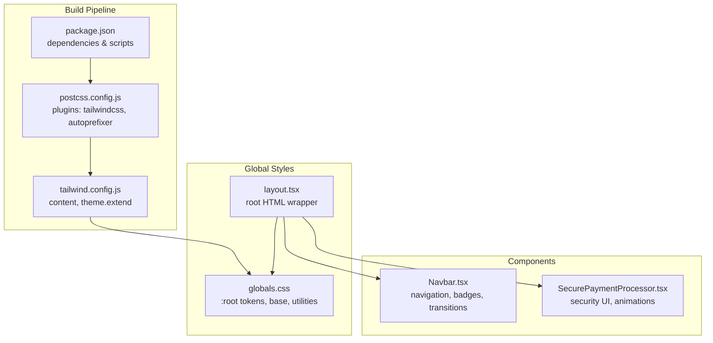
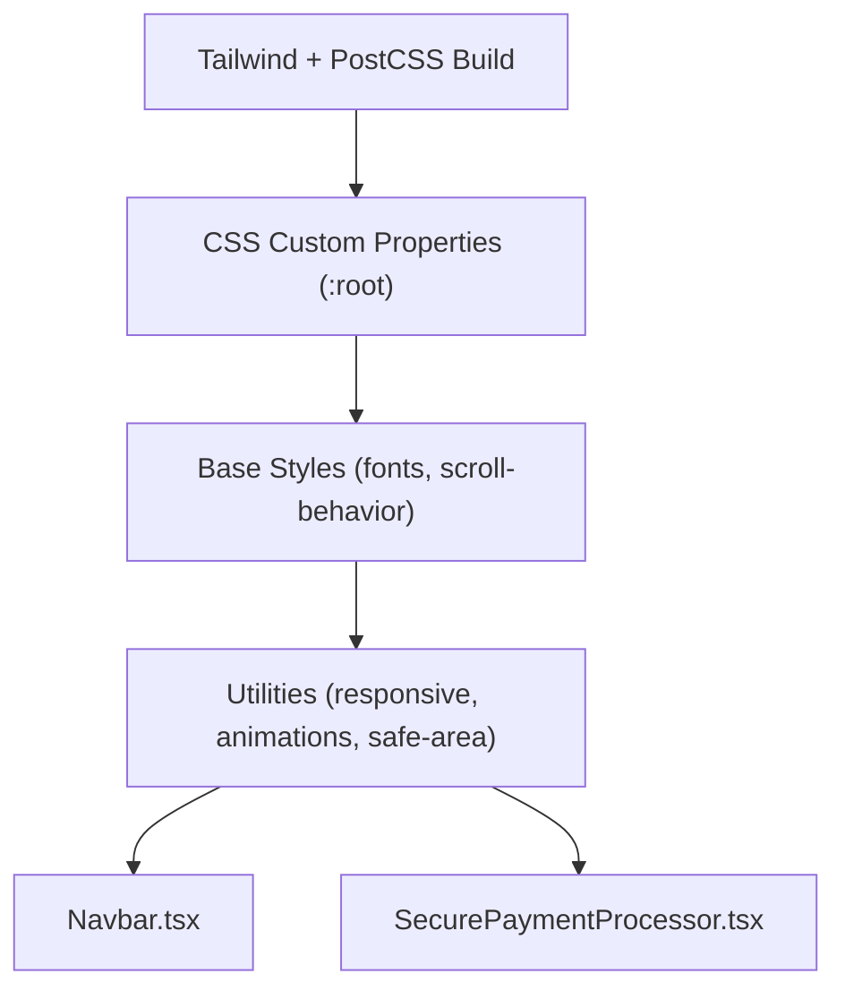
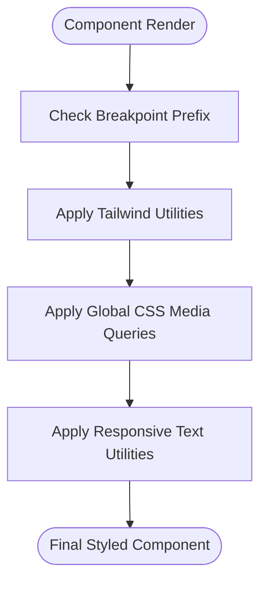
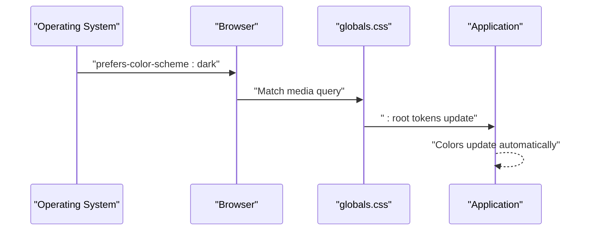
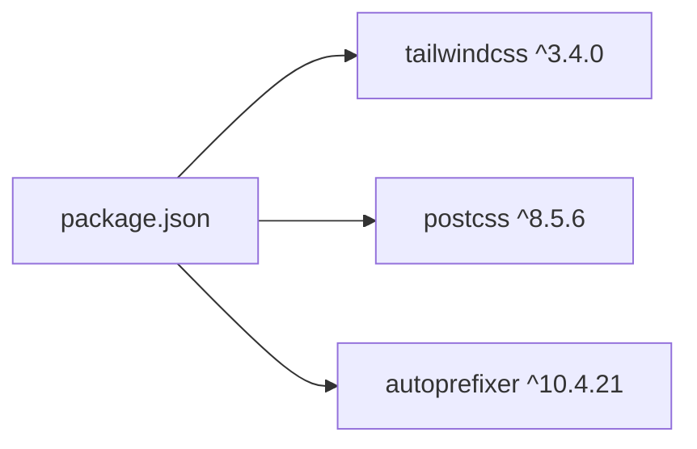

# Styling & Theming

<cite>
**Referenced Files in This Document**
- [tailwind.config.js](file://restaurant-frontend/tailwind.config.js)
- [postcss.config.js](file://restaurant-frontend/postcss.config.js)
- [package.json](file://restaurant-frontend/package.json)
- [next.config.js](file://restaurant-frontend/next.config.js)
- [globals.css](file://restaurant-frontend/src/app/globals.css)
- [layout.tsx](file://restaurant-frontend/src/app/layout.tsx)
- [Navbar.tsx](file://restaurant-frontend/src/components/Navbar.tsx)
- [SecurePaymentProcessor.tsx](file://restaurant-frontend/src/components/SecurePaymentProcessor.tsx)
- [page.tsx](file://restaurant-frontend/src/app/page.tsx)
</cite>

## Table of Contents
1. [Introduction](#introduction)
2. [Project Structure](#project-structure)
3. [Core Components](#core-components)
4. [Architecture Overview](#architecture-overview)
5. [Detailed Component Analysis](#detailed-component-analysis)
6. [Dependency Analysis](#dependency-analysis)
7. [Performance Considerations](#performance-considerations)
8. [Troubleshooting Guide](#troubleshooting-guide)
9. [Conclusion](#conclusion)
10. [Appendices](#appendices)

## Introduction
This document describes the frontend design system for DeQ-Bite’s restaurant application, focusing on Tailwind CSS configuration, global CSS structure, responsive design, dark mode behavior, PostCSS build pipeline, and component styling patterns. It also covers accessibility considerations, design tokens, and scalable component approaches used across the Next.js application.

## Project Structure
The styling system centers around Tailwind CSS and PostCSS, with global CSS applied at the root layout and component-level styling implemented using utility-first classes. The configuration extends Tailwind with custom breakpoints, spacing, and typography scales, while global CSS defines color tokens, animations, and responsive utilities.

**Diagram sources**
- [package.json:12-42](file://restaurant-frontend/package.json#L12-L42)
- [postcss.config.js:1-7](file://restaurant-frontend/postcss.config.js#L1-L7)
- [tailwind.config.js:1-31](file://restaurant-frontend/tailwind.config.js#L1-L31)
- [globals.css:1-146](file://restaurant-frontend/src/app/globals.css#L1-L146)
- [layout.tsx:1-50](file://restaurant-frontend/src/app/layout.tsx#L1-L50)
- [Navbar.tsx:1-197](file://restaurant-frontend/src/components/Navbar.tsx#L1-L197)
- [SecurePaymentProcessor.tsx:1-347](file://restaurant-frontend/src/components/SecurePaymentProcessor.tsx#L1-L347)

**Section sources**
- [package.json:12-42](file://restaurant-frontend/package.json#L12-L42)
- [postcss.config.js:1-7](file://restaurant-frontend/postcss.config.js#L1-L7)
- [tailwind.config.js:1-31](file://restaurant-frontend/tailwind.config.js#L1-L31)
- [globals.css:1-146](file://restaurant-frontend/src/app/globals.css#L1-L146)
- [layout.tsx:1-50](file://restaurant-frontend/src/app/layout.tsx#L1-L50)

## Core Components
- Tailwind configuration extends breakpoints, spacing, and typography to match product needs and ensures content scanning targets application pages, components, and app directories.
- Global CSS defines CSS custom properties for foreground/background colors, applies prefers-color-scheme-aware defaults, and establishes base styles, responsive utilities, animations, and device-safe-area handling.
- PostCSS pipeline enables Tailwind processing and vendor prefixing for cross-browser compatibility.
- Next.js configuration sets image remote patterns, environment variables, and output tracing for optimized builds.

Key configuration highlights:
- Tailwind content scanning includes pages, components, and app directories.
- Custom breakpoints: xs, sm, md, lg, xl, 2xl.
- Extended spacing scale: 18, 88, 128 with rem-based sizing.
- Extended typography: xxs font size.
- PostCSS plugins: tailwindcss and autoprefixer.
- Next.js viewport and theme color configured at the root layout.

**Section sources**
- [tailwind.config.js:3-29](file://restaurant-frontend/tailwind.config.js#L3-L29)
- [globals.css:5-35](file://restaurant-frontend/src/app/globals.css#L5-L35)
- [postcss.config.js:1-7](file://restaurant-frontend/postcss.config.js#L1-L7)
- [layout.tsx:12-18](file://restaurant-frontend/src/app/layout.tsx#L12-L18)
- [next.config.js:4-17](file://restaurant-frontend/next.config.js#L4-L17)

## Architecture Overview
The styling architecture follows a layered approach:
- Build layer: Tailwind and PostCSS compile utilities and apply vendor prefixes.
- Base layer: Global CSS defines color tokens, base typography, and foundational utilities.
- Component layer: UI components use Tailwind utilities and global classes for consistent styling.
- Interaction layer: Animations, transitions, and responsive utilities enhance UX.

**Diagram sources**
- [tailwind.config.js:8-26](file://restaurant-frontend/tailwind.config.js#L8-L26)
- [globals.css:5-146](file://restaurant-frontend/src/app/globals.css#L5-L146)
- [Navbar.tsx:64-197](file://restaurant-frontend/src/components/Navbar.tsx#L64-L197)
- [SecurePaymentProcessor.tsx:261-347](file://restaurant-frontend/src/components/SecurePaymentProcessor.tsx#L261-L347)

## Detailed Component Analysis

### Tailwind Configuration
- Content scanning: Ensures purge-safe generation of styles across pages, components, and app directories.
- Breakpoints: Custom xs breakpoint at 475px supports narrow mobile experiences.
- Spacing: Adds 4.5rem (18), 22rem (88), and 32rem (128) for specific layouts.
- Typography: Introduces xxs size for fine-grained text control.
- Plugins: No additional plugins are configured.

Implementation references:
- Content paths and theme extensions: [tailwind.config.js:3-29](file://restaurant-frontend/tailwind.config.js#L3-L29)

**Section sources**
- [tailwind.config.js:3-29](file://restaurant-frontend/tailwind.config.js#L3-L29)

### Global CSS and Design Tokens
- CSS custom properties define foreground and background gradients for light/dark modes via prefers-color-scheme.
- Body styles include font smoothing, minimum width, and gradient backgrounds driven by custom properties.
- Component-specific utilities:
  - Container sizing and responsive padding.
  - Hover transforms with media-query guards.
  - Cart item separators.
  - Payment security badge styling.
  - Loading spinner with keyframe animation.
  - Touch-friendly active states for mobile.
  - Safe-area padding and bottom padding for mobile insets.
  - Scrollbar hiding utilities.
  - Responsive text utilities using clamp().

Dark mode behavior:
- prefers-color-scheme media query switches :root color tokens for dark mode, enabling automatic theme alignment.

Accessibility and responsive utilities:
- Smooth scrolling for improved navigation.
- Font smoothing for legibility.
- clamp() responsive text utilities for fluid typography.
- Safe-area utilities for modern mobile devices.

**Section sources**
- [globals.css:5-35](file://restaurant-frontend/src/app/globals.css#L5-L35)
- [globals.css:38-146](file://restaurant-frontend/src/app/globals.css#L38-L146)

### PostCSS and Build Pipeline
- PostCSS configuration enables Tailwind and Autoprefixer plugins.
- Tailwind processes utilities and generates purged CSS.
- Autoprefixer adds vendor prefixes for broader browser support.
- Next.js build scripts orchestrate development, production builds, and type checking.

**Section sources**
- [postcss.config.js:1-7](file://restaurant-frontend/postcss.config.js#L1-L7)
- [package.json:5-11](file://restaurant-frontend/package.json#L5-L11)

### Component Styling Patterns

#### Navbar
- Uses semantic structure with sticky positioning and z-index for visibility.
- Responsive padding and typography scaling across breakpoints.
- Active state highlighting with orange accent color and hover transitions.
- Cart badge with red indicator and truncation for long counts.
- Mobile bottom navigation with active states and safe-area padding.
- Conditional rendering for authenticated users and admin/kitchen access.

Responsive and interaction patterns:
- Desktop navigation uses hidden md:flex with spacing utilities.
- Mobile navigation collapses to icons with badges and active highlighting.
- Hover and active states use Tailwind transitions and color utilities.

**Section sources**
- [Navbar.tsx:64-197](file://restaurant-frontend/src/components/Navbar.tsx#L64-L197)

#### Secure Payment Processor
- Card-based layout with shadows and rounded corners.
- Security features highlighted with colored borders and icons.
- Animated status indicators during verification.
- Order summary with clear typography hierarchy and borders.
- Disabled states for buttons during loading/verification.
- Accessible transitions and focus-friendly interactions.

Animation and transitions:
- Spinner animation for loading states.
- Icon animations for status updates.
- Transition utilities for hover and active states.

**Section sources**
- [SecurePaymentProcessor.tsx:261-347](file://restaurant-frontend/src/components/SecurePaymentProcessor.tsx#L261-L347)

### Responsive Design Implementation
- Tailwind responsive prefixes enable breakpoint-specific utilities across components.
- Custom xs breakpoint at 475px allows targeted styling for narrow screens.
- Media queries in global CSS adjust container padding and hover transforms for tablet-sized screens.
- Responsive text utilities use clamp() for fluid scaling across viewport widths.
- Safe-area utilities adapt padding for modern mobile devices.

**Diagram sources**
- [tailwind.config.js:10-17](file://restaurant-frontend/tailwind.config.js#L10-L17)
- [globals.css:44-62](file://restaurant-frontend/src/app/globals.css#L44-L62)
- [globals.css:124-142](file://restaurant-frontend/src/app/globals.css#L124-L142)

**Section sources**
- [tailwind.config.js:10-17](file://restaurant-frontend/tailwind.config.js#L10-L17)
- [globals.css:44-62](file://restaurant-frontend/src/app/globals.css#L44-L62)
- [globals.css:124-142](file://restaurant-frontend/src/app/globals.css#L124-L142)

### Dark Mode Implementation
- prefers-color-scheme media query switches :root color tokens for dark mode.
- CSS custom properties drive body background and text colors automatically.
- No explicit manual toggle is present; theme adapts to system preference.

**Diagram sources**
- [globals.css:11-17](file://restaurant-frontend/src/app/globals.css#L11-L17)
- [globals.css:5-17](file://restaurant-frontend/src/app/globals.css#L5-L17)

**Section sources**
- [globals.css:11-17](file://restaurant-frontend/src/app/globals.css#L11-L17)

### Accessibility Considerations
- Focus management:
  - Form inputs use focus ring utilities for keyboard navigation.
  - Buttons and links maintain visible focus states.
- Contrast and readability:
  - Color tokens defined via CSS custom properties ensure consistent contrast.
  - Orange accent color used for primary actions and active states.
- Motion and interaction:
  - Transitions and hover effects improve feedback.
  - Animations use controlled durations and easing.
- Mobile usability:
  - Touch-friendly active states for non-hover devices.
  - Safe-area insets prevent content overlap on modern phones.

**Section sources**
- [globals.css:76-88](file://restaurant-frontend/src/app/globals.css#L76-L88)
- [globals.css:91-99](file://restaurant-frontend/src/app/globals.css#L91-L99)
- [globals.css:102-111](file://restaurant-frontend/src/app/globals.css#L102-L111)
- [Navbar.tsx:89-96](file://restaurant-frontend/src/components/Navbar.tsx#L89-L96)
- [SecurePaymentProcessor.tsx:317-337](file://restaurant-frontend/src/components/SecurePaymentProcessor.tsx#L317-L337)

## Dependency Analysis
The styling system relies on Tailwind CSS and PostCSS, with Next.js orchestrating the build and runtime behavior. Dependencies include Tailwind CSS and PostCSS packages, with autoprefixer configured via PostCSS.

**Diagram sources**
- [package.json:36-41](file://restaurant-frontend/package.json#L36-L41)

**Section sources**
- [package.json:32-42](file://restaurant-frontend/package.json#L32-L42)

## Performance Considerations
- Purge-safe configuration: Tailwind content scanning targets pages, components, and app directories to minimize unused CSS.
- Utility-first approach: Reduces custom CSS bloat by leveraging prebuilt utilities.
- CSS custom properties: Centralized theming reduces duplication and improves maintainability.
- Autoprefixer: Ensures modern CSS compatibility without manual vendor prefixes.
- Next.js build optimizations: Environment variables and output tracing improve build reliability.

[No sources needed since this section provides general guidance]

## Troubleshooting Guide
- Tailwind utilities not applying:
  - Verify content paths in Tailwind configuration include current directories.
  - Ensure PostCSS plugin order includes tailwindcss before autoprefixer.
- Dark mode not activating:
  - Confirm prefers-color-scheme media query is supported by the browser.
  - Check :root token overrides are present in global CSS.
- Animation or transition issues:
  - Confirm keyframes and transition utilities are defined in global CSS.
  - Ensure components apply appropriate Tailwind transition classes.
- Mobile layout problems:
  - Review safe-area utilities and media queries for responsive adjustments.
  - Validate hover vs. active states for non-hover devices.

**Section sources**
- [tailwind.config.js:3-7](file://restaurant-frontend/tailwind.config.js#L3-L7)
- [postcss.config.js:2-5](file://restaurant-frontend/postcss.config.js#L2-L5)
- [globals.css:11-17](file://restaurant-frontend/src/app/globals.css#L11-L17)
- [globals.css:76-88](file://restaurant-frontend/src/app/globals.css#L76-L88)
- [globals.css:91-99](file://restaurant-frontend/src/app/globals.css#L91-L99)
- [globals.css:102-111](file://restaurant-frontend/src/app/globals.css#L102-L111)

## Conclusion
DeQ-Bite’s styling and theming system leverages Tailwind CSS and PostCSS to deliver a consistent, responsive, and accessible design. The configuration extends Tailwind with custom breakpoints, spacing, and typography, while global CSS provides design tokens, animations, and responsive utilities. Components adopt a utility-first approach with clear interaction patterns, transitions, and accessibility practices. The system is optimized for performance and maintainability, with a foundation ready for future theming enhancements.

[No sources needed since this section summarizes without analyzing specific files]

## Appendices

### Design Token Reference
- CSS custom properties:
  - Foreground RGB
  - Background start RGB
  - Background end RGB
- Usage: Applied in body background and text color via rgb() interpolation.

**Section sources**
- [globals.css:5-17](file://restaurant-frontend/src/app/globals.css#L5-L17)

### Responsive Scale Reference
- Breakpoints:
  - xs: 475px
  - sm: 640px
  - md: 768px
  - lg: 1024px
  - xl: 1280px
  - 2xl: 1536px
- Spacing:
  - 18: 4.5rem
  - 88: 22rem
  - 128: 32rem
- Typography:
  - xxs: 0.625rem

**Section sources**
- [tailwind.config.js:10-26](file://restaurant-frontend/tailwind.config.js#L10-L26)

### Example Component Styling References
- Navbar:
  - Active link highlighting and hover transitions
  - Cart badge and mobile navigation
  - Safe-area padding for mobile
- Secure Payment Processor:
  - Security feature cards with colored borders
  - Animated status indicators
  - Order summary and button states

**Section sources**
- [Navbar.tsx:89-96](file://restaurant-frontend/src/components/Navbar.tsx#L89-L96)
- [Navbar.tsx:174](file://restaurant-frontend/src/components/Navbar.tsx#L174)
- [SecurePaymentProcessor.tsx:266-294](file://restaurant-frontend/src/components/SecurePaymentProcessor.tsx#L266-L294)
- [SecurePaymentProcessor.tsx:208-219](file://restaurant-frontend/src/components/SecurePaymentProcessor.tsx#L208-L219)