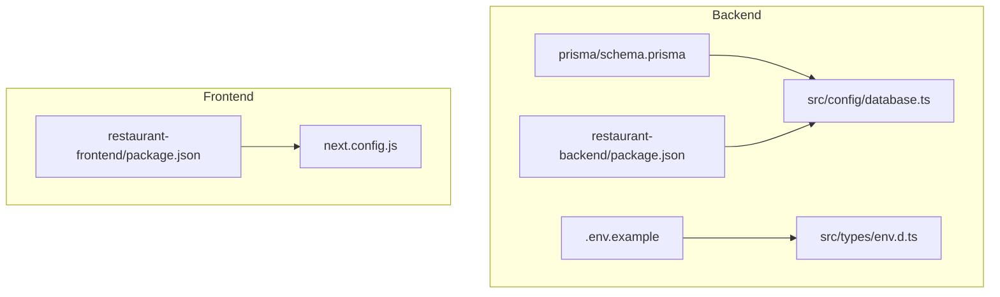
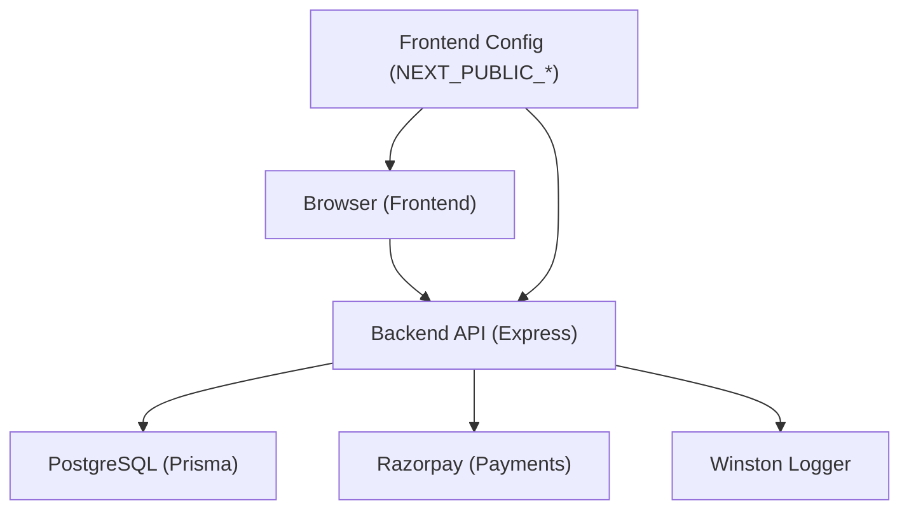
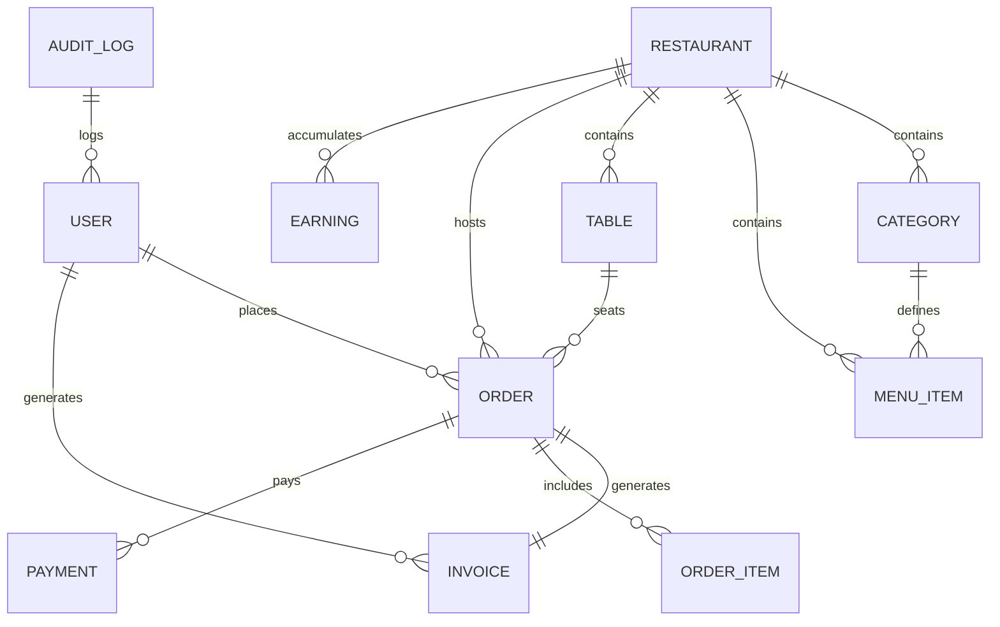
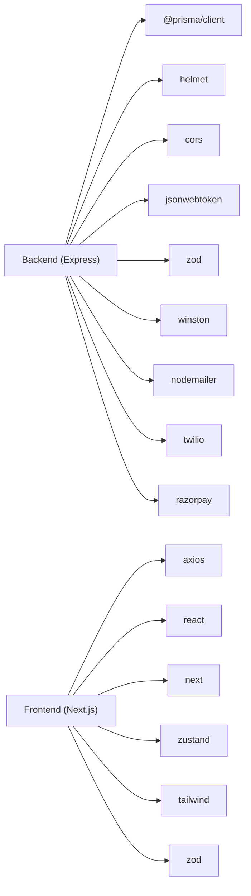
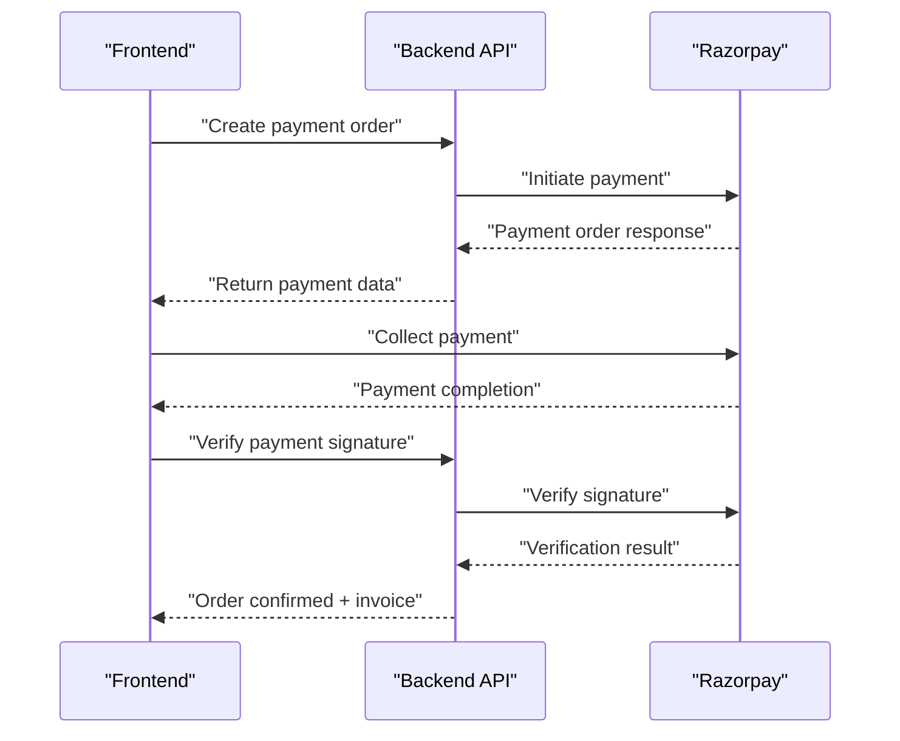
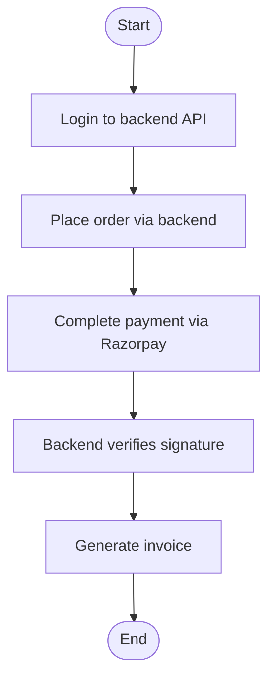

# Getting Started

<cite>
**Referenced Files in This Document**
- [README.md](file://README.md)
- [SEPARATION_GUIDE.md](file://SEPARATION_GUIDE.md)
- [IMPLEMENTATION_STATUS.md](file://IMPLEMENTATION_STATUS.md)
- [SAMPLE_DATA.md](file://SAMPLE_DATA.md)
- [test-order.mjs](file://test-order.mjs)
- [restaurant-backend/package.json](file://restaurant-backend/package.json)
- [restaurant-frontend/package.json](file://restaurant-frontend/package.json)
- [restaurant-backend/.env.example](file://restaurant-backend/.env.example)
- [restaurant-backend/prisma/schema.prisma](file://restaurant-backend/prisma/schema.prisma)
- [restaurant-backend/src/config/database.ts](file://restaurant-backend/src/config/database.ts)
- [restaurant-backend/src/types/env.d.ts](file://restaurant-backend/src/types/env.d.ts)
- [restaurant-frontend/next.config.js](file://restaurant-frontend/next.config.js)
</cite>

## Table of Contents
1. [Introduction](#introduction)
2. [Project Structure](#project-structure)
3. [Core Components](#core-components)
4. [Architecture Overview](#architecture-overview)
5. [Detailed Component Analysis](#detailed-component-analysis)
6. [Dependency Analysis](#dependency-analysis)
7. [Performance Considerations](#performance-considerations)
8. [Troubleshooting Guide](#troubleshooting-guide)
9. [Conclusion](#conclusion)
10. [Appendices](#appendices)

## Introduction
This guide helps you set up the DeQ-Bite restaurant management system with a separated backend and frontend. It covers prerequisites, automated and manual setup for Windows and Linux/macOS, environment configuration, database migration with Prisma, quick start commands, verification steps, common issues, and initial testing procedures.

## Project Structure
DeQ-Bite is split into two independent services:
- Backend API server: Express.js + TypeScript + Prisma + PostgreSQL
- Frontend application: Next.js + React + TypeScript

**Diagram sources**
- [restaurant-backend/package.json](file://restaurant-backend/package.json#L1-L80)
- [restaurant-backend/.env.example](file://restaurant-backend/.env.example#L1-L53)
- [restaurant-backend/prisma/schema.prisma](file://restaurant-backend/prisma/schema.prisma#L1-L384)
- [restaurant-backend/src/config/database.ts](file://restaurant-backend/src/config/database.ts#L1-L66)
- [restaurant-backend/src/types/env.d.ts](file://restaurant-backend/src/types/env.d.ts#L1-L32)
- [restaurant-frontend/package.json](file://restaurant-frontend/package.json#L1-L54)
- [restaurant-frontend/next.config.js](file://restaurant-frontend/next.config.js#L1-L22)

**Section sources**
- [README.md](file://README.md#L65-L99)
- [SEPARATION_GUIDE.md](file://SEPARATION_GUIDE.md#L27-L66)

## Core Components
- Backend
  - Express server with TypeScript and Prisma ORM
  - Routes for authentication, payments, invoices, menus, orders, tables, and more
  - Security middleware (rate limiting, CORS, helmet, input validation)
  - Payment integration with Razorpay and secure signature verification
- Frontend
  - Next.js application with React and TypeScript
  - State management with Zustand
  - API client with interceptors and environment-driven configuration
  - Components for customer and admin experiences

Key setup prerequisites:
- Node.js 18+
- PostgreSQL database
- Razorpay account for payments

**Section sources**
- [README.md](file://README.md#L27-L64)
- [SEPARATION_GUIDE.md](file://SEPARATION_GUIDE.md#L67-L131)
- [IMPLEMENTATION_STATUS.md](file://IMPLEMENTATION_STATUS.md#L115-L135)
- [restaurant-backend/package.json](file://restaurant-backend/package.json#L1-L80)
- [restaurant-frontend/package.json](file://restaurant-frontend/package.json#L1-L54)

## Architecture Overview
The system uses a separated architecture for enhanced security and scalability:
- Backend runs on port 5000
- Frontend runs on port 3000
- Payment flow is secured by server-side signature verification
- Database is PostgreSQL with Prisma ORM

**Diagram sources**
- [README.md](file://README.md#L126-L143)
- [SEPARATION_GUIDE.md](file://SEPARATION_GUIDE.md#L164-L202)
- [restaurant-backend/src/config/database.ts](file://restaurant-backend/src/config/database.ts#L1-L66)
- [restaurant-frontend/next.config.js](file://restaurant-frontend/next.config.js#L12-L17)

## Detailed Component Analysis

### Prerequisites
- Node.js 18+ (required by both backend and frontend)
- PostgreSQL database (configured via DATABASE_URL)
- Razorpay account (for payments): RAZORPAY_KEY_ID and RAZORPAY_KEY_SECRET

Verification:
- Confirm Node.js version meets requirement
- Confirm PostgreSQL is reachable and credentials are correct
- Confirm Razorpay keys are valid and live/test modes are configured appropriately

**Section sources**
- [README.md](file://README.md#L29-L32)
- [SEPARATION_GUIDE.md](file://SEPARATION_GUIDE.md#L86-L113)
- [restaurant-backend/.env.example](file://restaurant-backend/.env.example#L8-L17)

### Automated Setup (Windows and Linux/macOS)
- Windows
  - Run the automated script to set up both backend and frontend
- Linux/macOS
  - Make the script executable and run it

Quick commands:
- Windows: run the batch script
- Linux/macOS: chmod +x the shell script, then execute it

Notes:
- The automated script coordinates backend and frontend setup
- Ensure ports 5000 (backend) and 3000 (frontend) are free

**Section sources**
- [README.md](file://README.md#L34-L42)
- [IMPLEMENTATION_STATUS.md](file://IMPLEMENTATION_STATUS.md#L203-L213)

### Manual Setup

#### Backend Setup
1. Navigate to backend directory
2. Install dependencies
3. Copy environment template to .env and configure:
   - DATABASE_URL
   - JWT_SECRET and JWT_EXPIRES_IN
   - RAZORPAY_KEY_ID and RAZORPAY_KEY_SECRET
   - SMTP_* for email delivery
   - TWILIO_* for SMS delivery
   - FRONTEND_URL and ENCRYPTION_KEY
4. Generate Prisma client and run migrations
5. Seed database (optional)
6. Start backend in development mode

Ports:
- Backend runs on http://localhost:5000

**Section sources**
- [SEPARATION_GUIDE.md](file://SEPARATION_GUIDE.md#L69-L131)
- [restaurant-backend/.env.example](file://restaurant-backend/.env.example#L1-L53)
- [restaurant-backend/package.json](file://restaurant-backend/package.json#L6-L16)

#### Frontend Setup
1. Navigate to frontend directory
2. Install dependencies
3. Configure environment variables:
   - NEXT_PUBLIC_API_URL (pointing to backend API)
   - NEXT_PUBLIC_RAZORPAY_KEY_ID
   - NEXT_PUBLIC_APP_NAME and NEXT_PUBLIC_APP_URL (optional)
4. Start frontend in development mode

Ports:
- Frontend runs on http://localhost:3000

**Section sources**
- [SEPARATION_GUIDE.md](file://SEPARATION_GUIDE.md#L133-L162)
- [restaurant-frontend/next.config.js](file://restaurant-frontend/next.config.js#L12-L17)

### Environment Variable Configuration

#### Backend (.env)
Required variables:
- DATABASE_URL
- JWT_SECRET and JWT_EXPIRES_IN
- RAZORPAY_KEY_ID and RAZORPAY_KEY_SECRET
- SMTP_HOST, SMTP_PORT, SMTP_USER, SMTP_PASS
- TWILIO_ACCOUNT_SID, TWILIO_AUTH_TOKEN, TWILIO_PHONE_NUMBER
- FRONTEND_URL
- ENCRYPTION_KEY

Optional variables:
- PAYTM_* and PHONEPE_* for alternate payment providers
- RATE_LIMIT_WINDOW_MS and RATE_LIMIT_MAX_REQUESTS
- API_KEY for internal services

Validation:
- Ensure DATABASE_URL points to a reachable PostgreSQL instance
- Ensure JWT secret is strong and consistent across deployments
- Ensure Razorpay keys match the selected mode (test/live)

**Section sources**
- [SEPARATION_GUIDE.md](file://SEPARATION_GUIDE.md#L86-L113)
- [restaurant-backend/.env.example](file://restaurant-backend/.env.example#L1-L53)
- [restaurant-backend/src/types/env.d.ts](file://restaurant-backend/src/types/env.d.ts#L3-L26)

#### Frontend (.env.local)
Required variables:
- NEXT_PUBLIC_API_URL
- NEXT_PUBLIC_RAZORPAY_KEY_ID

Optional variables:
- NEXT_PUBLIC_APP_NAME
- NEXT_PUBLIC_APP_URL

Note:
- These variables are exposed to the browser; keep sensitive backend secrets on the backend

**Section sources**
- [SEPARATION_GUIDE.md](file://SEPARATION_GUIDE.md#L145-L162)
- [restaurant-frontend/next.config.js](file://restaurant-frontend/next.config.js#L12-L17)

### Database Migration with Prisma
Steps:
1. Generate Prisma client
2. Run migrations to create/update database schema
3. Seed database (optional) to populate initial data

Schema overview:
- Users, Restaurants, Categories, MenuItems, Tables, Orders, OrderItems, Invoices, Coupons, Offers, Payments, Earnings, AuditLogs
- Enums for roles, statuses, providers, and more

**Diagram sources**
- [restaurant-backend/prisma/schema.prisma](file://restaurant-backend/prisma/schema.prisma#L11-L384)

**Section sources**
- [SEPARATION_GUIDE.md](file://SEPARATION_GUIDE.md#L115-L125)
- [restaurant-backend/prisma/schema.prisma](file://restaurant-backend/prisma/schema.prisma#L1-L384)
- [restaurant-backend/src/config/database.ts](file://restaurant-backend/src/config/database.ts#L1-L66)

### Quick Start Commands and Verification
Backend:
- Install dependencies
- Copy and configure .env
- Generate Prisma client
- Run migrations
- Start backend

Frontend:
- Install dependencies
- Configure .env.local
- Start frontend

Verification:
- Backend health check
- Authentication endpoint test
- Frontend access at http://localhost:3000

**Section sources**
- [README.md](file://README.md#L44-L64)
- [README.md](file://README.md#L159-L178)

### Initial Testing Procedures
- Backend
  - Health check endpoint
  - Authentication with test credentials
- Frontend
  - Open http://localhost:3000
  - Login with test credentials
  - Place an order and test payment flow
  - Verify invoice generation

Sample data:
- Pre-configured test users and sample data are available for immediate testing

**Section sources**
- [README.md](file://README.md#L159-L178)
- [SAMPLE_DATA.md](file://SAMPLE_DATA.md#L5-L32)

## Dependency Analysis
- Backend dependencies include Express, Prisma, bcrypt, helmet, cors, jsonwebtoken, nodemailer, twilio, razorpay, zod, winston, morgan, and more
- Frontend dependencies include Next.js, React, axios, tailwind, zod, zustand, lucide-react, and others

**Diagram sources**
- [restaurant-backend/package.json](file://restaurant-backend/package.json#L18-L44)
- [restaurant-frontend/package.json](file://restaurant-frontend/package.json#L12-L31)

**Section sources**
- [restaurant-backend/package.json](file://restaurant-backend/package.json#L1-L80)
- [restaurant-frontend/package.json](file://restaurant-frontend/package.json#L1-L54)

## Performance Considerations
- Database connection pooling with Prisma
- Rate limiting to prevent abuse
- Caching strategies and optimized queries
- CDN-ready frontend assets
- Code splitting and lazy loading in Next.js

[No sources needed since this section provides general guidance]

## Troubleshooting Guide
Common issues and resolutions:
- Database connectivity
  - Verify DATABASE_URL format and PostgreSQL accessibility
  - Ensure migrations ran successfully
- Environment variables
  - Confirm .env and .env.local values are correct
  - Check NEXT_PUBLIC_API_URL points to the backend
- Ports in use
  - Ensure ports 5000 (backend) and 3000 (frontend) are free
- Payment configuration
  - Validate Razorpay keys and mode (test/live)
  - Check signature verification logs
- Logs and monitoring
  - Review backend logs for errors
  - Use Winston logs and audit trails

**Section sources**
- [README.md](file://README.md#L236-L242)
- [SEPARATION_GUIDE.md](file://SEPARATION_GUIDE.md#L223-L247)

## Conclusion
You now have the complete setup instructions to launch DeQ-Bite’s separated backend and frontend, configure environments, run database migrations, and verify the system. Use the provided quick start commands and testing procedures to validate your installation.

[No sources needed since this section summarizes without analyzing specific files]

## Appendices

### Appendix A: Backend Environment Variables Reference
- DATABASE_URL: PostgreSQL connection string
- JWT_SECRET and JWT_EXPIRES_IN: Token configuration
- RAZORPAY_KEY_ID and RAZORPAY_KEY_SECRET: Payment gateway credentials
- SMTP_*: Email delivery configuration
- TWILIO_*: SMS delivery configuration
- FRONTEND_URL: Allowed origin for CORS
- ENCRYPTION_KEY: Encryption key for sensitive data
- RATE_LIMIT_*: Rate limiting configuration
- API_KEY: Internal service key

**Section sources**
- [restaurant-backend/.env.example](file://restaurant-backend/.env.example#L1-L53)
- [restaurant-backend/src/types/env.d.ts](file://restaurant-backend/src/types/env.d.ts#L3-L26)

### Appendix B: Frontend Environment Variables Reference
- NEXT_PUBLIC_API_URL: Backend API base URL
- NEXT_PUBLIC_RAZORPAY_KEY_ID: Public Razorpay key
- NEXT_PUBLIC_APP_NAME and NEXT_PUBLIC_APP_URL: Optional branding

**Section sources**
- [restaurant-frontend/next.config.js](file://restaurant-frontend/next.config.js#L12-L17)

### Appendix C: Payment Flow Sequence

**Diagram sources**
- [README.md](file://README.md#L128-L135)
- [SEPARATION_GUIDE.md](file://SEPARATION_GUIDE.md#L166-L181)

### Appendix D: End-to-End Order Flow (Automated Test)

**Diagram sources**
- [test-order.mjs](file://test-order.mjs#L1-L58)
- [README.md](file://README.md#L159-L178)