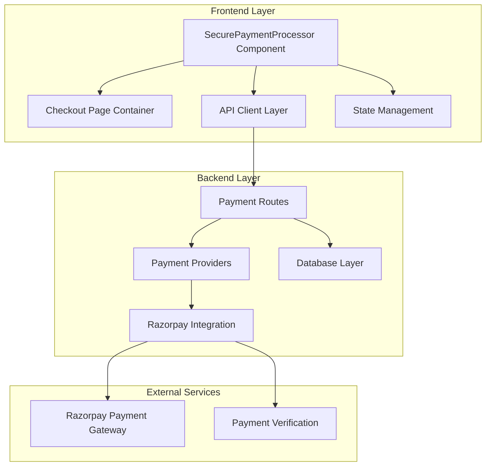
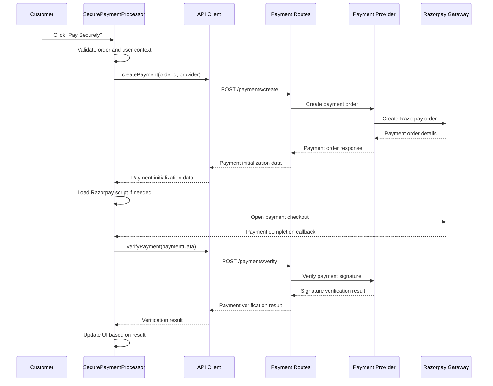
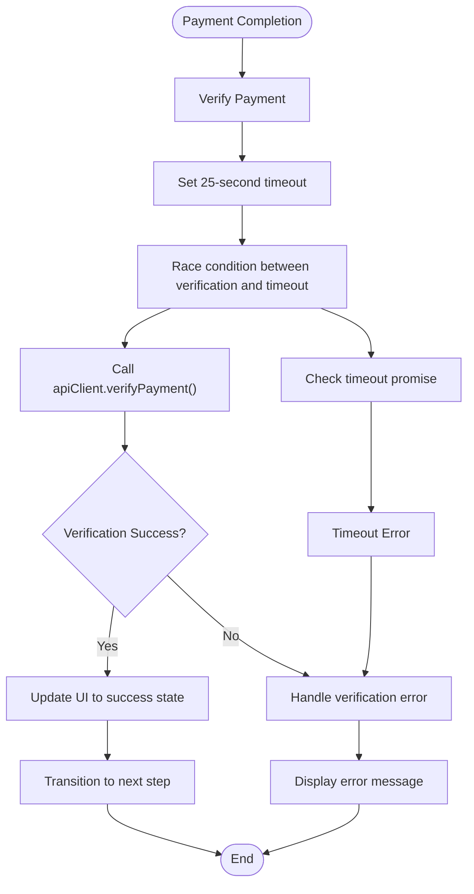
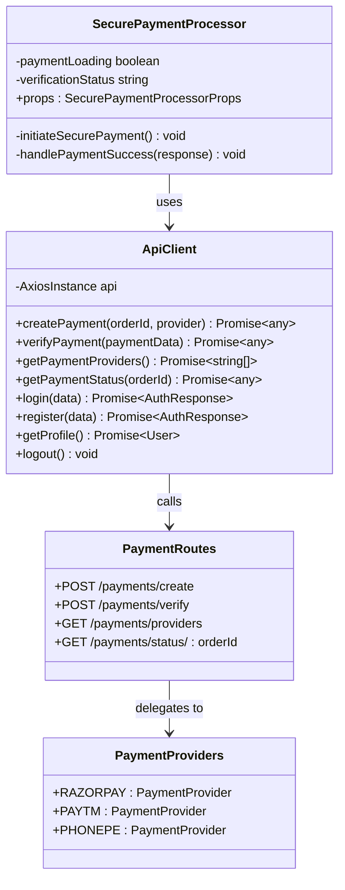
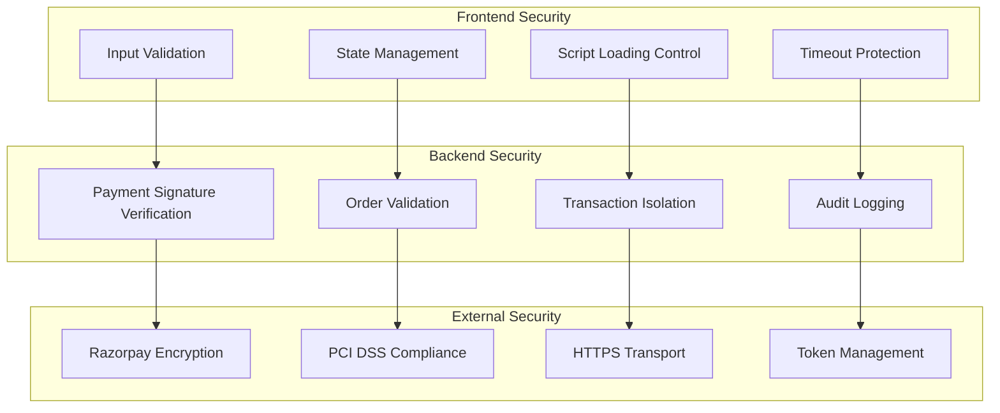
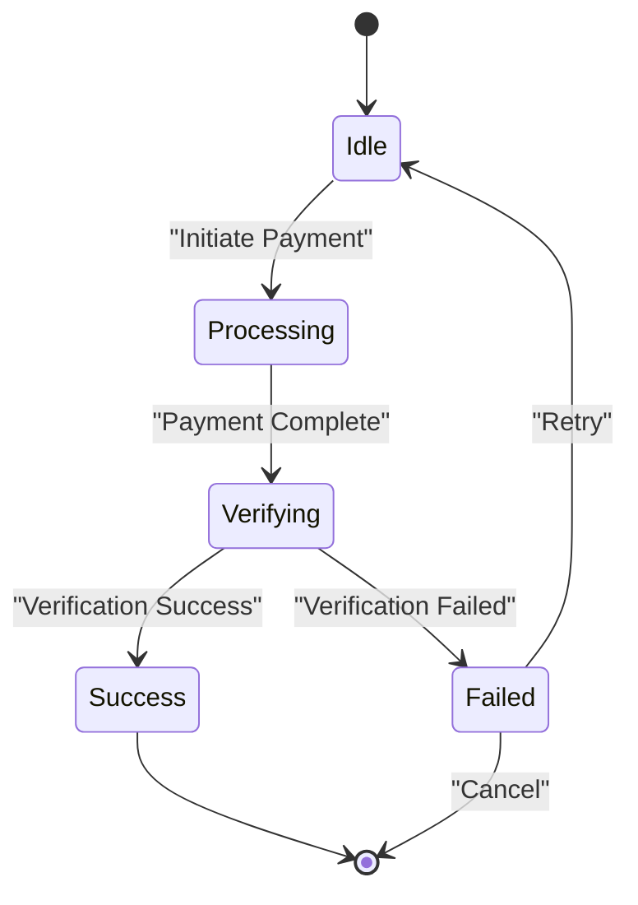
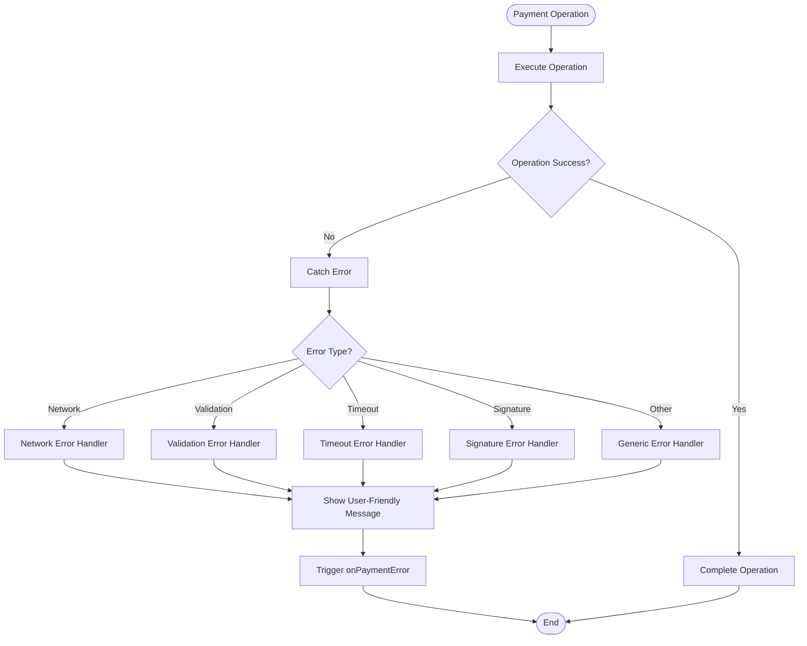

# Frontend Payment Processor

<cite>
**Referenced Files in This Document**
- [SecurePaymentProcessor.tsx](file://restaurant-frontend/src/components/SecurePaymentProcessor.tsx)
- [api-client.ts](file://restaurant-frontend/src/lib/api-client.ts)
- [payments.ts](file://restaurant-backend/src/lib/payments/index.ts)
- [payments.ts](file://restaurant-backend/src/routes/payments.ts)
- [razorpay.ts](file://restaurant-backend/src/lib/razorpay.ts)
- [page.tsx](file://restaurant-frontend/src/app/checkout/page.tsx)
- [cart.ts](file://restaurant-frontend/src/store/cart.ts)
- [auth.ts](file://restaurant-frontend/src/store/auth.ts)
</cite>

## Table of Contents
1. [Introduction](#introduction)
2. [Component Architecture](#component-architecture)
3. [Core Props and State Management](#core-props-and-state-management)
4. [Payment Flow Implementation](#payment-flow-implementation)
5. [Backend Integration](#backend-integration)
6. [Security Features](#security-features)
7. [User Experience Patterns](#user-experience-patterns)
8. [Error Handling Mechanisms](#error-handling-mechanisms)
9. [Integration Examples](#integration-examples)
10. [Performance Considerations](#performance-considerations)
11. [Troubleshooting Guide](#troubleshooting-guide)
12. [Conclusion](#conclusion)

## Introduction

The SecurePaymentProcessor is a critical frontend component in the DeQ-Bite restaurant ordering system responsible for handling secure payment transactions. Built with React and Next.js, this component integrates seamlessly with the backend payment API to provide customers with a seamless, secure payment experience using Razorpay as the primary payment gateway.

The component serves as the bridge between the customer's payment preferences and the restaurant's payment processing infrastructure, supporting multiple payment methods while maintaining strict security protocols and providing comprehensive user feedback throughout the payment lifecycle.

## Component Architecture

The SecurePaymentProcessor follows a modular architecture designed for maintainability and scalability:



**Diagram sources**
- [SecurePaymentProcessor.tsx:72-152](file://restaurant-frontend/src/components/SecurePaymentProcessor.tsx#L72-L152)
- [page.tsx:321-343](file://restaurant-frontend/src/app/checkout/page.tsx#L321-L343)

The component is designed as a self-contained unit that handles all aspects of payment processing, from initiation to completion verification, while delegating complex operations to specialized backend services.

## Core Props and State Management

### Component Props Interface

The SecurePaymentProcessor accepts a well-defined set of props that ensure type safety and clear contract expectations:

```typescript
interface SecurePaymentProcessorProps {
  order: Order;
  onPaymentSuccess: () => void;
  onPaymentError: (error: string) => void;
}
```

### Order Data Structure

The component expects a comprehensive order object containing all payment-relevant information:

```typescript
interface Order {
  id: string;
  totalPaise: number;
  subtotalPaise: number;
  taxPaise: number;
  discountPaise: number;
  paymentProvider?: 'RAZORPAY' | 'PAYTM' | 'PHONEPE' | 'CASH';
  table: {
    number: number;
    location: string;
  };
  items: {
    quantity: number;
    pricePaise: number;
    menuItem: {
      name: string;
    };
  }[];
}
```

### Internal State Management

The component maintains several state variables to manage the payment lifecycle:

| State Variable | Type | Purpose | Default Value |
|---|---|---|---|
| `paymentLoading` | boolean | Controls loading states during payment processing | false |
| `paymentSuccess` | boolean | Tracks successful payment completion | false |
| `verificationStatus` | 'idle' \| 'verifying' \| 'success' \| 'failed' | Payment verification progress tracking | 'idle' |
| `user` | User \| null | Current authenticated user context | null |

**Section sources**
- [SecurePaymentProcessor.tsx:66-81](file://restaurant-frontend/src/components/SecurePaymentProcessor.tsx#L66-L81)
- [SecurePaymentProcessor.tsx:46-64](file://restaurant-frontend/src/components/SecurePaymentProcessor.tsx#L46-L64)

## Payment Flow Implementation

### Payment Initiation Process

The payment initiation flow follows a structured sequence designed for reliability and user feedback:



**Diagram sources**
- [SecurePaymentProcessor.tsx:83-152](file://restaurant-frontend/src/components/SecurePaymentProcessor.tsx#L83-L152)
- [api-client.ts:381-387](file://restaurant-frontend/src/lib/api-client.ts#L381-L387)
- [payments.ts:195-292](file://restaurant-backend/src/routes/payments.ts#L195-L292)

### Payment Verification Process

The verification process implements robust timeout handling and error management:



**Diagram sources**
- [SecurePaymentProcessor.tsx:154-206](file://restaurant-frontend/src/components/SecurePaymentProcessor.tsx#L154-L206)

**Section sources**
- [SecurePaymentProcessor.tsx:83-206](file://restaurant-frontend/src/components/SecurePaymentProcessor.tsx#L83-L206)

## Backend Integration

### API Client Integration

The component integrates with the backend through a well-structured API client that handles authentication, tenant routing, and error handling:



**Diagram sources**
- [api-client.ts:194-432](file://restaurant-frontend/src/lib/api-client.ts#L194-L432)
- [payments.ts:195-407](file://restaurant-backend/src/routes/payments.ts#L195-L407)

### Payment Provider Configuration

The backend supports multiple payment providers with configurable enablement:

| Provider | Status | Configuration Required |
|---|---|---|
| **RAZORPAY** | ✅ Enabled | `RAZORPAY_KEY_ID`, `RAZORPAY_KEY_SECRET` |
| **PAYTM** | ⚠️ Not Configured | `PAYTM_MERCHANT_ID`, `PAYTM_MERCHANT_KEY` |
| **PHONEPE** | ⚠️ Not Configured | `PHONEPE_MERCHANT_ID`, `PHONEPE_SALT_KEY` |
| **CASH** | ✅ Supported | Restaurant policy setting |

**Section sources**
- [payments.ts:111-124](file://restaurant-backend/src/lib/payments/index.ts#L111-L124)
- [payments.ts:180-193](file://restaurant-backend/src/routes/payments.ts#L180-L193)

## Security Features

### Multi-Layered Security Implementation

The payment processor implements comprehensive security measures at multiple layers:



**Diagram sources**
- [SecurePaymentProcessor.tsx:104-144](file://restaurant-frontend/src/components/SecurePaymentProcessor.tsx#L104-L144)
- [razorpay.ts:65-105](file://restaurant-backend/src/lib/razorpay.ts#L65-L105)

### Security Measures Implemented

1. **Frontend Script Loading**: Dynamic loading of Razorpay SDK only when needed
2. **Payment Signature Verification**: End-to-end signature validation
3. **Timeout Protection**: 25-second verification timeout to prevent hanging states
4. **State Management**: Controlled state transitions to prevent inconsistent UI states
5. **Error Boundary Handling**: Comprehensive error catching and user-friendly messaging

**Section sources**
- [SecurePaymentProcessor.tsx:104-162](file://restaurant-frontend/src/components/SecurePaymentProcessor.tsx#L104-L162)
- [razorpay.ts:65-105](file://restaurant-backend/src/lib/razorpay.ts#L65-L105)

## User Experience Patterns

### Progressive Disclosure Design

The component implements progressive disclosure to guide users through the payment process:



**Diagram sources**
- [SecurePaymentProcessor.tsx:77-79](file://restaurant-frontend/src/components/SecurePaymentProcessor.tsx#L77-L79)

### Loading States and Feedback

The component provides comprehensive user feedback through multiple visual indicators:

| State | Icon | Message | Action |
|---|---|---|---|
| **Idle** | None | Ready to pay | Enable payment button |
| **Processing** | ⏳ | Processing payment... | Disable button, show spinner |
| **Verifying** | ⏱️ | Verifying payment security... | Show verification indicator |
| **Success** | ✅ | Payment verified successfully! | Enable continue button |
| **Failed** | ❌ | Payment verification failed | Show error message |

**Section sources**
- [SecurePaymentProcessor.tsx:208-232](file://restaurant-frontend/src/components/SecurePaymentProcessor.tsx#L208-L232)
- [SecurePaymentProcessor.tsx:317-337](file://restaurant-frontend/src/components/SecurePaymentProcessor.tsx#L317-L337)

## Error Handling Mechanisms

### Comprehensive Error Management

The payment processor implements layered error handling for different failure scenarios:



**Diagram sources**
- [SecurePaymentProcessor.tsx:145-205](file://restaurant-frontend/src/components/SecurePaymentProcessor.tsx#L145-L205)

### Error Categories and Responses

| Error Category | Trigger Condition | User Message | Backend Response |
|---|---|---|---|
| **Network Timeout** | 25+ second delay | "Payment verification timed out. The server is taking too long to respond. Please check your internet connection and try again, or contact support if the issue persists." | ECONNABORTED |
| **Invalid Signature** | Razorpay signature mismatch | "Payment verification failed due to invalid signature. Please try again." | Signature validation failure |
| **Order Not Found** | Payment reference mismatch | "Order not found. Please contact support." | 404 error |
| **Payment Failed** | Non-successful payment status | "Payment was not successful. Please check your payment method and try again." | Payment status != authorized/captured |
| **Already Verified** | Duplicate verification attempt | "Payment already verified." | Already processed |

**Section sources**
- [SecurePaymentProcessor.tsx:183-205](file://restaurant-frontend/src/components/SecurePaymentProcessor.tsx#L183-L205)
- [api-client.ts:408-431](file://restaurant-frontend/src/lib/api-client.ts#L408-L431)

## Integration Examples

### Basic Integration Pattern

The SecurePaymentProcessor is integrated into the checkout flow through the following pattern:

```typescript
// Checkout page integration
<SecurePaymentProcessor
  order={{
    id: createdOrder.id,
    totalPaise: createdOrder.totalPaise,
    subtotalPaise: createdOrder.subtotalPaise,
    taxPaise: createdOrder.taxPaise,
    discountPaise: createdOrder.discountPaise || 0,
    table: createdOrder.table,
    items: createdOrder.items,
    paymentProvider: paymentProvider,
  }}
  onPaymentSuccess={handlePaymentSuccess}
  onPaymentError={handlePaymentError}
/>
```

### API Client Usage Patterns

The component relies on specific API client methods for payment operations:

```typescript
// Payment creation
const paymentData = await apiClient.createPayment(orderId, provider);

// Payment verification  
const verificationResult = await apiClient.verifyPayment({
  razorpay_order_id: response.razorpay_order_id,
  razorpay_payment_id: response.razorpay_payment_id,
  razorpay_signature: response.razorpay_signature,
});
```

**Section sources**
- [page.tsx:326-339](file://restaurant-frontend/src/app/checkout/page.tsx#L326-L339)
- [api-client.ts:381-432](file://restaurant-frontend/src/lib/api-client.ts#L381-L432)

## Performance Considerations

### Optimization Strategies

The payment processor implements several performance optimizations:

1. **Lazy Script Loading**: Razorpay SDK is loaded only when needed
2. **State Optimization**: Minimal re-renders through efficient state management
3. **Timeout Management**: Prevents hanging states with 25-second verification timeout
4. **Conditional Rendering**: Only renders necessary UI elements based on current state

### Memory Management

The component properly manages memory through:
- Cleanup of event listeners
- Proper disposal of external script resources
- Efficient state updates to prevent memory leaks

## Troubleshooting Guide

### Common Issues and Solutions

| Issue | Symptoms | Solution |
|---|---|---|
| **Payment Button Disabled** | Button appears grayed out | Check order validity and user authentication |
| **Verification Stuck on "Verifying"** | Spinner continues indefinitely | Check network connectivity and timeout logs |
| **Signature Error Messages** | "Invalid signature" notifications | Verify backend configuration and payment gateway setup |
| **Order Not Found Errors** | "Order not found" messages | Confirm order exists and belongs to current user |
| **Razorpay Script Loading Failures** | Payment modal doesn't appear | Check CDN accessibility and browser console errors |

### Debugging Steps

1. **Enable Developer Tools**: Monitor network requests and console output
2. **Check Environment Variables**: Verify payment gateway credentials are properly configured
3. **Review Payment Logs**: Examine backend logs for payment processing errors
4. **Test with Test Cards**: Use Razorpay test cards for development validation

**Section sources**
- [SecurePaymentProcessor.tsx:145-151](file://restaurant-frontend/src/components/SecurePaymentProcessor.tsx#L145-L151)
- [payments.ts:294-407](file://restaurant-backend/src/routes/payments.ts#L294-L407)

## Conclusion

The SecurePaymentProcessor component represents a comprehensive solution for handling secure payments in the DeQ-Bite restaurant ordering system. Through its robust architecture, comprehensive error handling, and focus on user experience, it provides a reliable foundation for payment processing while maintaining strict security standards.

The component's modular design ensures maintainability and extensibility, while its integration patterns demonstrate best practices for frontend-backend communication. The implementation successfully balances user experience with security requirements, providing clear feedback and graceful error handling throughout the payment lifecycle.

Future enhancements could include expanded payment provider support, additional payment method options, and advanced analytics tracking for payment success rates and user behavior patterns.