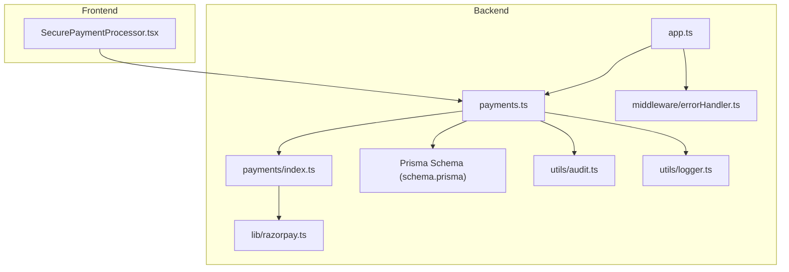
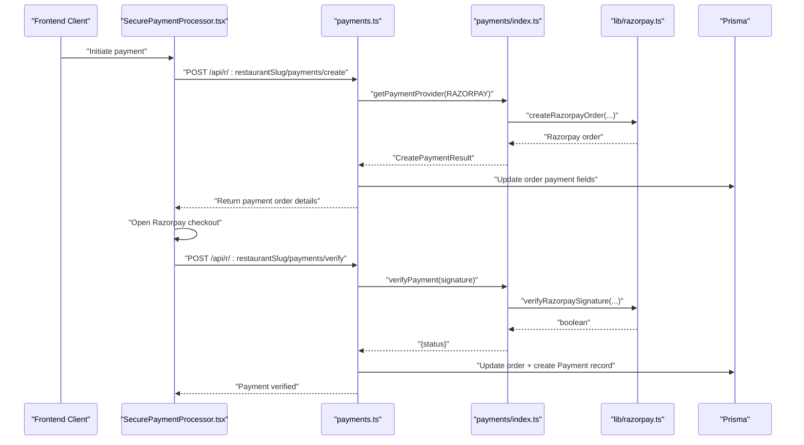
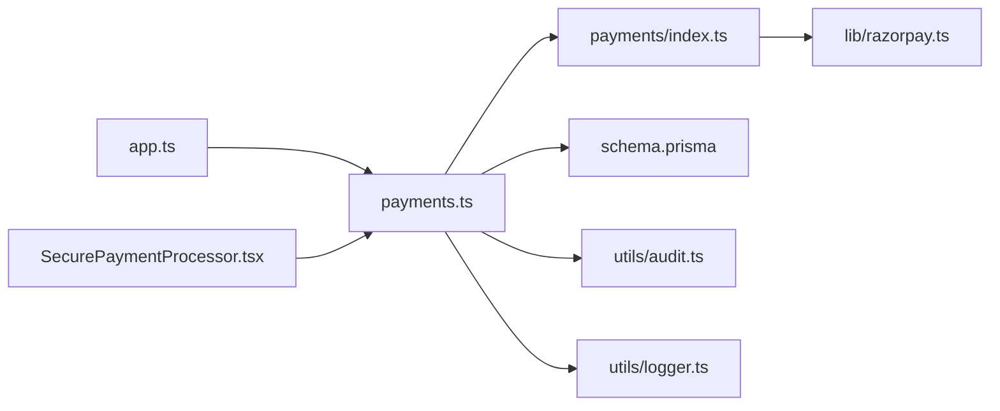

# Payment Processing

<cite>
**Referenced Files in This Document**
- [payments.ts](file://restaurant-backend/src/routes/payments.ts)
- [razorpay.ts](file://restaurant-backend/src/lib/razorpay.ts)
- [payments/index.ts](file://restaurant-backend/src/lib/payments/index.ts)
- [SecurePaymentProcessor.tsx](file://restaurant-frontend/src/components/SecurePaymentProcessor.tsx)
- [env.d.ts](file://restaurant-backend/src/types/env.d.ts)
- [schema.prisma](file://restaurant-backend/prisma/schema.prisma)
- [audit.ts](file://restaurant-backend/src/utils/audit.ts)
- [logger.ts](file://restaurant-backend/src/utils/logger.ts)
- [errorHandler.ts](file://restaurant-backend/src/middleware/errorHandler.ts)
- [app.ts](file://restaurant-backend/src/app.ts)
- [package.json](file://restaurant-backend/package.json)
</cite>

## Table of Contents
1. [Introduction](#introduction)
2. [Project Structure](#project-structure)
3. [Core Components](#core-components)
4. [Architecture Overview](#architecture-overview)
5. [Detailed Component Analysis](#detailed-component-analysis)
6. [Dependency Analysis](#dependency-analysis)
7. [Performance Considerations](#performance-considerations)
8. [Troubleshooting Guide](#troubleshooting-guide)
9. [Conclusion](#conclusion)
10. [Appendices](#appendices)

## Introduction
This document explains DeQ-Bite’s secure payment processing system with a focus on Razorpay integration. It covers API configuration, payment order creation, signature verification, server-side verification using HMAC-SHA256, the end-to-end payment flow from order creation to order confirmation, the frontend payment processor component, payment status management, transaction logging, refund processing, security measures, webhook handling, and error recovery. It also outlines testing procedures, sandbox setup, and production deployment considerations.

## Project Structure
The payment system spans two applications:
- Backend (Express): Routes, providers, Razorpay integration, logging, auditing, and database models.
- Frontend (Next.js): Secure payment UI component integrating with Razorpay checkout.

**Diagram sources**
- [payments.ts](file://restaurant-backend/src/routes/payments.ts#L1-L731)
- [payments/index.ts](file://restaurant-backend/src/lib/payments/index.ts#L1-L124)
- [razorpay.ts](file://restaurant-backend/src/lib/razorpay.ts#L1-L219)
- [schema.prisma](file://restaurant-backend/prisma/schema.prisma#L144-L278)
- [audit.ts](file://restaurant-backend/src/utils/audit.ts#L1-L17)
- [logger.ts](file://restaurant-backend/src/utils/logger.ts#L1-L56)
- [errorHandler.ts](file://restaurant-backend/src/middleware/errorHandler.ts#L1-L82)
- [app.ts](file://restaurant-backend/src/app.ts#L1-L148)
- [SecurePaymentProcessor.tsx](file://restaurant-frontend/src/components/SecurePaymentProcessor.tsx#L1-L347)

**Section sources**
- [payments.ts](file://restaurant-backend/src/routes/payments.ts#L1-L731)
- [payments/index.ts](file://restaurant-backend/src/lib/payments/index.ts#L1-L124)
- [razorpay.ts](file://restaurant-backend/src/lib/razorpay.ts#L1-L219)
- [schema.prisma](file://restaurant-backend/prisma/schema.prisma#L144-L278)
- [audit.ts](file://restaurant-backend/src/utils/audit.ts#L1-L17)
- [logger.ts](file://restaurant-backend/src/utils/logger.ts#L1-L56)
- [errorHandler.ts](file://restaurant-backend/src/middleware/errorHandler.ts#L1-L82)
- [app.ts](file://restaurant-backend/src/app.ts#L1-L148)
- [SecurePaymentProcessor.tsx](file://restaurant-frontend/src/components/SecurePaymentProcessor.tsx#L1-L347)

## Core Components
- Payment Provider Abstraction: Defines a unified interface for payment providers and currently enables Razorpay with stubs for others.
- Razorpay Integration: Handles order creation, signature verification, payment capture, refunds, and webhook signature validation.
- Backend Payment Routes: Exposes endpoints to create payment orders, verify payments, process refunds, manage statuses, and query payment status.
- Frontend Payment Processor: Integrates Razorpay checkout, initiates verification, and displays real-time verification status.
- Data Models: Orders, Payments, Invoices, Earnings, and Audit Logs track payment lifecycle and compliance.
- Logging and Auditing: Centralized logging and safe audit log writes for operational visibility and compliance.
- Error Handling: Unified error handling with environment-aware responses.

**Section sources**
- [payments/index.ts](file://restaurant-backend/src/lib/payments/index.ts#L1-L124)
- [razorpay.ts](file://restaurant-backend/src/lib/razorpay.ts#L1-L219)
- [payments.ts](file://restaurant-backend/src/routes/payments.ts#L1-L731)
- [schema.prisma](file://restaurant-backend/prisma/schema.prisma#L144-L278)
- [audit.ts](file://restaurant-backend/src/utils/audit.ts#L1-L17)
- [logger.ts](file://restaurant-backend/src/utils/logger.ts#L1-L56)
- [errorHandler.ts](file://restaurant-backend/src/middleware/errorHandler.ts#L1-L82)

## Architecture Overview
End-to-end payment flow:
1. Frontend requests a payment order creation.
2. Backend validates the order and creates a Razorpay order.
3. Frontend opens Razorpay checkout with returned order details.
4. Upon payment completion, Razorpay redirects with signature.
5. Frontend verifies the signature via backend endpoint.
6. Backend validates signature and payment status, updates order and payment records, and emits events.

**Diagram sources**
- [SecurePaymentProcessor.tsx](file://restaurant-frontend/src/components/SecurePaymentProcessor.tsx#L83-L152)
- [payments.ts](file://restaurant-backend/src/routes/payments.ts#L195-L292)
- [payments/index.ts](file://restaurant-backend/src/lib/payments/index.ts#L40-L81)
- [razorpay.ts](file://restaurant-backend/src/lib/razorpay.ts#L33-L60)
- [payments.ts](file://restaurant-backend/src/routes/payments.ts#L294-L407)

## Detailed Component Analysis

### Backend Payment Routes
Endpoints and responsibilities:
- GET /api/payments/providers: Returns enabled providers per restaurant and cash if enabled.
- POST /api/payments/create: Creates a Razorpay order for the due/pending amount, sets order to PROCESSING, and returns order details.
- POST /api/payments/verify: Verifies signature and payment status, updates order/payment records, and emits events.
- POST /api/payments/refund: Issues refunds against the original payment transaction ID and updates order/payment records.
- GET /api/payments/status/:orderId: Retrieves order payment status and history.
- POST /api/payments/cash/confirm: Manages cash payments with admin authorization.
- PUT /api/payments/status: Updates payment status manually with validation.

Key behaviors:
- Validation via Zod schemas.
- Transactional updates to maintain consistency.
- Audit logging for payment actions.
- Real-time event emission for order updates.

**Section sources**
- [payments.ts](file://restaurant-backend/src/routes/payments.ts#L180-L728)

### Payment Provider Abstraction
Defines:
- Provider interface with createOrder, verifyPayment, and refund.
- Provider selection and enablement checks.
- Razorpay provider implementation with signature verification and payment status checks.

Security highlights:
- Signature verification uses HMAC-SHA256 with stored secrets.
- Payment status enforced to be authorized or captured.

**Section sources**
- [payments/index.ts](file://restaurant-backend/src/lib/payments/index.ts#L32-L81)

### Razorpay Integration
Capabilities:
- Order creation with amount, currency, receipt, and notes.
- Signature verification using HMAC-SHA256 on order_id|payment_id.
- Optional capture for manual capture gateways.
- Refund processing with optional amount and reason.
- Payment details fetching.
- Webhook signature validation using a dedicated webhook secret.

Logging and error handling:
- Structured logs for order creation, verification, capture, refund, and fetch operations.
- Errors logged with context and rethrown.

**Section sources**
- [razorpay.ts](file://restaurant-backend/src/lib/razorpay.ts#L33-L60)
- [razorpay.ts](file://restaurant-backend/src/lib/razorpay.ts#L65-L105)
- [razorpay.ts](file://restaurant-backend/src/lib/razorpay.ts#L110-L129)
- [razorpay.ts](file://restaurant-backend/src/lib/razorpay.ts#L134-L169)
- [razorpay.ts](file://restaurant-backend/src/lib/razorpay.ts#L174-L195)
- [razorpay.ts](file://restaurant-backend/src/lib/razorpay.ts#L200-L218)

### Frontend Payment Processor
Responsibilities:
- Initiates payment by calling backend create endpoint.
- Loads Razorpay checkout script dynamically.
- Opens checkout with secure options and pre-filled customer details.
- Verifies payment via backend verify endpoint with a 25-second timeout.
- Displays real-time verification status and success/failure messaging.

UX and security:
- Bank-grade security messaging and PCI-compliant provider branding.
- Controlled loading states and user feedback during verification.

**Section sources**
- [SecurePaymentProcessor.tsx](file://restaurant-frontend/src/components/SecurePaymentProcessor.tsx#L83-L152)
- [SecurePaymentProcessor.tsx](file://restaurant-frontend/src/components/SecurePaymentProcessor.tsx#L154-L206)
- [SecurePaymentProcessor.tsx](file://restaurant-frontend/src/components/SecurePaymentProcessor.tsx#L261-L347)

### Data Models and Status Management
Models involved:
- Order: Tracks totals, paid/due amounts, provider, transaction ID, and status.
- Payment: Records each payment or refund with provider details and status.
- Invoice and Earning: Auto-generated on full payment completion.
- AuditLog: Captures payment-related actions.

Status computation:
- Due and status derived from total and paid amounts with bounds checking.

**Section sources**
- [schema.prisma](file://restaurant-backend/prisma/schema.prisma#L144-L175)
- [schema.prisma](file://restaurant-backend/prisma/schema.prisma#L260-L278)
- [schema.prisma](file://restaurant-backend/prisma/schema.prisma#L190-L204)
- [schema.prisma](file://restaurant-backend/prisma/schema.prisma#L280-L293)
- [payments.ts](file://restaurant-backend/src/routes/payments.ts#L44-L59)

### Logging, Auditing, and Error Handling
- Winston-based logger with console and file transports; serverless-safe fallback.
- Safe audit log creation with migration guard.
- Unified error handler with environment-aware responses and standardized API error shape.

**Section sources**
- [logger.ts](file://restaurant-backend/src/utils/logger.ts#L1-L56)
- [audit.ts](file://restaurant-backend/src/utils/audit.ts#L1-L17)
- [errorHandler.ts](file://restaurant-backend/src/middleware/errorHandler.ts#L1-L82)

## Dependency Analysis
- Express app mounts tenant-aware routes under restaurant slugs and supports direct restaurant ID endpoints.
- Payment routes depend on:
  - Authentication and restaurant middleware.
  - Payment provider abstraction.
  - Razorpay library for external API calls.
  - Prisma for persistence.
  - Audit and logging utilities.

**Diagram sources**
- [app.ts](file://restaurant-backend/src/app.ts#L111-L126)
- [payments.ts](file://restaurant-backend/src/routes/payments.ts#L1-L14)
- [payments/index.ts](file://restaurant-backend/src/lib/payments/index.ts#L1-L124)
- [razorpay.ts](file://restaurant-backend/src/lib/razorpay.ts#L1-L219)
- [schema.prisma](file://restaurant-backend/prisma/schema.prisma#L144-L278)
- [audit.ts](file://restaurant-backend/src/utils/audit.ts#L1-L17)
- [logger.ts](file://restaurant-backend/src/utils/logger.ts#L1-L56)
- [SecurePaymentProcessor.tsx](file://restaurant-frontend/src/components/SecurePaymentProcessor.tsx#L1-L347)

**Section sources**
- [app.ts](file://restaurant-backend/src/app.ts#L111-L126)
- [payments.ts](file://restaurant-backend/src/routes/payments.ts#L1-L14)

## Performance Considerations
- Asynchronous operations for external API calls (Razorpay) are awaited; consider adding retry/backoff for transient failures.
- Transactional updates reduce race conditions; ensure database connection pooling is tuned for expected load.
- Logging includes timing metrics for order creation and payment fetch; monitor latency in production.
- Frontend verification uses a timeout to prevent hanging; ensure network timeouts are aligned with backend processing.

[No sources needed since this section provides general guidance]

## Troubleshooting Guide
Common issues and remedies:
- Missing provider configuration: Ensure environment variables for the selected provider are present before enabling.
- Invalid signature errors: Verify HMAC-SHA256 inputs and secrets; check that order_id and payment_id match the transaction.
- Payment not successful: Confirm payment status is authorized or captured; otherwise, reject verification.
- Order not found: Validate order ownership and restaurant context; ensure correct user and restaurant filters.
- Refund errors: Confirm the original payment transaction ID exists and the amount is valid.
- Audit log table missing: Migration may not have run; safe audit logging will skip and warn.

Operational diagnostics:
- Review structured logs for order creation, verification, capture, refund, and fetch operations.
- Use GET /api/payments/status/:orderId to inspect order and payment history.
- Check unified error responses and stack traces in development mode.

**Section sources**
- [payments/index.ts](file://restaurant-backend/src/lib/payments/index.ts#L40-L81)
- [razorpay.ts](file://restaurant-backend/src/lib/razorpay.ts#L65-L105)
- [payments.ts](file://restaurant-backend/src/routes/payments.ts#L294-L407)
- [payments.ts](file://restaurant-backend/src/routes/payments.ts#L409-L516)
- [audit.ts](file://restaurant-backend/src/utils/audit.ts#L5-L16)
- [errorHandler.ts](file://restaurant-backend/src/middleware/errorHandler.ts#L22-L76)

## Conclusion
DeQ-Bite’s payment system integrates Razorpay securely with server-side signature verification, robust status management, and comprehensive transaction logging. The frontend component provides a seamless, secure checkout experience with real-time feedback. The backend enforces strict validation, maintains audit trails, and supports refunds and manual status updates. With proper environment configuration and monitoring, the system is ready for production.

[No sources needed since this section summarizes without analyzing specific files]

## Appendices

### Environment Variables
Required for Razorpay:
- RAZORPAY_KEY_ID
- RAZORPAY_KEY_SECRET
- RAZORPAY_WEBHOOK_SECRET (for webhook signature validation)

Optional for enhanced security/logging:
- LOG_LEVEL
- JWT_SECRET (production)

**Section sources**
- [env.d.ts](file://restaurant-backend/src/types/env.d.ts#L10-L11)
- [env.d.ts](file://restaurant-backend/src/types/env.d.ts#L25-L27)
- [razorpay.ts](file://restaurant-backend/src/lib/razorpay.ts#L200-L218)

### API Endpoints Summary
- GET /api/payments/providers
- POST /api/payments/create
- POST /api/payments/verify
- POST /api/payments/refund
- GET /api/payments/status/:orderId
- POST /api/payments/cash/confirm
- PUT /api/payments/status

**Section sources**
- [payments.ts](file://restaurant-backend/src/routes/payments.ts#L180-L728)

### Security Measures
- Transport security: Helmet-enabled Express app.
- CORS configuration allows trusted origins and credentials.
- Rate limiting to mitigate abuse.
- HMAC-SHA256 signature verification for payment authenticity.
- PCI-compliant provider (Razorpay) handles cardholder data.
- Environment-driven secrets and minimal logging of sensitive data.

**Section sources**
- [app.ts](file://restaurant-backend/src/app.ts#L37-L65)
- [app.ts](file://restaurant-backend/src/app.ts#L67-L77)
- [razorpay.ts](file://restaurant-backend/src/lib/razorpay.ts#L65-L105)

### Testing and Deployment
- Local development: Use environment variables and local database; verify endpoints with Postman collection.
- Sandbox: Use Razorpay test credentials and webhook secrets for local testing.
- Production: Ensure secrets are set, health checks pass (/health), and logs are monitored.

**Section sources**
- [package.json](file://restaurant-backend/package.json#L6-L16)
- [app.ts](file://restaurant-backend/src/app.ts#L92-L99)