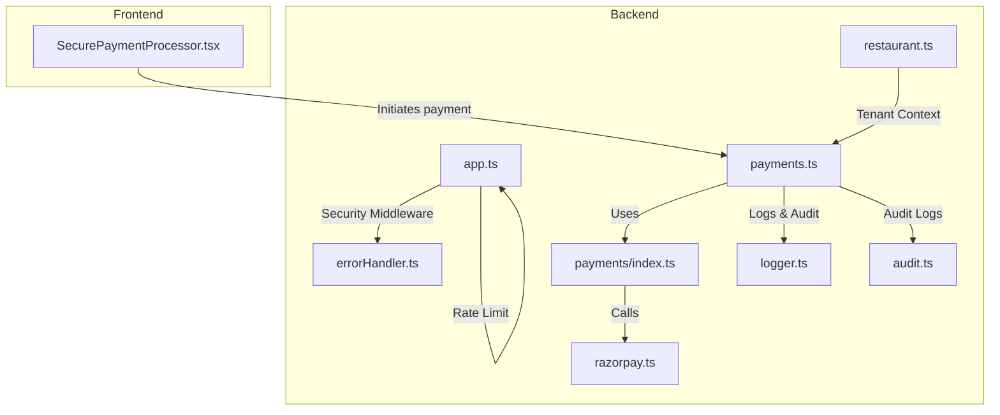
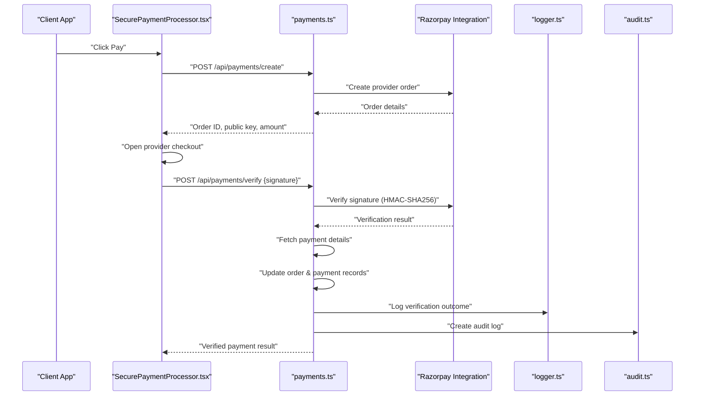
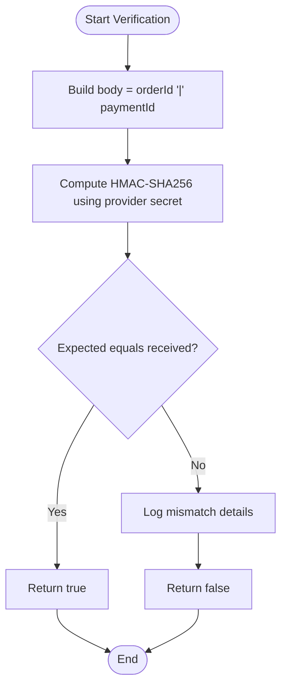
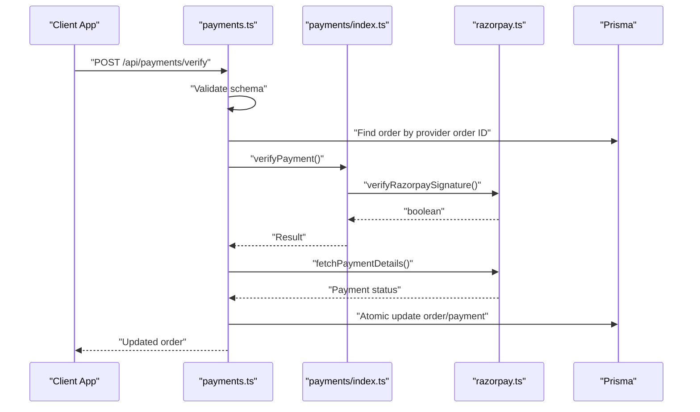
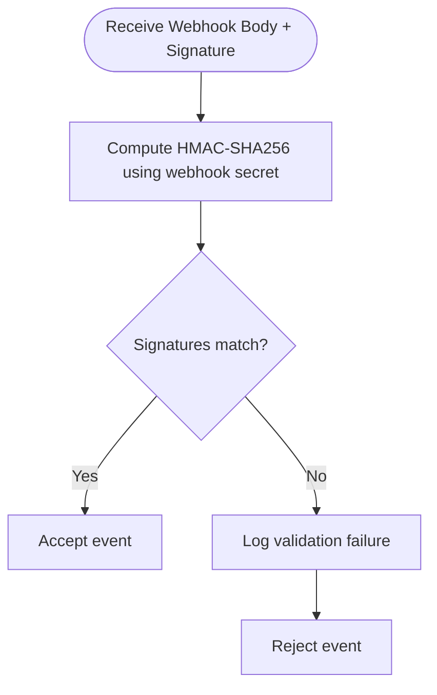
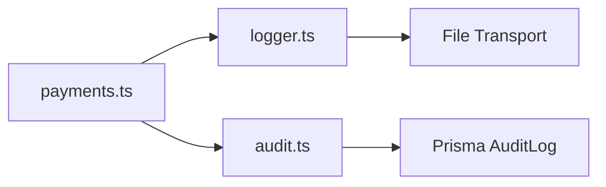
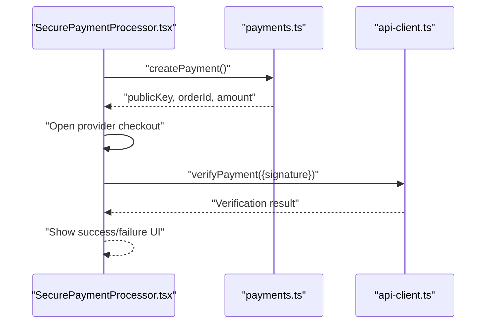
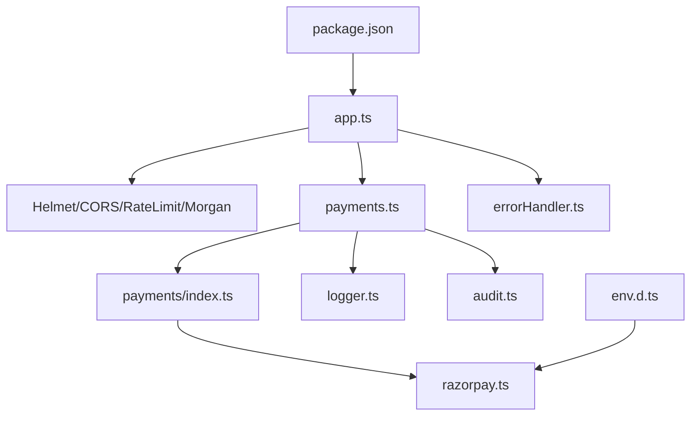

# Payment Verification & Security

<cite>
**Referenced Files in This Document**
- [payments.ts](file://restaurant-backend/src/routes/payments.ts)
- [payments/index.ts](file://restaurant-backend/src/lib/payments/index.ts)
- [razorpay.ts](file://restaurant-backend/src/lib/razorpay.ts)
- [errorHandler.ts](file://restaurant-backend/src/middleware/errorHandler.ts)
- [logger.ts](file://restaurant-backend/src/utils/logger.ts)
- [audit.ts](file://restaurant-backend/src/utils/audit.ts)
- [env.d.ts](file://restaurant-backend/src/types/env.d.ts)
- [app.ts](file://restaurant-backend/src/app.ts)
- [restaurant.ts](file://restaurant-backend/src/middleware/restaurant.ts)
- [SecurePaymentProcessor.tsx](file://restaurant-frontend/src/components/SecurePaymentProcessor.tsx)
- [package.json](file://restaurant-backend/package.json)
- [README.md](file://README.md)
</cite>

## Table of Contents
1. [Introduction](#introduction)
2. [Project Structure](#project-structure)
3. [Core Components](#core-components)
4. [Architecture Overview](#architecture-overview)
5. [Detailed Component Analysis](#detailed-component-analysis)
6. [Dependency Analysis](#dependency-analysis)
7. [Performance Considerations](#performance-considerations)
8. [Troubleshooting Guide](#troubleshooting-guide)
9. [Conclusion](#conclusion)
10. [Appendices](#appendices)

## Introduction
This document explains the payment verification and security implementation in DeQ-Bite. It focuses on the HMAC-SHA256 signature verification used to validate payment authenticity, the server-side payment verification workflow that prevents client-side tampering, the signature generation algorithm, comparison mechanisms, and security logging. It also covers webhook signature validation for incoming payment notifications, fraud prevention measures, signature mismatch detection, and security breach handling. Finally, it outlines security best practices, PCI compliance considerations, and data protection measures, along with the logging strategy for security events and monitoring suspicious activities.

## Project Structure
The payment security implementation spans the backend API routes, payment provider abstraction, Razorpay integration utilities, middleware, logging, and audit utilities. The frontend securely initiates payments and verifies outcomes server-side.

**Diagram sources**
- [app.ts:1-148](file://restaurant-backend/src/app.ts#L1-L148)
- [payments.ts:1-731](file://restaurant-backend/src/routes/payments.ts#L1-L731)
- [payments/index.ts:1-124](file://restaurant-backend/src/lib/payments/index.ts#L1-L124)
- [razorpay.ts:1-219](file://restaurant-backend/src/lib/razorpay.ts#L1-L219)
- [errorHandler.ts:1-82](file://restaurant-backend/src/middleware/errorHandler.ts#L1-L82)
- [logger.ts:1-56](file://restaurant-backend/src/utils/logger.ts#L1-L56)
- [audit.ts:1-17](file://restaurant-backend/src/utils/audit.ts#L1-L17)
- [restaurant.ts:1-246](file://restaurant-backend/src/middleware/restaurant.ts#L1-L246)
- [SecurePaymentProcessor.tsx:1-347](file://restaurant-frontend/src/components/SecurePaymentProcessor.tsx#L1-L347)

**Section sources**
- [app.ts:1-148](file://restaurant-backend/src/app.ts#L1-L148)
- [payments.ts:1-731](file://restaurant-backend/src/routes/payments.ts#L1-L731)
- [payments/index.ts:1-124](file://restaurant-backend/src/lib/payments/index.ts#L1-L124)
- [razorpay.ts:1-219](file://restaurant-backend/src/lib/razorpay.ts#L1-L219)
- [errorHandler.ts:1-82](file://restaurant-backend/src/middleware/errorHandler.ts#L1-L82)
- [logger.ts:1-56](file://restaurant-backend/src/utils/logger.ts#L1-L56)
- [audit.ts:1-17](file://restaurant-backend/src/utils/audit.ts#L1-L17)
- [restaurant.ts:1-246](file://restaurant-backend/src/middleware/restaurant.ts#L1-L246)
- [SecurePaymentProcessor.tsx:1-347](file://restaurant-frontend/src/components/SecurePaymentProcessor.tsx#L1-L347)

## Core Components
- Payment Provider Abstraction: Defines provider capabilities and enforces server-side verification for supported providers.
- Razorpay Integration: Implements HMAC-SHA256 signature verification, webhook validation, payment capture, and refund flows.
- Payment Routes: Orchestrates payment creation, verification, status updates, and refunds with strict validation and logging.
- Security Middleware: Enforces CORS, rate limiting, Helmet hardening, and centralized error handling.
- Logging and Audit: Structured logging for security-relevant events and safe audit log writes with schema mismatch resilience.

**Section sources**
- [payments/index.ts:1-124](file://restaurant-backend/src/lib/payments/index.ts#L1-L124)
- [razorpay.ts:1-219](file://restaurant-backend/src/lib/razorpay.ts#L1-L219)
- [payments.ts:1-731](file://restaurant-backend/src/routes/payments.ts#L1-L731)
- [app.ts:1-148](file://restaurant-backend/src/app.ts#L1-L148)
- [errorHandler.ts:1-82](file://restaurant-backend/src/middleware/errorHandler.ts#L1-L82)
- [logger.ts:1-56](file://restaurant-backend/src/utils/logger.ts#L1-L56)
- [audit.ts:1-17](file://restaurant-backend/src/utils/audit.ts#L1-L17)

## Architecture Overview
The payment flow ensures that clients cannot tamper with payment outcomes. The frontend initiates a payment via the backend, which creates a provider order and returns a client-configured checkout session. Upon completion, the client submits the signature to the backend for server-side verification. Only after successful verification is the order updated and audit logs recorded.

**Diagram sources**
- [payments.ts:195-407](file://restaurant-backend/src/routes/payments.ts#L195-L407)
- [payments/index.ts:40-81](file://restaurant-backend/src/lib/payments/index.ts#L40-L81)
- [razorpay.ts:65-105](file://restaurant-backend/src/lib/razorpay.ts#L65-L105)
- [logger.ts:1-56](file://restaurant-backend/src/utils/logger.ts#L1-L56)
- [audit.ts:5-16](file://restaurant-backend/src/utils/audit.ts#L5-L16)
- [SecurePaymentProcessor.tsx:83-206](file://restaurant-frontend/src/components/SecurePaymentProcessor.tsx#L83-L206)

## Detailed Component Analysis

### HMAC-SHA256 Signature Verification (Razorpay)
- Inputs: order ID, payment ID, and signature.
- Algorithm: Concatenate order ID and payment ID with a pipe separator, compute HMAC-SHA256 using the provider’s secret, compare with the received signature.
- Logging: Logs verification result and truncated signatures for security; logs mismatch details including lengths.

**Diagram sources**
- [razorpay.ts:65-105](file://restaurant-backend/src/lib/razorpay.ts#L65-L105)

**Section sources**
- [razorpay.ts:65-105](file://restaurant-backend/src/lib/razorpay.ts#L65-L105)

### Server-Side Payment Verification Workflow
- Route: POST /api/payments/verify validates inputs, finds the order by provider order ID and user/restaurant context, invokes provider verification, fetches payment details, updates order/payment records atomically, logs, and emits real-time events.
- Fraud Prevention: Rejects missing fields, invalid signatures, and non-success statuses; ensures order ownership and context; uses transactions to prevent inconsistent state.

**Diagram sources**
- [payments.ts:294-407](file://restaurant-backend/src/routes/payments.ts#L294-L407)
- [payments/index.ts:60-77](file://restaurant-backend/src/lib/payments/index.ts#L60-L77)
- [razorpay.ts:174-195](file://restaurant-backend/src/lib/razorpay.ts#L174-L195)

**Section sources**
- [payments.ts:294-407](file://restaurant-backend/src/routes/payments.ts#L294-L407)
- [payments/index.ts:60-77](file://restaurant-backend/src/lib/payments/index.ts#L60-L77)
- [razorpay.ts:174-195](file://restaurant-backend/src/lib/razorpay.ts#L174-L195)

### Webhook Signature Validation
- Validates incoming webhook payloads by computing HMAC-SHA256 over the raw body using the configured webhook secret and comparing with the provided signature.
- Logs failures for diagnostics.

**Diagram sources**
- [razorpay.ts:200-218](file://restaurant-backend/src/lib/razorpay.ts#L200-L218)

**Section sources**
- [razorpay.ts:200-218](file://restaurant-backend/src/lib/razorpay.ts#L200-L218)

### Security Logging and Audit
- Logging: Winston-based structured logs with timestamps and JSON formatting; file transport in non-serverless environments; sensitive data truncated in logs.
- Audit: Safe audit log creation with graceful handling for missing audit tables to avoid breaking core flows.

**Diagram sources**
- [payments.ts:376-388](file://restaurant-backend/src/routes/payments.ts#L376-L388)
- [logger.ts:1-56](file://restaurant-backend/src/utils/logger.ts#L1-L56)
- [audit.ts:5-16](file://restaurant-backend/src/utils/audit.ts#L5-L16)

**Section sources**
- [payments.ts:376-388](file://restaurant-backend/src/routes/payments.ts#L376-L388)
- [logger.ts:1-56](file://restaurant-backend/src/utils/logger.ts#L1-L56)
- [audit.ts:5-16](file://restaurant-backend/src/utils/audit.ts#L5-L16)

### Frontend Secure Payment Processor
- Initiates payment via backend, loads provider checkout script, and upon success races verification with a timeout to prevent hanging UI states.
- Provides user feedback during verification and handles signature mismatches and timeouts gracefully.

**Diagram sources**
- [SecurePaymentProcessor.tsx:83-206](file://restaurant-frontend/src/components/SecurePaymentProcessor.tsx#L83-L206)
- [payments.ts:294-407](file://restaurant-backend/src/routes/payments.ts#L294-L407)

**Section sources**
- [SecurePaymentProcessor.tsx:83-206](file://restaurant-frontend/src/components/SecurePaymentProcessor.tsx#L83-L206)
- [payments.ts:294-407](file://restaurant-backend/src/routes/payments.ts#L294-L407)

## Dependency Analysis
- Express app applies Helmet, CORS, rate limiting, and Morgan for logging.
- Payment routes depend on provider abstraction and Razorpay utilities.
- Error handling centralizes API errors and logs request context.
- Environment variables define secrets and keys for providers and logging.

**Diagram sources**
- [app.ts:1-148](file://restaurant-backend/src/app.ts#L1-L148)
- [payments.ts:1-731](file://restaurant-backend/src/routes/payments.ts#L1-L731)
- [payments/index.ts:1-124](file://restaurant-backend/src/lib/payments/index.ts#L1-L124)
- [razorpay.ts:1-219](file://restaurant-backend/src/lib/razorpay.ts#L1-L219)
- [errorHandler.ts:1-82](file://restaurant-backend/src/middleware/errorHandler.ts#L1-L82)
- [logger.ts:1-56](file://restaurant-backend/src/utils/logger.ts#L1-L56)
- [audit.ts:1-17](file://restaurant-backend/src/utils/audit.ts#L1-L17)
- [env.d.ts:1-32](file://restaurant-backend/src/types/env.d.ts#L1-L32)
- [package.json:1-80](file://restaurant-backend/package.json#L1-L80)

**Section sources**
- [app.ts:1-148](file://restaurant-backend/src/app.ts#L1-L148)
- [payments.ts:1-731](file://restaurant-backend/src/routes/payments.ts#L1-L731)
- [payments/index.ts:1-124](file://restaurant-backend/src/lib/payments/index.ts#L1-L124)
- [razorpay.ts:1-219](file://restaurant-backend/src/lib/razorpay.ts#L1-L219)
- [errorHandler.ts:1-82](file://restaurant-backend/src/middleware/errorHandler.ts#L1-L82)
- [logger.ts:1-56](file://restaurant-backend/src/utils/logger.ts#L1-L56)
- [audit.ts:1-17](file://restaurant-backend/src/utils/audit.ts#L1-L17)
- [env.d.ts:1-32](file://restaurant-backend/src/types/env.d.ts#L1-L32)
- [package.json:1-80](file://restaurant-backend/package.json#L1-L80)

## Performance Considerations
- Transactional Updates: Atomic order and payment updates reduce retries and race conditions.
- Logging Overhead: Structured JSON logs minimize parsing overhead; file rotation limits disk usage.
- Timeout Handling: Frontend verification timeout prevents UI hangs; backend verification is synchronous and logged for observability.
- Provider Calls: Timing logs around provider calls help identify latency hotspots.

[No sources needed since this section provides general guidance]

## Troubleshooting Guide
- Signature Mismatch:
  - Symptom: Verification fails with mismatch logs.
  - Actions: Confirm provider secret correctness, ensure body concatenation order, and verify the exact signature value.
- Payment Not Successful:
  - Symptom: Non-success status after verification.
  - Actions: Check provider dashboard for status; ensure capture/refund flows align with provider policies.
- Missing Fields:
  - Symptom: Validation errors for missing order/payment/signature fields.
  - Actions: Ensure frontend sends all required fields and backend schema matches.
- Audit Log Table Missing:
  - Symptom: Warning about missing audit table; logs skipped.
  - Actions: Run migrations to create audit log table; otherwise, core flows continue unaffected.
- Webhook Validation Failures:
  - Symptom: Webhooks rejected due to signature mismatch.
  - Actions: Verify webhook secret and ensure raw body is used for signature computation.

**Section sources**
- [razorpay.ts:87-104](file://restaurant-backend/src/lib/razorpay.ts#L87-L104)
- [payments.ts:326-374](file://restaurant-backend/src/routes/payments.ts#L326-L374)
- [audit.ts:9-14](file://restaurant-backend/src/utils/audit.ts#L9-L14)
- [razorpay.ts:212-217](file://restaurant-backend/src/lib/razorpay.ts#L212-L217)

## Conclusion
DeQ-Bite’s payment verification relies on server-side HMAC-SHA256 signature validation and robust provider integration. The workflow prevents client-side tampering by validating signatures and payment statuses before updating orders. Structured logging and audit trails support incident investigation and compliance. Additional security measures like CORS, rate limiting, and Helmet hardening further protect the system.

[No sources needed since this section summarizes without analyzing specific files]

## Appendices

### Security Best Practices
- Secrets Management: Store provider keys and webhook secrets in environment variables; rotate regularly.
- Input Validation: Use schema validation for all endpoints; enforce strict types.
- Least Privilege: Restrict access to payment-sensitive endpoints; require authentication and role checks.
- Logging Sanitization: Avoid logging sensitive data; truncate or redact where necessary.
- Monitoring: Track signature mismatches, verification failures, and webhook rejections.

[No sources needed since this section provides general guidance]

### PCI Compliance Considerations
- Tokenization and Direct APIs: Use provider APIs directly; avoid storing cardholder data.
- Encryption: Ensure TLS termination at ingress; enforce HTTPS.
- Auditability: Maintain logs of payment events and verification outcomes.
- Data Retention: Define retention policies for logs and invoices; securely purge when required.

[No sources needed since this section provides general guidance]

### Data Protection Measures
- Environment Variables: Define secrets in environment types and guard production deployments.
- Tenant Isolation: Middleware attaches restaurant context to requests to scope data access.
- File Storage: Secure PDF generation and controlled access to invoices.

**Section sources**
- [env.d.ts:1-32](file://restaurant-backend/src/types/env.d.ts#L1-L32)
- [restaurant.ts:76-200](file://restaurant-backend/src/middleware/restaurant.ts#L76-L200)
- [payments.ts:103-144](file://restaurant-backend/src/routes/payments.ts#L103-L144)