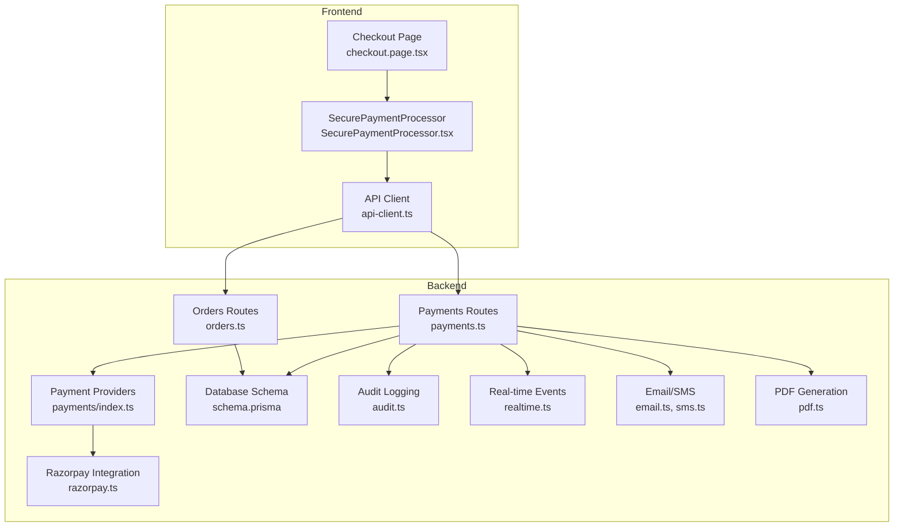
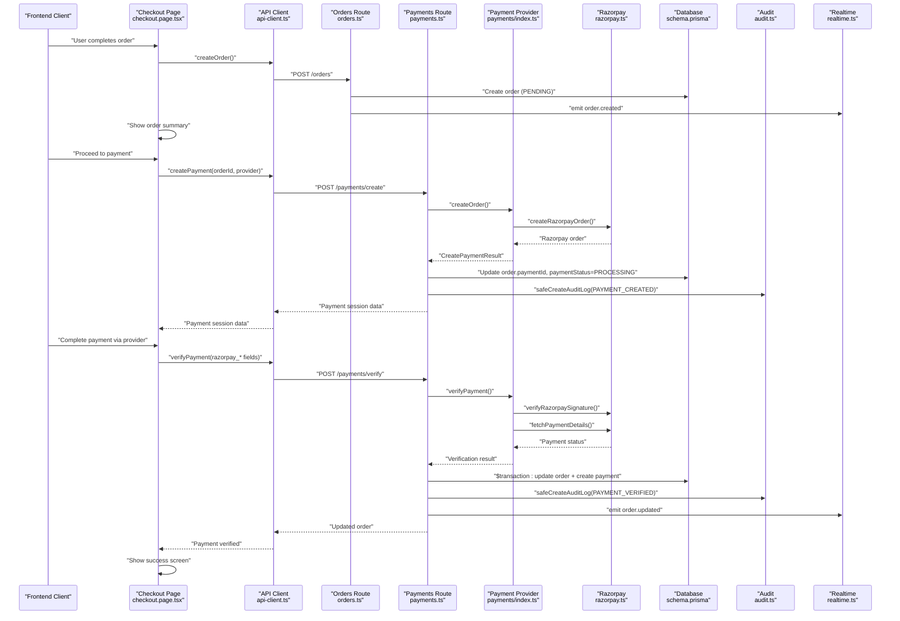
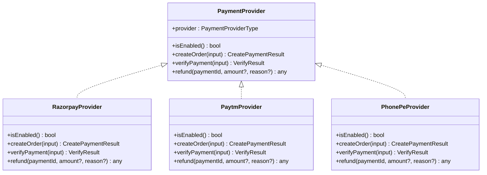
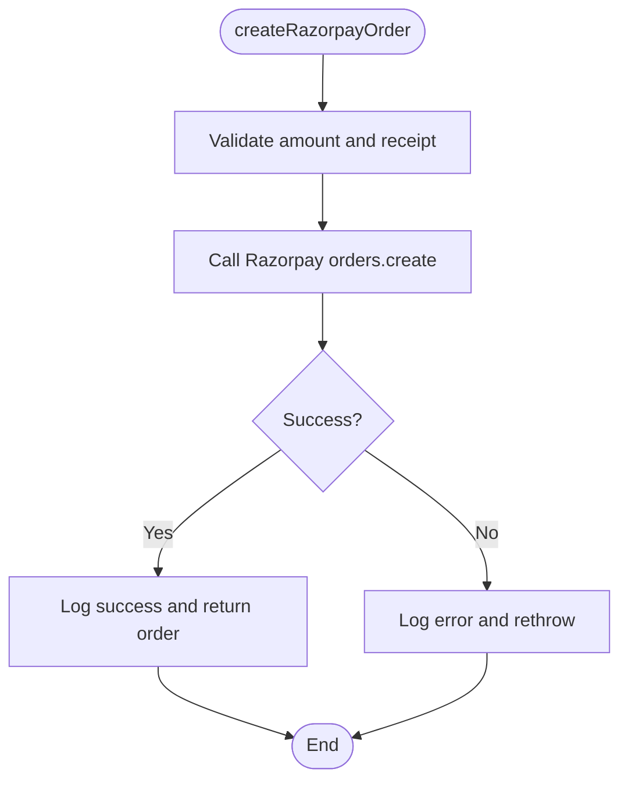
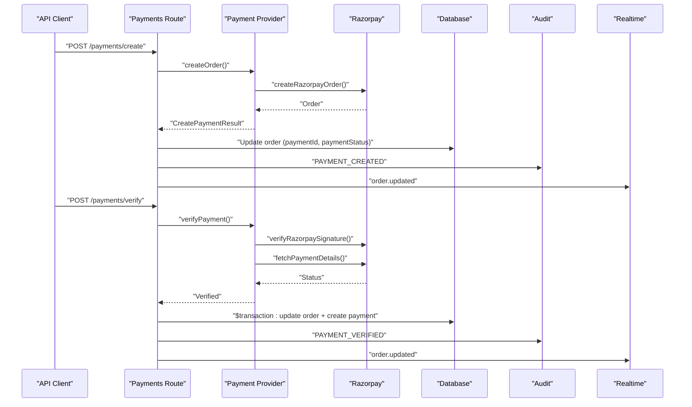
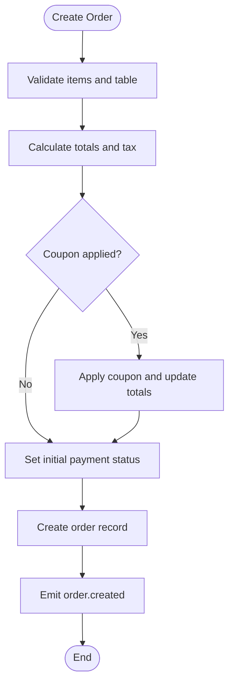
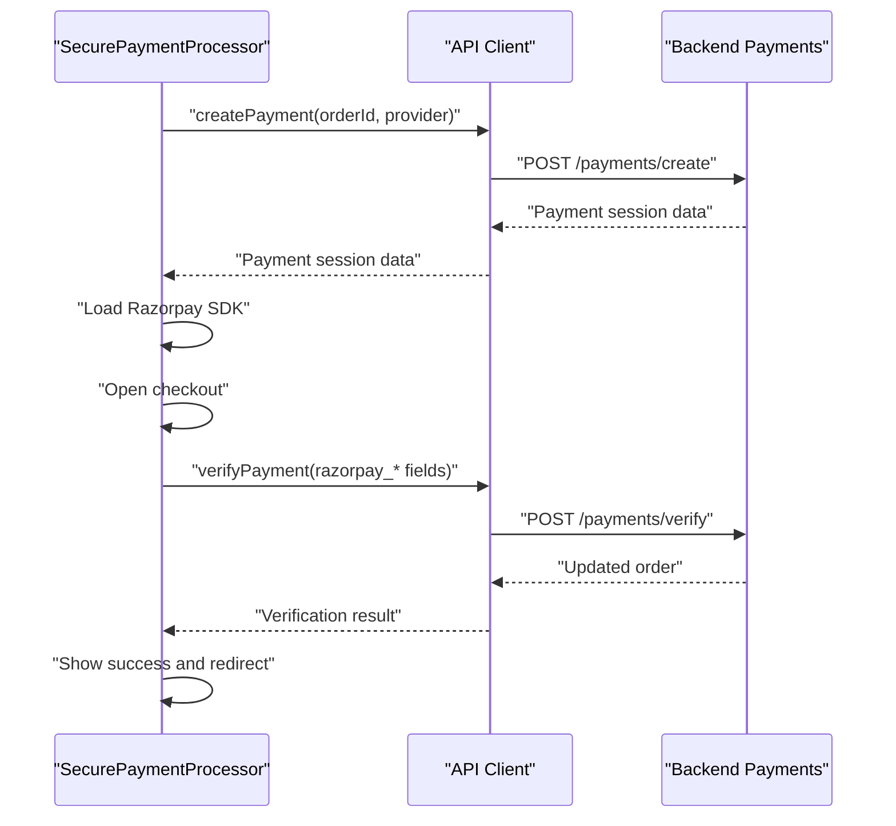
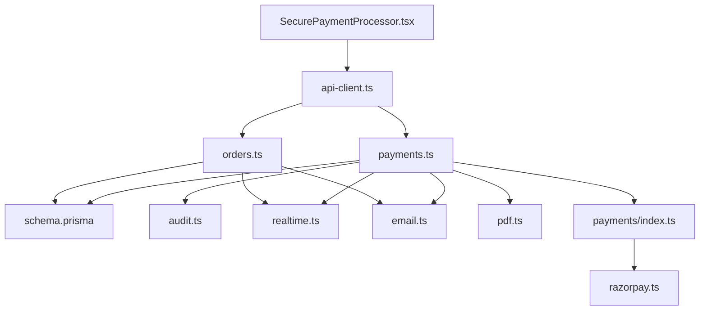

# Payment Workflow & Transaction Management

<cite>
**Referenced Files in This Document**
- [payments.ts](file://restaurant-backend/src/routes/payments.ts)
- [orders.ts](file://restaurant-backend/src/routes/orders.ts)
- [index.ts](file://restaurant-backend/src/lib/payments/index.ts)
- [razorpay.ts](file://restaurant-backend/src/lib/razorpay.ts)
- [audit.ts](file://restaurant-backend/src/utils/audit.ts)
- [audit.ts](file://restaurant-backend/src/utils/audit.ts)
- [realtime.ts](file://restaurant-backend/src/utils/realtime.ts)
- [email.ts](file://restaurant-backend/src/lib/email.ts)
- [pdf.ts](file://restaurant-backend/src/lib/pdf.ts)
- [schema.prisma](file://restaurant-backend/prisma/schema.prisma)
- [api-client.ts](file://restaurant-frontend/src/lib/api-client.ts)
- [SecurePaymentProcessor.tsx](file://restaurant-frontend/src/components/SecurePaymentProcessor.tsx)
- [checkout.page.tsx](file://restaurant-frontend/src/app/checkout/page.tsx)
- [errorHandler.ts](file://restaurant-backend/src/middleware/errorHandler.ts)
</cite>

## Table of Contents
1. [Introduction](#introduction)
2. [Project Structure](#project-structure)
3. [Core Components](#core-components)
4. [Architecture Overview](#architecture-overview)
5. [Detailed Component Analysis](#detailed-component-analysis)
6. [Dependency Analysis](#dependency-analysis)
7. [Performance Considerations](#performance-considerations)
8. [Troubleshooting Guide](#troubleshooting-guide)
9. [Conclusion](#conclusion)

## Introduction
This document explains the complete payment workflow and transaction management system in DeQ-Bite. It covers the end-to-end flow from order creation through payment completion and order confirmation, including payment initiation, verification, capture, and completion. It also documents payment status tracking, state management, error recovery mechanisms, frontend-backend integration, order updates, inventory coordination, notifications, transaction rollbacks, timeouts, retries, audit trails, and compliance considerations.

## Project Structure
The payment system spans both backend and frontend:
- Backend (Express + Prisma): Payment routes, provider abstraction, Razorpay integration, audit logging, real-time events, and invoice generation.
- Frontend (Next.js): Payment UI, secure payment processor, order checkout flow, and API client integration.

**Diagram sources**
- [checkout.page.tsx](file://restaurant-frontend/src/app/checkout/page.tsx#L13)
- [SecurePaymentProcessor.tsx](file://restaurant-frontend/src/components/SecurePaymentProcessor.tsx#L72)
- [api-client.ts](file://restaurant-frontend/src/lib/api-client.ts#L380)
- [orders.ts](file://restaurant-backend/src/routes/orders.ts#L82)
- [payments.ts](file://restaurant-backend/src/routes/payments.ts#L195)
- [index.ts](file://restaurant-backend/src/lib/payments/index.ts#L40)
- [razorpay.ts](file://restaurant-backend/src/lib/razorpay.ts#L33)
- [schema.prisma](file://restaurant-backend/prisma/schema.prisma#L162)
- [audit.ts](file://restaurant-backend/src/utils/audit.ts#L5)
- [realtime.ts](file://restaurant-backend/src/utils/realtime.ts#L12)
- [email.ts](file://restaurant-backend/src/lib/email.ts#L31)
- [pdf.ts](file://restaurant-backend/src/lib/pdf.ts#L37)

**Section sources**
- [orders.ts:82-267](file://restaurant-backend/src/routes/orders.ts#L82-L267)
- [payments.ts:195-407](file://restaurant-backend/src/routes/payments.ts#L195-L407)
- [index.ts:40-81](file://restaurant-backend/src/lib/payments/index.ts#L40-L81)
- [razorpay.ts:33-105](file://restaurant-backend/src/lib/razorpay.ts#L33-L105)
- [schema.prisma:162-296](file://restaurant-backend/prisma/schema.prisma#L162-L296)
- [api-client.ts:380-440](file://restaurant-frontend/src/lib/api-client.ts#L380-L440)
- [SecurePaymentProcessor.tsx:83-152](file://restaurant-frontend/src/components/SecurePaymentProcessor.tsx#L83-L152)

## Core Components
- Payment Provider Abstraction: Defines a unified interface for payment providers (currently Razorpay implemented, others stubbed).
- Razorpay Integration: Handles order creation, signature verification, payment capture, refunds, and webhook validation.
- Payments Route: Orchestrates payment creation, verification, cash confirmation, status updates, and refund processing with atomic transactions.
- Orders Route: Manages order lifecycle, including creation, item addition, coupon application, and status transitions.
- Audit Logging: Records payment actions for compliance and troubleshooting.
- Real-time Events: Emits order/payment updates to subscribed clients.
- Notifications: Email/SMS for invoices and order confirmations.
- PDF Generation: Creates invoices for paid orders.

**Section sources**
- [index.ts:32-81](file://restaurant-backend/src/lib/payments/index.ts#L32-L81)
- [razorpay.ts:33-195](file://restaurant-backend/src/lib/razorpay.ts#L33-L195)
- [payments.ts:195-728](file://restaurant-backend/src/routes/payments.ts#L195-L728)
- [orders.ts:82-694](file://restaurant-backend/src/routes/orders.ts#L82-L694)
- [audit.ts:5-16](file://restaurant-backend/src/utils/audit.ts#L5-L16)
- [realtime.ts:12-22](file://restaurant-backend/src/utils/realtime.ts#L12-L22)
- [email.ts:31-61](file://restaurant-backend/src/lib/email.ts#L31-L61)
- [pdf.ts:37-187](file://restaurant-backend/src/lib/pdf.ts#L37-L187)

## Architecture Overview
The payment workflow integrates frontend and backend components:
- Frontend collects order details, selects payment method, and initiates secure payment.
- Backend creates a provider-specific payment order and updates order payment status.
- After payment verification, backend atomically updates order and payment records, generates invoices/earnings, emits real-time events, and logs audit entries.
- Frontend displays payment status and provides invoice download.

**Diagram sources**
- [checkout.page.tsx:142-222](file://restaurant-frontend/src/app/checkout/page.tsx#L142-L222)
- [api-client.ts:380-440](file://restaurant-frontend/src/lib/api-client.ts#L380-L440)
- [orders.ts:82-267](file://restaurant-backend/src/routes/orders.ts#L82-L267)
- [payments.ts:195-407](file://restaurant-backend/src/routes/payments.ts#L195-L407)
- [index.ts:40-81](file://restaurant-backend/src/lib/payments/index.ts#L40-L81)
- [razorpay.ts:65-105](file://restaurant-backend/src/lib/razorpay.ts#L65-L105)
- [audit.ts:5-16](file://restaurant-backend/src/utils/audit.ts#L5-L16)
- [realtime.ts:12-22](file://restaurant-backend/src/utils/realtime.ts#L12-L22)

## Detailed Component Analysis

### Payment Provider Abstraction
Implements a provider-agnostic interface for payment processing. Currently supports:
- RAZORPAY: Fully implemented with order creation, signature verification, payment details retrieval, and refunds.
- PAYTM/PHONEPE: Stubs indicating unimplemented integrations.
- Provider selection logic ensures only enabled providers are used.

**Diagram sources**
- [index.ts:32-115](file://restaurant-backend/src/lib/payments/index.ts#L32-L115)

**Section sources**
- [index.ts:32-124](file://restaurant-backend/src/lib/payments/index.ts#L32-L124)

### Razorpay Integration
Handles provider-specific operations:
- Order creation with amount, currency, receipt, and notes.
- Signature verification using HMAC-SHA256.
- Payment capture and refund processing.
- Webhook signature validation.

**Diagram sources**
- [razorpay.ts:33-60](file://restaurant-backend/src/lib/razorpay.ts#L33-L60)

**Section sources**
- [razorpay.ts:33-195](file://restaurant-backend/src/lib/razorpay.ts#L33-L195)

### Payments Route: End-to-End Flow
Manages payment lifecycle:
- Create Payment: Validates order, selects provider, creates provider order, updates order payment fields, logs audit, and emits real-time events.
- Verify Payment: Confirms payment via provider, computes status, performs atomic order/payment updates, generates invoice/earnings, logs audit, and emits real-time events.
- Cash Confirmation: Manual cash payment confirmation by authorized users with audit logging and invoice/earnings generation.
- Refund: Processes refunds via provider, updates order/payment records, logs audit, and emits real-time events.
- Status Updates: Admin-controlled payment status updates with audit logging and invoice/earnings generation when completed.

**Diagram sources**
- [payments.ts:195-407](file://restaurant-backend/src/routes/payments.ts#L195-L407)
- [index.ts:40-81](file://restaurant-backend/src/lib/payments/index.ts#L40-L81)
- [razorpay.ts:65-105](file://restaurant-backend/src/lib/razorpay.ts#L65-L105)

**Section sources**
- [payments.ts:195-728](file://restaurant-backend/src/routes/payments.ts#L195-L728)

### Orders Route: Order Lifecycle
Creates orders, manages items, applies coupons, and controls status transitions:
- Order Creation: Validates items, calculates totals, applies coupons, sets initial payment status based on restaurant policy and payment method.
- Add Items: Adds new items to ongoing orders, recalculates totals, and updates payment status.
- Apply Coupon: Replaces coupon on unpaid orders and recalculates totals.
- Status Transitions: Enforces payment completion for "before-meal" restaurants before advancing order status.

**Diagram sources**
- [orders.ts:82-267](file://restaurant-backend/src/routes/orders.ts#L82-L267)

**Section sources**
- [orders.ts:82-694](file://restaurant-backend/src/routes/orders.ts#L82-L694)

### Frontend Integration: Secure Payment Processor
- Initiates payment by calling backend createPayment endpoint.
- Loads Razorpay SDK dynamically and opens checkout.
- Verifies payment with backend verifyPayment endpoint.
- Implements timeout handling during verification.
- Provides user feedback and navigation to order summary.

**Diagram sources**
- [SecurePaymentProcessor.tsx:83-206](file://restaurant-frontend/src/components/SecurePaymentProcessor.tsx#L83-L206)
- [api-client.ts:380-440](file://restaurant-frontend/src/lib/api-client.ts#L380-L440)
- [payments.ts:294-407](file://restaurant-backend/src/routes/payments.ts#L294-L407)

**Section sources**
- [SecurePaymentProcessor.tsx:72-347](file://restaurant-frontend/src/components/SecurePaymentProcessor.tsx#L72-L347)
- [api-client.ts:380-440](file://restaurant-frontend/src/lib/api-client.ts#L380-L440)

### Audit Trail and Compliance
- Audit logs are written for payment actions (creation, verification, refund, status updates).
- Safe logging handles missing audit table gracefully to avoid breaking core flows.
- Logs include actor, restaurant, action, entity, and metadata for traceability.

**Section sources**
- [audit.ts:5-16](file://restaurant-backend/src/utils/audit.ts#L5-L16)
- [payments.ts:376-481](file://restaurant-backend/src/routes/payments.ts#L376-L481)

### Notifications and Invoicing
- Invoices are generated for fully paid orders, including PDF creation and storage.
- Email/SMS notifications can be sent for invoices and order confirmations.
- PDF generation uses jsPDF with standardized receipts.

**Section sources**
- [payments.ts:61-166](file://restaurant-backend/src/routes/payments.ts#L61-L166)
- [pdf.ts:37-187](file://restaurant-backend/src/lib/pdf.ts#L37-L187)
- [email.ts:31-61](file://restaurant-backend/src/lib/email.ts#L31-L61)

## Dependency Analysis
Payment components depend on:
- Database models for orders, payments, invoices, and audit logs.
- Provider libraries for payment processing.
- Real-time utilities for event broadcasting.
- Utility libraries for logging, PDF generation, and notifications.

**Diagram sources**
- [payments.ts:1-14](file://restaurant-backend/src/routes/payments.ts#L1-L14)
- [orders.ts:1-9](file://restaurant-backend/src/routes/orders.ts#L1-L9)
- [schema.prisma:162-324](file://restaurant-backend/prisma/schema.prisma#L162-L324)
- [audit.ts:1-16](file://restaurant-backend/src/utils/audit.ts#L1-L16)
- [realtime.ts:1-22](file://restaurant-backend/src/utils/realtime.ts#L1-L22)
- [email.ts:1-61](file://restaurant-backend/src/lib/email.ts#L1-L61)
- [pdf.ts:1-30](file://restaurant-backend/src/lib/pdf.ts#L1-L30)
- [index.ts:1-10](file://restaurant-backend/src/lib/payments/index.ts#L1-L10)
- [razorpay.ts:1-21](file://restaurant-backend/src/lib/razorpay.ts#L1-L21)
- [api-client.ts:1-10](file://restaurant-frontend/src/lib/api-client.ts#L1-L10)
- [SecurePaymentProcessor.tsx:1-18](file://restaurant-frontend/src/components/SecurePaymentProcessor.tsx#L1-L18)

**Section sources**
- [payments.ts:1-14](file://restaurant-backend/src/routes/payments.ts#L1-L14)
- [orders.ts:1-9](file://restaurant-backend/src/routes/orders.ts#L1-L9)
- [schema.prisma:162-324](file://restaurant-backend/prisma/schema.prisma#L162-L324)

## Performance Considerations
- Atomic Transactions: Payment verification and order updates are wrapped in database transactions to maintain consistency.
- Timeout Handling: Frontend enforces a 25-second timeout for payment verification to prevent hanging UI.
- Asynchronous Handlers: Backend uses async handlers to safely wrap route functions and propagate errors.
- Real-time Updates: Event emission minimizes polling and keeps clients updated efficiently.
- PDF Generation: Buffered generation avoids blocking the main thread; storage writes occur after buffer creation.

[No sources needed since this section provides general guidance]

## Troubleshooting Guide
Common issues and resolutions:
- Payment Verification Failures: Validate signature and payment status; ensure provider credentials are configured; check backend logs for detailed errors.
- Order Not Found: Confirm order ownership and restaurant association; verify payment reference matching.
- Payment Already Verified: Handle idempotent verification responses gracefully.
- Cash Payment Confirmation: Ensure admin authorization and correct payment timing per restaurant policy.
- Audit Log Table Missing: Safe logging prevents failures when audit tables are not initialized.
- Network Timeouts: Implement retry logic on the frontend with user feedback; adjust backend timeouts as needed.

**Section sources**
- [payments.ts:294-407](file://restaurant-backend/src/routes/payments.ts#L294-L407)
- [payments.ts:570-646](file://restaurant-backend/src/routes/payments.ts#L570-L646)
- [audit.ts:5-16](file://restaurant-backend/src/utils/audit.ts#L5-L16)
- [errorHandler.ts:22-76](file://restaurant-backend/src/middleware/errorHandler.ts#L22-L76)
- [SecurePaymentProcessor.tsx:158-206](file://restaurant-frontend/src/components/SecurePaymentProcessor.tsx#L158-L206)

## Conclusion
DeQ-Bite’s payment system provides a robust, provider-agnostic framework with strong transaction guarantees, real-time updates, comprehensive audit logging, and seamless frontend integration. The modular design enables easy extension to additional payment providers while maintaining strict state management, error handling, and compliance-ready audit trails.