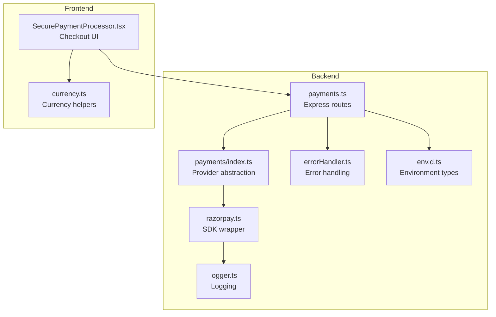
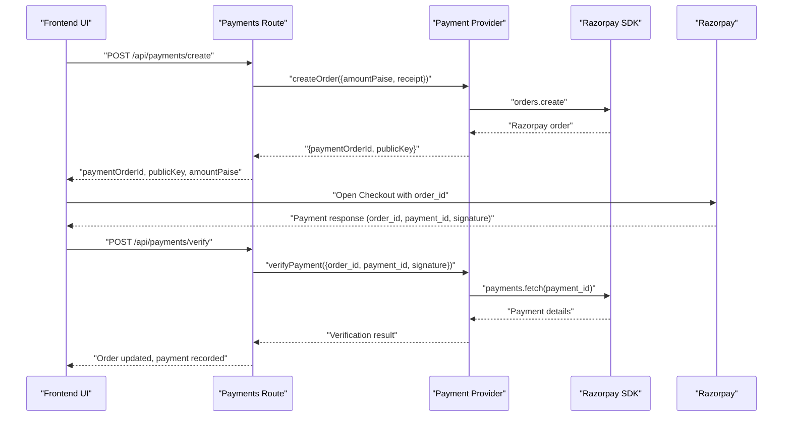
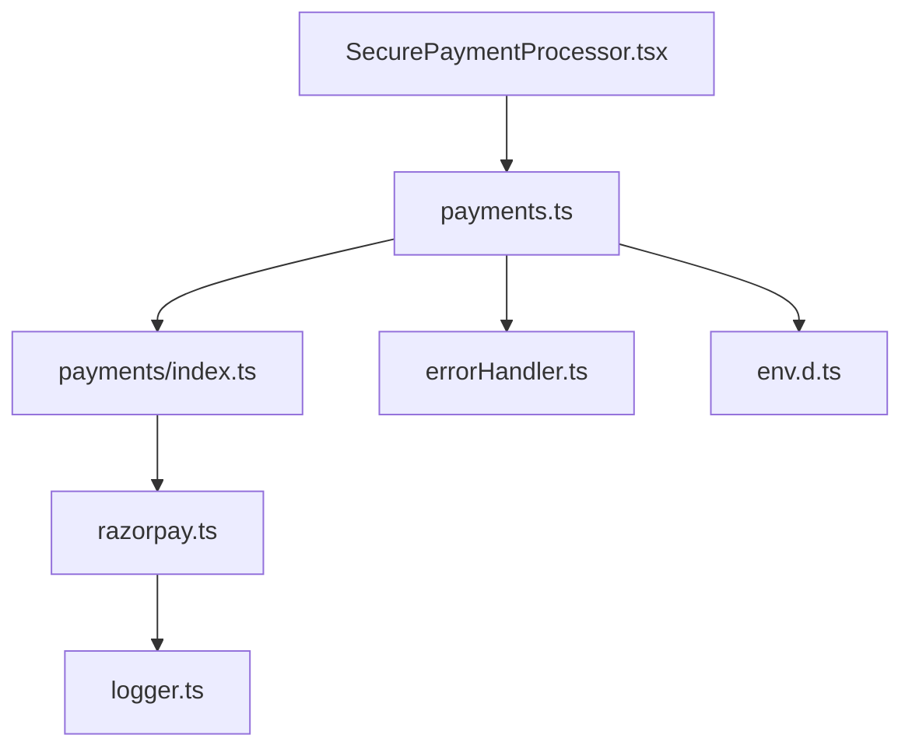

# Razorpay Integration

<cite>
**Referenced Files in This Document**
- [razorpay.ts](file://restaurant-backend/src/lib/razorpay.ts)
- [payments.ts](file://restaurant-backend/src/routes/payments.ts)
- [index.ts](file://restaurant-backend/src/lib/payments/index.ts)
- [errorHandler.ts](file://restaurant-backend/src/middleware/errorHandler.ts)
- [logger.ts](file://restaurant-backend/src/utils/logger.ts)
- [SecurePaymentProcessor.tsx](file://restaurant-frontend/src/components/SecurePaymentProcessor.tsx)
- [currency.ts](file://restaurant-frontend/src/lib/currency.ts)
- [env.d.ts](file://restaurant-backend/src/types/env.d.ts)
- [package.json](file://restaurant-backend/package.json)
</cite>

## Table of Contents
1. [Introduction](#introduction)
2. [Project Structure](#project-structure)
3. [Core Components](#core-components)
4. [Architecture Overview](#architecture-overview)
5. [Detailed Component Analysis](#detailed-component-analysis)
6. [Dependency Analysis](#dependency-analysis)
7. [Performance Considerations](#performance-considerations)
8. [Troubleshooting Guide](#troubleshooting-guide)
9. [Conclusion](#conclusion)

## Introduction
This document explains the Razorpay payment gateway integration in DeQ-Bite. It covers SDK initialization and instance management, order creation with amount conversion and receipt generation, payment verification and capture, refund processing, and webhook signature validation. It also documents error handling, logging, and performance monitoring, along with security implications for each integration point.

## Project Structure
The Razorpay integration spans backend and frontend modules:
- Backend: Payment provider abstraction, Razorpay SDK wrapper, Express routes, error handling, and logging.
- Frontend: Secure payment UI component integrating with Razorpay Checkout.

**Diagram sources**
- [payments.ts](file://restaurant-backend/src/routes/payments.ts#L1-L731)
- [index.ts](file://restaurant-backend/src/lib/payments/index.ts#L1-L124)
- [razorpay.ts](file://restaurant-backend/src/lib/razorpay.ts#L1-L219)
- [errorHandler.ts](file://restaurant-backend/src/middleware/errorHandler.ts#L1-L82)
- [logger.ts](file://restaurant-backend/src/utils/logger.ts#L1-L56)
- [env.d.ts](file://restaurant-backend/src/types/env.d.ts#L1-L32)
- [SecurePaymentProcessor.tsx](file://restaurant-frontend/src/components/SecurePaymentProcessor.tsx#L1-L347)
- [currency.ts](file://restaurant-frontend/src/lib/currency.ts#L1-L12)

**Section sources**
- [payments.ts](file://restaurant-backend/src/routes/payments.ts#L1-L731)
- [index.ts](file://restaurant-backend/src/lib/payments/index.ts#L1-L124)
- [razorpay.ts](file://restaurant-backend/src/lib/razorpay.ts#L1-L219)
- [errorHandler.ts](file://restaurant-backend/src/middleware/errorHandler.ts#L1-L82)
- [logger.ts](file://restaurant-backend/src/utils/logger.ts#L1-L56)
- [env.d.ts](file://restaurant-backend/src/types/env.d.ts#L1-L32)
- [SecurePaymentProcessor.tsx](file://restaurant-frontend/src/components/SecurePaymentProcessor.tsx#L1-L347)
- [currency.ts](file://restaurant-frontend/src/lib/currency.ts#L1-L12)

## Core Components
- Razorpay SDK wrapper: Initializes the SDK once, exposes order creation, signature verification, payment capture, refunds, payment fetch, and webhook signature validation.
- Provider abstraction: Exposes a unified interface for payment providers and selects Razorpay based on configuration.
- Express routes: Handles payment creation, verification, refund, status checks, and cash confirmation.
- Frontend checkout: Integrates Razorpay Checkout, collects payment response, and verifies with backend.

Key responsibilities:
- Amount conversion: Backend uses paise internally; frontend converts to rupees for display.
- Currency handling: Defaults to INR for orders and payments.
- Receipt generation: Uses order-specific receipts for traceability.
- Security: Signature verification for payments and webhooks; HMAC-SHA256 validation.

**Section sources**
- [razorpay.ts](file://restaurant-backend/src/lib/razorpay.ts#L1-L219)
- [index.ts](file://restaurant-backend/src/lib/payments/index.ts#L1-L124)
- [payments.ts](file://restaurant-backend/src/routes/payments.ts#L1-L731)
- [SecurePaymentProcessor.tsx](file://restaurant-frontend/src/components/SecurePaymentProcessor.tsx#L1-L347)
- [currency.ts](file://restaurant-frontend/src/lib/currency.ts#L1-L12)

## Architecture Overview
End-to-end payment flow from frontend to backend and Razorpay:

**Diagram sources**
- [payments.ts](file://restaurant-backend/src/routes/payments.ts#L195-L407)
- [index.ts](file://restaurant-backend/src/lib/payments/index.ts#L40-L81)
- [razorpay.ts](file://restaurant-backend/src/lib/razorpay.ts#L33-L60)
- [SecurePaymentProcessor.tsx](file://restaurant-frontend/src/components/SecurePaymentProcessor.tsx#L83-L152)

## Detailed Component Analysis

### Razorpay SDK Initialization and Instance Management
- Singleton pattern: Lazily creates a single Razorpay instance using environment credentials.
- Environment validation: Throws if keys are missing.
- Reuse: Subsequent calls return the cached instance.

Security and reliability:
- Credentials are loaded from environment variables.
- One instance prevents redundant SDK initialization.

**Section sources**
- [razorpay.ts](file://restaurant-backend/src/lib/razorpay.ts#L7-L19)
- [env.d.ts](file://restaurant-backend/src/types/env.d.ts#L10-L11)

### Order Creation and Amount Handling
- Input: Requires amount in paise, receipt, optional currency (defaults to INR), and notes.
- Backend amount conversion: Rounds to integer paise before calling SDK.
- Receipt generation: Uses a unique receipt per order for traceability.
- Response: Returns paymentOrderId, amountPaise, currency, and publicKey.

Frontend integration:
- Converts total to rupees for display using currency helpers.
- Passes order total in paise to backend.

**Section sources**
- [razorpay.ts](file://restaurant-backend/src/lib/razorpay.ts#L23-L60)
- [payments.ts](file://restaurant-backend/src/routes/payments.ts#L244-L254)
- [currency.ts](file://restaurant-backend/src/lib/currency.ts#L11-L12)
- [SecurePaymentProcessor.tsx](file://restaurant-frontend/src/components/SecurePaymentProcessor.tsx#L311-L313)

### Payment Verification and Capture
- Signature verification: Validates HMAC-SHA256 using order_id|payment_id against stored key secret.
- Payment fetch: Confirms payment status via SDK.
- Capture: Manual capture supported via SDK; refund processing available.

Backend flow:
- Routes validate order ownership and status.
- Calls provider verifyPayment which validates signature and payment status.
- Updates order payment status and records payment.

Frontend flow:
- Opens Razorpay Checkout with returned order_id and publicKey.
- On success, sends payment_id and signature to backend for verification.

Security:
- Signature mismatch triggers error handling.
- Payment status checked to ensure authorized or captured.

**Section sources**
- [index.ts](file://restaurant-backend/src/lib/payments/index.ts#L60-L77)
- [razorpay.ts](file://restaurant-backend/src/lib/razorpay.ts#L65-L105)
- [payments.ts](file://restaurant-backend/src/routes/payments.ts#L294-L407)
- [SecurePaymentProcessor.tsx](file://restaurant-frontend/src/components/SecurePaymentProcessor.tsx#L117-L144)

### Refund Processing
- Backend: Converts rupee amount to paise, constructs refund payload, calls SDK refund.
- Transaction: Updates order status and records negative payment entry.
- Notes: Optional reason stored in refund notes.

Security:
- Requires existing paymentTransactionId on order.
- Validates order state for completed/partially paid.

**Section sources**
- [payments.ts](file://restaurant-backend/src/routes/payments.ts#L409-L516)
- [razorpay.ts](file://restaurant-backend/src/lib/razorpay.ts#L134-L169)

### Webhook Signature Validation
- Validates webhook payload using HMAC-SHA256 with webhook secret from environment.
- Returns boolean indicating validity.

Security:
- Secret must be securely configured.
- Only trusted webhook requests should trigger this validation.

**Section sources**
- [razorpay.ts](file://restaurant-backend/src/lib/razorpay.ts#L200-L218)

### Frontend Checkout Integration
- Loads Razorpay script dynamically.
- Configures checkout with order_id, amount in paise, currency, and customer details.
- Verifies payment response via backend with timeout protection.

UX:
- Shows real-time verification status.
- Provides user-friendly messaging for success/failure.

**Section sources**
- [SecurePaymentProcessor.tsx](file://restaurant-frontend/src/components/SecurePaymentProcessor.tsx#L104-L152)
- [SecurePaymentProcessor.tsx](file://restaurant-frontend/src/components/SecurePaymentProcessor.tsx#L154-L206)

## Dependency Analysis

**Diagram sources**
- [payments.ts](file://restaurant-backend/src/routes/payments.ts#L1-L731)
- [index.ts](file://restaurant-backend/src/lib/payments/index.ts#L1-L124)
- [razorpay.ts](file://restaurant-backend/src/lib/razorpay.ts#L1-L219)
- [errorHandler.ts](file://restaurant-backend/src/middleware/errorHandler.ts#L1-L82)
- [logger.ts](file://restaurant-backend/src/utils/logger.ts#L1-L56)
- [env.d.ts](file://restaurant-backend/src/types/env.d.ts#L1-L32)
- [SecurePaymentProcessor.tsx](file://restaurant-frontend/src/components/SecurePaymentProcessor.tsx#L1-L347)

**Section sources**
- [payments.ts](file://restaurant-backend/src/routes/payments.ts#L1-L731)
- [index.ts](file://restaurant-backend/src/lib/payments/index.ts#L1-L124)
- [razorpay.ts](file://restaurant-backend/src/lib/razorpay.ts#L1-L219)
- [errorHandler.ts](file://restaurant-backend/src/middleware/errorHandler.ts#L1-L82)
- [logger.ts](file://restaurant-backend/src/utils/logger.ts#L1-L56)
- [env.d.ts](file://restaurant-backend/src/types/env.d.ts#L1-L32)
- [SecurePaymentProcessor.tsx](file://restaurant-frontend/src/components/SecurePaymentProcessor.tsx#L1-L347)

## Performance Considerations
- Logging timing: Order creation and payment fetch include duration metrics for observability.
- Async handlers: Backend wraps route handlers to catch errors and avoid unhandled rejections.
- Frontend timeout: Payment verification includes a 25-second timeout to prevent hanging UI.
- Currency conversion: Minimal overhead; frontend uses efficient formatting.

Recommendations:
- Monitor order creation and payment fetch durations via logs.
- Add circuit breaker for external SDK calls under load.
- Cache provider availability checks if frequently queried.

**Section sources**
- [razorpay.ts](file://restaurant-backend/src/lib/razorpay.ts#L35-L42)
- [razorpay.ts](file://restaurant-backend/src/lib/razorpay.ts#L176-L185)
- [errorHandler.ts](file://restaurant-backend/src/middleware/errorHandler.ts#L78-L82)
- [SecurePaymentProcessor.tsx](file://restaurant-frontend/src/components/SecurePaymentProcessor.tsx#L158-L162)

## Troubleshooting Guide
Common issues and resolutions:
- Missing credentials: SDK initialization throws if keys are not configured.
- Invalid signature: Verification fails if signature mismatch occurs; check shared secret and payload concatenation.
- Payment not successful: Ensure payment status is authorized or captured before marking complete.
- Refund errors: Verify paymentTransactionId exists and order is in appropriate state.
- Timeout during verification: Frontend enforces a 25-second limit; retry after checking connectivity.

Error handling and logging:
- Centralized error handling with environment-aware error messages.
- Structured logs for order creation, verification, capture, refund, and webhook validation failures.

**Section sources**
- [razorpay.ts](file://restaurant-backend/src/lib/razorpay.ts#L9-L10)
- [index.ts](file://restaurant-backend/src/lib/payments/index.ts#L44-L46)
- [index.ts](file://restaurant-backend/src/lib/payments/index.ts#L69-L70)
- [payments.ts](file://restaurant-backend/src/routes/payments.ts#L428-L430)
- [errorHandler.ts](file://restaurant-backend/src/middleware/errorHandler.ts#L22-L76)
- [logger.ts](file://restaurant-backend/src/utils/logger.ts#L50-L56)
- [SecurePaymentProcessor.tsx](file://restaurant-frontend/src/components/SecurePaymentProcessor.tsx#L158-L162)

## Conclusion
DeQ-Bite’s Razorpay integration follows secure, observable, and maintainable patterns:
- Backend uses a singleton SDK wrapper, provider abstraction, and robust error/logging.
- Frontend integrates Razorpay Checkout with dynamic loading and verification feedback.
- Amounts are consistently handled in paise, receipts are unique per order, and signatures are validated using HMAC-SHA256.
- The system supports manual capture, refunds, and webhook validation with clear security implications and operational safeguards.