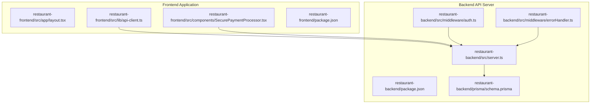
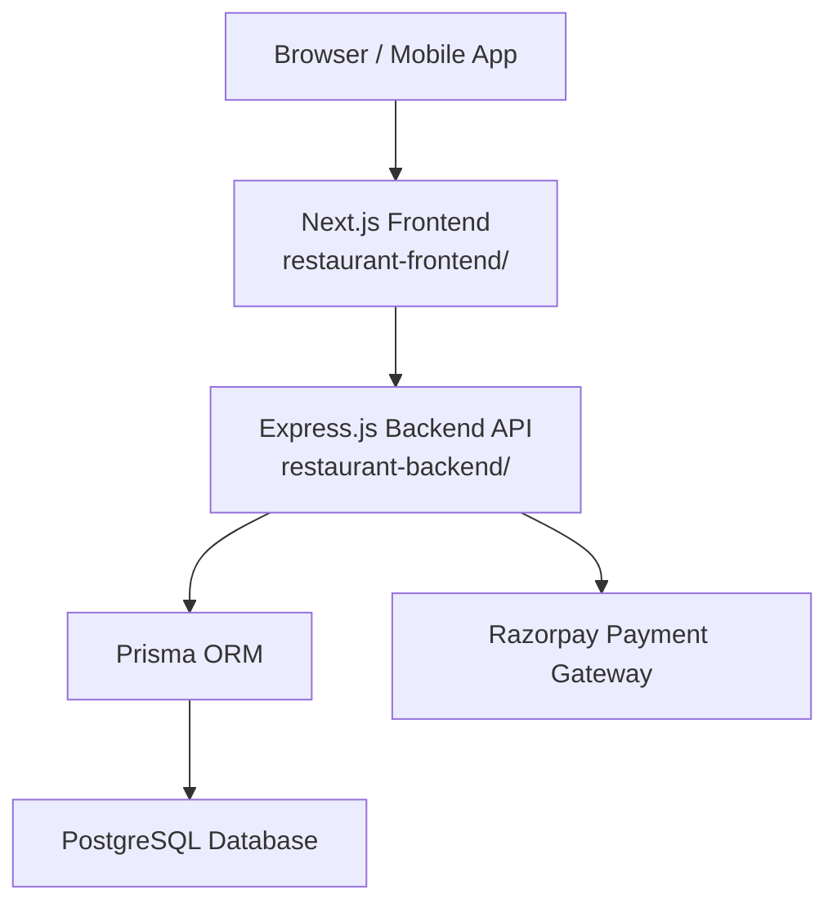
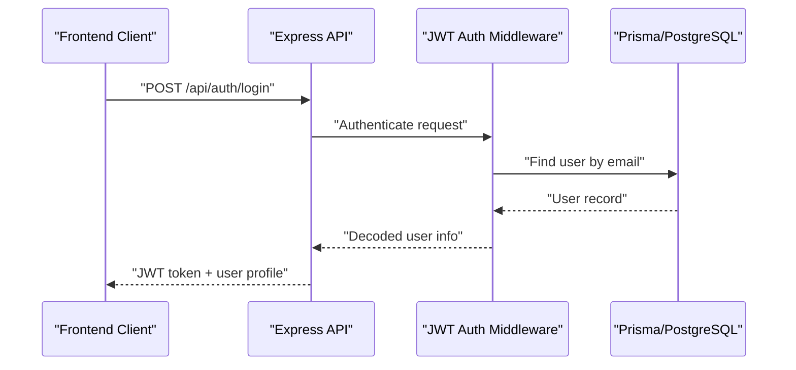
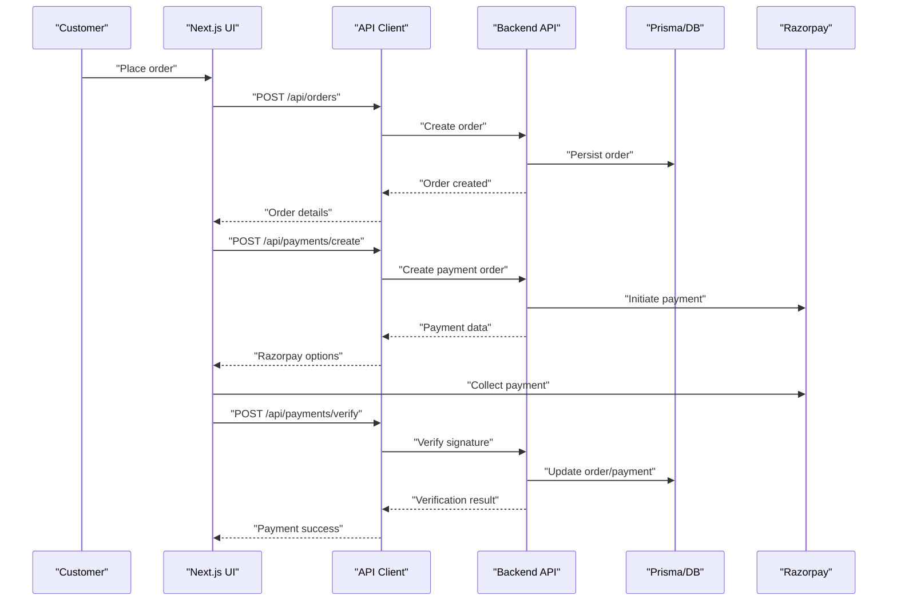
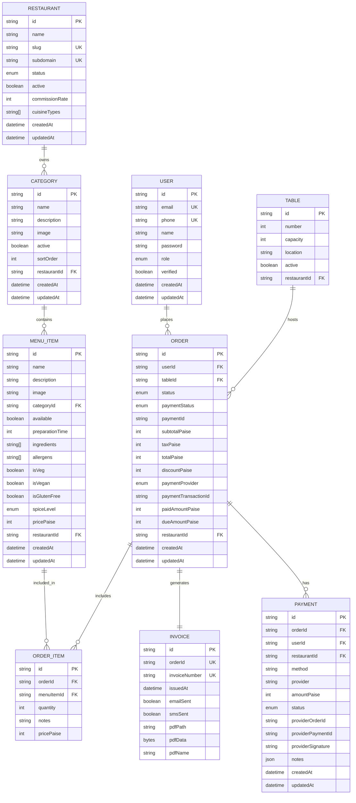
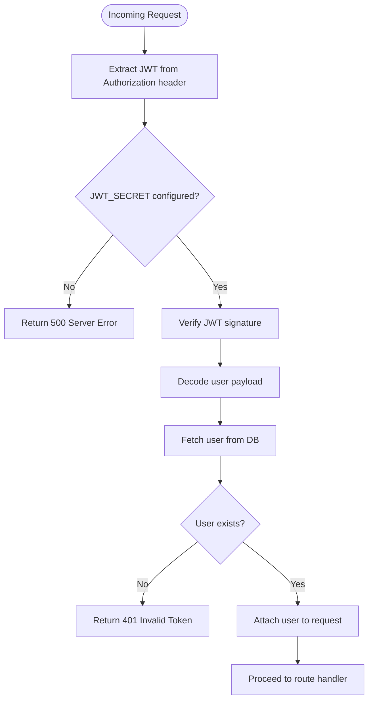
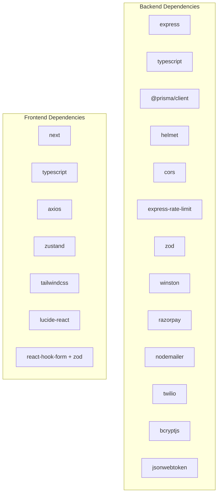

# Project Overview

<cite>
**Referenced Files in This Document**
- [README.md](file://README.md)
- [IMPLEMENTATION_STATUS.md](file://IMPLEMENTATION_STATUS.md)
- [SEPARATION_GUIDE.md](file://SEPARATION_GUIDE.md)
- [PRISMA_DATA_FETCHING.md](file://PRISMA_DATA_FETCHING.md)
- [restaurant-backend/package.json](file://restaurant-backend/package.json)
- [restaurant-frontend/package.json](file://restaurant-frontend/package.json)
- [restaurant-backend/src/server.ts](file://restaurant-backend/src/server.ts)
- [restaurant-backend/prisma/schema.prisma](file://restaurant-backend/prisma/schema.prisma)
- [restaurant-backend/src/middleware/auth.ts](file://restaurant-backend/src/middleware/auth.ts)
- [restaurant-backend/src/middleware/errorHandler.ts](file://restaurant-backend/src/middleware/errorHandler.ts)
- [restaurant-frontend/src/app/layout.tsx](file://restaurant-frontend/src/app/layout.tsx)
- [restaurant-frontend/src/components/SecurePaymentProcessor.tsx](file://restaurant-frontend/src/components/SecurePaymentProcessor.tsx)
- [restaurant-frontend/src/lib/api-client.ts](file://restaurant-frontend/src/lib/api-client.ts)
</cite>

## Table of Contents
1. [Introduction](#introduction)
2. [Project Structure](#project-structure)
3. [Core Components](#core-components)
4. [Architecture Overview](#architecture-overview)
5. [Detailed Component Analysis](#detailed-component-analysis)
6. [Dependency Analysis](#dependency-analysis)
7. [Performance Considerations](#performance-considerations)
8. [Troubleshooting Guide](#troubleshooting-guide)
9. [Conclusion](#conclusion)
10. [Appendices](#appendices)

## Introduction
DeQ-Bite is a modern, scalable restaurant web application featuring a fully separated backend and frontend architecture. The system delivers a seamless online ordering experience with strong emphasis on security, performance, and maintainability. It supports real-time order management, table reservations, and automated invoice generation, while integrating securely with the Razorpay payment gateway. The backend is built with Express.js and TypeScript, and the frontend leverages Next.js App Router with React and TypeScript. The database is powered by PostgreSQL through Prisma ORM, enabling type-safe, efficient data operations.

Key benefits for users:
- Beginners: Clear setup instructions, sample data, and guided testing steps enable quick onboarding.
- Experienced developers: Modular architecture, comprehensive security middleware, and scalable patterns support rapid feature development and deployment.
- Restaurant operators: Admin dashboards, order tracking, and analytics streamline daily operations.

**Section sources**
- [README.md](file://README.md#L1-L248)
- [IMPLEMENTATION_STATUS.md](file://IMPLEMENTATION_STATUS.md#L1-L248)

## Project Structure
The repository is organized into two primary directories:
- restaurant-backend: Express.js API server with TypeScript, Prisma ORM, and security middleware.
- restaurant-frontend: Next.js frontend application with React, TypeScript, and state management.

**Diagram sources**
- [restaurant-backend/src/server.ts](file://restaurant-backend/src/server.ts#L1-L33)
- [restaurant-backend/package.json](file://restaurant-backend/package.json#L1-L80)
- [restaurant-backend/prisma/schema.prisma](file://restaurant-backend/prisma/schema.prisma#L1-L384)
- [restaurant-backend/src/middleware/auth.ts](file://restaurant-backend/src/middleware/auth.ts#L1-L137)
- [restaurant-backend/src/middleware/errorHandler.ts](file://restaurant-backend/src/middleware/errorHandler.ts#L1-L82)
- [restaurant-frontend/src/app/layout.tsx](file://restaurant-frontend/src/app/layout.tsx#L1-L50)
- [restaurant-frontend/src/lib/api-client.ts](file://restaurant-frontend/src/lib/api-client.ts#L1-L800)
- [restaurant-frontend/src/components/SecurePaymentProcessor.tsx](file://restaurant-frontend/src/components/SecurePaymentProcessor.tsx#L1-L347)
- [restaurant-frontend/package.json](file://restaurant-frontend/package.json#L1-L54)

**Section sources**
- [README.md](file://README.md#L65-L99)
- [SEPARATION_GUIDE.md](file://SEPARATION_GUIDE.md#L27-L66)

## Core Components
- Backend API server: Manages authentication, payment processing, order lifecycle, invoice generation, and database interactions via Prisma.
- Frontend application: Provides responsive UI for customer and admin workflows, integrates with the backend through a typed API client, and handles secure payment flows.
- Database: PostgreSQL schema managed by Prisma with comprehensive models for users, restaurants, menus, orders, payments, and invoices.
- Security middleware: Implements JWT authentication, rate limiting, CORS protection, input validation, and centralized error handling.

Technology stack highlights:
- Backend: Express.js, TypeScript, Prisma, PostgreSQL, Helmet.js, CORS, express-rate-limit, Zod, Winston logging, Nodemailer, Twilio, Razorpay SDK.
- Frontend: Next.js 15 App Router, React, TypeScript, Axios, Zustand, Tailwind CSS, React Hook Form + Zod validation, Lucide React icons.

**Section sources**
- [IMPLEMENTATION_STATUS.md](file://IMPLEMENTATION_STATUS.md#L115-L135)
- [restaurant-backend/package.json](file://restaurant-backend/package.json#L18-L44)
- [restaurant-frontend/package.json](file://restaurant-frontend/package.json#L12-L31)

## Architecture Overview
The system follows a separated architecture with independent scaling for backend and frontend. The frontend communicates with the backend via RESTful endpoints, while the backend enforces security policies and performs server-side payment verification.

**Diagram sources**
- [SEPARATION_GUIDE.md](file://SEPARATION_GUIDE.md#L262-L276)
- [restaurant-backend/src/server.ts](file://restaurant-backend/src/server.ts#L1-L33)
- [restaurant-backend/prisma/schema.prisma](file://restaurant-backend/prisma/schema.prisma#L1-L384)
- [restaurant-frontend/src/app/layout.tsx](file://restaurant-frontend/src/app/layout.tsx#L28-L28)

## Detailed Component Analysis

### Backend API Server
The backend initializes the server, connects to the database, and exposes REST endpoints for authentication, payments, orders, invoices, and administrative functions. It includes robust middleware for authentication, error handling, and security.

**Diagram sources**
- [restaurant-backend/src/middleware/auth.ts](file://restaurant-backend/src/middleware/auth.ts#L7-L75)
- [restaurant-backend/src/middleware/errorHandler.ts](file://restaurant-backend/src/middleware/errorHandler.ts#L22-L76)
- [restaurant-backend/src/server.ts](file://restaurant-backend/src/server.ts#L17-L30)

Key implementation characteristics:
- JWT authentication with role-based authorization.
- Centralized error handling with structured responses and logging.
- Database connectivity and graceful shutdown handling.

**Section sources**
- [restaurant-backend/src/server.ts](file://restaurant-backend/src/server.ts#L1-L33)
- [restaurant-backend/src/middleware/auth.ts](file://restaurant-backend/src/middleware/auth.ts#L1-L137)
- [restaurant-backend/src/middleware/errorHandler.ts](file://restaurant-backend/src/middleware/errorHandler.ts#L1-L82)

### Frontend Application
The frontend provides a responsive user interface with integrated payment processing and secure communication with the backend. It uses a typed API client and state management for efficient data handling.

**Diagram sources**
- [restaurant-frontend/src/components/SecurePaymentProcessor.tsx](file://restaurant-frontend/src/components/SecurePaymentProcessor.tsx#L83-L152)
- [restaurant-frontend/src/lib/api-client.ts](file://restaurant-frontend/src/lib/api-client.ts#L380-L440)
- [restaurant-backend/src/middleware/auth.ts](file://restaurant-backend/src/middleware/auth.ts#L1-L137)

Frontend highlights:
- Secure payment processor component with real-time verification feedback.
- API client with request/response interceptors, tenant-aware routing, and authentication token injection.
- Layout integration with Razorpay script loading and global notifications.

**Section sources**
- [restaurant-frontend/src/components/SecurePaymentProcessor.tsx](file://restaurant-frontend/src/components/SecurePaymentProcessor.tsx#L1-L347)
- [restaurant-frontend/src/lib/api-client.ts](file://restaurant-frontend/src/lib/api-client.ts#L194-L240)
- [restaurant-frontend/src/app/layout.tsx](file://restaurant-frontend/src/app/layout.tsx#L28-L48)

### Database Schema and Data Fetching
The PostgreSQL schema defines core entities for users, restaurants, menu items, orders, payments, and invoices. Enhanced Prisma data fetching strategies optimize performance and type safety.

**Diagram sources**
- [restaurant-backend/prisma/schema.prisma](file://restaurant-backend/prisma/schema.prisma#L11-L384)

Enhanced data fetching strategies:
- Selective field retrieval to minimize payload size.
- Include related entities to reduce round trips.
- Aggregation-based statistics for performance and insights.

**Section sources**
- [PRISMA_DATA_FETCHING.md](file://PRISMA_DATA_FETCHING.md#L132-L183)
- [PRISMA_DATA_FETCHING.md](file://PRISMA_DATA_FETCHING.md#L217-L238)

### Security Implementation
The system implements layered security across authentication, payment processing, and data access controls.

**Diagram sources**
- [restaurant-backend/src/middleware/auth.ts](file://restaurant-backend/src/middleware/auth.ts#L13-L75)

Security features summary:
- JWT-based authentication with role-based authorization.
- Server-side payment signature verification via Razorpay.
- Rate limiting, CORS protection, input validation, and comprehensive error handling.
- Audit logging and secure file storage for invoices.

**Section sources**
- [SEPARATION_GUIDE.md](file://SEPARATION_GUIDE.md#L164-L202)
- [README.md](file://README.md#L126-L144)

## Dependency Analysis
The backend and frontend packages define their respective runtime and development dependencies, reflecting the chosen technologies and integrations.

**Diagram sources**
- [restaurant-backend/package.json](file://restaurant-backend/package.json#L18-L44)
- [restaurant-frontend/package.json](file://restaurant-frontend/package.json#L12-L31)

**Section sources**
- [restaurant-backend/package.json](file://restaurant-backend/package.json#L1-L80)
- [restaurant-frontend/package.json](file://restaurant-frontend/package.json#L1-L54)

## Performance Considerations
- Backend scalability: Horizontal scaling behind a load balancer, database connection pooling via Prisma, and readiness for caching and microservices.
- Frontend optimization: Code splitting, lazy loading, CDN-ready assets, and efficient state management with Zustand.
- Data fetching: Selective field retrieval, include relationships, and aggregation-based statistics to minimize payload sizes and database load.
- Payment flow: Asynchronous verification and reduced timeout windows to improve responsiveness.

[No sources needed since this section provides general guidance]

## Troubleshooting Guide
Common issues and resolutions:
- Authentication failures: Verify JWT_SECRET configuration and ensure tokens are included in Authorization headers.
- Payment verification errors: Confirm backend verification logic and network connectivity to external services.
- Database connectivity: Check Prisma client generation and migration status.
- Frontend API errors: Validate NEXT_PUBLIC_API_URL and tenant slug propagation.

**Section sources**
- [restaurant-backend/src/middleware/errorHandler.ts](file://restaurant-backend/src/middleware/errorHandler.ts#L22-L76)
- [restaurant-frontend/src/lib/api-client.ts](file://restaurant-frontend/src/lib/api-client.ts#L206-L239)

## Conclusion
DeQ-Bite delivers a production-ready, secure, and scalable restaurant ordering platform with a clear separation between frontend and backend. Its architecture, combined with robust security measures and optimized data fetching, enables smooth operations for both customers and restaurant staff. The modular design and comprehensive documentation make it accessible to developers of all levels while supporting future enhancements and deployments.

[No sources needed since this section summarizes without analyzing specific files]

## Appendices
- Test credentials and sample data are provided for immediate development and testing.
- API endpoints and interactive documentation are available via the backend health checks.

**Section sources**
- [SAMPLE_DATA.md](file://SAMPLE_DATA.md#L1-L119)
- [README.md](file://README.md#L109-L125)