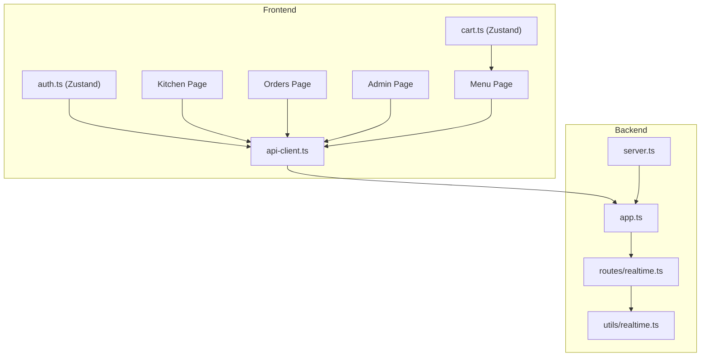
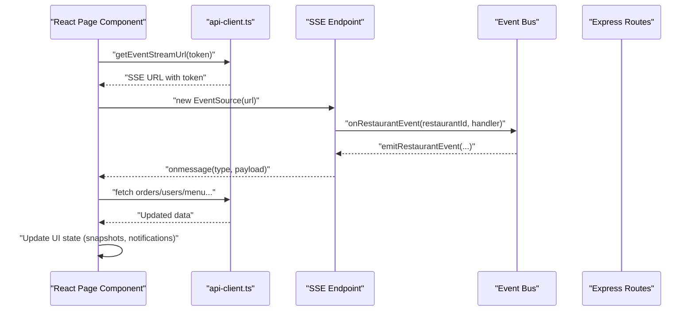
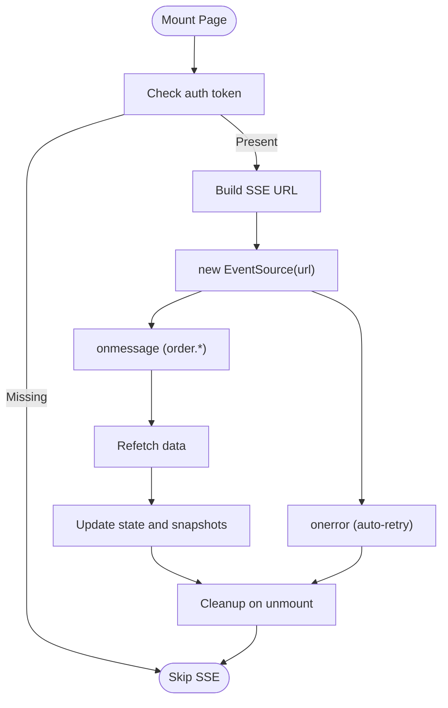
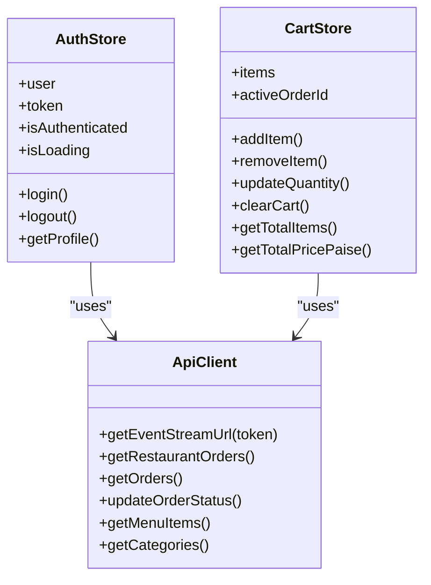
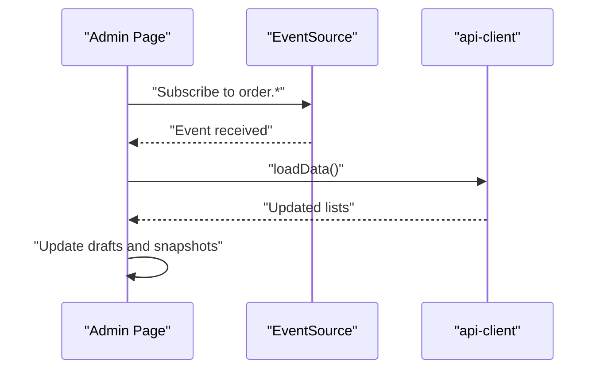
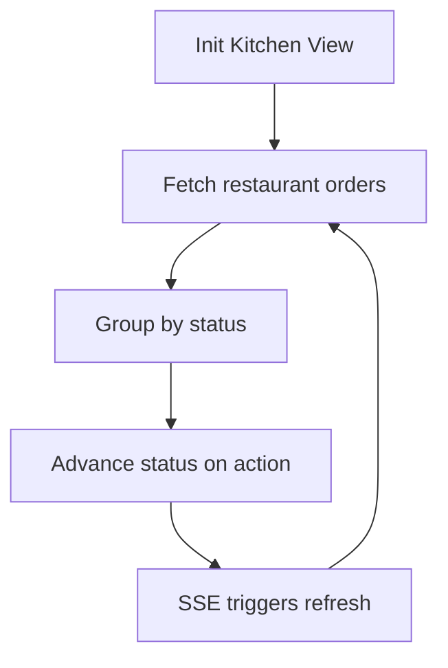
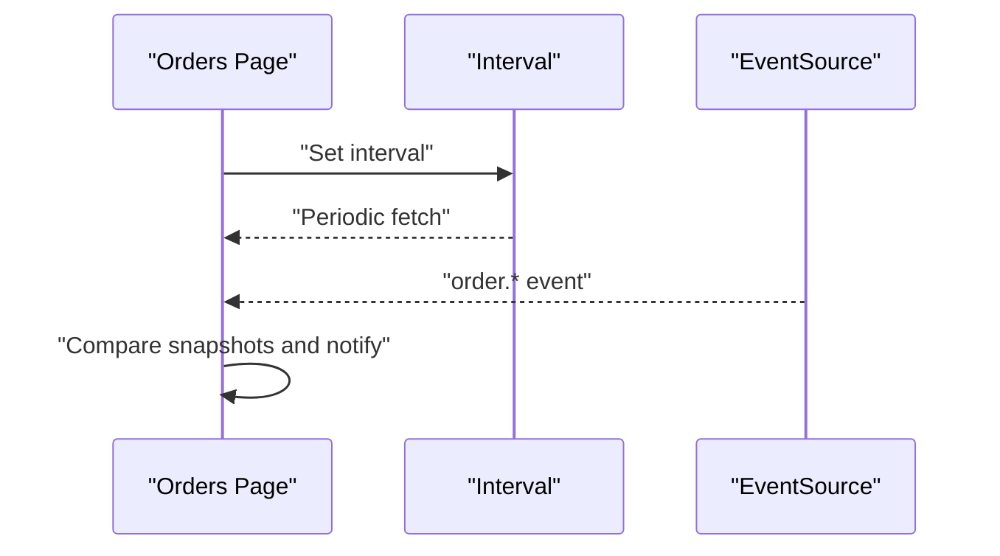
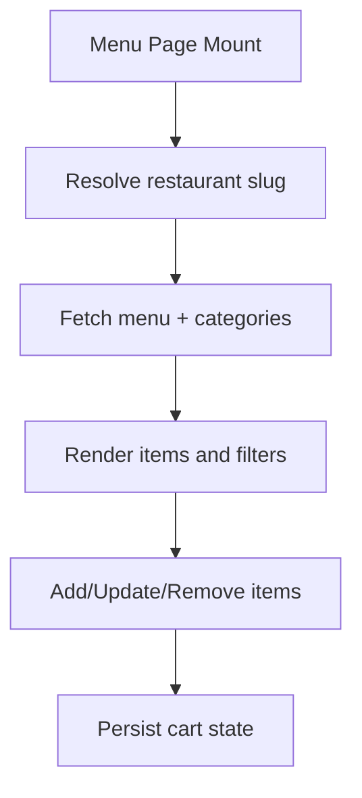
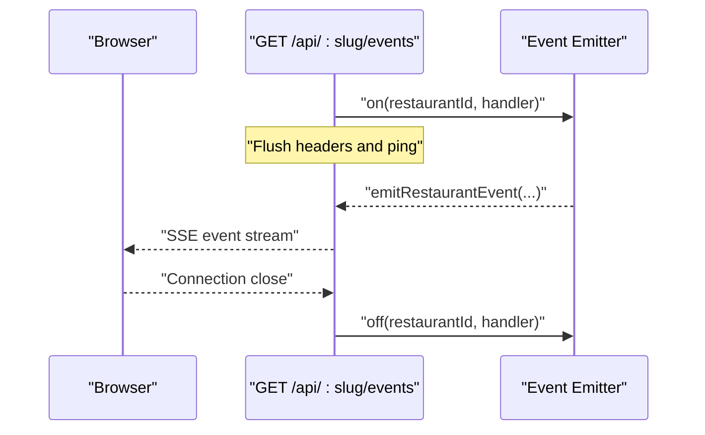
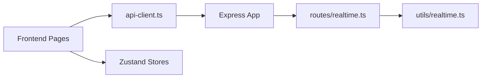

# Client Integration Patterns

<cite>
**Referenced Files in This Document**
- [api-client.ts](file://restaurant-frontend/src/lib/api-client.ts)
- [auth.ts](file://restaurant-frontend/src/store/auth.ts)
- [cart.ts](file://restaurant-frontend/src/store/cart.ts)
- [kitchen/page.tsx](file://restaurant-frontend/src/app/kitchen/page.tsx)
- [orders/page.tsx](file://restaurant-frontend/src/app/orders/page.tsx)
- [menu/page.tsx](file://restaurant-frontend/src/app/menu/page.tsx)
- [admin/page.tsx](file://restaurant-frontend/src/app/admin/page.tsx)
- [realtime.ts](file://restaurant-backend/src/utils/realtime.ts)
- [realtime.ts](file://restaurant-backend/src/routes/realtime.ts)
- [app.ts](file://restaurant-backend/src/app.ts)
- [server.ts](file://restaurant-backend/src/server.ts)
</cite>

## Table of Contents
1. [Introduction](#introduction)
2. [Project Structure](#project-structure)
3. [Core Components](#core-components)
4. [Architecture Overview](#architecture-overview)
5. [Detailed Component Analysis](#detailed-component-analysis)
6. [Dependency Analysis](#dependency-analysis)
7. [Performance Considerations](#performance-considerations)
8. [Troubleshooting Guide](#troubleshooting-guide)
9. [Conclusion](#conclusion)
10. [Appendices](#appendices)

## Introduction
This document describes client integration patterns for DeQ-Bite’s real-time features across frontend components. It focuses on the WebSocket-compatible Server-Sent Events (SSE) implementation used by the React application to receive live updates for orders, payments, and administrative dashboards. The guide covers SSE client setup, state synchronization strategies using React hooks and Zustand stores, error handling and retry behavior, optimistic updates, performance optimization, and testing/debugging approaches.

## Project Structure
The real-time integration spans two primary areas:
- Frontend (Next.js 15 app):
  - API client wrapper for tenant-aware endpoints and SSE URL construction
  - Zustand stores for authentication and cart state
  - Page components that subscribe to SSE streams and synchronize UI state
- Backend (Express):
  - SSE route emitting events scoped per restaurant
  - In-process event bus for emitting domain events to SSE subscribers

**Diagram sources**
- [api-client.ts](file://restaurant-frontend/src/lib/api-client.ts)
- [auth.ts](file://restaurant-frontend/src/store/auth.ts)
- [cart.ts](file://restaurant-frontend/src/store/cart.ts)
- [kitchen/page.tsx](file://restaurant-frontend/src/app/kitchen/page.tsx)
- [orders/page.tsx](file://restaurant-frontend/src/app/orders/page.tsx)
- [menu/page.tsx](file://restaurant-frontend/src/app/menu/page.tsx)
- [admin/page.tsx](file://restaurant-frontend/src/app/admin/page.tsx)
- [realtime.ts](file://restaurant-backend/src/routes/realtime.ts)
- [realtime.ts](file://restaurant-backend/src/utils/realtime.ts)
- [app.ts](file://restaurant-backend/src/app.ts)
- [server.ts](file://restaurant-backend/src/server.ts)

**Section sources**
- [api-client.ts](file://restaurant-frontend/src/lib/api-client.ts)
- [auth.ts](file://restaurant-frontend/src/store/auth.ts)
- [cart.ts](file://restaurant-frontend/src/store/cart.ts)
- [kitchen/page.tsx](file://restaurant-frontend/src/app/kitchen/page.tsx)
- [orders/page.tsx](file://restaurant-frontend/src/app/orders/page.tsx)
- [menu/page.tsx](file://restaurant-frontend/src/app/menu/page.tsx)
- [admin/page.tsx](file://restaurant-frontend/src/app/admin/page.tsx)
- [realtime.ts](file://restaurant-backend/src/routes/realtime.ts)
- [realtime.ts](file://restaurant-backend/src/utils/realtime.ts)
- [app.ts](file://restaurant-backend/src/app.ts)
- [server.ts](file://restaurant-backend/src/server.ts)

## Core Components
- SSE Client in React:
  - Uses the browser EventSource to connect to the backend SSE endpoint
  - Subscribes to order-related events and refreshes local state
- API Client:
  - Builds tenant-aware URLs and constructs SSE URLs with token query param
  - Centralizes HTTP interactions and tenant context headers
- State Stores:
  - Authentication store persists JWT and user context
  - Cart store manages order-in-progress state and items
- Backend SSE:
  - Emits restaurant-scoped events via an in-process event bus
  - Serves SSE with keep-alive pings and automatic browser retries

Key integration points:
- SSE subscription lifecycle in page components
- Snapshot-based notifications and local storage caching
- Tenant routing and restaurant scoping

**Section sources**
- [api-client.ts](file://restaurant-frontend/src/lib/api-client.ts)
- [auth.ts](file://restaurant-frontend/src/store/auth.ts)
- [cart.ts](file://restaurant-frontend/src/store/cart.ts)
- [kitchen/page.tsx](file://restaurant-frontend/src/app/kitchen/page.tsx)
- [orders/page.tsx](file://restaurant-frontend/src/app/orders/page.tsx)
- [admin/page.tsx](file://restaurant-frontend/src/app/admin/page.tsx)
- [realtime.ts](file://restaurant-backend/src/routes/realtime.ts)
- [realtime.ts](file://restaurant-backend/src/utils/realtime.ts)

## Architecture Overview
The real-time architecture uses SSE to push restaurant-scoped events to subscribed clients. The frontend subscribes to a single SSE endpoint and listens for order-related events to update UI state.

**Diagram sources**
- [api-client.ts](file://restaurant-frontend/src/lib/api-client.ts)
- [orders/page.tsx](file://restaurant-frontend/src/app/orders/page.tsx)
- [kitchen/page.tsx](file://restaurant-frontend/src/app/kitchen/page.tsx)
- [admin/page.tsx](file://restaurant-frontend/src/app/admin/page.tsx)
- [realtime.ts](file://restaurant-backend/src/routes/realtime.ts)
- [realtime.ts](file://restaurant-backend/src/utils/realtime.ts)

## Detailed Component Analysis

### SSE Client Implementation in React Pages
- Subscription pattern:
  - Retrieve auth token from local storage
  - Construct SSE URL via API client
  - Create EventSource and listen for order events
  - Clean up listeners on unmount
- Event handling:
  - Listen for order.created and order.updated events
  - Trigger a refetch of relevant data to synchronize state
- Retry behavior:
  - Browser EventSource automatically reconnects on disconnect

**Diagram sources**
- [orders/page.tsx](file://restaurant-frontend/src/app/orders/page.tsx)
- [kitchen/page.tsx](file://restaurant-frontend/src/app/kitchen/page.tsx)
- [admin/page.tsx](file://restaurant-frontend/src/app/admin/page.tsx)
- [api-client.ts](file://restaurant-frontend/src/lib/api-client.ts)

**Section sources**
- [orders/page.tsx](file://restaurant-frontend/src/app/orders/page.tsx)
- [kitchen/page.tsx](file://restaurant-frontend/src/app/kitchen/page.tsx)
- [admin/page.tsx](file://restaurant-frontend/src/app/admin/page.tsx)
- [api-client.ts](file://restaurant-frontend/src/lib/api-client.ts)

### State Management Strategies
- Authentication state:
  - Persisted Zustand store with token and user metadata
  - Used to gate access and derive restaurant role
- Cart state:
  - Persisted Zustand store for items and active order ID
  - Supports optimistic updates during add/remove actions
- Local snapshots:
  - Store last-known order/payment statuses in localStorage
  - Compare snapshots to compute deltas and show targeted notifications
- UI loading states:
  - Dedicated loading flags per operation
  - Spinner indicators and disabled controls during async actions

**Diagram sources**
- [auth.ts](file://restaurant-frontend/src/store/auth.ts)
- [cart.ts](file://restaurant-frontend/src/store/cart.ts)
- [api-client.ts](file://restaurant-frontend/src/lib/api-client.ts)

**Section sources**
- [auth.ts](file://restaurant-frontend/src/store/auth.ts)
- [cart.ts](file://restaurant-frontend/src/store/cart.ts)
- [api-client.ts](file://restaurant-frontend/src/lib/api-client.ts)

### Integration Patterns by Feature Area

#### Admin Dashboard
- Access control:
  - Enforces OWNER/ADMIN roles before subscribing to SSE
- Data synchronization:
  - Subscribes to order events and reloads menu, users, orders, and payment policy
- Optimistic UX:
  - Draft fields for status/partial payment updates
  - Immediate UI feedback while backend updates are in progress

**Diagram sources**
- [admin/page.tsx](file://restaurant-frontend/src/app/admin/page.tsx)
- [api-client.ts](file://restaurant-frontend/src/lib/api-client.ts)

**Section sources**
- [admin/page.tsx](file://restaurant-frontend/src/app/admin/page.tsx)

#### Kitchen Interface
- Role-based gating:
  - Only STAFF/ADMIN/OWNER can access kitchen
- Queue management:
  - Groups orders by status and advances stages
  - Uses snapshot comparison to announce status changes

**Diagram sources**
- [kitchen/page.tsx](file://restaurant-frontend/src/app/kitchen/page.tsx)
- [api-client.ts](file://restaurant-frontend/src/lib/api-client.ts)

**Section sources**
- [kitchen/page.tsx](file://restaurant-frontend/src/app/kitchen/page.tsx)

#### Customer Orders Page
- Polling + SSE hybrid:
  - Periodic polling to complement SSE updates
  - SSE for near-real-time order/payment status changes
- Notifications:
  - Browser notifications and local notification logs
  - Snapshot-based delta detection

**Diagram sources**
- [orders/page.tsx](file://restaurant-frontend/src/app/orders/page.tsx)

**Section sources**
- [orders/page.tsx](file://restaurant-frontend/src/app/orders/page.tsx)

#### Menu System
- Tenant-aware context:
  - Resolves restaurant slug and applies to API calls
- Cart integration:
  - Adds/removes items and updates quantities optimistically
  - Persists cart state across sessions

**Diagram sources**
- [menu/page.tsx](file://restaurant-frontend/src/app/menu/page.tsx)
- [cart.ts](file://restaurant-frontend/src/store/cart.ts)

**Section sources**
- [menu/page.tsx](file://restaurant-frontend/src/app/menu/page.tsx)
- [cart.ts](file://restaurant-frontend/src/store/cart.ts)

### Backend SSE Implementation
- SSE route:
  - Sets appropriate headers for streaming
  - Sends periodic ping events to keep the connection alive
  - Emits restaurant-scoped events to connected clients
- Event bus:
  - In-process EventEmitter keyed by restaurantId
  - Listeners registered per connection and cleaned up on close

**Diagram sources**
- [realtime.ts](file://restaurant-backend/src/routes/realtime.ts)
- [realtime.ts](file://restaurant-backend/src/utils/realtime.ts)
- [app.ts](file://restaurant-backend/src/app.ts)

**Section sources**
- [realtime.ts](file://restaurant-backend/src/routes/realtime.ts)
- [realtime.ts](file://restaurant-backend/src/utils/realtime.ts)
- [app.ts](file://restaurant-backend/src/app.ts)

## Dependency Analysis
- Frontend depends on:
  - API client for tenant-aware endpoints and SSE URL construction
  - Zustand stores for state persistence and derivation
  - React components for rendering and lifecycle management
- Backend depends on:
  - Express app for routing and middleware
  - SSE route for streaming events
  - In-process event bus for decoupled event emission

**Diagram sources**
- [api-client.ts](file://restaurant-frontend/src/lib/api-client.ts)
- [orders/page.tsx](file://restaurant-frontend/src/app/orders/page.tsx)
- [kitchen/page.tsx](file://restaurant-frontend/src/app/kitchen/page.tsx)
- [admin/page.tsx](file://restaurant-frontend/src/app/admin/page.tsx)
- [cart.ts](file://restaurant-frontend/src/store/cart.ts)
- [auth.ts](file://restaurant-frontend/src/store/auth.ts)
- [app.ts](file://restaurant-backend/src/app.ts)
- [realtime.ts](file://restaurant-backend/src/routes/realtime.ts)
- [realtime.ts](file://restaurant-backend/src/utils/realtime.ts)

**Section sources**
- [api-client.ts](file://restaurant-frontend/src/lib/api-client.ts)
- [orders/page.tsx](file://restaurant-frontend/src/app/orders/page.tsx)
- [kitchen/page.tsx](file://restaurant-frontend/src/app/kitchen/page.tsx)
- [admin/page.tsx](file://restaurant-frontend/src/app/admin/page.tsx)
- [cart.ts](file://restaurant-frontend/src/store/cart.ts)
- [auth.ts](file://restaurant-frontend/src/store/auth.ts)
- [app.ts](file://restaurant-backend/src/app.ts)
- [realtime.ts](file://restaurant-backend/src/routes/realtime.ts)
- [realtime.ts](file://restaurant-backend/src/utils/realtime.ts)

## Performance Considerations
- SSE connection reuse:
  - Subscribe once per page and reuse the EventSource instance
  - Close on unmount to avoid leaks
- Snapshot-based updates:
  - Maintain minimal state diffs in localStorage to reduce re-renders
- Debounced polling:
  - Use intervals judiciously; rely primarily on SSE for live updates
- Payload size:
  - Keep event payloads small; fetch detailed data via API on demand
- Memory management:
  - Avoid accumulating listeners; ensure cleanup on route changes
- Rendering optimization:
  - Memoize derived data (e.g., grouped orders) to minimize re-computation

## Troubleshooting Guide
Common issues and remedies:
- SSE connection fails:
  - Verify token presence and validity
  - Check CORS configuration and allowed origins
  - Confirm SSE endpoint path and restaurant slug resolution
- No updates received:
  - Ensure EventSource is created and listening for correct event types
  - Validate backend event emission for the restaurantId
- Stale UI state:
  - Implement snapshot-based delta detection and refetch logic
  - Use loading flags to prevent race conditions
- Network errors:
  - Rely on automatic browser retries; surface user-friendly messages
  - Consider exponential backoff in future enhancements

**Section sources**
- [orders/page.tsx](file://restaurant-frontend/src/app/orders/page.tsx)
- [kitchen/page.tsx](file://restaurant-frontend/src/app/kitchen/page.tsx)
- [admin/page.tsx](file://restaurant-frontend/src/app/admin/page.tsx)
- [realtime.ts](file://restaurant-backend/src/routes/realtime.ts)

## Conclusion
DeQ-Bite’s real-time client integration leverages SSE for scalable, low-overhead updates across admin dashboards, kitchen interfaces, customer order pages, and menu systems. The React components subscribe to a single SSE endpoint, synchronize state via API calls, and maintain responsive UX through snapshots, optimistic updates, and careful memory management. The backend’s in-process event bus ensures restaurant-scoped event delivery with robust keep-alive and automatic retry behavior.

## Appendices

### Real-Time Data Binding Examples
- Order status updates:
  - Subscribe to order.* events and refetch orders
  - Compare snapshots to compute deltas and show notifications
- Payment status updates:
  - Combine SSE with periodic polling for critical transitions
  - Update payment status draft fields and persist changes
- Inventory changes:
  - Emit menu-related events and refresh menu + categories
  - Use optimistic cart updates with eventual consistency

**Section sources**
- [orders/page.tsx](file://restaurant-frontend/src/app/orders/page.tsx)
- [admin/page.tsx](file://restaurant-frontend/src/app/admin/page.tsx)
- [menu/page.tsx](file://restaurant-frontend/src/app/menu/page.tsx)

### Testing and Debugging Strategies
- Unit/integration tests:
  - Mock EventSource and intercept API calls
  - Simulate event emissions and verify UI updates
- End-to-end tests:
  - Automate SSE subscription and event-driven flows
- Debugging tools:
  - Browser DevTools Network tab for SSE streams
  - Backend logs for SSE connection lifecycle and event emissions

**Section sources**
- [orders/page.tsx](file://restaurant-frontend/src/app/orders/page.tsx)
- [kitchen/page.tsx](file://restaurant-frontend/src/app/kitchen/page.tsx)
- [admin/page.tsx](file://restaurant-frontend/src/app/admin/page.tsx)
- [realtime.ts](file://restaurant-backend/src/routes/realtime.ts)