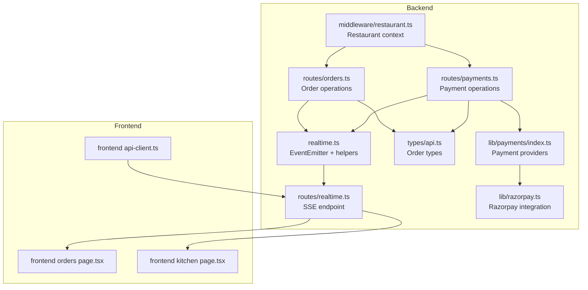
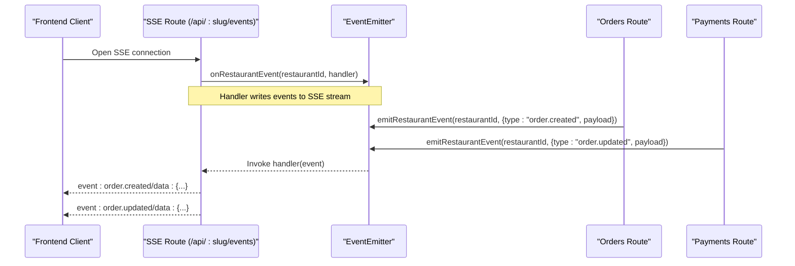
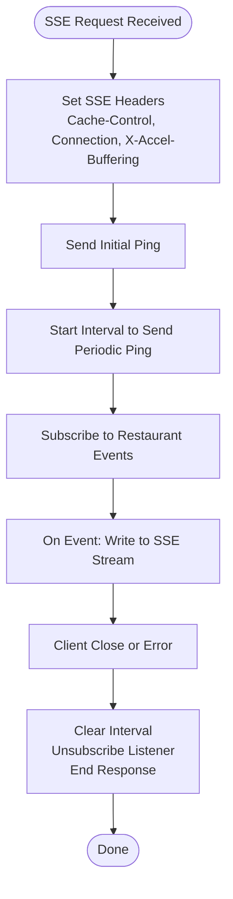
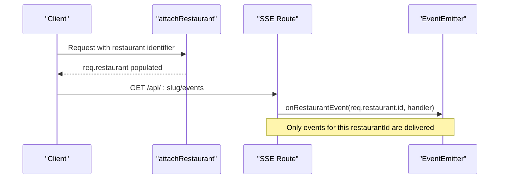
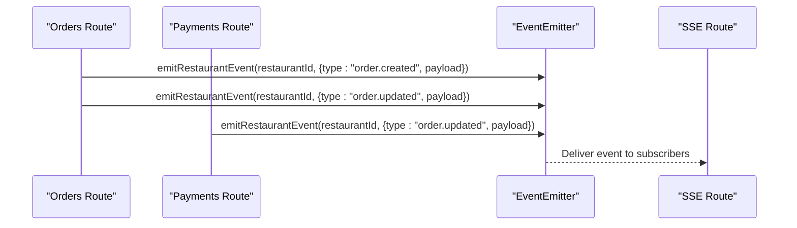
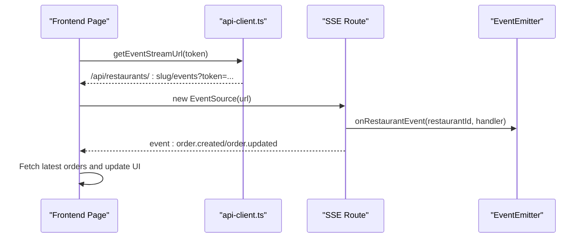
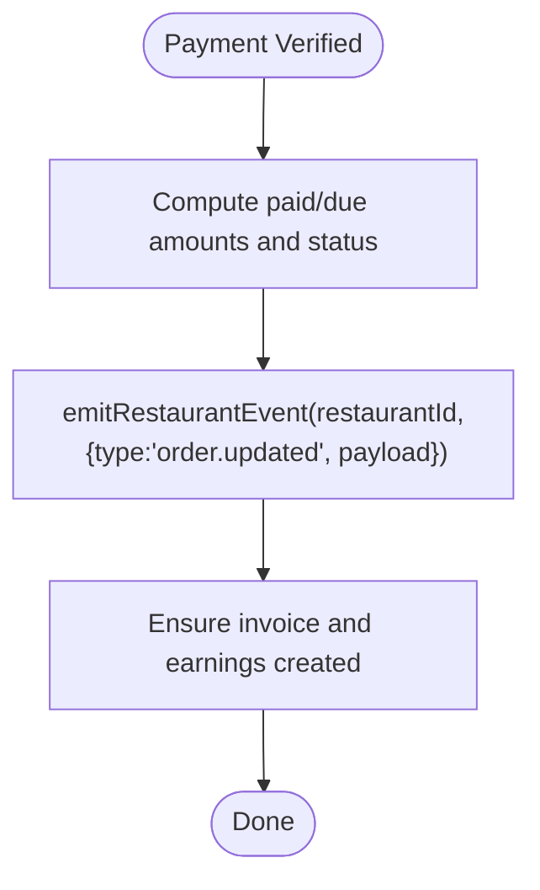
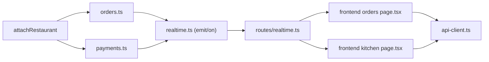

# Event Broadcasting System

<cite>
**Referenced Files in This Document**
- [realtime.ts](file://restaurant-backend/src/utils/realtime.ts)
- [realtime.ts](file://restaurant-backend/src/routes/realtime.ts)
- [orders.ts](file://restaurant-backend/src/route/orders.ts)
- [payments.ts](file://restaurant-backend/src/route/payments.ts)
- [restaurant.ts](file://restaurant-backend/src/middleware/restaurant.ts)
- [api.ts](file://restaurant-backend/src/types/api.ts)
- [razorpay.ts](file://restaurant-backend/src/lib/razorpay.ts)
- [payments/index.ts](file://restaurant-backend/src/lib/payments/index.ts)
- [page.tsx](file://restaurant-frontend/src/app/kitchen/page.tsx)
- [page.tsx](file://restaurant-frontend/src/app/orders/page.tsx)
- [api-client.ts](file://restaurant-frontend/src/lib/api-client.ts)
</cite>

## Table of Contents
1. [Introduction](#introduction)
2. [Project Structure](#project-structure)
3. [Core Components](#core-components)
4. [Architecture Overview](#architecture-overview)
5. [Detailed Component Analysis](#detailed-component-analysis)
6. [Dependency Analysis](#dependency-analysis)
7. [Performance Considerations](#performance-considerations)
8. [Troubleshooting Guide](#troubleshooting-guide)
9. [Conclusion](#conclusion)

## Introduction
This document describes DeQ-Bite’s real-time event broadcasting system for restaurant operations. The system uses an EventEmitter-based architecture to deliver restaurant-scoped notifications to subscribed clients via Server-Sent Events (SSE). It covers event types (order lifecycle updates, payment changes), payload structure, serialization, subscription management, and operational safeguards such as cleanup and isolation between restaurants.

## Project Structure
The event system spans backend utilities, HTTP routes, domain handlers, and frontend consumers:
- Backend utilities define the event bus and SSE route
- Domain routes emit restaurant-scoped events during order and payment operations
- Frontend pages subscribe to SSE streams and react to events

**Diagram sources**
- [realtime.ts:1-23](file://restaurant-backend/src/utils/realtime.ts#L1-L23)
- [realtime.ts:1-40](file://restaurant-backend/src/routes/realtime.ts#L1-L40)
- [orders.ts:1-694](file://restaurant-backend/src/route/orders.ts#L1-L694)
- [payments.ts:1-731](file://restaurant-backend/src/route/payments.ts#L1-L731)
- [restaurant.ts:1-246](file://restaurant-backend/src/middleware/restaurant.ts#L1-L246)
- [api.ts:52-66](file://restaurant-backend/src/types/api.ts#L52-L66)
- [payments/index.ts:1-124](file://restaurant-backend/src/lib/payments/index.ts#L1-L124)
- [razorpay.ts:1-219](file://restaurant-backend/src/lib/razorpay.ts#L1-L219)
- [page.tsx:1-489](file://restaurant-frontend/src/app/orders/page.tsx#L1-L489)
- [page.tsx:1-259](file://restaurant-frontend/src/app/kitchen/page.tsx#L1-L259)
- [api-client.ts:324-329](file://restaurant-frontend/src/lib/api-client.ts#L324-L329)

**Section sources**
- [realtime.ts:1-23](file://restaurant-backend/src/utils/realtime.ts#L1-L23)
- [realtime.ts:1-40](file://restaurant-backend/src/routes/realtime.ts#L1-L40)
- [orders.ts:1-694](file://restaurant-backend/src/route/orders.ts#L1-L694)
- [payments.ts:1-731](file://restaurant-backend/src/route/payments.ts#L1-L731)
- [restaurant.ts:76-200](file://restaurant-backend/src/middleware/restaurant.ts#L76-L200)
- [api.ts:52-66](file://restaurant-backend/src/types/api.ts#L52-L66)
- [payments/index.ts:1-124](file://restaurant-backend/src/lib/payments/index.ts#L1-L124)
- [razorpay.ts:1-219](file://restaurant-backend/src/lib/razorpay.ts#L1-L219)
- [page.tsx:1-489](file://restaurant-frontend/src/app/orders/page.tsx#L1-L489)
- [page.tsx:1-259](file://restaurant-frontend/src/app/kitchen/page.tsx#L1-L259)
- [api-client.ts:324-329](file://restaurant-frontend/src/lib/api-client.ts#L324-L329)

## Core Components
- Event Bus: An EventEmitter keyed by restaurantId to isolate channels per restaurant
- SSE Endpoint: A long-lived HTTP endpoint emitting events to subscribed clients
- Event Emitters: Domain routes emit restaurant-scoped events on order and payment changes
- Subscription Management: Clients connect via SSE and receive filtered events per restaurant context
- Payload Model: Standardized event payload with type, restaurantId, and structured payload

Key responsibilities:
- Emit events: [emitRestaurantEvent:12-17](file://restaurant-backend/src/utils/realtime.ts#L12-L17)
- Subscribe to events: [onRestaurantEvent:19-22](file://restaurant-backend/src/utils/realtime.ts#L19-L22)
- SSE route: [GET /api/:restaurantSlug/events:9-37](file://restaurant-backend/src/routes/realtime.ts#L9-L37)
- Restaurant context: [attachRestaurant:76-200](file://restaurant-backend/src/middleware/restaurant.ts#L76-L200)

**Section sources**
- [realtime.ts:1-23](file://restaurant-backend/src/utils/realtime.ts#L1-L23)
- [realtime.ts:1-40](file://restaurant-backend/src/routes/realtime.ts#L1-L40)
- [restaurant.ts:76-200](file://restaurant-backend/src/middleware/restaurant.ts#L76-L200)

## Architecture Overview
The system uses a publish-subscribe model:
- Publishers: Order and payment routes emit events scoped to a restaurant
- Broker: EventEmitter keyed by restaurantId
- Subscribers: Frontend pages open SSE connections and listen for restaurant-specific events

**Diagram sources**
- [realtime.ts:12-22](file://restaurant-backend/src/utils/realtime.ts#L12-L22)
- [realtime.ts:24-30](file://restaurant-backend/src/routes/realtime.ts#L24-L30)
- [orders.ts:254-257](file://restaurant-backend/src/route/orders.ts#L254-L257)
- [payments.ts:392-395](file://restaurant-backend/src/route/payments.ts#L392-L395)

## Detailed Component Analysis

### Event Bus and SSE Endpoint
- Event Bus: A single EventEmitter instance with unlimited listeners
- SSE Route: Establishes SSE headers, sends periodic pings, subscribes to restaurant events, and cleans up on client disconnect
- Subscription Cleanup: Returns an unsubscribe function; route clears intervals and unsubscribes on request close

**Diagram sources**
- [realtime.ts:9-37](file://restaurant-backend/src/routes/realtime.ts#L9-L37)
- [realtime.ts:19-22](file://restaurant-backend/src/utils/realtime.ts#L19-L22)

**Section sources**
- [realtime.ts:1-23](file://restaurant-backend/src/utils/realtime.ts#L1-L23)
- [realtime.ts:1-40](file://restaurant-backend/src/routes/realtime.ts#L1-L40)

### Event Types and Payloads
- Event Type: String identifying the event (e.g., "order.created", "order.updated")
- Restaurant Scope: restaurantId included in emitted event to ensure SSE subscribers receive only relevant events
- Payload: Structured data containing order fields such as status, paymentStatus, totals, timestamps

Common payload fields (from order events):
- id, status, paymentStatus, paymentProvider, paidAmountPaise, dueAmountPaise, totalPaise, updatedAt, createdAt

**Section sources**
- [orders.ts:38-48](file://restaurant-backend/src/route/orders.ts#L38-L48)
- [payments.ts:168-178](file://restaurant-backend/src/route/payments.ts#L168-L178)
- [api.ts:52-66](file://restaurant-backend/src/types/api.ts#L52-L66)

### Restaurant-Scoped Routing and Isolation
- Restaurant Context: Middleware attaches restaurant context to requests using slug/subdomain/host headers
- SSE Subscription: Uses req.restaurant.id to subscribe to the correct channel
- Event Emission: Routes emit events using the restaurantId from the authenticated restaurant context

**Diagram sources**
- [restaurant.ts:76-200](file://restaurant-backend/src/middleware/restaurant.ts#L76-L200)
- [realtime.ts:24-30](file://restaurant-backend/src/routes/realtime.ts#L24-L30)

**Section sources**
- [restaurant.ts:76-200](file://restaurant-backend/src/middleware/restaurant.ts#L76-L200)
- [realtime.ts:9-37](file://restaurant-backend/src/routes/realtime.ts#L9-L37)

### Event Emission Patterns
- Order Placement: Emits "order.created" with order payload after creation
- Adding Items: Emits "order.updated" with updated order payload
- Applying Coupon: Emits "order.updated" with updated order payload
- Status Updates: Emits "order.updated" with updated order payload
- Payment Verification: Emits "order.updated" with updated order payload
- Cash Confirmation: Emits "order.updated" with updated order payload
- Payment Status Update: Emits "order.updated" with updated order payload

**Diagram sources**
- [orders.ts:254-257](file://restaurant-backend/src/route/orders.ts#L254-L257)
- [orders.ts:381-384](file://restaurant-backend/src/route/orders.ts#L381-L384)
- [orders.ts:481-484](file://restaurant-backend/src/route/orders.ts#L481-L484)
- [orders.ts:620-623](file://restaurant-backend/src/route/orders.ts#L620-L623)
- [payments.ts:392-395](file://restaurant-backend/src/route/payments.ts#L392-L395)
- [payments.ts:634-637](file://restaurant-backend/src/route/payments.ts#L634-L637)
- [payments.ts:718-721](file://restaurant-backend/src/route/payments.ts#L718-L721)

**Section sources**
- [orders.ts:254-257](file://restaurant-backend/src/route/orders.ts#L254-L257)
- [orders.ts:381-384](file://restaurant-backend/src/route/orders.ts#L381-L384)
- [orders.ts:481-484](file://restaurant-backend/src/route/orders.ts#L481-L484)
- [orders.ts:620-623](file://restaurant-backend/src/route/orders.ts#L620-L623)
- [payments.ts:392-395](file://restaurant-backend/src/route/payments.ts#L392-L395)
- [payments.ts:634-637](file://restaurant-backend/src/route/payments.ts#L634-L637)
- [payments.ts:718-721](file://restaurant-backend/src/route/payments.ts#L718-L721)

### Frontend Subscription and Consumption
- SSE URL Construction: Builds tenant-aware SSE URL with token query parameter
- EventSource Usage: Frontends open SSE connections and listen for "order.created" and "order.updated"
- Local State Synchronization: Frontends fetch latest order lists and compare snapshots to show notifications

**Diagram sources**
- [api-client.ts:324-329](file://restaurant-frontend/src/lib/api-client.ts#L324-L329)
- [page.tsx:48-71](file://restaurant-frontend/src/app/orders/page.tsx#L48-L71)
- [page.tsx:41-64](file://restaurant-frontend/src/app/kitchen/page.tsx#L41-L64)

**Section sources**
- [api-client.ts:324-329](file://restaurant-frontend/src/lib/api-client.ts#L324-L329)
- [page.tsx:48-71](file://restaurant-frontend/src/app/orders/page.tsx#L48-L71)
- [page.tsx:41-64](file://restaurant-frontend/src/app/kitchen/page.tsx#L41-L64)

### Payment Provider Integration and Event Emission
- Payment Providers: Provider abstraction supports multiple gateways; currently Razorpay is implemented
- Signature Verification: Payments module verifies signatures and emits "order.updated" upon successful verification
- Cash Payments: Cash confirmation emits "order.updated" and auto-generates invoice/earnings when applicable

**Diagram sources**
- [payments.ts:326-374](file://restaurant-backend/src/route/payments.ts#L326-L374)
- [payments.ts:392-395](file://restaurant-backend/src/route/payments.ts#L392-L395)
- [payments.ts:619-637](file://restaurant-backend/src/route/payments.ts#L619-L637)
- [payments.ts:718-721](file://restaurant-backend/src/route/payments.ts#L718-L721)
- [payments/index.ts:40-81](file://restaurant-backend/src/lib/payments/index.ts#L40-L81)
- [razorpay.ts:65-105](file://restaurant-backend/src/lib/razorpay.ts#L65-L105)

**Section sources**
- [payments.ts:326-374](file://restaurant-backend/src/route/payments.ts#L326-L374)
- [payments.ts:392-395](file://restaurant-backend/src/route/payments.ts#L392-L395)
- [payments.ts:619-637](file://restaurant-backend/src/route/payments.ts#L619-L637)
- [payments.ts:718-721](file://restaurant-backend/src/route/payments.ts#L718-L721)
- [payments/index.ts:40-81](file://restaurant-backend/src/lib/payments/index.ts#L40-L81)
- [razorpay.ts:65-105](file://restaurant-backend/src/lib/razorpay.ts#L65-L105)

## Dependency Analysis
- EventEmitter isolation: Each restaurantId maps to a distinct event channel
- SSE lifecycle: Route manages subscription lifecycle and cleanup on client disconnect
- Restaurant context: Middleware ensures all operations and emissions occur within the correct restaurant scope
- Frontend integration: EventSource-based consumption with local snapshot comparisons for UX

**Diagram sources**
- [restaurant.ts:76-200](file://restaurant-backend/src/middleware/restaurant.ts#L76-L200)
- [orders.ts:1-694](file://restaurant-backend/src/route/orders.ts#L1-L694)
- [payments.ts:1-731](file://restaurant-backend/src/route/payments.ts#L1-L731)
- [realtime.ts:1-23](file://restaurant-backend/src/utils/realtime.ts#L1-L23)
- [realtime.ts:1-40](file://restaurant-backend/src/routes/realtime.ts#L1-L40)
- [page.tsx:1-489](file://restaurant-frontend/src/app/orders/page.tsx#L1-L489)
- [page.tsx:1-259](file://restaurant-frontend/src/app/kitchen/page.tsx#L1-L259)
- [api-client.ts:324-329](file://restaurant-frontend/src/lib/api-client.ts#L324-L329)

**Section sources**
- [restaurant.ts:76-200](file://restaurant-backend/src/middleware/restaurant.ts#L76-L200)
- [orders.ts:1-694](file://restaurant-backend/src/route/orders.ts#L1-L694)
- [payments.ts:1-731](file://restaurant-backend/src/route/payments.ts#L1-L731)
- [realtime.ts:1-23](file://restaurant-backend/src/utils/realtime.ts#L1-L23)
- [realtime.ts:1-40](file://restaurant-backend/src/routes/realtime.ts#L1-L40)
- [page.tsx:1-489](file://restaurant-frontend/src/app/orders/page.tsx#L1-L489)
- [page.tsx:1-259](file://restaurant-frontend/src/app/kitchen/page.tsx#L1-L259)
- [api-client.ts:324-329](file://restaurant-frontend/src/lib/api-client.ts#L324-L329)

## Performance Considerations
- SSE Keep-Alive: Periodic ping events maintain connection health and detect dead clients
- Minimal Serialization: Events are JSON-serialized for transport; payloads include only necessary order fields
- Listener Limits: EventEmitter configured to accept unlimited listeners to support many concurrent SSE connections
- Cleanup on Disconnect: Intervals and subscriptions are cleared when clients disconnect to prevent leaks

[No sources needed since this section provides general guidance]

## Troubleshooting Guide
- No events received: Verify SSE URL construction and token inclusion; ensure restaurant context is attached
- Duplicate or stale events: Check frontend snapshot logic and ensure periodic refresh is functioning
- Payment verification failures: Validate provider signatures and payment statuses; inspect logs for signature mismatches
- Memory leaks: Confirm SSE route unsubscribes and clears intervals on client close

**Section sources**
- [realtime.ts:32-37](file://restaurant-backend/src/routes/realtime.ts#L32-L37)
- [page.tsx:90-150](file://restaurant-frontend/src/app/orders/page.tsx#L90-L150)
- [razorpay.ts:65-105](file://restaurant-backend/src/lib/razorpay.ts#L65-L105)

## Conclusion
DeQ-Bite’s event broadcasting system leverages a simple, robust EventEmitter-based architecture to deliver real-time, restaurant-scoped notifications via SSE. The design cleanly separates concerns between publishers (orders and payments), the broker (EventEmitter keyed by restaurantId), and subscribers (frontend pages). With proper cleanup, isolation, and minimal serialization overhead, the system scales to support high-frequency order and payment updates while maintaining clear separation between restaurant contexts.