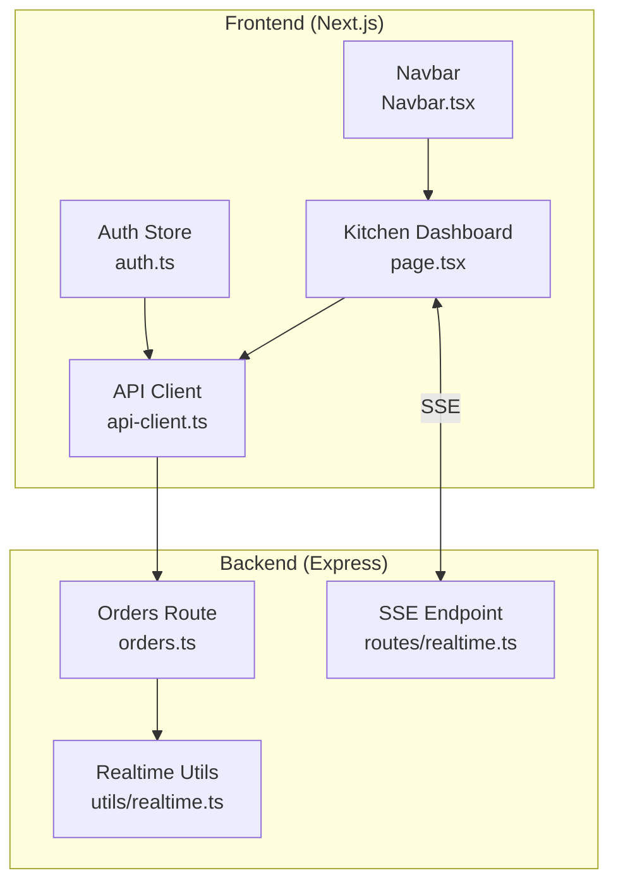
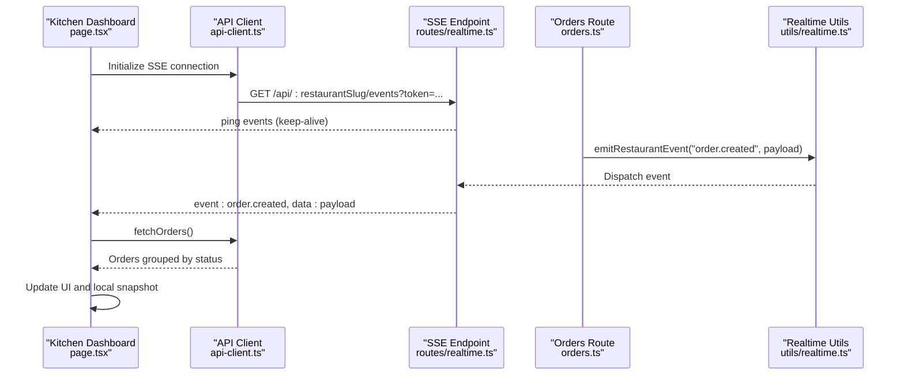
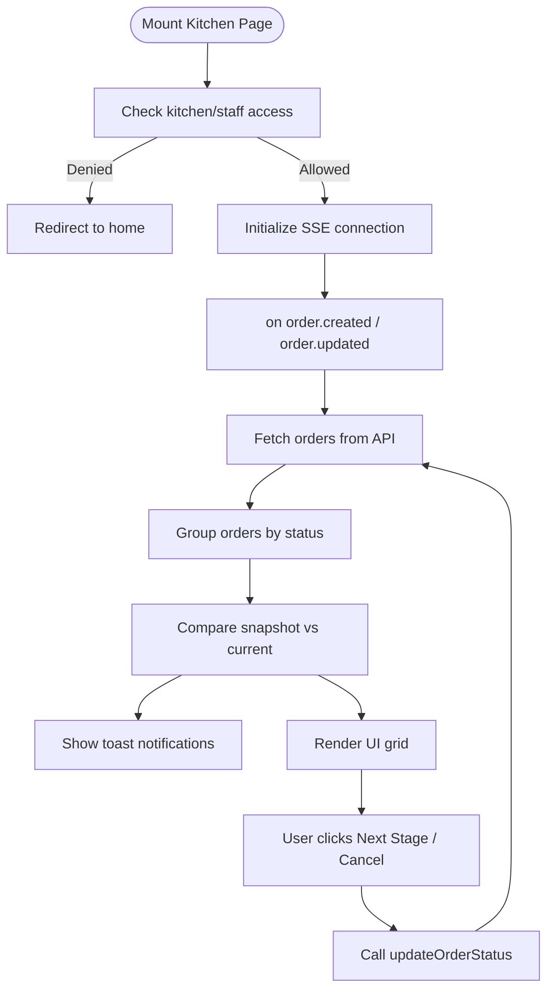
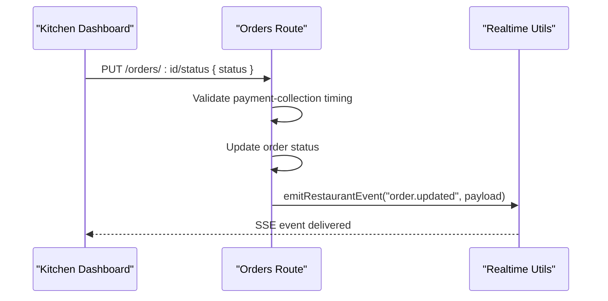
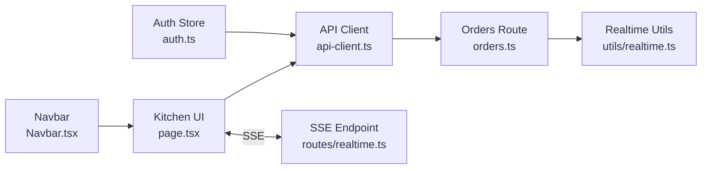

# Kitchen Display System

<cite>
**Referenced Files in This Document**
- [page.tsx](file://restaurant-frontend/src/app/kitchen/page.tsx)
- [api-client.ts](file://restaurant-frontend/src/lib/api-client.ts)
- [auth.ts](file://restaurant-frontend/src/store/auth.ts)
- [Navbar.tsx](file://restaurant-frontend/src/components/Navbar.tsx)
- [orders.ts](file://restaurant-backend/src/routes/orders.ts)
- [realtime.ts](file://restaurant-backend/src/utils/realtime.ts)
- [realtime.ts](file://restaurant-backend/src/routes/realtime.ts)
- [sampleData.ts](file://restaurant-backend/src/lib/sampleData.ts)
</cite>

## Table of Contents
1. [Introduction](#introduction)
2. [Project Structure](#project-structure)
3. [Core Components](#core-components)
4. [Architecture Overview](#architecture-overview)
5. [Detailed Component Analysis](#detailed-component-analysis)
6. [Dependency Analysis](#dependency-analysis)
7. [Performance Considerations](#performance-considerations)
8. [Troubleshooting Guide](#troubleshooting-guide)
9. [Conclusion](#conclusion)

## Introduction
This document describes the kitchen display system for DeQ-Bite’s real-time order management interface. It covers the kitchen dashboard implementation, live order updates, preparation status tracking, order prioritization, real-time visualization, order workflow management, staff interface capabilities, visual design patterns, backend-to-frontend integration, offline fallback mechanisms, and supervisor monitoring features.

## Project Structure
The kitchen display system spans two applications:
- Frontend (Next.js): Provides the kitchen dashboard UI, real-time updates via Server-Sent Events (SSE), and local snapshot caching for offline resilience.
- Backend (Express): Manages order lifecycle, emits real-time events, and exposes SSE endpoints for clients.

**Diagram sources**
- [page.tsx:1-259](file://restaurant-frontend/src/app/kitchen/page.tsx#L1-L259)
- [api-client.ts:1-894](file://restaurant-frontend/src/lib/api-client.ts#L1-L894)
- [auth.ts:1-177](file://restaurant-frontend/src/store/auth.ts#L1-L177)
- [Navbar.tsx:1-197](file://restaurant-frontend/src/components/Navbar.tsx#L1-L197)
- [orders.ts:1-694](file://restaurant-backend/src/routes/orders.ts#L1-L694)
- [realtime.ts:1-23](file://restaurant-backend/src/utils/realtime.ts#L1-L23)
- [realtime.ts:1-40](file://restaurant-backend/src/routes/realtime.ts#L1-L40)

**Section sources**
- [page.tsx:1-259](file://restaurant-frontend/src/app/kitchen/page.tsx#L1-L259)
- [api-client.ts:1-894](file://restaurant-frontend/src/lib/api-client.ts#L1-L894)
- [auth.ts:1-177](file://restaurant-frontend/src/store/auth.ts#L1-L177)
- [Navbar.tsx:1-197](file://restaurant-frontend/src/components/Navbar.tsx#L1-L197)
- [orders.ts:1-694](file://restaurant-backend/src/routes/orders.ts#L1-L694)
- [realtime.ts:1-23](file://restaurant-backend/src/utils/realtime.ts#L1-L23)
- [realtime.ts:1-40](file://restaurant-backend/src/routes/realtime.ts#L1-L40)

## Core Components
- Kitchen Dashboard (page.tsx): Renders live orders grouped by status, handles status transitions, and displays order details. Integrates SSE for real-time updates and local snapshot caching for offline resilience.
- API Client (api-client.ts): Encapsulates HTTP requests to backend endpoints, manages tenant-aware URLs, and provides typed interfaces for orders, users, and real-time events.
- Auth Store (auth.ts): Manages authentication state and integrates with local storage for persistence.
- Orders Route (orders.ts): Implements order lifecycle endpoints, enforces payment-collection timing rules, and emits real-time events on order creation and updates.
- Realtime Utilities (utils/realtime.ts): In-process event emitter for restaurant-scoped events.
- SSE Endpoint (routes/realtime.ts): Exposes an SSE endpoint that streams order events to authenticated kitchen clients.

**Section sources**
- [page.tsx:10-259](file://restaurant-frontend/src/app/kitchen/page.tsx#L10-L259)
- [api-client.ts:194-894](file://restaurant-frontend/src/lib/api-client.ts#L194-L894)
- [auth.ts:1-177](file://restaurant-frontend/src/store/auth.ts#L1-L177)
- [orders.ts:581-629](file://restaurant-backend/src/routes/orders.ts#L581-L629)
- [realtime.ts:1-23](file://restaurant-backend/src/utils/realtime.ts#L1-L23)
- [realtime.ts:1-40](file://restaurant-backend/src/routes/realtime.ts#L1-L40)

## Architecture Overview
The system uses a reactive architecture:
- Clients connect to the SSE endpoint to receive live order updates.
- Backend emits restaurant-scoped events upon order creation and status changes.
- Frontend updates the UI immediately and maintains a local snapshot to detect deltas for notifications.

**Diagram sources**
- [page.tsx:36-64](file://restaurant-frontend/src/app/kitchen/page.tsx#L36-L64)
- [api-client.ts:324-329](file://restaurant-frontend/src/lib/api-client.ts#L324-L329)
- [realtime.ts:9-37](file://restaurant-backend/src/routes/realtime.ts#L9-L37)
- [orders.ts:245-257](file://restaurant-backend/src/routes/orders.ts#L245-L257)
- [realtime.ts:12-17](file://restaurant-backend/src/utils/realtime.ts#L12-L17)

## Detailed Component Analysis

### Kitchen Dashboard (page.tsx)
Responsibilities:
- Role-based access control for kitchen/staff roles.
- Fetches restaurant orders and filters out completed/cancelled.
- Groups orders by status using a predefined flow.
- Subscribes to SSE events to auto-refresh on order changes.
- Local snapshot caching to compare previous and current statuses for toast notifications.
- Provides buttons to advance status or cancel orders.

Key behaviors:
- Status flow progression is enforced by advancing to the next status in sequence.
- Loading states and error handling via toast notifications.
- Responsive grid layout with distinct sections per status.

**Diagram sources**
- [page.tsx:12-133](file://restaurant-frontend/src/app/kitchen/page.tsx#L12-L133)
- [page.tsx:66-107](file://restaurant-frontend/src/app/kitchen/page.tsx#L66-L107)
- [page.tsx:109-114](file://restaurant-frontend/src/app/kitchen/page.tsx#L109-L114)

**Section sources**
- [page.tsx:10-259](file://restaurant-frontend/src/app/kitchen/page.tsx#L10-L259)

### API Client (api-client.ts)
Responsibilities:
- Tenant-aware routing via restaurant slug headers.
- SSE URL construction for the events endpoint.
- Typed order and user interfaces.
- HTTP methods for orders: create, list, get, update status, cancel, add items, apply coupon.

Integration points:
- Uses Authorization header from localStorage.
- Builds tenant-specific endpoints under /api/restaurants/:slug.

**Section sources**
- [api-client.ts:194-894](file://restaurant-frontend/src/lib/api-client.ts#L194-L894)

### Orders Route (orders.ts)
Responsibilities:
- Enforces payment-collection timing rules before allowing status progression.
- Emits real-time events on order creation and updates.
- Provides endpoints for:
  - Creating orders (starts as PENDING).
  - Updating order status (authorized roles).
  - Cancelling orders (only in eligible stages).
  - Adding items to ongoing orders.
  - Applying coupons to unpaid orders.

**Diagram sources**
- [orders.ts:581-629](file://restaurant-backend/src/routes/orders.ts#L581-L629)
- [orders.ts:245-257](file://restaurant-backend/src/routes/orders.ts#L245-L257)
- [realtime.ts:12-17](file://restaurant-backend/src/utils/realtime.ts#L12-L17)

**Section sources**
- [orders.ts:581-629](file://restaurant-backend/src/routes/orders.ts#L581-L629)
- [orders.ts:245-257](file://restaurant-backend/src/routes/orders.ts#L245-L257)

### Realtime Utilities and SSE Endpoint
Responsibilities:
- Realtime event emitter scoped by restaurantId.
- SSE endpoint that flushes headers, sends periodic ping events, and streams order events.

Behavior:
- Clients receive keep-alive pings and order events keyed by type.
- Listener cleanup on client disconnect.

**Section sources**
- [realtime.ts:1-23](file://restaurant-backend/src/utils/realtime.ts#L1-L23)
- [realtime.ts:9-37](file://restaurant-backend/src/routes/realtime.ts#L9-L37)

### Auth Store and Navigation
Responsibilities:
- Persist and hydrate authentication state.
- Enable kitchen navigation link based on restaurant role.
- Provide profile retrieval for role checks.

**Section sources**
- [auth.ts:1-177](file://restaurant-frontend/src/store/auth.ts#L1-L177)
- [Navbar.tsx:17-48](file://restaurant-frontend/src/components/Navbar.tsx#L17-L48)

### Sample Data (for development)
Includes sample orders demonstrating typical kitchen states (e.g., PREPARING, COMPLETED) and menu items with preparation times. Useful for UI testing and understanding data shapes.

**Section sources**
- [sampleData.ts:404-474](file://restaurant-backend/src/lib/sampleData.ts#L404-L474)

## Dependency Analysis
High-level dependencies:
- Kitchen dashboard depends on API client for HTTP and SSE URL construction.
- API client depends on environment configuration and tenant slugs.
- Orders route depends on database access and emits events via realtime utilities.
- SSE endpoint depends on realtime utilities and requires authentication and restaurant context.

**Diagram sources**
- [page.tsx:1-259](file://restaurant-frontend/src/app/kitchen/page.tsx#L1-L259)
- [api-client.ts:1-894](file://restaurant-frontend/src/lib/api-client.ts#L1-L894)
- [orders.ts:1-694](file://restaurant-backend/src/routes/orders.ts#L1-L694)
- [realtime.ts:1-23](file://restaurant-backend/src/utils/realtime.ts#L1-L23)
- [realtime.ts:1-40](file://restaurant-backend/src/routes/realtime.ts#L1-L40)
- [auth.ts:1-177](file://restaurant-frontend/src/store/auth.ts#L1-L177)
- [Navbar.tsx:1-197](file://restaurant-frontend/src/components/Navbar.tsx#L1-L197)

**Section sources**
- [page.tsx:1-259](file://restaurant-frontend/src/app/kitchen/page.tsx#L1-L259)
- [api-client.ts:1-894](file://restaurant-frontend/src/lib/api-client.ts#L1-L894)
- [orders.ts:1-694](file://restaurant-backend/src/routes/orders.ts#L1-L694)
- [realtime.ts:1-23](file://restaurant-backend/src/utils/realtime.ts#L1-L23)
- [realtime.ts:1-40](file://restaurant-backend/src/routes/realtime.ts#L1-L40)
- [auth.ts:1-177](file://restaurant-frontend/src/store/auth.ts#L1-L177)
- [Navbar.tsx:1-197](file://restaurant-frontend/src/components/Navbar.tsx#L1-L197)

## Performance Considerations
- SSE keep-alive pings reduce connection churn; ensure clients reconnect gracefully on network interruptions.
- Local snapshot caching minimizes redundant UI updates and reduces toast noise.
- Grouping orders by status avoids re-rendering the entire list on minor changes.
- API timeouts are configured to prevent long hangs; consider retry/backoff strategies for transient failures.

## Troubleshooting Guide
Common issues and resolutions:
- Unauthorized access to kitchen: Verify user restaurantRole and redirect behavior.
- No real-time updates: Confirm SSE initialization, token presence, and backend event emission.
- Status update blocked: Review payment-collection timing rules before advancing status.
- Offline scenarios: Local snapshot persists across reloads; ensure localStorage availability.

Operational checks:
- Confirm SSE endpoint responds with ping events and order events.
- Validate order status transitions align with the status flow.
- Inspect toast notifications for new order alerts and status changes.

**Section sources**
- [page.tsx:28-33](file://restaurant-frontend/src/app/kitchen/page.tsx#L28-L33)
- [page.tsx:41-64](file://restaurant-frontend/src/app/kitchen/page.tsx#L41-L64)
- [orders.ts:600-609](file://restaurant-backend/src/routes/orders.ts#L600-L609)

## Conclusion
The kitchen display system provides a robust, real-time interface for managing orders in DeQ-Bite. It combines SSE-driven updates, role-based access, local snapshot caching, and a clear status progression model to ensure smooth kitchen operations. The modular backend and frontend architecture supports maintainability and scalability for future enhancements such as supervisor dashboards and advanced analytics.