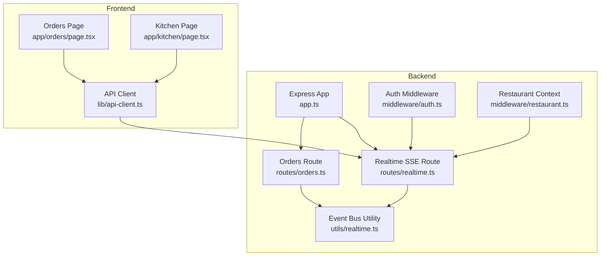
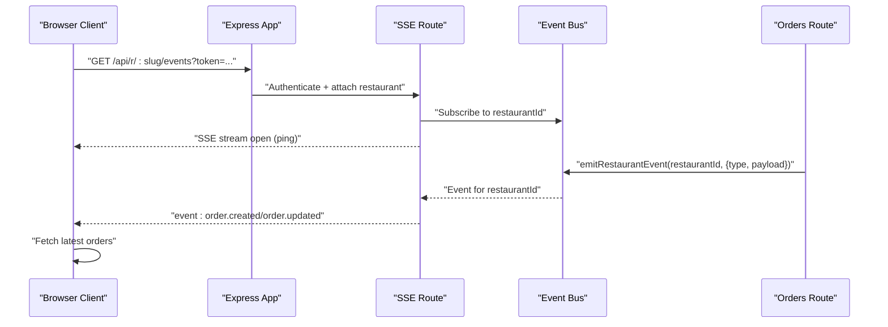
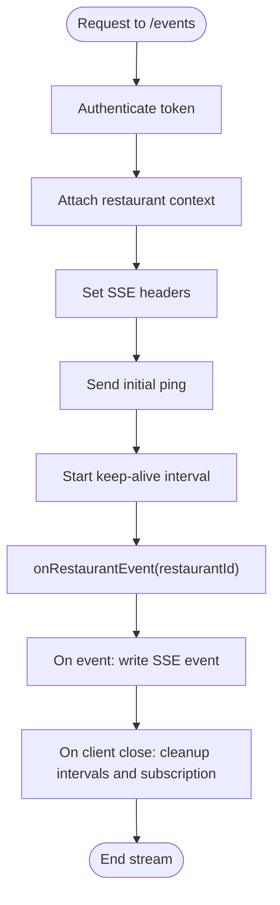
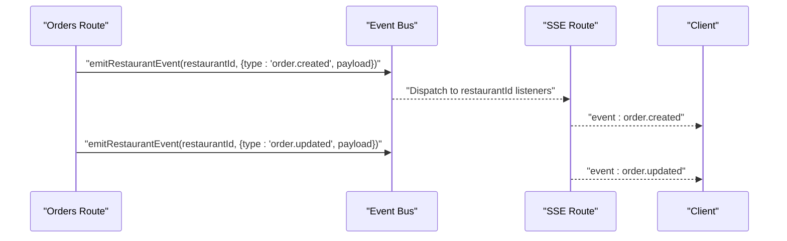
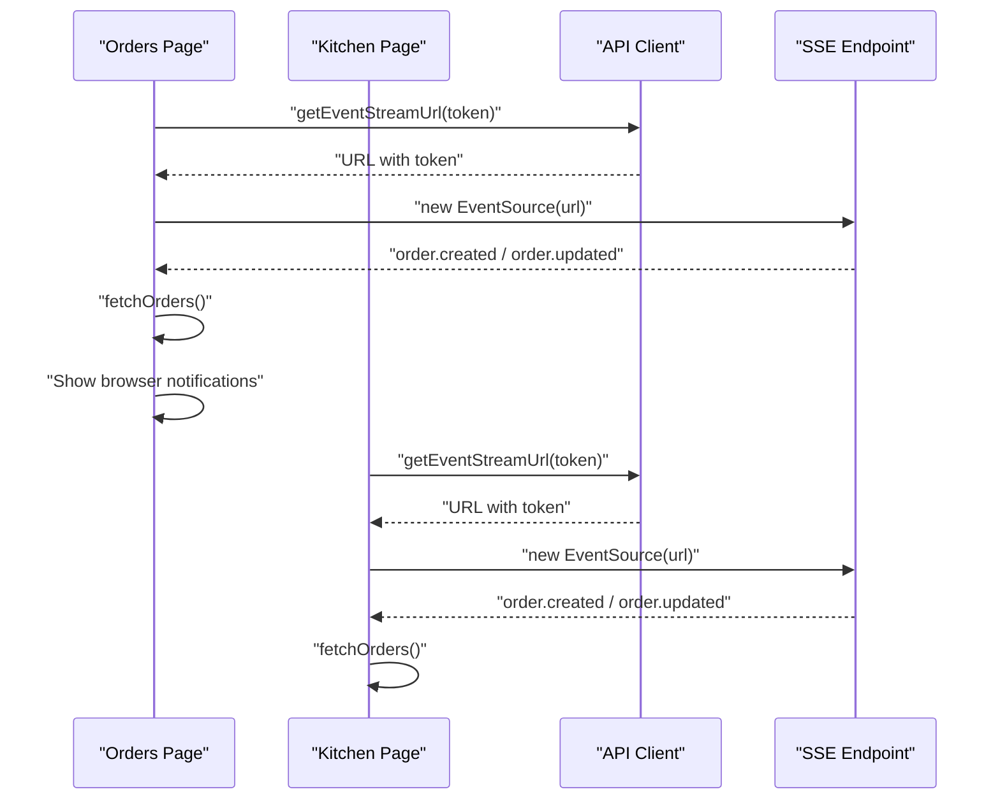
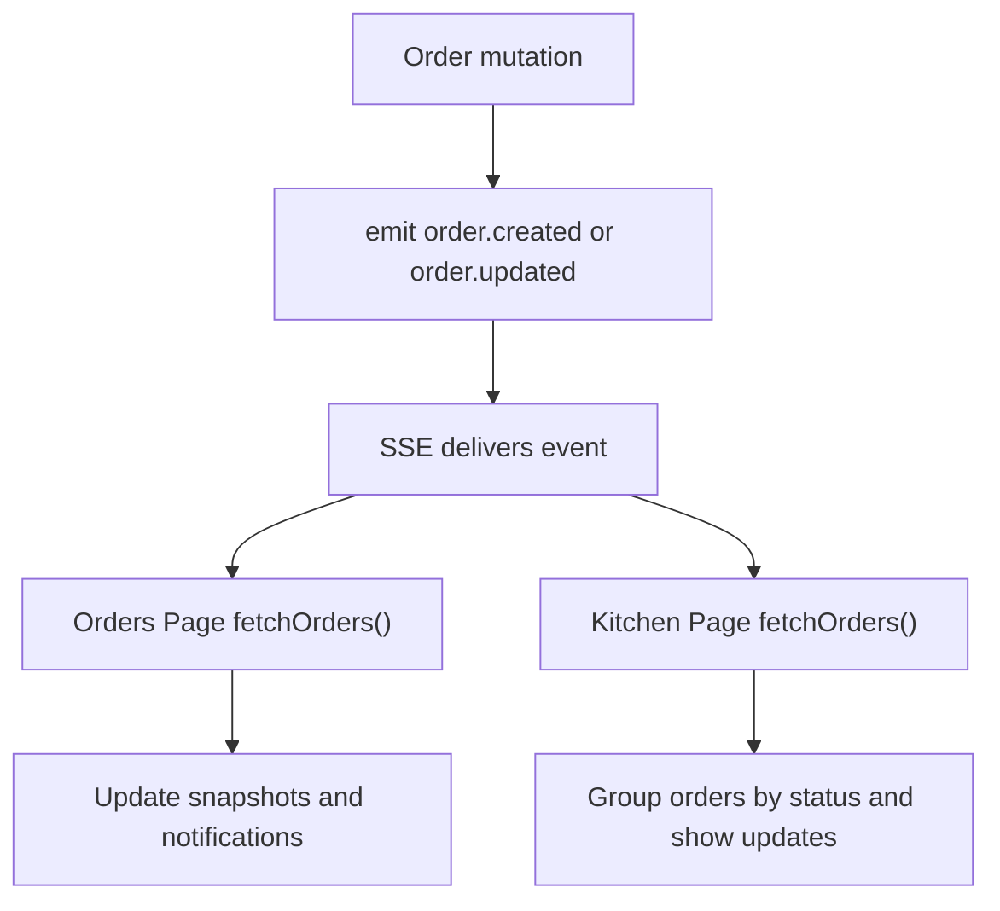
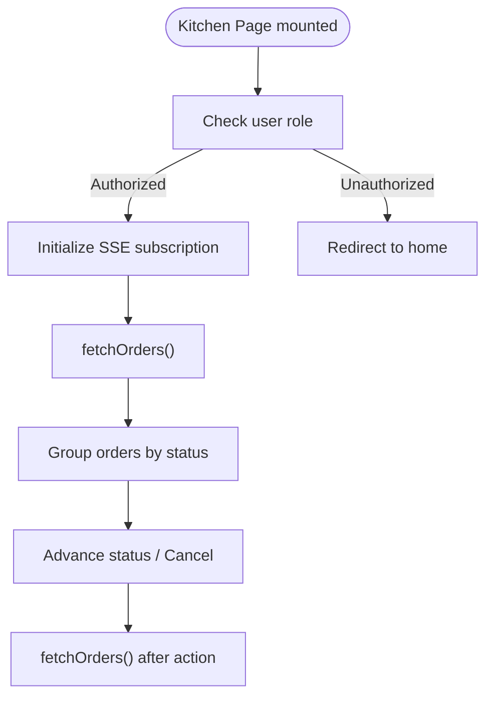
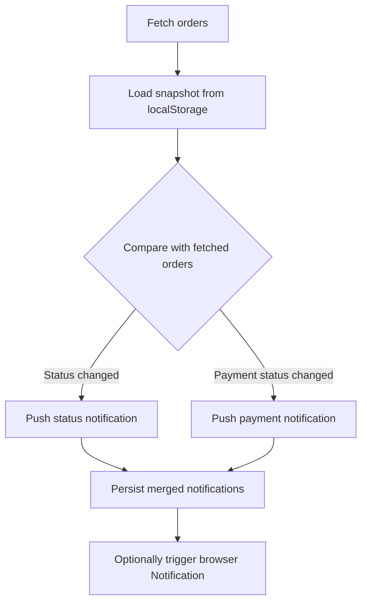
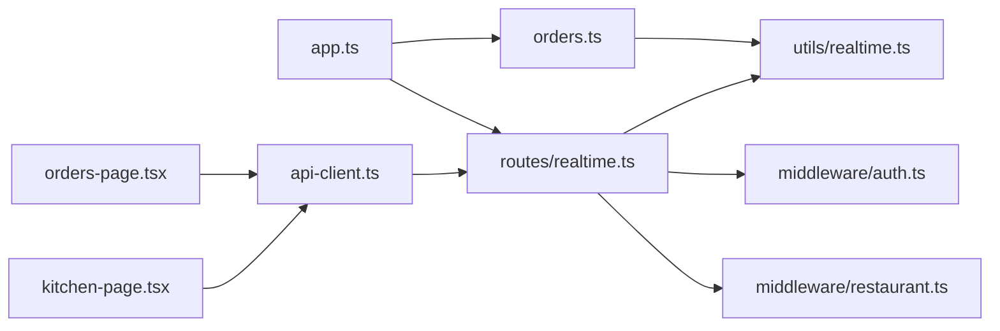

# Real-time Features

<cite>
**Referenced Files in This Document**
- [realtime.ts](file://restaurant-backend/src/routes/realtime.ts)
- [realtime.ts](file://restaurant-backend/src/utils/realtime.ts)
- [orders.ts](file://restaurant-backend/src/routes/orders.ts)
- [app.ts](file://restaurant-backend/src/app.ts)
- [server.ts](file://restaurant-backend/src/server.ts)
- [auth.ts](file://restaurant-backend/src/middleware/auth.ts)
- [restaurant.ts](file://restaurant-backend/src/middleware/restaurant.ts)
- [api-client.ts](file://restaurant-frontend/src/lib/api-client.ts)
- [orders-page.tsx](file://restaurant-frontend/src/app/orders/page.tsx)
- [kitchen-page.tsx](file://restaurant-frontend/src/app/kitchen/page.tsx)
</cite>

## Table of Contents
1. [Introduction](#introduction)
2. [Project Structure](#project-structure)
3. [Core Components](#core-components)
4. [Architecture Overview](#architecture-overview)
5. [Detailed Component Analysis](#detailed-component-analysis)
6. [Dependency Analysis](#dependency-analysis)
7. [Performance Considerations](#performance-considerations)
8. [Troubleshooting Guide](#troubleshooting-guide)
9. [Conclusion](#conclusion)

## Introduction
This document explains DeQ-Bite’s real-time features for live order updates, kitchen display, and notifications. It covers the event broadcasting architecture, client-server communication patterns, order tracking across channels, kitchen interface behavior, notification strategies, connection management, error recovery, scalability considerations, and performance optimization.

## Project Structure
The real-time system spans backend and frontend:
- Backend exposes a Server-Sent Events (SSE) endpoint and emits restaurant-scoped events.
- Frontend connects via EventSource to receive live updates and refreshes order lists.
- Orders route emits events on create, update, and status changes.

**Diagram sources**
- [app.ts](file://restaurant-backend/src/app.ts#L111-L124)
- [realtime.ts](file://restaurant-backend/src/routes/realtime.ts#L1-L39)
- [realtime.ts](file://restaurant-backend/src/utils/realtime.ts#L1-L23)
- [orders.ts](file://restaurant-backend/src/routes/orders.ts#L245-L257)
- [auth.ts](file://restaurant-backend/src/middleware/auth.ts#L7-L75)
- [restaurant.ts](file://restaurant-backend/src/middleware/restaurant.ts#L76-L200)
- [api-client.ts](file://restaurant-frontend/src/lib/api-client.ts#L324-L329)
- [orders-page.tsx](file://restaurant-frontend/src/app/orders/page.tsx#L43-L71)
- [kitchen-page.tsx](file://restaurant-frontend/src/app/kitchen/page.tsx#L34-L62)

**Section sources**
- [app.ts](file://restaurant-backend/src/app.ts#L111-L124)
- [realtime.ts](file://restaurant-backend/src/routes/realtime.ts#L1-L39)
- [realtime.ts](file://restaurant-backend/src/utils/realtime.ts#L1-L23)
- [orders.ts](file://restaurant-backend/src/routes/orders.ts#L245-L257)
- [api-client.ts](file://restaurant-frontend/src/lib/api-client.ts#L324-L329)
- [orders-page.tsx](file://restaurant-frontend/src/app/orders/page.tsx#L43-L71)
- [kitchen-page.tsx](file://restaurant-frontend/src/app/kitchen/page.tsx#L34-L62)

## Core Components
- SSE Endpoint: Serves Server-Sent Events for a restaurant context, sending periodic pings and forwarding emitted events.
- Event Bus: In-process EventEmitter keyed by restaurantId to fan out events to connected clients.
- Orders Route: Emits order lifecycle events (created, updated) after mutations.
- Frontend Pages: Subscribe to SSE and refresh order lists to reflect live changes.
- Authentication and Tenant Context: Ensures SSE requires a valid token and binds a restaurant context.

Key responsibilities:
- Emit events from business logic (orders).
- Deliver events to subscribed clients via SSE.
- Update UI reactively on order changes.

**Section sources**
- [realtime.ts](file://restaurant-backend/src/routes/realtime.ts#L10-L37)
- [realtime.ts](file://restaurant-backend/src/utils/realtime.ts#L12-L22)
- [orders.ts](file://restaurant-backend/src/routes/orders.ts#L245-L257)
- [orders-page.tsx](file://restaurant-frontend/src/app/orders/page.tsx#L43-L71)
- [kitchen-page.tsx](file://restaurant-frontend/src/app/kitchen/page.tsx#L34-L62)
- [auth.ts](file://restaurant-backend/src/middleware/auth.ts#L7-L75)
- [restaurant.ts](file://restaurant-backend/src/middleware/restaurant.ts#L76-L200)

## Architecture Overview
The real-time architecture uses SSE for one-way server-to-client updates. Clients connect to a tenant-scoped SSE endpoint and receive events for their restaurant context.

**Diagram sources**
- [realtime.ts](file://restaurant-backend/src/routes/realtime.ts#L10-L37)
- [realtime.ts](file://restaurant-backend/src/utils/realtime.ts#L12-L22)
- [orders.ts](file://restaurant-backend/src/routes/orders.ts#L245-L257)
- [api-client.ts](file://restaurant-frontend/src/lib/api-client.ts#L324-L329)
- [orders-page.tsx](file://restaurant-frontend/src/app/orders/page.tsx#L43-L71)
- [kitchen-page.tsx](file://restaurant-frontend/src/app/kitchen/page.tsx#L34-L62)

## Detailed Component Analysis

### SSE Endpoint and Event Broadcasting
- Endpoint: GET /api/r/:restaurantSlug/events
- Authentication: Requires a valid bearer token.
- Restaurant Context: Requires a restaurant context (slug/subdomain/param).
- Streaming: Sets SSE headers, sends periodic ping events, writes incoming events, and cleans up on close.

**Diagram sources**
- [realtime.ts](file://restaurant-backend/src/routes/realtime.ts#L10-L37)
- [auth.ts](file://restaurant-backend/src/middleware/auth.ts#L7-L75)
- [restaurant.ts](file://restaurant-backend/src/middleware/restaurant.ts#L76-L200)

**Section sources**
- [realtime.ts](file://restaurant-backend/src/routes/realtime.ts#L10-L37)
- [auth.ts](file://restaurant-backend/src/middleware/auth.ts#L7-L75)
- [restaurant.ts](file://restaurant-backend/src/middleware/restaurant.ts#L76-L200)

### Event Bus and Order Lifecycle Events
- Event Bus: EventEmitter keyed by restaurantId; listeners are attached per connection.
- Order Events:
  - Created: Emitted after a new order is created.
  - Updated: Emitted after order updates (add items, apply coupon, status change, cancel).

**Diagram sources**
- [realtime.ts](file://restaurant-backend/src/utils/realtime.ts#L12-L22)
- [orders.ts](file://restaurant-backend/src/routes/orders.ts#L245-L257)
- [orders.ts](file://restaurant-backend/src/routes/orders.ts#L381-L384)
- [orders.ts](file://restaurant-backend/src/routes/orders.ts#L481-L484)
- [orders.ts](file://restaurant-backend/src/routes/orders.ts#L620-L623)
- [orders.ts](file://restaurant-backend/src/routes/orders.ts#L682-L685)

**Section sources**
- [realtime.ts](file://restaurant-backend/src/utils/realtime.ts#L12-L22)
- [orders.ts](file://restaurant-backend/src/routes/orders.ts#L245-L257)
- [orders.ts](file://restaurant-backend/src/routes/orders.ts#L381-L384)
- [orders.ts](file://restaurant-backend/src/routes/orders.ts#L481-L484)
- [orders.ts](file://restaurant-backend/src/routes/orders.ts#L620-L623)
- [orders.ts](file://restaurant-backend/src/routes/orders.ts#L682-L685)

### Frontend Integration Patterns
- Orders Page:
  - Subscribes to SSE events for order.created and order.updated.
  - Periodically fetches orders to reconcile state.
  - Uses browser Notifications when permission is granted.
- Kitchen Page:
  - Subscribes to SSE events to refresh kitchen queues.
  - Manages order status transitions and cancellations.

**Diagram sources**
- [api-client.ts](file://restaurant-frontend/src/lib/api-client.ts#L324-L329)
- [orders-page.tsx](file://restaurant-frontend/src/app/orders/page.tsx#L43-L71)
- [kitchen-page.tsx](file://restaurant-frontend/src/app/kitchen/page.tsx#L34-L62)

**Section sources**
- [orders-page.tsx](file://restaurant-frontend/src/app/orders/page.tsx#L43-L71)
- [orders-page.tsx](file://restaurant-frontend/src/app/orders/page.tsx#L90-L150)
- [kitchen-page.tsx](file://restaurant-frontend/src/app/kitchen/page.tsx#L34-L62)
- [kitchen-page.tsx](file://restaurant-frontend/src/app/kitchen/page.tsx#L115-L146)
- [api-client.ts](file://restaurant-frontend/src/lib/api-client.ts#L324-L329)

### Real-time Order Tracking Across Channels
- Event Types:
  - order.created: New orders awaiting confirmation.
  - order.updated: Status changes, payment status changes, cancellations.
- Client Behavior:
  - Orders Page: Displays notifications and updates order list snapshots.
  - Kitchen Page: Groups orders by status and advances stages.

**Diagram sources**
- [orders.ts](file://restaurant-backend/src/routes/orders.ts#L245-L257)
- [orders.ts](file://restaurant-backend/src/routes/orders.ts#L381-L384)
- [orders.ts](file://restaurant-backend/src/routes/orders.ts#L481-L484)
- [orders.ts](file://restaurant-backend/src/routes/orders.ts#L620-L623)
- [orders.ts](file://restaurant-backend/src/routes/orders.ts#L682-L685)
- [orders-page.tsx](file://restaurant-frontend/src/app/orders/page.tsx#L90-L150)
- [kitchen-page.tsx](file://restaurant-frontend/src/app/kitchen/page.tsx#L64-L105)

**Section sources**
- [orders.ts](file://restaurant-backend/src/routes/orders.ts#L245-L257)
- [orders.ts](file://restaurant-backend/src/routes/orders.ts#L381-L384)
- [orders.ts](file://restaurant-backend/src/routes/orders.ts#L481-L484)
- [orders.ts](file://restaurant-backend/src/routes/orders.ts#L620-L623)
- [orders.ts](file://restaurant-backend/src/routes/orders.ts#L682-L685)
- [orders-page.tsx](file://restaurant-frontend/src/app/orders/page.tsx#L90-L150)
- [kitchen-page.tsx](file://restaurant-frontend/src/app/kitchen/page.tsx#L64-L105)

### Kitchen Interface Implementation
- Access Control: Only users with OWNER, ADMIN, or STAFF roles can access the kitchen page.
- Live Updates: Subscribes to SSE and refreshes order lists.
- Status Management: Provides buttons to move orders to the next status or cancel.

**Diagram sources**
- [kitchen-page.tsx](file://restaurant-frontend/src/app/kitchen/page.tsx#L12-L32)
- [kitchen-page.tsx](file://restaurant-frontend/src/app/kitchen/page.tsx#L34-L62)
- [kitchen-page.tsx](file://restaurant-frontend/src/app/kitchen/page.tsx#L115-L146)

**Section sources**
- [kitchen-page.tsx](file://restaurant-frontend/src/app/kitchen/page.tsx#L12-L32)
- [kitchen-page.tsx](file://restaurant-frontend/src/app/kitchen/page.tsx#L34-L62)
- [kitchen-page.tsx](file://restaurant-frontend/src/app/kitchen/page.tsx#L115-L146)

### Notification System
- Orders Page:
  - Maintains a local snapshot of order status and payment status.
  - Compares with fetched data to generate notifications.
  - Uses browser Notifications when permission is granted.
- Kitchen Page:
  - Uses toast notifications for actions and updates.

**Diagram sources**
- [orders-page.tsx](file://restaurant-frontend/src/app/orders/page.tsx#L90-L150)

**Section sources**
- [orders-page.tsx](file://restaurant-frontend/src/app/orders/page.tsx#L90-L150)

## Dependency Analysis
- Backend dependencies:
  - Express app mounts tenant-aware routers and SSE route.
  - SSE route depends on authentication and restaurant context middleware.
  - Orders route emits events via the event bus.
- Frontend dependencies:
  - API client builds tenant URLs and attaches token and restaurant slug.
  - Pages subscribe to SSE and fetch orders.

**Diagram sources**
- [orders.ts](file://restaurant-backend/src/routes/orders.ts#L245-L257)
- [realtime.ts](file://restaurant-backend/src/utils/realtime.ts#L12-L22)
- [realtime.ts](file://restaurant-backend/src/routes/realtime.ts#L10-L37)
- [auth.ts](file://restaurant-backend/src/middleware/auth.ts#L7-L75)
- [restaurant.ts](file://restaurant-backend/src/middleware/restaurant.ts#L76-L200)
- [app.ts](file://restaurant-backend/src/app.ts#L111-L124)
- [api-client.ts](file://restaurant-frontend/src/lib/api-client.ts#L324-L329)
- [orders-page.tsx](file://restaurant-frontend/src/app/orders/page.tsx#L43-L71)
- [kitchen-page.tsx](file://restaurant-frontend/src/app/kitchen/page.tsx#L34-L62)

**Section sources**
- [app.ts](file://restaurant-backend/src/app.ts#L111-L124)
- [realtime.ts](file://restaurant-backend/src/routes/realtime.ts#L10-L37)
- [realtime.ts](file://restaurant-backend/src/utils/realtime.ts#L12-L22)
- [orders.ts](file://restaurant-backend/src/routes/orders.ts#L245-L257)
- [api-client.ts](file://restaurant-frontend/src/lib/api-client.ts#L324-L329)
- [orders-page.tsx](file://restaurant-frontend/src/app/orders/page.tsx#L43-L71)
- [kitchen-page.tsx](file://restaurant-frontend/src/app/kitchen/page.tsx#L34-L62)

## Performance Considerations
- SSE Keep-alive: Periodic ping events maintain connection liveness and help detect dead connections.
- Event volume: Limit event frequency by emitting only meaningful changes (created/updated).
- Client polling: Orders pages poll periodically to reconcile state; adjust intervals based on load.
- Payload size: Keep event payloads minimal (order identifiers and essential fields).
- Connection reuse: Reuse a single EventSource per page; avoid multiple concurrent subscriptions.
- Backend scaling: EventEmitter is in-process; for horizontal scaling, replace with a distributed pub/sub (e.g., Redis) and reverse proxy to distribute clients across instances.

[No sources needed since this section provides general guidance]

## Troubleshooting Guide
- Connection drops:
  - SSE reconnects automatically via browser EventSource; ensure backend keeps-alive pings are sent.
  - Verify authentication token is present and valid; token extraction supports headers, body, and query parameters.
- No events received:
  - Confirm restaurant context is attached (slug/subdomain/param).
  - Ensure the SSE URL includes a valid token query parameter.
  - Check that the restaurantId matches the authenticated restaurant context.
- Frequent re-fetches:
  - Orders pages rely on SSE plus periodic polling; reduce polling interval if acceptable.
- Notifications not appearing:
  - Browser Notification permission must be granted; handle unsupported environments.
  - Local storage snapshots must be readable; clear and regenerate if corrupted.

**Section sources**
- [realtime.ts](file://restaurant-backend/src/routes/realtime.ts#L10-L37)
- [auth.ts](file://restaurant-backend/src/middleware/auth.ts#L7-L75)
- [restaurant.ts](file://restaurant-backend/src/middleware/restaurant.ts#L76-L200)
- [orders-page.tsx](file://restaurant-frontend/src/app/orders/page.tsx#L73-L88)
- [orders-page.tsx](file://restaurant-frontend/src/app/orders/page.tsx#L90-L150)

## Conclusion
DeQ-Bite’s real-time system leverages SSE for low-latency, restaurant-scoped updates. Business logic emits order events, which are broadcast to subscribed clients. Frontend pages subscribe to SSE and refresh order lists to keep the UI synchronized. With proper authentication, tenant scoping, and client-side reconciliation, the system provides responsive order tracking for customers and kitchen staff. For scale-out deployments, consider replacing the in-process event bus with a distributed pub/sub solution.