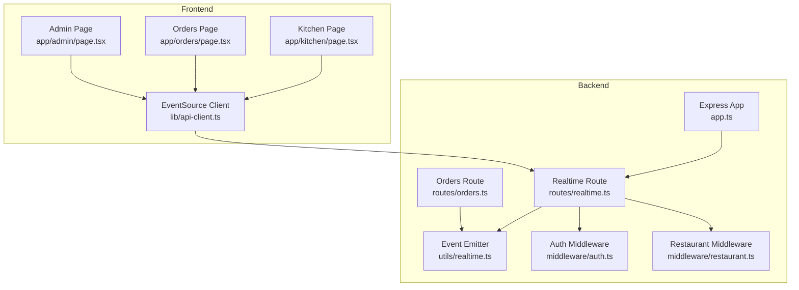
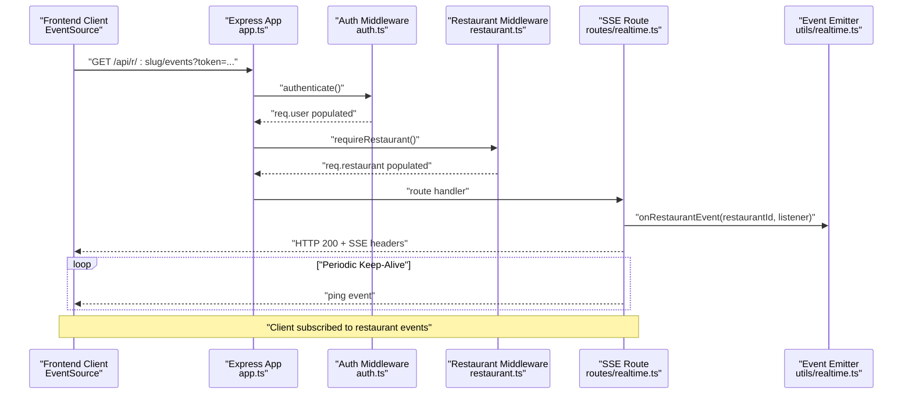
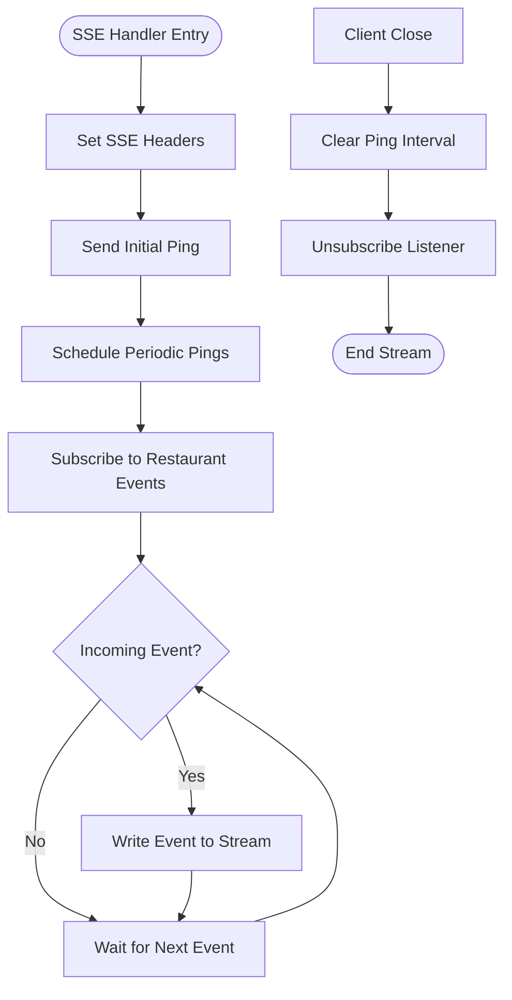
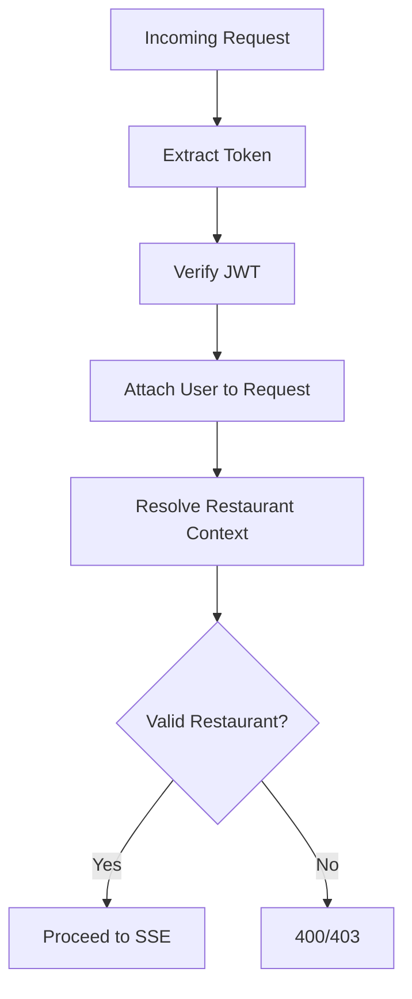
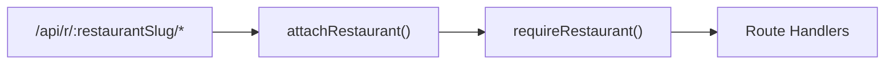
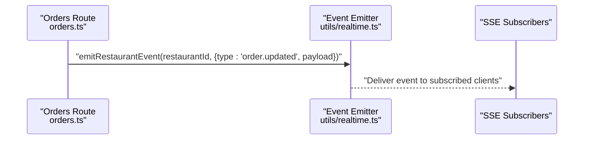
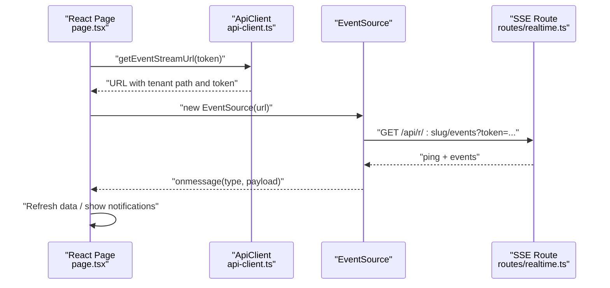
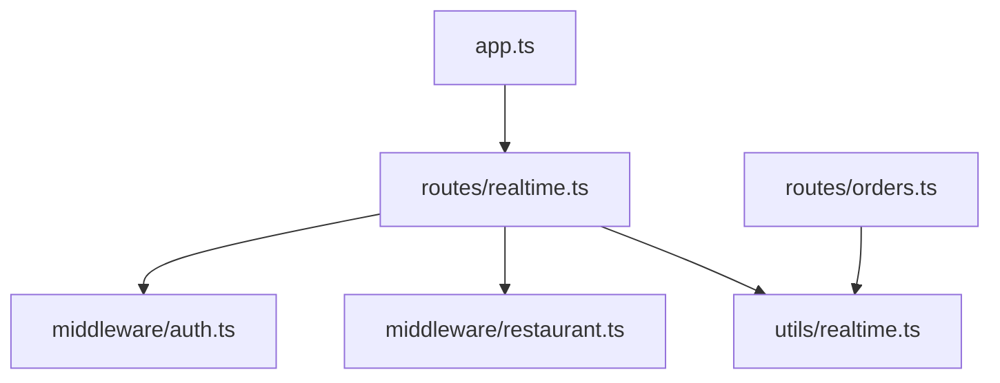

# WebSocket Implementation

<cite>
**Referenced Files in This Document**
- [realtime.ts](file://restaurant-backend/src/utils/realtime.ts)
- [realtime.ts](file://restaurant-backend/src/routes/realtime.ts)
- [app.ts](file://restaurant-backend/src/app.ts)
- [server.ts](file://restaurant-backend/src/server.ts)
- [auth.ts](file://restaurant-backend/src/middleware/auth.ts)
- [restaurant.ts](file://restaurant-backend/src/middleware/restaurant.ts)
- [orders.ts](file://restaurant-backend/src/routes/orders.ts)
- [api-client.ts](file://restaurant-frontend/src/lib/api-client.ts)
- [page.tsx](file://restaurant-frontend/src/app/kitchen/page.tsx)
- [page.tsx](file://restaurant-frontend/src/app/orders/page.tsx)
- [page.tsx](file://restaurant-frontend/src/app/admin/page.tsx)
</cite>

## Table of Contents
1. [Introduction](#introduction)
2. [Project Structure](#project-structure)
3. [Core Components](#core-components)
4. [Architecture Overview](#architecture-overview)
5. [Detailed Component Analysis](#detailed-component-analysis)
6. [Dependency Analysis](#dependency-analysis)
7. [Performance Considerations](#performance-considerations)
8. [Troubleshooting Guide](#troubleshooting-guide)
9. [Conclusion](#conclusion)

## Introduction
This document explains the real-time communication system in DeQ-Bite, focusing on the event-driven architecture that powers live updates for restaurant operations. The system currently uses Server-Sent Events (SSE) via an Express route to deliver real-time events to authenticated clients. It covers server setup, connection lifecycle, authentication and authorization, routing per restaurant context, event emission, and practical guidance for scaling and reliability.

## Project Structure
The real-time subsystem spans backend and frontend:
- Backend: Express application mounts an SSE route under tenant-aware paths, with middleware enforcing authentication and restaurant context.
- Frontend: React pages establish an EventSource connection to the SSE endpoint and listen for order-related events.

**Diagram sources**
- [app.ts](file://restaurant-backend/src/app.ts#L107-L124)
- [realtime.ts](file://restaurant-backend/src/routes/realtime.ts#L1-L39)
- [realtime.ts](file://restaurant-backend/src/utils/realtime.ts#L1-L23)
- [auth.ts](file://restaurant-backend/src/middleware/auth.ts#L1-L137)
- [restaurant.ts](file://restaurant-backend/src/middleware/restaurant.ts#L1-L246)
- [orders.ts](file://restaurant-backend/src/routes/orders.ts#L582-L626)
- [api-client.ts](file://restaurant-frontend/src/lib/api-client.ts#L324-L329)
- [page.tsx](file://restaurant-frontend/src/app/kitchen/page.tsx#L36-L62)
- [page.tsx](file://restaurant-frontend/src/app/orders/page.tsx#L30-L73)
- [page.tsx](file://restaurant-frontend/src/app/admin/page.tsx#L66-L93)

**Section sources**
- [app.ts](file://restaurant-backend/src/app.ts#L107-L124)
- [realtime.ts](file://restaurant-backend/src/routes/realtime.ts#L1-L39)
- [realtime.ts](file://restaurant-backend/src/utils/realtime.ts#L1-L23)
- [auth.ts](file://restaurant-backend/src/middleware/auth.ts#L1-L137)
- [restaurant.ts](file://restaurant-backend/src/middleware/restaurant.ts#L1-L246)
- [api-client.ts](file://restaurant-frontend/src/lib/api-client.ts#L324-L329)
- [page.tsx](file://restaurant-frontend/src/app/kitchen/page.tsx#L36-L62)
- [page.tsx](file://restaurant-frontend/src/app/orders/page.tsx#L30-L73)
- [page.tsx](file://restaurant-frontend/src/app/admin/page.tsx#L66-L93)

## Core Components
- Event Emitter: A lightweight EventEmitter keyed by restaurantId to fan out events to connected clients.
- SSE Route: An Express GET endpoint that streams events to authenticated users within a restaurant context.
- Authentication and Authorization: JWT-based authentication and restaurant membership checks.
- Tenant Routing: Path-based routing under /api/r/:restaurantSlug to isolate contexts.
- Client Integration: EventSource-based clients in frontend pages subscribe to the SSE stream.

Key responsibilities:
- Emit events from business logic (e.g., order updates) and route them to the correct restaurant channel.
- Enforce authentication and restaurant membership before establishing the stream.
- Provide keep-alive pings and graceful cleanup on client disconnect.

**Section sources**
- [realtime.ts](file://restaurant-backend/src/utils/realtime.ts#L1-L23)
- [realtime.ts](file://restaurant-backend/src/routes/realtime.ts#L1-L39)
- [auth.ts](file://restaurant-backend/src/middleware/auth.ts#L1-L137)
- [restaurant.ts](file://restaurant-backend/src/middleware/restaurant.ts#L202-L211)
- [app.ts](file://restaurant-backend/src/app.ts#L111-L124)
- [orders.ts](file://restaurant-backend/src/routes/orders.ts#L620-L623)
- [api-client.ts](file://restaurant-frontend/src/lib/api-client.ts#L324-L329)
- [page.tsx](file://restaurant-frontend/src/app/kitchen/page.tsx#L36-L62)

## Architecture Overview
The real-time pipeline connects clients to the backend via SSE. Clients authenticate and specify a restaurant context; the server validates and streams events scoped to that restaurant.

**Diagram sources**
- [app.ts](file://restaurant-backend/src/app.ts#L111-L124)
- [auth.ts](file://restaurant-backend/src/middleware/auth.ts#L7-L75)
- [restaurant.ts](file://restaurant-backend/src/middleware/restaurant.ts#L202-L211)
- [realtime.ts](file://restaurant-backend/src/routes/realtime.ts#L10-L37)
- [realtime.ts](file://restaurant-backend/src/utils/realtime.ts#L19-L22)
- [api-client.ts](file://restaurant-frontend/src/lib/api-client.ts#L324-L329)

## Detailed Component Analysis

### Event Emitter and SSE Route
- The emitter stores listeners per restaurantId and emits events when emitted by business logic.
- The SSE route sets streaming headers, sends an initial ping, schedules periodic pings, subscribes to events for the current restaurant, and cleans up on close.

**Diagram sources**
- [realtime.ts](file://restaurant-backend/src/routes/realtime.ts#L10-L37)
- [realtime.ts](file://restaurant-backend/src/utils/realtime.ts#L19-L22)

**Section sources**
- [realtime.ts](file://restaurant-backend/src/utils/realtime.ts#L1-L23)
- [realtime.ts](file://restaurant-backend/src/routes/realtime.ts#L1-L39)

### Authentication and Authorization
- Authentication middleware extracts tokens from headers/body/query, verifies JWT, and attaches user info to the request.
- Restaurant middleware resolves the active restaurant from headers, path, or subdomain, ensuring the client targets a valid, active restaurant.
- The SSE route composes these middlewares to ensure only authenticated restaurant users receive events.

**Diagram sources**
- [auth.ts](file://restaurant-backend/src/middleware/auth.ts#L7-L75)
- [restaurant.ts](file://restaurant-backend/src/middleware/restaurant.ts#L76-L200)
- [realtime.ts](file://restaurant-backend/src/routes/realtime.ts#L10-L10)

**Section sources**
- [auth.ts](file://restaurant-backend/src/middleware/auth.ts#L1-L137)
- [restaurant.ts](file://restaurant-backend/src/middleware/restaurant.ts#L1-L246)
- [realtime.ts](file://restaurant-backend/src/routes/realtime.ts#L1-L39)

### Tenant Routing and Restaurant Context
- Tenant routes are mounted under /api/r/:restaurantSlug, enabling per-restaurant isolation.
- Restaurant middleware supports slug, subdomain, or path-based identification and filters by active status and approval where applicable.

**Diagram sources**
- [app.ts](file://restaurant-backend/src/app.ts#L111-L124)
- [restaurant.ts](file://restaurant-backend/src/middleware/restaurant.ts#L76-L200)

**Section sources**
- [app.ts](file://restaurant-backend/src/app.ts#L111-L124)
- [restaurant.ts](file://restaurant-backend/src/middleware/restaurant.ts#L1-L246)

### Event Emission from Business Logic
- When order status changes, the orders route emits a restaurant-scoped event that downstream consumers (e.g., SSE subscribers) receive.

**Diagram sources**
- [orders.ts](file://restaurant-backend/src/routes/orders.ts#L620-L623)
- [realtime.ts](file://restaurant-backend/src/utils/realtime.ts#L12-L17)

**Section sources**
- [orders.ts](file://restaurant-backend/src/routes/orders.ts#L620-L623)
- [realtime.ts](file://restaurant-backend/src/utils/realtime.ts#L1-L23)

### Client Integration Patterns
- Frontend pages create an EventSource pointing to the SSE endpoint built with the tenant path and token query parameter.
- They listen for specific event types (e.g., order.created, order.updated) and refresh data accordingly.
- Automatic reconnection is handled by the browser’s EventSource implementation.

**Diagram sources**
- [api-client.ts](file://restaurant-frontend/src/lib/api-client.ts#L324-L329)
- [page.tsx](file://restaurant-frontend/src/app/kitchen/page.tsx#L36-L62)
- [page.tsx](file://restaurant-frontend/src/app/orders/page.tsx#L30-L73)
- [page.tsx](file://restaurant-frontend/src/app/admin/page.tsx#L66-L93)
- [realtime.ts](file://restaurant-backend/src/routes/realtime.ts#L10-L37)

**Section sources**
- [api-client.ts](file://restaurant-frontend/src/lib/api-client.ts#L324-L329)
- [page.tsx](file://restaurant-frontend/src/app/kitchen/page.tsx#L36-L62)
- [page.tsx](file://restaurant-frontend/src/app/orders/page.tsx#L30-L73)
- [page.tsx](file://restaurant-frontend/src/app/admin/page.tsx#L66-L93)
- [realtime.ts](file://restaurant-backend/src/routes/realtime.ts#L1-L39)

## Dependency Analysis
- The SSE route depends on authentication and restaurant middleware to validate the request.
- The event emitter is a central hub for decoupling business logic from delivery mechanisms.
- Tenant routing ensures isolation across restaurants.

**Diagram sources**
- [realtime.ts](file://restaurant-backend/src/routes/realtime.ts#L1-L6)
- [auth.ts](file://restaurant-backend/src/middleware/auth.ts#L1-L6)
- [restaurant.ts](file://restaurant-backend/src/middleware/restaurant.ts#L1-L6)
- [realtime.ts](file://restaurant-backend/src/utils/realtime.ts#L1-L1)
- [orders.ts](file://restaurant-backend/src/routes/orders.ts#L620-L623)
- [app.ts](file://restaurant-backend/src/app.ts#L111-L124)

**Section sources**
- [realtime.ts](file://restaurant-backend/src/routes/realtime.ts#L1-L6)
- [auth.ts](file://restaurant-backend/src/middleware/auth.ts#L1-L6)
- [restaurant.ts](file://restaurant-backend/src/middleware/restaurant.ts#L1-L6)
- [realtime.ts](file://restaurant-backend/src/utils/realtime.ts#L1-L1)
- [orders.ts](file://restaurant-backend/src/routes/orders.ts#L620-L623)
- [app.ts](file://restaurant-backend/src/app.ts#L111-L124)

## Performance Considerations
- SSE streaming: Efficient for many long-lived connections; minimal overhead compared to WebSockets for unidirectional server-to-client updates.
- Keep-alive pings: Prevent premature connection drops behind proxies/load balancers.
- Memory management: Listeners are attached per connection; ensure cleanup on close to avoid leaks.
- Scalability: For high concurrency, consider horizontal scaling with sticky sessions or a message broker (e.g., Redis) to fan out events across instances.
- Backpressure: SSE writes are synchronous; ensure event payloads are concise and avoid blocking the event loop.

[No sources needed since this section provides general guidance]

## Troubleshooting Guide
Common issues and resolutions:
- Authentication failures: Verify token presence and validity; ensure JWT_SECRET is configured in production.
- Restaurant context missing: Confirm x-restaurant-slug/x-restaurant-subdomain headers or path-based slug resolution.
- Connection drops: Check keep-alive pings and network timeouts; ensure load balancer/proxy supports SSE.
- Excessive listeners: EventEmitter.setMaxListeners(0) disables limits; monitor listener growth and ensure proper cleanup.
- Graceful shutdown: SIGTERM/SIGINT handlers in server.ts ensure clean process termination.

**Section sources**
- [auth.ts](file://restaurant-backend/src/middleware/auth.ts#L33-L75)
- [restaurant.ts](file://restaurant-backend/src/middleware/restaurant.ts#L85-L100)
- [realtime.ts](file://restaurant-backend/src/routes/realtime.ts#L17-L37)
- [realtime.ts](file://restaurant-backend/src/utils/realtime.ts#L9-L10)
- [server.ts](file://restaurant-backend/src/server.ts#L7-L15)

## Conclusion
DeQ-Bite’s real-time system leverages SSE with an EventEmitter-based event bus to deliver scoped, low-latency updates to authenticated restaurant users. The design balances simplicity, maintainability, and performance while supporting tenant isolation and graceful connection handling. For future enhancements, consider adding WebSocket support alongside SSE, implementing exponential backoff for clients, and integrating a distributed pub/sub layer for multi-instance deployments.