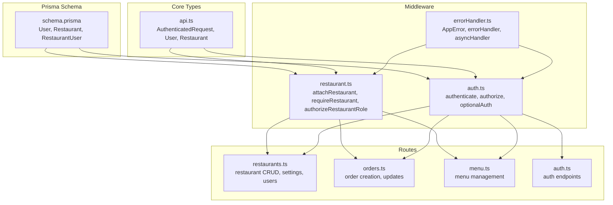
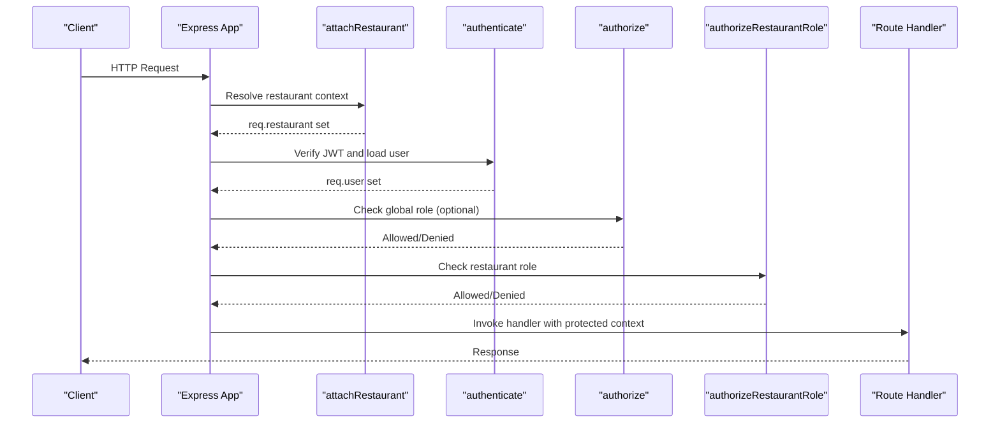
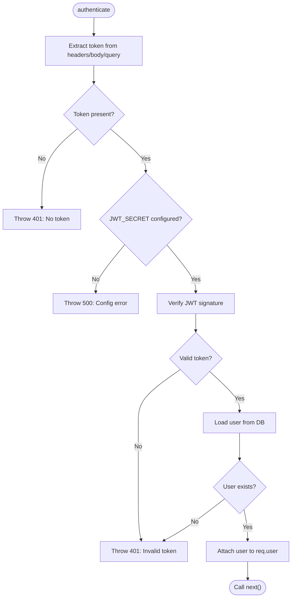
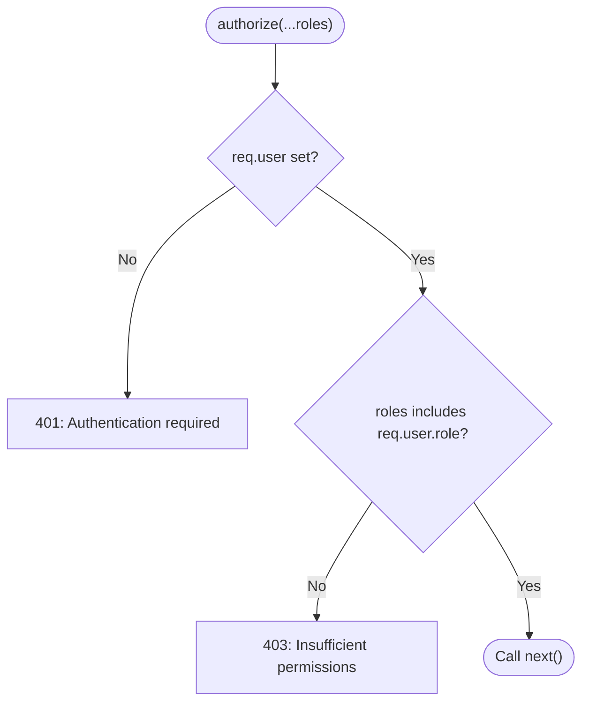
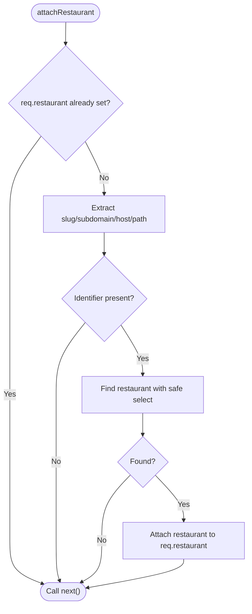
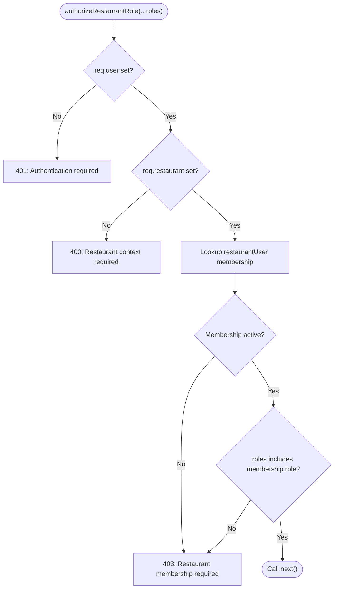
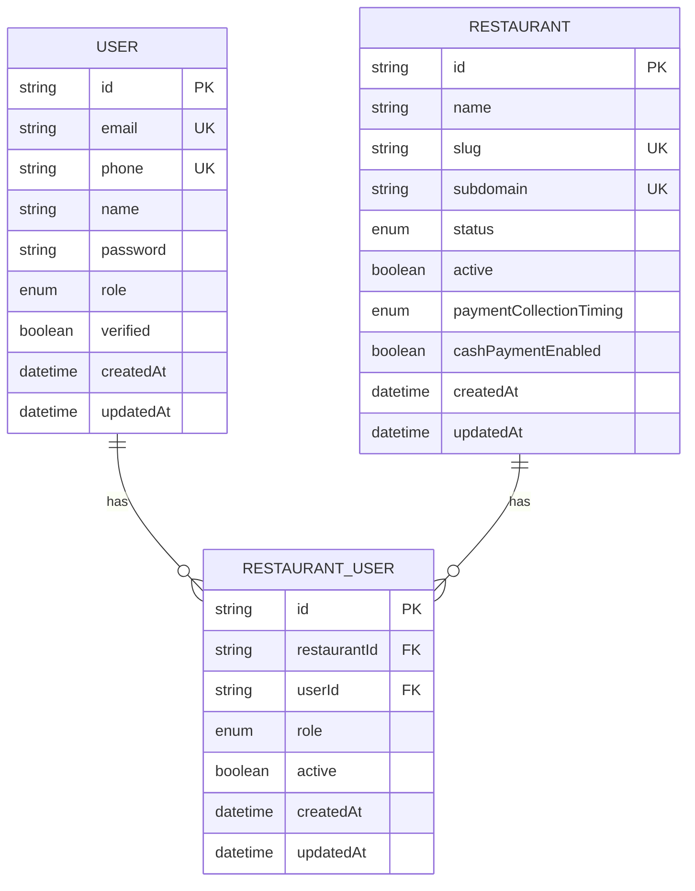
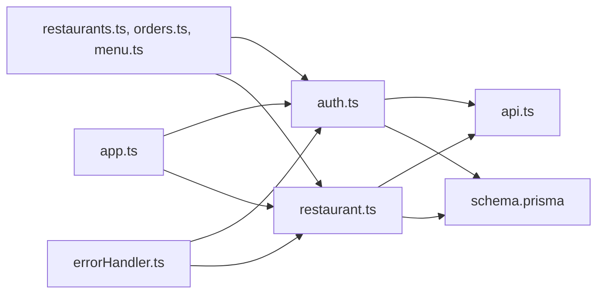

# Access Control & Authorization

<cite>
**Referenced Files in This Document**
- [auth.ts](file://restaurant-backend/src/middleware/auth.ts)
- [restaurant.ts](file://restaurant-backend/src/middleware/restaurant.ts)
- [api.ts](file://restaurant-backend/src/types/api.ts)
- [schema.prisma](file://restaurant-backend/prisma/schema.prisma)
- [app.ts](file://restaurant-backend/src/app.ts)
- [restaurants.ts](file://restaurant-backend/src/routes/restaurants.ts)
- [orders.ts](file://restaurant-backend/src/routes/orders.ts)
- [menu.ts](file://restaurant-backend/src/routes/menu.ts)
- [auth.ts](file://restaurant-backend/src/routes/auth.ts)
- [errorHandler.ts](file://restaurant-backend/src/middleware/errorHandler.ts)
</cite>

## Table of Contents
1. [Introduction](#introduction)
2. [Project Structure](#project-structure)
3. [Core Components](#core-components)
4. [Architecture Overview](#architecture-overview)
5. [Detailed Component Analysis](#detailed-component-analysis)
6. [Dependency Analysis](#dependency-analysis)
7. [Performance Considerations](#performance-considerations)
8. [Troubleshooting Guide](#troubleshooting-guide)
9. [Conclusion](#conclusion)
10. [Appendices](#appendices)

## Introduction
This document provides comprehensive access control and authorization documentation for DeQ-Bite’s Role-Based Access Control (RBAC) system. It covers:
- The authorize middleware implementation with role validation and permission checking
- Multi-role user system including customer, admin, staff, and owner roles with their respective permissions
- Restaurant-level authorization including ownership verification and staff access control
- Resource-based authorization patterns for protecting sensitive operations and data access
- Permission inheritance and hierarchical access control mechanisms
- Implementation examples for route protection, middleware chaining, and dynamic permission evaluation
- Authorization bypass scenarios, security boundaries, and access control testing strategies
- Guidelines for extending the authorization system with new roles and permissions

## Project Structure
The authorization system spans middleware, route handlers, and Prisma models:
- Middleware: authentication, authorization, and restaurant context resolution
- Routes: route protection with middleware chaining and resource-level checks
- Prisma schema: user roles, restaurant roles, and relationships

**Diagram sources**
- [auth.ts:1-137](file://restaurant-backend/src/middleware/auth.ts#L1-L137)
- [restaurant.ts:1-246](file://restaurant-backend/src/middleware/restaurant.ts#L1-L246)
- [restaurants.ts:1-554](file://restaurant-backend/src/routes/restaurants.ts#L1-L554)
- [orders.ts:1-694](file://restaurant-backend/src/routes/orders.ts#L1-L694)
- [menu.ts:1-356](file://restaurant-backend/src/routes/menu.ts#L1-L356)
- [auth.ts:1-390](file://restaurant-backend/src/routes/auth.ts#L1-L390)
- [api.ts:1-114](file://restaurant-backend/src/types/api.ts#L1-L114)
- [schema.prisma:11-402](file://restaurant-backend/prisma/schema.prisma#L11-L402)
- [errorHandler.ts:1-82](file://restaurant-backend/src/middleware/errorHandler.ts#L1-L82)

**Section sources**
- [app.ts:1-148](file://restaurant-backend/src/app.ts#L1-L148)
- [auth.ts:1-137](file://restaurant-backend/src/middleware/auth.ts#L1-L137)
- [restaurant.ts:1-246](file://restaurant-backend/src/middleware/restaurant.ts#L1-L246)
- [api.ts:1-114](file://restaurant-backend/src/types/api.ts#L1-L114)
- [schema.prisma:11-402](file://restaurant-backend/prisma/schema.prisma#L11-L402)

## Core Components
- Authentication middleware validates JWT tokens and attaches user context to requests.
- Authorization middleware enforces role-based access for global operations.
- Restaurant middleware resolves restaurant context and enforces restaurant-level roles.
- Route handlers chain middleware to protect endpoints and enforce resource-level permissions.

Key responsibilities:
- Token extraction from headers/body/query
- JWT verification and user loading
- Role validation against allowed roles
- Restaurant context resolution via slug/subdomain/path
- Restaurant membership and role checks

**Section sources**
- [auth.ts:7-89](file://restaurant-backend/src/middleware/auth.ts#L7-L89)
- [restaurant.ts:76-245](file://restaurant-backend/src/middleware/restaurant.ts#L76-L245)
- [api.ts:3-18](file://restaurant-backend/src/types/api.ts#L3-L18)

## Architecture Overview
The authorization pipeline integrates authentication, global authorization, and restaurant-level authorization:

**Diagram sources**
- [app.ts:82-124](file://restaurant-backend/src/app.ts#L82-L124)
- [restaurant.ts:76-245](file://restaurant-backend/src/middleware/restaurant.ts#L76-L245)
- [auth.ts:7-89](file://restaurant-backend/src/middleware/auth.ts#L7-L89)
- [restaurants.ts:377-429](file://restaurant-backend/src/routes/restaurants.ts#L377-L429)

## Detailed Component Analysis

### Authentication Middleware
The authentication middleware performs:
- Robust token extraction from Authorization header, request body, and query parameters
- JWT verification using environment-configured secret
- User lookup and attachment to request object
- Error handling for missing tokens, invalid/expired tokens, and server configuration issues

**Diagram sources**
- [auth.ts:12-75](file://restaurant-backend/src/middleware/auth.ts#L12-L75)

**Section sources**
- [auth.ts:7-89](file://restaurant-backend/src/middleware/auth.ts#L7-L89)
- [errorHandler.ts:9-20](file://restaurant-backend/src/middleware/errorHandler.ts#L9-L20)

### Authorization Middleware
The authorization middleware enforces role-based access:
- Requires authenticated user
- Checks if user’s role is included in allowed roles
- Returns 403 for insufficient permissions

**Diagram sources**
- [auth.ts:77-89](file://restaurant-backend/src/middleware/auth.ts#L77-L89)

**Section sources**
- [auth.ts:77-89](file://restaurant-backend/src/middleware/auth.ts#L77-L89)

### Restaurant Context Middleware
The restaurant middleware:
- Resolves restaurant context from headers, subdomain, or path
- Handles schema mismatches gracefully with fallback queries
- Exposes helpers to require restaurant context and enforce restaurant roles

Key capabilities:
- Field selection safety using Prisma DMMF
- Subdomain and slug extraction
- Fallback query when schema fields are missing
- Restaurant membership and role validation

**Diagram sources**
- [restaurant.ts:76-200](file://restaurant-backend/src/middleware/restaurant.ts#L76-L200)

**Section sources**
- [restaurant.ts:76-245](file://restaurant-backend/src/middleware/restaurant.ts#L76-L245)

### Restaurant-Level Authorization
Restaurant-level authorization enforces:
- Membership existence and activity
- Role inclusion among OWNER, ADMIN, STAFF
- Enforced via middleware factory that accepts allowed roles

**Diagram sources**
- [restaurant.ts:213-245](file://restaurant-backend/src/middleware/restaurant.ts#L213-L245)

**Section sources**
- [restaurant.ts:213-245](file://restaurant-backend/src/middleware/restaurant.ts#L213-L245)

### Roles and Permissions Model
Roles are defined in the Prisma schema:
- Global user roles: CUSTOMER, ADMIN, STAFF, CENTRAL_ADMIN, OWNER, KITCHEN_STAFF
- Restaurant roles: OWNER, ADMIN, STAFF

**Diagram sources**
- [schema.prisma:11-88](file://restaurant-backend/prisma/schema.prisma#L11-L88)

**Section sources**
- [schema.prisma:326-339](file://restaurant-backend/prisma/schema.prisma#L326-L339)
- [api.ts:20-28](file://restaurant-backend/src/types/api.ts#L20-L28)

### Resource-Based Authorization Patterns
Resource-based authorization is enforced in routes:
- Restaurant settings and users endpoints require restaurant context and restaurant-level roles
- Menu management endpoints enforce restaurant-level roles OWNER, ADMIN, or STAFF
- Orders endpoint enforces restaurant context and uses restaurant-level roles for administrative actions

Examples:
- Restaurant settings payment policy: requires restaurant context and OWNER/ADMIN
- Restaurant users listing/adding: requires restaurant context and OWNER/ADMIN
- Menu admin listing: requires restaurant context and OWNER/ADMIN/STAFF
- Orders creation: requires restaurant context and user authentication

**Section sources**
- [restaurants.ts:377-429](file://restaurant-backend/src/routes/restaurants.ts#L377-L429)
- [restaurants.ts:431-551](file://restaurant-backend/src/routes/restaurants.ts#L431-L551)
- [menu.ts:63-89](file://restaurant-backend/src/routes/menu.ts#L63-L89)
- [orders.ts:82-104](file://restaurant-backend/src/routes/orders.ts#L82-L104)

### Middleware Chaining and Route Protection
Middleware chaining ensures layered protection:
- Global auth middleware runs first to attach user context
- Restaurant context middleware attaches restaurant context
- Restaurant role middleware enforces restaurant-level permissions
- Optional middleware can attach user context without failing

Typical patterns:
- authenticate -> requireRestaurant -> authorizeRestaurantRole('OWNER','ADMIN')
- authenticate -> requireRestaurant -> authorizeRestaurantRole('OWNER','ADMIN','STAFF')

**Section sources**
- [app.ts:82-124](file://restaurant-backend/src/app.ts#L82-L124)
- [restaurants.ts:377-429](file://restaurant-backend/src/routes/restaurants.ts#L377-L429)
- [menu.ts:63-89](file://restaurant-backend/src/routes/menu.ts#L63-L89)

### Dynamic Permission Evaluation
Dynamic permission evaluation occurs at runtime:
- Restaurant context resolution supports slug, subdomain, and path-based identification
- Schema mismatch handling ensures graceful fallback when Prisma client schema lags behind database
- Field selection safety prevents “select must not be empty” errors

**Section sources**
- [restaurant.ts:76-200](file://restaurant-backend/src/middleware/restaurant.ts#L76-L200)
- [restaurants.ts:136-154](file://restaurant-backend/src/routes/restaurants.ts#L136-L154)

## Dependency Analysis
The authorization system depends on:
- Express middleware chain ordering
- Prisma models for user and restaurant relationships
- Environment configuration for JWT secrets
- Type definitions for authenticated requests

**Diagram sources**
- [auth.ts:1-137](file://restaurant-backend/src/middleware/auth.ts#L1-L137)
- [restaurant.ts:1-246](file://restaurant-backend/src/middleware/restaurant.ts#L1-L246)
- [api.ts:1-114](file://restaurant-backend/src/types/api.ts#L1-L114)
- [schema.prisma:11-402](file://restaurant-backend/prisma/schema.prisma#L11-L402)
- [restaurants.ts:1-554](file://restaurant-backend/src/routes/restaurants.ts#L1-L554)
- [orders.ts:1-694](file://restaurant-backend/src/routes/orders.ts#L1-L694)
- [menu.ts:1-356](file://restaurant-backend/src/routes/menu.ts#L1-L356)
- [app.ts:1-148](file://restaurant-backend/src/app.ts#L1-L148)
- [errorHandler.ts:1-82](file://restaurant-backend/src/middleware/errorHandler.ts#L1-L82)

**Section sources**
- [app.ts:1-148](file://restaurant-backend/src/app.ts#L1-L148)
- [auth.ts:1-137](file://restaurant-backend/src/middleware/auth.ts#L1-L137)
- [restaurant.ts:1-246](file://restaurant-backend/src/middleware/restaurant.ts#L1-L246)
- [schema.prisma:11-402](file://restaurant-backend/prisma/schema.prisma#L11-L402)

## Performance Considerations
- Token verification and user lookup occur per request; cache user context where appropriate
- Restaurant context resolution uses safe field selection to avoid unnecessary data transfer
- Schema mismatch fallbacks add overhead; keep Prisma client and database in sync
- Middleware chaining adds minimal overhead; ensure early exits for unauthenticated requests

## Troubleshooting Guide
Common authorization issues and resolutions:
- Missing JWT_SECRET: server configuration error; configure environment variable
- Invalid/expired token: authentication failure; regenerate token or refresh token
- Insufficient permissions: 403 error; verify user role and restaurant membership
- Restaurant context required: 400 error; ensure restaurant identifier is provided via header/path
- Schema mismatch: fallback query executed; update Prisma client or database schema

**Section sources**
- [auth.ts:40-44](file://restaurant-backend/src/middleware/auth.ts#L40-L44)
- [auth.ts:67-74](file://restaurant-backend/src/middleware/auth.ts#L67-L74)
- [restaurant.ts:141-183](file://restaurant-backend/src/middleware/restaurant.ts#L141-L183)
- [errorHandler.ts:22-76](file://restaurant-backend/src/middleware/errorHandler.ts#L22-L76)

## Conclusion
DeQ-Bite’s RBAC system combines global authentication with restaurant-level authorization, enforcing role-based access across endpoints. The middleware chain ensures robust protection, while schema-aware query building maintains resilience during deployments. Extending the system involves adding roles to Prisma enums, updating middleware factories, and protecting new routes with appropriate middleware chains.

## Appendices

### Authorization Bypass Scenarios
- optionalAuth middleware allows requests to proceed without authentication; use sparingly and only for read-only endpoints
- Public endpoints (e.g., restaurant search/detail) do not require authentication
- Ensure bypasses are intentional and logged appropriately

**Section sources**
- [auth.ts:91-137](file://restaurant-backend/src/middleware/auth.ts#L91-L137)
- [restaurants.ts:92-164](file://restaurant-backend/src/routes/restaurants.ts#L92-L164)

### Security Boundaries
- JWT secret must be strong and environment-specific
- CORS configuration restricts origins and headers
- Rate limiting protects against abuse
- Error handling avoids leaking sensitive error details in production

**Section sources**
- [app.ts:28-32](file://restaurant-backend/src/app.ts#L28-L32)
- [app.ts:42-65](file://restaurant-backend/src/app.ts#L42-L65)
- [app.ts:67-75](file://restaurant-backend/src/app.ts#L67-L75)
- [errorHandler.ts:66-70](file://restaurant-backend/src/middleware/errorHandler.ts#L66-L70)

### Access Control Testing Strategies
- Unit tests for middleware: token presence/absence, role validation, error responses
- Integration tests: route protection with various role combinations
- End-to-end tests: restaurant context resolution and role enforcement
- Load tests: measure middleware overhead under high concurrency

[No sources needed since this section provides general guidance]

### Extending the Authorization System
Steps to add new roles and permissions:
- Define new roles in Prisma enums (global and restaurant)
- Update middleware factories to accept new roles
- Protect new routes with appropriate middleware chains
- Add tests covering new role combinations
- Document new endpoints and their permission requirements

**Section sources**
- [schema.prisma:326-339](file://restaurant-backend/prisma/schema.prisma#L326-L339)
- [auth.ts:77-89](file://restaurant-backend/src/middleware/auth.ts#L77-L89)
- [restaurant.ts:213-245](file://restaurant-backend/src/middleware/restaurant.ts#L213-L245)