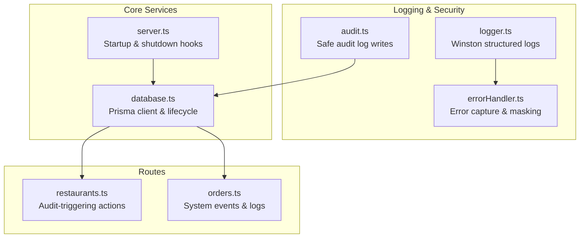
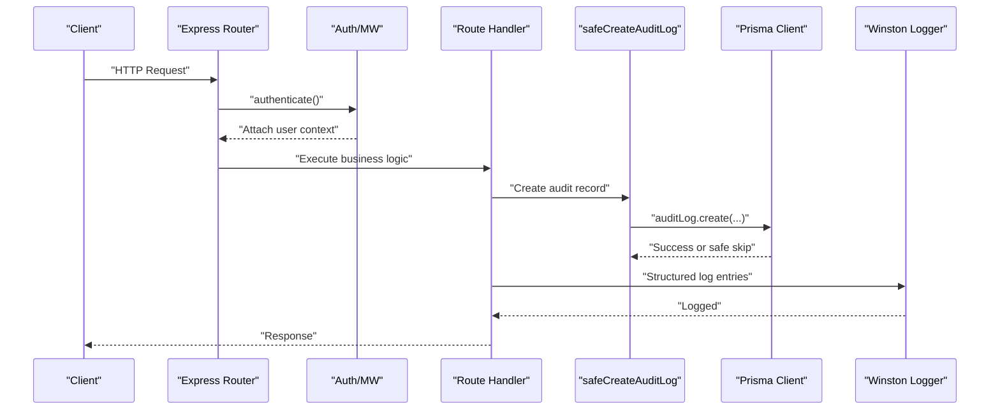
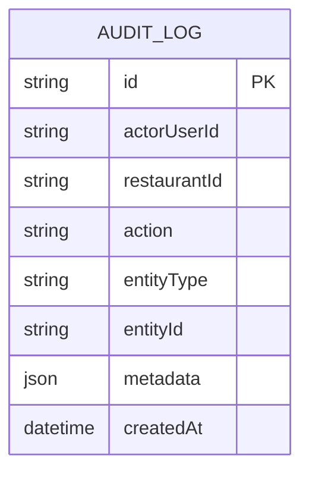
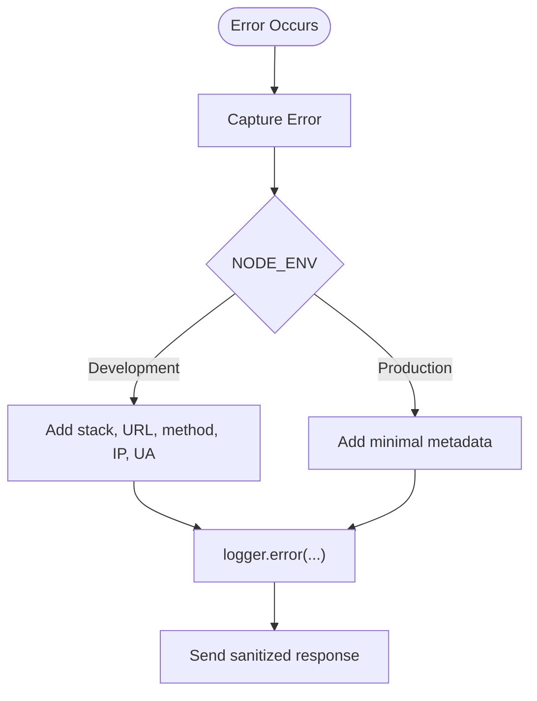
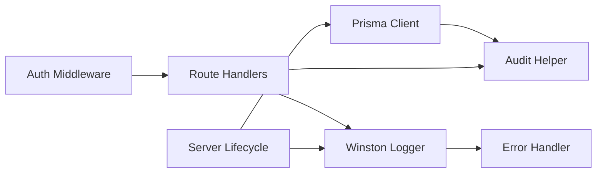

# Audit Logging & Compliance

<cite>
**Referenced Files in This Document**
- [audit.ts](file://restaurant-backend/src/utils/audit.ts)
- [logger.ts](file://restaurant-backend/src/utils/logger.ts)
- [errorHandler.ts](file://restaurant-backend/src/middleware/errorHandler.ts)
- [auth.ts](file://restaurant-backend/src/middleware/auth.ts)
- [database.ts](file://restaurant-backend/src/config/database.ts)
- [schema.prisma](file://restaurant-backend/prisma/schema.prisma)
- [restaurants.ts](file://restaurant-backend/src/routes/restaurants.ts)
- [orders.ts](file://restaurant-backend/src/routes/orders.ts)
- [server.ts](file://restaurant-backend/src/server.ts)
- [package.json](file://restaurant-backend/package.json)
</cite>

## Table of Contents
1. [Introduction](#introduction)
2. [Project Structure](#project-structure)
3. [Core Components](#core-components)
4. [Architecture Overview](#architecture-overview)
5. [Detailed Component Analysis](#detailed-component-analysis)
6. [Dependency Analysis](#dependency-analysis)
7. [Performance Considerations](#performance-considerations)
8. [Troubleshooting Guide](#troubleshooting-guide)
9. [Conclusion](#conclusion)
10. [Appendices](#appendices)

## Introduction
This document provides comprehensive audit logging and compliance documentation for DeQ-Bite’s security event tracking system. It explains the audit trail implementation covering user actions, system events, and security incidents; the logging framework with structured logging, log levels, and audit event categorization; compliance tracking features for regulatory requirements and security monitoring; data retention policies, log aggregation, and security event correlation; integration with external monitoring systems and alerting mechanisms; and practical guidance for custom audit events, log filtering, compliance reporting, log security, and incident investigation workflows.

## Project Structure
The audit and logging capabilities are implemented across several modules:
- Centralized logging and error handling utilities
- Audit log persistence and safe creation helpers
- Database connectivity and Prisma client configuration
- Route handlers that trigger audit events for key business actions
- Server lifecycle hooks for graceful shutdown and health signals

**Diagram sources**
- [logger.ts:1-56](file://restaurant-backend/src/utils/logger.ts#L1-L56)
- [errorHandler.ts:1-82](file://restaurant-backend/src/middleware/errorHandler.ts#L1-L82)
- [audit.ts:1-17](file://restaurant-backend/src/utils/audit.ts#L1-L17)
- [database.ts:1-66](file://restaurant-backend/src/config/database.ts#L1-L66)
- [server.ts:1-33](file://restaurant-backend/src/server.ts#L1-L33)
- [restaurants.ts:1-554](file://restaurant-backend/src/routes/restaurants.ts#L1-L554)
- [orders.ts:1-694](file://restaurant-backend/src/routes/orders.ts#L1-L694)

**Section sources**
- [logger.ts:1-56](file://restaurant-backend/src/utils/logger.ts#L1-L56)
- [errorHandler.ts:1-82](file://restaurant-backend/src/middleware/errorHandler.ts#L1-L82)
- [audit.ts:1-17](file://restaurant-backend/src/utils/audit.ts#L1-L17)
- [database.ts:1-66](file://restaurant-backend/src/config/database.ts#L1-L66)
- [server.ts:1-33](file://restaurant-backend/src/server.ts#L1-L33)
- [restaurants.ts:1-554](file://restaurant-backend/src/routes/restaurants.ts#L1-L554)
- [orders.ts:1-694](file://restaurant-backend/src/routes/orders.ts#L1-L694)

## Core Components
- Structured logging with Winston: JSON-formatted logs with timestamps, levels, and contextual metadata. Console transport is always enabled; file transports are added in non-serverless environments with rotation and size limits.
- Safe audit logging: A helper that writes audit records to the database with resilience against missing tables via migration safeguards.
- Prisma client configuration: Environment-aware logging and optional acceleration extension; centralized connection/disconnection lifecycle.
- Error handling: Centralized error capture with production-safe masking and structured metadata injection for diagnostics.
- Audit schema: A dedicated AuditLog model capturing actor, restaurant context, action, entity, and metadata.

Key implementation references:
- Structured logging and transports: [logger.ts:1-56](file://restaurant-backend/src/utils/logger.ts#L1-L56)
- Safe audit log creation: [audit.ts:5-16](file://restaurant-backend/src/utils/audit.ts#L5-L16)
- Prisma client and lifecycle: [database.ts:4-62](file://restaurant-backend/src/config/database.ts#L4-L62)
- AuditLog schema: [schema.prisma:313-324](file://restaurant-backend/prisma/schema.prisma#L313-L324)
- Error handler and metadata: [errorHandler.ts:22-76](file://restaurant-backend/src/middleware/errorHandler.ts#L22-L76)

**Section sources**
- [logger.ts:1-56](file://restaurant-backend/src/utils/logger.ts#L1-L56)
- [audit.ts:1-17](file://restaurant-backend/src/utils/audit.ts#L1-L17)
- [database.ts:1-66](file://restaurant-backend/src/config/database.ts#L1-L66)
- [schema.prisma:313-324](file://restaurant-backend/prisma/schema.prisma#L313-L324)
- [errorHandler.ts:1-82](file://restaurant-backend/src/middleware/errorHandler.ts#L1-L82)

## Architecture Overview
The audit and logging architecture integrates route handlers, middleware, and database persistence to produce a reliable audit trail and operational logs.

**Diagram sources**
- [auth.ts:7-75](file://restaurant-backend/src/middleware/auth.ts#L7-L75)
- [restaurants.ts:356-366](file://restaurant-backend/src/routes/restaurants.ts#L356-L366)
- [audit.ts:5-16](file://restaurant-backend/src/utils/audit.ts#L5-L16)
- [database.ts:44-62](file://restaurant-backend/src/config/database.ts#L44-L62)
- [logger.ts:50-56](file://restaurant-backend/src/utils/logger.ts#L50-L56)

## Detailed Component Analysis

### Audit Trail Implementation
- AuditLog model: Captures actorUserId, optional restaurantId, action, entityType, entityId, and JSON metadata with automatic timestamps.
- Safe audit creation: Attempts to persist audit records; if the audit table is missing (migration not yet applied), it logs a warning and continues without failing core flows.
- Audit-triggering routes: Examples include restaurant creation, payment policy updates, and user membership changes.

**Diagram sources**
- [schema.prisma:313-324](file://restaurant-backend/prisma/schema.prisma#L313-L324)

**Section sources**
- [audit.ts:5-16](file://restaurant-backend/src/utils/audit.ts#L5-L16)
- [schema.prisma:313-324](file://restaurant-backend/prisma/schema.prisma#L313-L324)
- [restaurants.ts:356-366](file://restaurant-backend/src/routes/restaurants.ts#L356-L366)
- [restaurants.ts:415-422](file://restaurant-backend/src/routes/restaurants.ts#L415-L422)
- [restaurants.ts:527-537](file://restaurant-backend/src/routes/restaurants.ts#L527-L537)

### Logging Framework: Structured Logs, Levels, and Metadata
- Winston configuration:
  - Timestamped, JSON-formatted logs with stack traces for errors.
  - Console transport enabled by default.
  - File transports for error and combined logs in non-serverless environments with rotation.
  - Environment-controlled log level via LOG_LEVEL.
- Error handler:
  - Produces structured error logs with request context (URL, method, IP, user agent in development).
  - Masks sensitive details in production and normalizes error responses.

**Diagram sources**
- [errorHandler.ts:22-76](file://restaurant-backend/src/middleware/errorHandler.ts#L22-L76)
- [logger.ts:50-56](file://restaurant-backend/src/utils/logger.ts#L50-L56)

**Section sources**
- [logger.ts:1-56](file://restaurant-backend/src/utils/logger.ts#L1-L56)
- [errorHandler.ts:1-82](file://restaurant-backend/src/middleware/errorHandler.ts#L1-L82)

### Audit Event Categorization and Coverage
- User actions: Login, logout, profile updates, password changes.
- System events: Order creation, status updates, cancellations, coupon application.
- Security incidents: Token verification failures, unauthorized access attempts, permission denials.
- Business events: Restaurant onboarding, payment policy changes, user membership updates.

Examples:
- Order creation and updates emit informational logs and real-time events.
- Restaurant operations trigger audit logs with metadata for compliance.

**Section sources**
- [orders.ts:246-257](file://restaurant-backend/src/routes/orders.ts#L246-L257)
- [orders.ts:581-629](file://restaurant-backend/src/routes/orders.ts#L581-L629)
- [restaurants.ts:356-366](file://restaurant-backend/src/routes/restaurants.ts#L356-L366)
- [restaurants.ts:415-422](file://restaurant-backend/src/routes/restaurants.ts#L415-L422)
- [restaurants.ts:527-537](file://restaurant-backend/src/routes/restaurants.ts#L527-L537)

### Compliance Tracking Features
- Structured audit records with actor, restaurant context, and metadata enable compliance reporting and trend analysis.
- Error logs include contextual information suitable for incident investigations.
- Environment-aware logging supports audit-friendly deployments across development, staging, and production.

**Section sources**
- [audit.ts:5-16](file://restaurant-backend/src/utils/audit.ts#L5-L16)
- [errorHandler.ts:22-76](file://restaurant-backend/src/middleware/errorHandler.ts#L22-L76)
- [logger.ts:50-56](file://restaurant-backend/src/utils/logger.ts#L50-L56)

### Data Retention Policies
- File-based log rotation: Two rotating files per severity with fixed maximum sizes and file counts.
- Recommendation: Align retention with organizational policy; configure external log archiving and purging schedules accordingly.

**Section sources**
- [logger.ts:32-44](file://restaurant-backend/src/utils/logger.ts#L32-L44)

### Log Aggregation and Security Event Correlation
- Structured JSON logs facilitate ingestion by log aggregators (e.g., SIEM, ELK stacks).
- Correlation: Combine audit logs (entity, action, actor) with error logs (request context) to reconstruct sequences of events for investigations.

**Section sources**
- [logger.ts:5-12](file://restaurant-backend/src/utils/logger.ts#L5-L12)
- [errorHandler.ts:22-76](file://restaurant-backend/src/middleware/errorHandler.ts#L22-L76)

### Integration with External Monitoring Systems and Alerting
- Health checks: Server exposes a health endpoint for readiness/liveness monitoring.
- Graceful shutdown: SIGTERM/SIGINT handlers ensure clean termination and logging of shutdown events.
- Recommendations: Forward Winston logs to external collectors; define alert rules on error rates and audit anomalies.

**Section sources**
- [server.ts:7-25](file://restaurant-backend/src/server.ts#L7-L25)
- [package.json:6-16](file://restaurant-backend/package.json#L6-L16)

### Implementation Examples

#### Example: Custom Audit Event
- Trigger after a protected operation completes successfully.
- Use the safe audit helper to persist the event; include actor, restaurant context, action label, entity type/id, and structured metadata.

References:
- Safe creation: [audit.ts:5-16](file://restaurant-backend/src/utils/audit.ts#L5-L16)
- Audit schema: [schema.prisma:313-324](file://restaurant-backend/prisma/schema.prisma#L313-L324)

#### Example: Log Filtering
- Adjust LOG_LEVEL to control verbosity.
- Use Winston transports selectively (console vs file) to reduce noise in serverless environments.

References:
- Level and transports: [logger.ts:50-56](file://restaurant-backend/src/utils/logger.ts#L50-L56)

#### Example: Compliance Reporting Automation
- Export audit logs periodically for review and retention.
- Aggregate by action, actor, and time windows to detect anomalies and support audits.

References:
- Audit persistence: [audit.ts:5-16](file://restaurant-backend/src/utils/audit.ts#L5-L16)
- Schema: [schema.prisma:313-324](file://restaurant-backend/prisma/schema.prisma#L313-L324)

### Log Security, Tamper Detection, and Integrity
- Transport security: Forward logs to secure collectors; protect log paths and credentials.
- Integrity: Avoid modifying audit records post-write; maintain immutable audit trails.
- Access control: Restrict database and file log access; enforce least privilege.

Note: The current implementation focuses on safe creation and structured logging; additional cryptographic protections (e.g., signed logs, append-only storage) are recommended for high-assurance environments.

**Section sources**
- [audit.ts:5-16](file://restaurant-backend/src/utils/audit.ts#L5-L16)
- [logger.ts:32-44](file://restaurant-backend/src/utils/logger.ts#L32-L44)

### Guidelines for Audit Log Analysis and Incident Investigation
- Timeline reconstruction: Correlate audit actions with error logs and request IDs.
- Scope determination: Identify affected actors, restaurants, and entities.
- Evidence preservation: Preserve raw logs and database snapshots for investigations.

**Section sources**
- [errorHandler.ts:22-76](file://restaurant-backend/src/middleware/errorHandler.ts#L22-L76)
- [audit.ts:5-16](file://restaurant-backend/src/utils/audit.ts#L5-L16)

## Dependency Analysis
The audit and logging subsystems depend on:
- Winston for structured logging
- Prisma for audit persistence
- Express middleware for authentication and error handling
- Server lifecycle for startup/shutdown hooks

**Diagram sources**
- [logger.ts:1-56](file://restaurant-backend/src/utils/logger.ts#L1-L56)
- [errorHandler.ts:1-82](file://restaurant-backend/src/middleware/errorHandler.ts#L1-L82)
- [audit.ts:1-17](file://restaurant-backend/src/utils/audit.ts#L1-L17)
- [database.ts:1-66](file://restaurant-backend/src/config/database.ts#L1-L66)
- [auth.ts:1-137](file://restaurant-backend/src/middleware/auth.ts#L1-L137)
- [server.ts:1-33](file://restaurant-backend/src/server.ts#L1-L33)

**Section sources**
- [logger.ts:1-56](file://restaurant-backend/src/utils/logger.ts#L1-L56)
- [errorHandler.ts:1-82](file://restaurant-backend/src/middleware/errorHandler.ts#L1-L82)
- [audit.ts:1-17](file://restaurant-backend/src/utils/audit.ts#L1-L17)
- [database.ts:1-66](file://restaurant-backend/src/config/database.ts#L1-L66)
- [auth.ts:1-137](file://restaurant-backend/src/middleware/auth.ts#L1-L137)
- [server.ts:1-33](file://restaurant-backend/src/server.ts#L1-L33)

## Performance Considerations
- Asynchronous audit writes: Non-blocking persistence reduces latency for critical paths.
- Log volume control: Use rotation and environment-specific transports to manage disk usage.
- Prisma client reuse: Global singleton pattern in non-production environments minimizes overhead.

**Section sources**
- [audit.ts:5-16](file://restaurant-backend/src/utils/audit.ts#L5-L16)
- [logger.ts:32-44](file://restaurant-backend/src/utils/logger.ts#L32-L44)
- [database.ts:35-42](file://restaurant-backend/src/config/database.ts#L35-L42)

## Troubleshooting Guide
- Audit table missing: The safe creation helper logs a warning and skips writes rather than failing requests.
- Production error masking: Error details are suppressed; use structured logs and request context for diagnostics.
- Graceful shutdown: SIGTERM/SIGINT are handled; verify logs for shutdown messages.

**Section sources**
- [audit.ts:5-16](file://restaurant-backend/src/utils/audit.ts#L5-L16)
- [errorHandler.ts:66-75](file://restaurant-backend/src/middleware/errorHandler.ts#L66-L75)
- [server.ts:7-15](file://restaurant-backend/src/server.ts#L7-L15)

## Conclusion
DeQ-Bite’s audit logging and compliance framework leverages structured Winston logs, resilient audit persistence, and environment-aware configurations to support security monitoring, incident response, and compliance reporting. By extending audit coverage to additional business events, integrating with external log collectors, and implementing robust log security measures, the system can meet evolving regulatory requirements and strengthen operational resilience.

## Appendices

### Appendix A: Audit Event Catalog (Examples)
- User lifecycle: LOGIN, PASSWORD_CHANGE
- Orders: ORDER_CREATED, ORDER_STATUS_CHANGED, ORDER_CANCELLED, COUPON_APPLIED
- Restaurants: RESTAURANT_CREATED, PAYMENT_POLICY_UPDATED, RESTAURANT_USER_UPSERT

**Section sources**
- [restaurants.ts:356-366](file://restaurant-backend/src/routes/restaurants.ts#L356-L366)
- [restaurants.ts:415-422](file://restaurant-backend/src/routes/restaurants.ts#L415-L422)
- [restaurants.ts:527-537](file://restaurant-backend/src/routes/restaurants.ts#L527-L537)
- [orders.ts:246-257](file://restaurant-backend/src/routes/orders.ts#L246-L257)
- [orders.ts:581-629](file://restaurant-backend/src/routes/orders.ts#L581-L629)