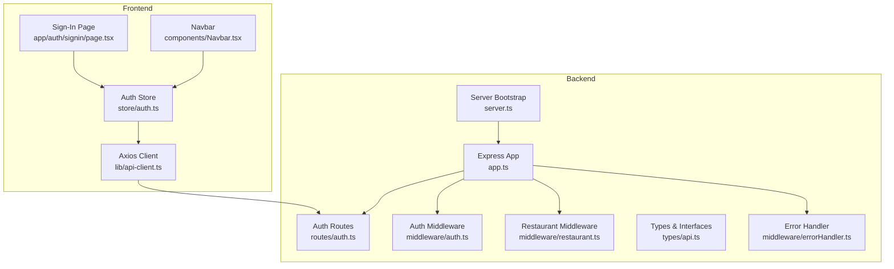
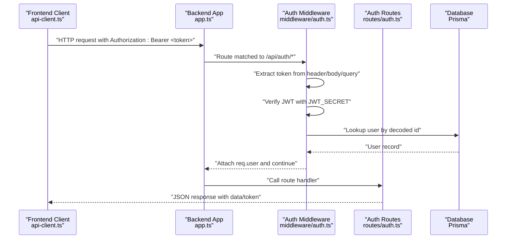
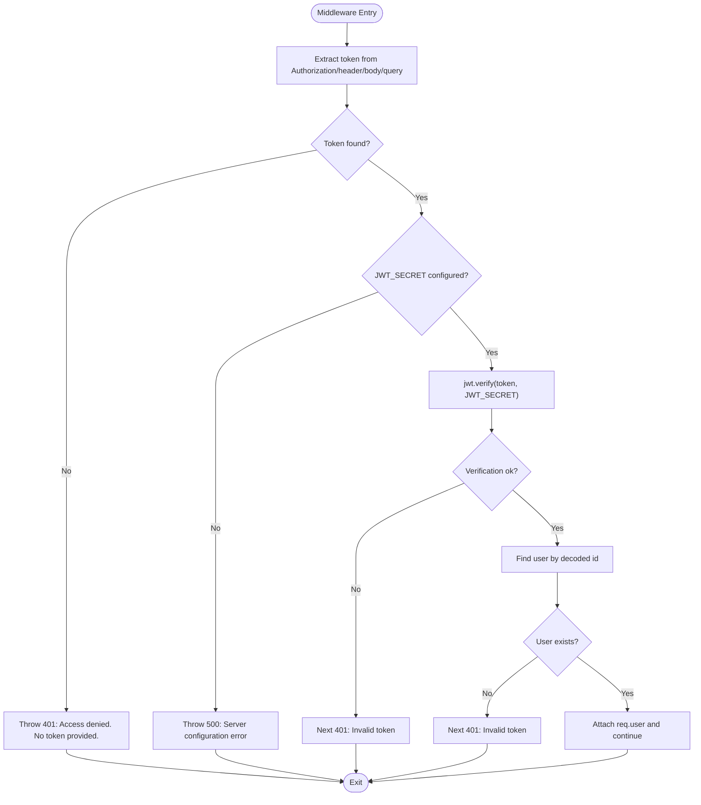
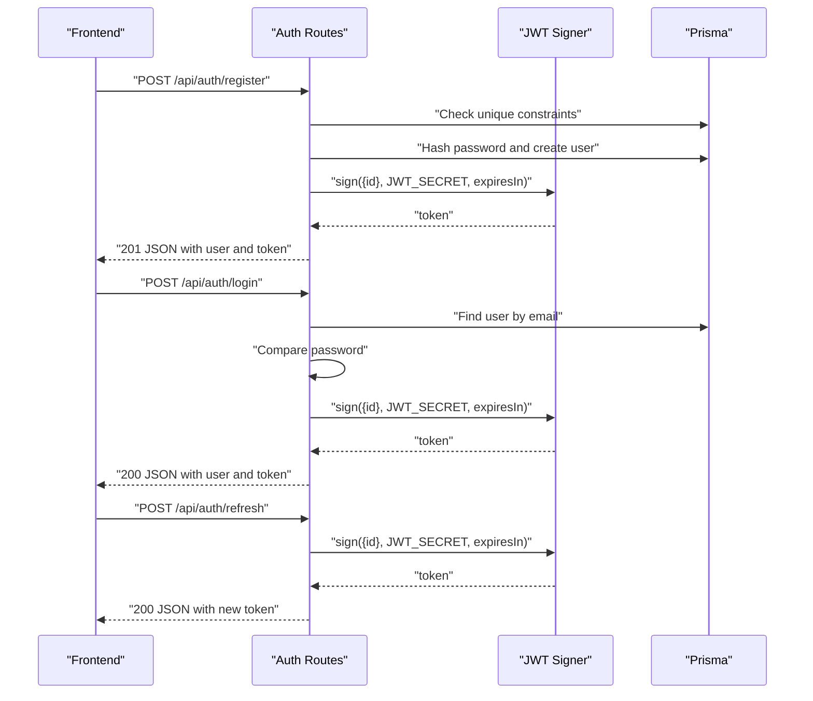
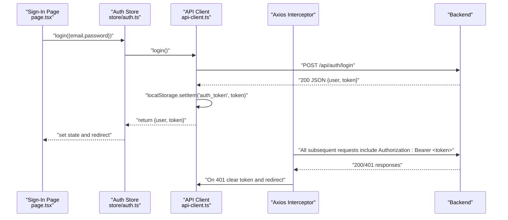
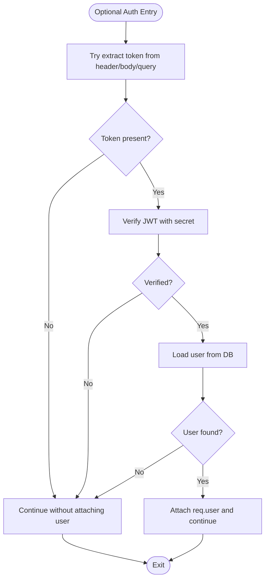
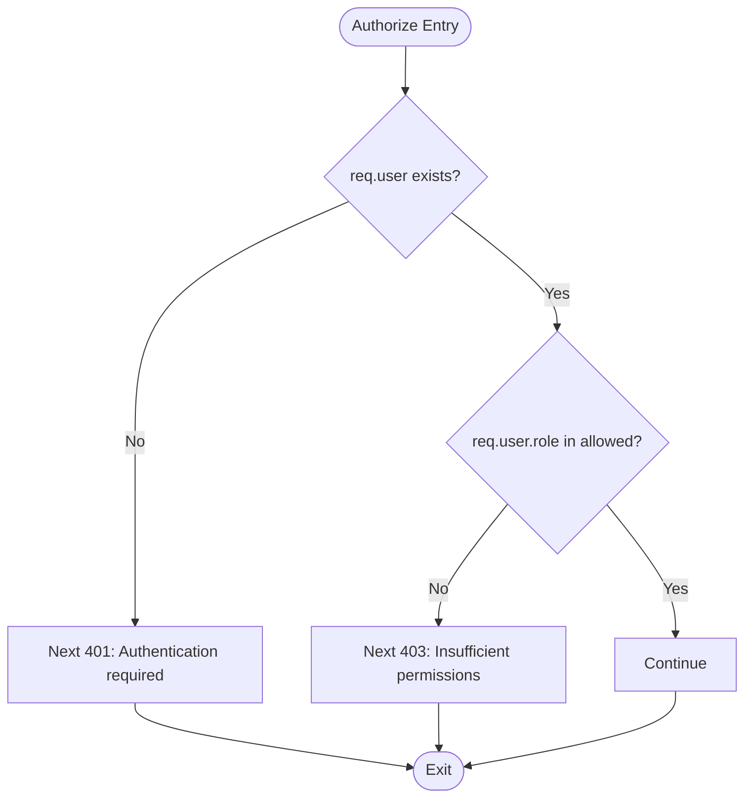
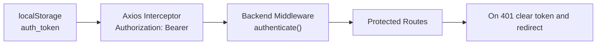
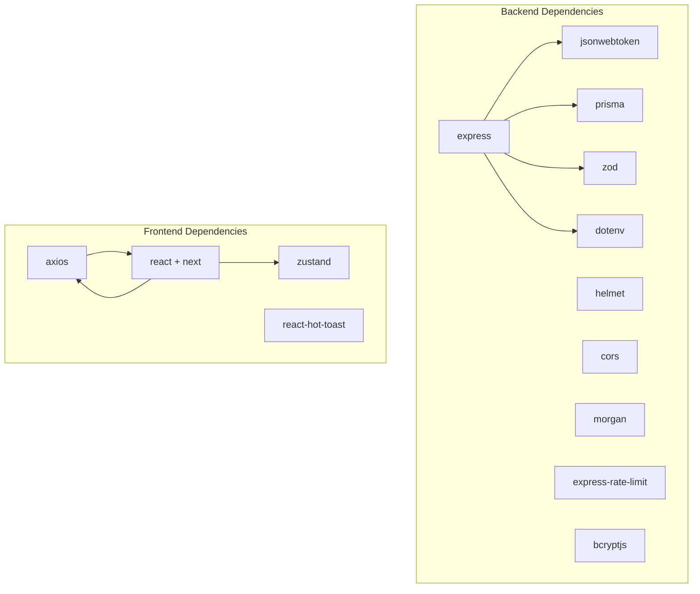

# Authentication System

<cite>
**Referenced Files in This Document**
- [auth.ts](file://restaurant-backend/src/middleware/auth.ts)
- [auth.ts](file://restaurant-backend/src/routes/auth.ts)
- [api-client.ts](file://restaurant-frontend/src/lib/api-client.ts)
- [auth.ts](file://restaurant-frontend/src/store/auth.ts)
- [app.ts](file://restaurant-backend/src/app.ts)
- [errorHandler.ts](file://restaurant-backend/src/middleware/errorHandler.ts)
- [api.ts](file://restaurant-backend/src/types/api.ts)
- [restaurant.ts](file://restaurant-backend/src/middleware/restaurant.ts)
- [env.d.ts](file://restaurant-backend/src/types/env.d.ts)
- [server.ts](file://restaurant-backend/src/server.ts)
- [schema.prisma](file://restaurant-backend/prisma/schema.prisma)
- [page.tsx](file://restaurant-frontend/src/app/auth/signin/page.tsx)
- [Navbar.tsx](file://restaurant-frontend/src/components/Navbar.tsx)
</cite>

## Table of Contents
1. [Introduction](#introduction)
2. [Project Structure](#project-structure)
3. [Core Components](#core-components)
4. [Architecture Overview](#architecture-overview)
5. [Detailed Component Analysis](#detailed-component-analysis)
6. [Dependency Analysis](#dependency-analysis)
7. [Performance Considerations](#performance-considerations)
8. [Troubleshooting Guide](#troubleshooting-guide)
9. [Conclusion](#conclusion)
10. [Appendices](#appendices)

## Introduction
This document describes DeQ-Bite’s JWT-based authentication system covering token extraction, verification, middleware integration, user session management, and frontend integration. It explains how tokens are extracted from headers, body, and query parameters; how JWT verification validates secrets and handles expiration; how sessions are managed via protected routes and refresh endpoints; and how the frontend stores, injects, and persists tokens. Security considerations, common issues, debugging techniques, and best practices are included.

## Project Structure
Authentication spans backend middleware and routes, and frontend API client and state management:
- Backend: Express app mounts auth routes and middleware; JWT verification occurs in middleware; protected endpoints are guarded by authentication and authorization helpers.
- Frontend: Axios-based API client injects Authorization headers automatically; Zustand store manages user state and token persistence; sign-in page triggers login flows.

**Diagram sources**
- [app.ts:107-124](file://restaurant-backend/src/app.ts#L107-L124)
- [auth.ts:7-75](file://restaurant-backend/src/middleware/auth.ts#L7-L75)
- [auth.ts:104-158](file://restaurant-backend/src/routes/auth.ts#L104-L158)
- [errorHandler.ts:22-76](file://restaurant-backend/src/middleware/errorHandler.ts#L22-L76)
- [api-client.ts:194-240](file://restaurant-frontend/src/lib/api-client.ts#L194-L240)
- [auth.ts:24-176](file://restaurant-frontend/src/store/auth.ts#L24-L176)
- [page.tsx:10-32](file://restaurant-frontend/src/app/auth/signin/page.tsx#L10-L32)
- [Navbar.tsx:11-31](file://restaurant-frontend/src/components/Navbar.tsx#L11-L31)
- [server.ts:17-30](file://restaurant-backend/src/server.ts#L17-L30)

**Section sources**
- [app.ts:107-124](file://restaurant-backend/src/app.ts#L107-L124)
- [auth.ts:7-75](file://restaurant-backend/src/middleware/auth.ts#L7-L75)
- [auth.ts:104-158](file://restaurant-backend/src/routes/auth.ts#L104-L158)
- [api-client.ts:194-240](file://restaurant-frontend/src/lib/api-client.ts#L194-L240)
- [auth.ts:24-176](file://restaurant-frontend/src/store/auth.ts#L24-L176)
- [page.tsx:10-32](file://restaurant-frontend/src/app/auth/signin/page.tsx#L10-L32)
- [Navbar.tsx:11-31](file://restaurant-frontend/src/components/Navbar.tsx#L11-L31)
- [server.ts:17-30](file://restaurant-backend/src/server.ts#L17-L30)

## Core Components
- Backend authentication middleware extracts tokens from Authorization header, body, and query parameters; verifies JWT using environment-configured secret; attaches user to request; supports optional authentication.
- Auth routes implement registration, login, profile retrieval, password change, and token refresh.
- Frontend API client injects Authorization headers automatically and clears tokens on 401; Zustand store persists tokens and user state; sign-in page coordinates login and redirects.

Key responsibilities:
- Token extraction and validation: middleware
- Token issuance and refresh: routes
- Session persistence and header injection: frontend client and store
- Error handling and logging: centralized error handler

**Section sources**
- [auth.ts:7-75](file://restaurant-backend/src/middleware/auth.ts#L7-L75)
- [auth.ts:31-45](file://restaurant-backend/src/routes/auth.ts#L31-L45)
- [auth.ts:104-158](file://restaurant-backend/src/routes/auth.ts#L104-L158)
- [auth.ts:375-387](file://restaurant-backend/src/routes/auth.ts#L375-L387)
- [api-client.ts:206-240](file://restaurant-frontend/src/lib/api-client.ts#L206-L240)
- [auth.ts:24-93](file://restaurant-frontend/src/store/auth.ts#L24-L93)

## Architecture Overview
End-to-end authentication flow from frontend to backend and back:

**Diagram sources**
- [app.ts:107-124](file://restaurant-backend/src/app.ts#L107-L124)
- [auth.ts:7-75](file://restaurant-backend/src/middleware/auth.ts#L7-L75)
- [auth.ts:104-158](file://restaurant-backend/src/routes/auth.ts#L104-L158)
- [api-client.ts:206-240](file://restaurant-frontend/src/lib/api-client.ts#L206-L240)

## Detailed Component Analysis

### Backend Authentication Middleware
Implements robust token extraction and verification:
- Extracts token from Authorization header (case-insensitive), body, and query parameters.
- Validates presence of JWT_SECRET environment variable.
- Verifies JWT and decodes payload; loads user from database; attaches user to request.
- Handles invalid/expired tokens and continues with optionalAuth without failing the request chain.

**Diagram sources**
- [auth.ts:7-75](file://restaurant-backend/src/middleware/auth.ts#L7-L75)

**Section sources**
- [auth.ts:7-75](file://restaurant-backend/src/middleware/auth.ts#L7-L75)

### Auth Routes: Registration, Login, Profile, Password Change, Refresh
- Registration: Validates input, checks uniqueness, hashes password, creates user, signs JWT, returns user and token.
- Login: Finds user, compares password, signs JWT, returns user and token.
- Protected profile endpoints: Use authenticate middleware to guard access.
- Password change: Requires authentication, verifies current password, updates with new hashed password.
- Token refresh: Generates a new token for the authenticated user.

**Diagram sources**
- [auth.ts:48-102](file://restaurant-backend/src/routes/auth.ts#L48-L102)
- [auth.ts:104-158](file://restaurant-backend/src/routes/auth.ts#L104-L158)
- [auth.ts:375-387](file://restaurant-backend/src/routes/auth.ts#L375-L387)

**Section sources**
- [auth.ts:48-102](file://restaurant-backend/src/routes/auth.ts#L48-L102)
- [auth.ts:104-158](file://restaurant-backend/src/routes/auth.ts#L104-L158)
- [auth.ts:337-373](file://restaurant-backend/src/routes/auth.ts#L337-L373)
- [auth.ts:375-387](file://restaurant-backend/src/routes/auth.ts#L375-L387)

### Frontend Authentication Integration
- Axios request interceptor adds Authorization header using stored token from localStorage.
- Response interceptor handles 401 by clearing token and redirecting to sign-in.
- API client methods for login/register store the returned token.
- Zustand store persists user and token, exposes actions for login/register/logout/getProfile/changePassword.
- Sign-in page coordinates form submission and redirects after successful login.

**Diagram sources**
- [page.tsx:18-32](file://restaurant-frontend/src/app/auth/signin/page.tsx#L18-L32)
- [auth.ts:33-55](file://restaurant-frontend/src/store/auth.ts#L33-L55)
- [api-client.ts:206-240](file://restaurant-frontend/src/lib/api-client.ts#L206-L240)
- [api-client.ts:332-348](file://restaurant-frontend/src/lib/api-client.ts#L332-L348)

**Section sources**
- [api-client.ts:206-240](file://restaurant-frontend/src/lib/api-client.ts#L206-L240)
- [api-client.ts:332-348](file://restaurant-frontend/src/lib/api-client.ts#L332-L348)
- [auth.ts:33-55](file://restaurant-frontend/src/store/auth.ts#L33-L55)
- [page.tsx:18-32](file://restaurant-frontend/src/app/auth/signin/page.tsx#L18-L32)

### Optional Authentication Flow
The optionalAuth middleware attempts token verification but does not fail the request chain if the token is absent or invalid. It still attaches the user to the request if verification succeeds.

**Diagram sources**
- [auth.ts:91-137](file://restaurant-backend/src/middleware/auth.ts#L91-L137)

**Section sources**
- [auth.ts:91-137](file://restaurant-backend/src/middleware/auth.ts#L91-L137)

### Authorization Guards
The authorize helper enforces role-based access control by checking the authenticated user’s role against allowed roles.

**Diagram sources**
- [auth.ts:77-89](file://restaurant-backend/src/middleware/auth.ts#L77-L89)

**Section sources**
- [auth.ts:77-89](file://restaurant-backend/src/middleware/auth.ts#L77-L89)

### Token Storage and Session Persistence
- Backend: Tokens are stored in the frontend’s localStorage and injected into Authorization headers for every request.
- Frontend: Axios interceptors automatically add Authorization headers; on 401, tokens are cleared and the user is redirected to sign-in.
- Zustand store persists user and token across sessions.

**Diagram sources**
- [api-client.ts:247-264](file://restaurant-frontend/src/lib/api-client.ts#L247-L264)
- [api-client.ts:206-240](file://restaurant-frontend/src/lib/api-client.ts#L206-L240)
- [auth.ts:7-75](file://restaurant-backend/src/middleware/auth.ts#L7-L75)

**Section sources**
- [api-client.ts:247-264](file://restaurant-frontend/src/lib/api-client.ts#L247-L264)
- [api-client.ts:206-240](file://restaurant-frontend/src/lib/api-client.ts#L206-L240)
- [auth.ts:162-176](file://restaurant-frontend/src/store/auth.ts#L162-L176)

## Dependency Analysis
- Backend depends on Express, Helmet, CORS, Morgan, rate limiting, Prisma, jsonwebtoken, bcrypt, zod, and dotenv.
- Frontend depends on Axios, react, Next.js, Zustand, react-hot-toast.
- Environment variables define JWT_SECRET, JWT_EXPIRES_IN, and other integrations.

**Diagram sources**
- [package.json:18-44](file://restaurant-backend/package.json#L18-L44)
- [api-client.ts:1-10](file://restaurant-frontend/src/lib/api-client.ts#L1-L10)

**Section sources**
- [package.json:18-44](file://restaurant-backend/package.json#L18-L44)
- [env.d.ts:3-28](file://restaurant-backend/src/types/env.d.ts#L3-L28)

## Performance Considerations
- Token verification is lightweight; ensure JWT_SECRET is cached in environment and not re-read per request.
- Prefer short-lived tokens with refresh endpoints to minimize long-lived token exposure.
- Use rate limiting and input validation to reduce load and protect endpoints.
- Avoid excessive database queries in middleware; keep user lookup minimal.

## Troubleshooting Guide
Common issues and resolutions:
- Missing JWT_SECRET: Backend logs configuration error and responds with 500; ensure environment variable is set in production.
- Invalid/expired token: Middleware catches JsonWebTokenError/TokenExpiredError and returns 401; frontend clears token and redirects to sign-in.
- No token provided: Middleware throws 401; ensure frontend interceptor sets Authorization header.
- CORS or header mismatches: Confirm allowed headers include Authorization and x-restaurant-slug; verify origin allowed.
- Schema mismatch in restaurant context: Restaurant middleware gracefully falls back if database/client schema differs.

Debugging steps:
- Enable development logs to inspect error stacks and request details.
- Verify Authorization header format: Bearer <token>.
- Confirm localStorage contains auth_token on frontend.
- Check backend health endpoint and logs for startup errors.

**Section sources**
- [errorHandler.ts:22-76](file://restaurant-backend/src/middleware/errorHandler.ts#L22-L76)
- [auth.ts:40-44](file://restaurant-backend/src/middleware/auth.ts#L40-L44)
- [auth.ts:67-74](file://restaurant-backend/src/middleware/auth.ts#L67-L74)
- [api-client.ts:224-240](file://restaurant-frontend/src/lib/api-client.ts#L224-L240)
- [app.ts:42-65](file://restaurant-backend/src/app.ts#L42-L65)
- [restaurant.ts:141-183](file://restaurant-backend/src/middleware/restaurant.ts#L141-L183)

## Conclusion
DeQ-Bite’s authentication system combines robust token extraction, secure JWT verification, and seamless frontend integration. The middleware ensures consistent protection across routes, while the frontend maintains secure token storage and automatic header injection. Optional authentication and authorization guards provide flexible access control. Following the security and troubleshooting guidance helps maintain a reliable and secure authentication pipeline.

## Appendices

### Implementation Examples

- Protected route usage (backend):
  - Apply the authenticate middleware to routes requiring login.
  - Use authorize([...roles]) to enforce role-based access.
  - Example paths:
    - [authenticate middleware:7-75](file://restaurant-backend/src/middleware/auth.ts#L7-L75)
    - [authorize helper:77-89](file://restaurant-backend/src/middleware/auth.ts#L77-L89)
    - [protected profile route:160-232](file://restaurant-backend/src/routes/auth.ts#L160-L232)

- Token refresh (backend):
  - Endpoint: POST /api/auth/refresh
  - Behavior: Generates a new token for the authenticated user.
  - Reference: [auth refresh route:375-387](file://restaurant-backend/src/routes/auth.ts#L375-L387)

- Frontend token management:
  - Request interceptor: Adds Authorization header using localStorage token.
  - Response interceptor: Clears token on 401 and redirects to sign-in.
  - References:
    - [request interceptor:206-240](file://restaurant-frontend/src/lib/api-client.ts#L206-L240)
    - [response interceptor:224-240](file://restaurant-frontend/src/lib/api-client.ts#L224-L240)
    - [store actions:33-93](file://restaurant-frontend/src/store/auth.ts#L33-L93)

- Environment configuration:
  - Required variables: JWT_SECRET, JWT_EXPIRES_IN, FRONTEND_URL, DATABASE_URL.
  - References:
    - [environment types:3-28](file://restaurant-backend/src/types/env.d.ts#L3-L28)
    - [server bootstrap:17-30](file://restaurant-backend/src/server.ts#L17-L30)

### Security Best Practices
- Use HTTPS in production to protect token transmission.
- Store tokens securely (localStorage is acceptable for browser apps; avoid storing in memory where possible).
- Rotate JWT_SECRET regularly and invalidate tokens during key rotation.
- Keep JWT expiration short; rely on refresh endpoints for continued sessions.
- Sanitize and validate all inputs; use zod schemas for request bodies.
- Monitor and log authentication events; alert on repeated failures.