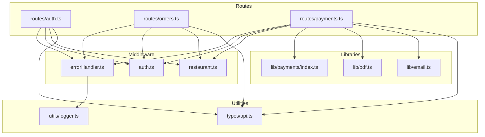
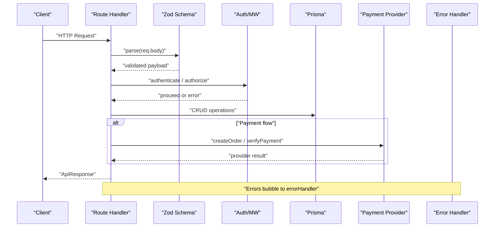
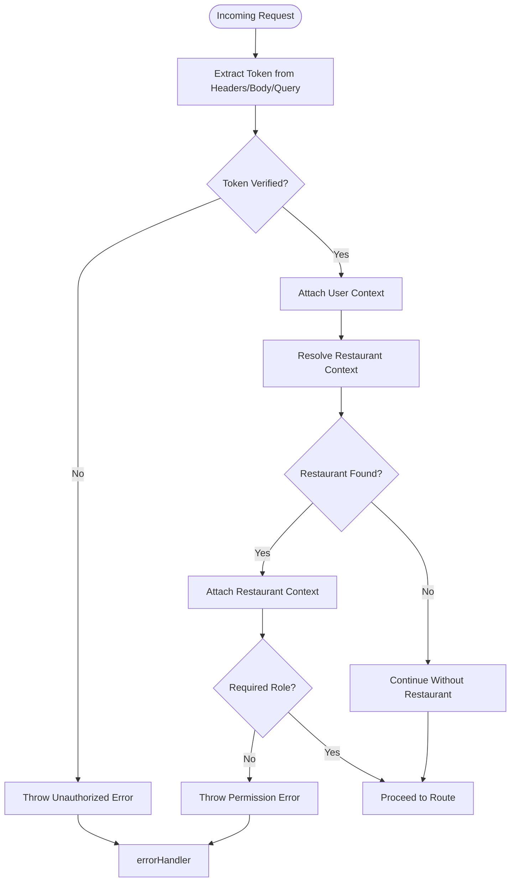
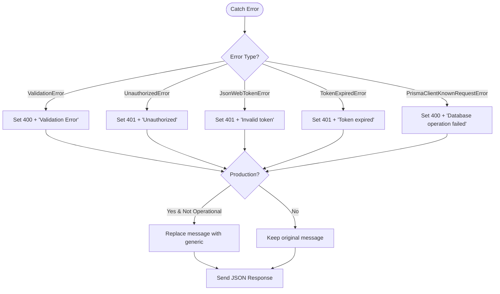
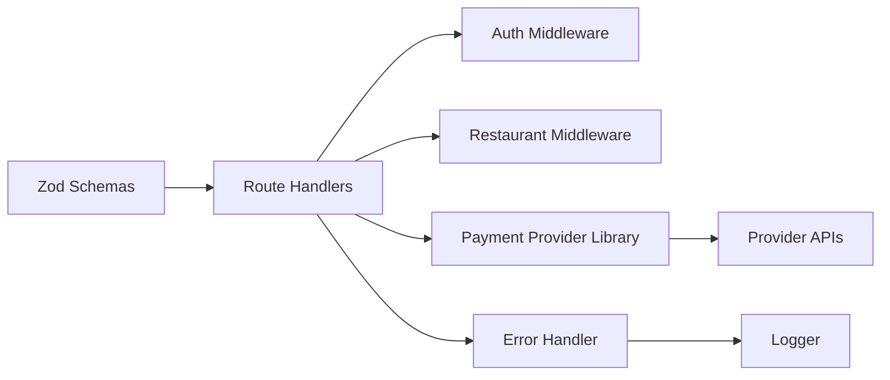

# Input Validation & Sanitization

<cite>
**Referenced Files in This Document**
- [errorHandler.ts](file://restaurant-backend/src/middleware/errorHandler.ts)
- [auth.ts](file://restaurant-backend/src/middleware/auth.ts)
- [restaurant.ts](file://restaurant-backend/src/middleware/restaurant.ts)
- [auth.ts](file://restaurant-backend/src/routes/auth.ts)
- [orders.ts](file://restaurant-backend/src/routes/orders.ts)
- [payments.ts](file://restaurant-backend/src/routes/payments.ts)
- [api.ts](file://restaurant-backend/src/types/api.ts)
- [payments/index.ts](file://restaurant-backend/src/lib/payments/index.ts)
- [pdf.ts](file://restaurant-backend/src/lib/pdf.ts)
- [email.ts](file://restaurant-backend/src/lib/email.ts)
- [logger.ts](file://restaurant-backend/src/utils/logger.ts)
- [server.ts](file://restaurant-backend/src/server.ts)
- [package.json](file://restaurant-backend/package.json)
</cite>

## Table of Contents
1. [Introduction](#introduction)
2. [Project Structure](#project-structure)
3. [Core Components](#core-components)
4. [Architecture Overview](#architecture-overview)
5. [Detailed Component Analysis](#detailed-component-analysis)
6. [Dependency Analysis](#dependency-analysis)
7. [Performance Considerations](#performance-considerations)
8. [Troubleshooting Guide](#troubleshooting-guide)
9. [Conclusion](#conclusion)
10. [Appendices](#appendices)

## Introduction
This document explains DeQ-Bite’s input validation and sanitization strategies across API requests, form submissions, and data processing. It focuses on Zod schema validation, middleware-based validation patterns, sanitization techniques to prevent injection and data corruption, error handling for validation failures, and specialized handling for sensitive data such as payment information and administrative inputs. It also covers validation performance, caching strategies, maintenance, and extension guidelines.

## Project Structure
DeQ-Bite’s backend is organized around Express routes, middleware, typed APIs, and libraries for payments and documents. Validation is primarily implemented using Zod schemas in route handlers, with shared middleware for authentication, authorization, and error handling.

**Diagram sources**
- [errorHandler.ts:1-82](file://restaurant-backend/src/middleware/errorHandler.ts#L1-L82)
- [auth.ts:1-137](file://restaurant-backend/src/middleware/auth.ts#L1-L137)
- [restaurant.ts:1-246](file://restaurant-backend/src/middleware/restaurant.ts#L1-L246)
- [auth.ts:1-390](file://restaurant-backend/src/routes/auth.ts#L1-L390)
- [orders.ts:1-694](file://restaurant-backend/src/routes/orders.ts#L1-L694)
- [payments.ts:1-731](file://restaurant-backend/src/routes/payments.ts#L1-L731)
- [payments/index.ts:1-124](file://restaurant-backend/src/lib/payments/index.ts#L1-L124)
- [pdf.ts:1-259](file://restaurant-backend/src/lib/pdf.ts#L1-L259)
- [email.ts:1-227](file://restaurant-backend/src/lib/email.ts#L1-L227)
- [api.ts:1-114](file://restaurant-backend/src/types/api.ts#L1-L114)
- [logger.ts:1-56](file://restaurant-backend/src/utils/logger.ts#L1-L56)

**Section sources**
- [auth.ts:1-390](file://restaurant-backend/src/routes/auth.ts#L1-L390)
- [orders.ts:1-694](file://restaurant-backend/src/routes/orders.ts#L1-L694)
- [payments.ts:1-731](file://restaurant-backend/src/routes/payments.ts#L1-L731)
- [errorHandler.ts:1-82](file://restaurant-backend/src/middleware/errorHandler.ts#L1-L82)
- [auth.ts:1-137](file://restaurant-backend/src/middleware/auth.ts#L1-L137)
- [restaurant.ts:1-246](file://restaurant-backend/src/middleware/restaurant.ts#L1-L246)
- [api.ts:1-114](file://restaurant-backend/src/types/api.ts#L1-L114)
- [payments/index.ts:1-124](file://restaurant-backend/src/lib/payments/index.ts#L1-L124)
- [pdf.ts:1-259](file://restaurant-backend/src/lib/pdf.ts#L1-L259)
- [email.ts:1-227](file://restaurant-backend/src/lib/email.ts#L1-L227)
- [logger.ts:1-56](file://restaurant-backend/src/utils/logger.ts#L1-L56)
- [server.ts:1-33](file://restaurant-backend/src/server.ts#L1-L33)
- [package.json:1-80](file://restaurant-backend/package.json#L1-L80)

## Core Components
- Zod schema validation: Centralized in route handlers for request payloads (authentication, orders, payments).
- Middleware validation and authorization: Authentication, restaurant context, and role-based authorization.
- Error handling: Unified error handler with operational error classification and environment-aware error responses.
- Sensitive data handling: Payment provider verification, cash payment confirmation, and invoice generation with controlled exposure of data.
- Logging and observability: Structured logging for diagnostics and security events.

**Section sources**
- [auth.ts:12-28](file://restaurant-backend/src/routes/auth.ts#L12-L28)
- [orders.ts:82-267](file://restaurant-backend/src/routes/orders.ts#L82-L267)
- [payments.ts:16-42](file://restaurant-backend/src/routes/payments.ts#L16-L42)
- [errorHandler.ts:9-82](file://restaurant-backend/src/middleware/errorHandler.ts#L9-L82)
- [auth.ts:7-137](file://restaurant-backend/src/middleware/auth.ts#L7-L137)
- [restaurant.ts:76-246](file://restaurant-backend/src/middleware/restaurant.ts#L76-L246)

## Architecture Overview
The validation architecture combines declarative Zod schemas with middleware and centralized error handling. Routes parse and validate payloads, enforce authentication and authorization, and then operate on validated data. Payment-sensitive flows use provider-specific validation and signatures.

**Diagram sources**
- [auth.ts:48-102](file://restaurant-backend/src/routes/auth.ts#L48-L102)
- [orders.ts:82-267](file://restaurant-backend/src/routes/orders.ts#L82-L267)
- [payments.ts:196-292](file://restaurant-backend/src/routes/payments.ts#L196-L292)
- [payments/index.ts:40-81](file://restaurant-backend/src/lib/payments/index.ts#L40-L81)
- [errorHandler.ts:22-76](file://restaurant-backend/src/middleware/errorHandler.ts#L22-L76)

## Detailed Component Analysis

### Zod Schema Validation in Routes
- Authentication routes define schemas for registration, login, and password changes. These schemas validate presence, length, and format of fields and are applied via parse before proceeding to business logic.
- Orders route validates order creation, item lists, coupon application, and status updates with explicit checks for arrays, numeric quantities, and availability.
- Payments route defines schemas for creating payment orders, verifying payments, issuing refunds, confirming cash payments, and updating statuses. These schemas constrain provider enums, amounts, and required fields.

Implementation examples (paths):
- [Register schema:13-18](file://restaurant-backend/src/routes/auth.ts#L13-L18)
- [Login schema:20-23](file://restaurant-backend/src/routes/auth.ts#L20-L23)
- [Change password schema:25-28](file://restaurant-backend/src/routes/auth.ts#L25-L28)
- [Create payment schema:16-19](file://restaurant-backend/src/routes/payments.ts#L16-L19)
- [Verify payment schema:21-25](file://restaurant-backend/src/routes/payments.ts#L21-L25)
- [Refund payment schema:27-31](file://restaurant-backend/src/routes/payments.ts#L27-L31)
- [Cash confirm schema:33-36](file://restaurant-backend/src/routes/payments.ts#L33-L36)
- [Update payment status schema:38-42](file://restaurant-backend/src/routes/payments.ts#L38-L42)

**Section sources**
- [auth.ts:12-28](file://restaurant-backend/src/routes/auth.ts#L12-L28)
- [payments.ts:16-42](file://restaurant-backend/src/routes/payments.ts#L16-L42)

### Validation Middleware Patterns
- Authentication middleware extracts tokens from headers or fallbacks, verifies them, and attaches user context. It throws structured errors for missing or invalid tokens.
- Restaurant context middleware resolves restaurant context from headers, subdomains, or path slugs and attaches restaurant metadata. It gracefully handles schema mismatches.
- Role-based authorization middleware checks restaurant membership and roles before allowing administrative actions.

**Diagram sources**
- [auth.ts:7-75](file://restaurant-backend/src/middleware/auth.ts#L7-L75)
- [restaurant.ts:76-200](file://restaurant-backend/src/middleware/restaurant.ts#L76-L200)
- [restaurant.ts:213-245](file://restaurant-backend/src/middleware/restaurant.ts#L213-L245)

**Section sources**
- [auth.ts:7-137](file://restaurant-backend/src/middleware/auth.ts#L7-L137)
- [restaurant.ts:76-246](file://restaurant-backend/src/middleware/restaurant.ts#L76-L246)

### Input Sanitization Techniques
- Zod enforces strict typing and constraints at parse time, rejecting unexpected shapes and invalid formats.
- Manual validations complement Zod for domain-specific checks (e.g., item arrays, numeric quantities, availability, coupon eligibility).
- Payment flows rely on provider-side verification and signatures to prevent tampering and ensure integrity.
- Logging captures sanitized request metadata for auditing without exposing raw sensitive payloads.

Guidelines:
- Prefer Zod schemas for structural validation; add manual checks for business rules.
- Avoid reflecting untrusted input directly in logs; sanitize or redact sensitive fields.
- Use provider APIs for payment verification rather than trusting client-provided payment data.

**Section sources**
- [orders.ts:82-176](file://restaurant-backend/src/routes/orders.ts#L82-L176)
- [payments.ts:294-407](file://restaurant-backend/src/routes/payments.ts#L294-L407)
- [payments/index.ts:60-77](file://restaurant-backend/src/lib/payments/index.ts#L60-L77)
- [logger.ts:1-56](file://restaurant-backend/src/utils/logger.ts#L1-L56)

### Error Handling Strategies for Validation Failures
- Operational vs non-operational errors: Operational errors (e.g., validation) are surfaced with user-friendly messages; non-operational errors are masked in production.
- Specific error mappings: ValidationError, UnauthorizedError, JsonWebTokenError, TokenExpiredError, PrismaClientKnownRequestError are normalized to appropriate HTTP codes.
- Environment-aware responses: Stack traces are included in development; production responses are minimal to avoid leaking internal details.

**Diagram sources**
- [errorHandler.ts:48-76](file://restaurant-backend/src/middleware/errorHandler.ts#L48-L76)

**Section sources**
- [errorHandler.ts:9-82](file://restaurant-backend/src/middleware/errorHandler.ts#L9-L82)

### Validation of Sensitive Data
- Payment information:
  - Creation uses Zod to validate order ID and provider selection.
  - Verification relies on provider signature verification and payment status checks.
  - Cash payment confirmation requires authorization and updates payment status accordingly.
- Personal details:
  - Registration enforces name, email, phone, and password constraints.
  - Login validates credentials against stored hashes.
- Administrative inputs:
  - Payment status updates and cash confirmations are restricted to authorized roles.

Implementation examples (paths):
- [Create payment schema:16-19](file://restaurant-backend/src/routes/payments.ts#L16-L19)
- [Verify payment schema:21-25](file://restaurant-backend/src/routes/payments.ts#L21-L25)
- [Cash confirm schema:33-36](file://restaurant-backend/src/routes/payments.ts#L33-L36)
- [Update payment status schema:38-42](file://restaurant-backend/src/routes/payments.ts#L38-L42)
- [Register schema:13-18](file://restaurant-backend/src/routes/auth.ts#L13-L18)
- [Login schema:20-23](file://restaurant-backend/src/routes/auth.ts#L20-L23)

**Section sources**
- [payments.ts:16-42](file://restaurant-backend/src/routes/payments.ts#L16-L42)
- [auth.ts:13-23](file://restaurant-backend/src/routes/auth.ts#L13-L23)

### Implementation Examples
- Custom validators: Combine Zod with manual checks for coupon validity and item availability.
- Async validation: Use Zod parse within async handlers; wrap route handlers with async wrapper to catch thrown errors.
- Validation pipeline integration: Apply Zod parse early in route handlers; attach auth/restaurant middleware before business logic.

Paths:
- [Async handler wrapper:78-82](file://restaurant-backend/src/middleware/errorHandler.ts#L78-L82)
- [Order creation validation:82-176](file://restaurant-backend/src/routes/orders.ts#L82-L176)
- [Payment verification flow:294-407](file://restaurant-backend/src/routes/payments.ts#L294-L407)

**Section sources**
- [errorHandler.ts:78-82](file://restaurant-backend/src/middleware/errorHandler.ts#L78-L82)
- [orders.ts:82-176](file://restaurant-backend/src/routes/orders.ts#L82-L176)
- [payments.ts:294-407](file://restaurant-backend/src/routes/payments.ts#L294-L407)

## Dependency Analysis
- Zod is used for schema validation across routes.
- Express middleware integrates authentication, authorization, and restaurant context resolution.
- Payment provider library encapsulates provider-specific validation and verification.
- PDF and email libraries depend on validated order data for invoice generation and notifications.

**Diagram sources**
- [auth.ts:12-28](file://restaurant-backend/src/routes/auth.ts#L12-L28)
- [orders.ts:82-176](file://restaurant-backend/src/routes/orders.ts#L82-L176)
- [payments.ts:16-42](file://restaurant-backend/src/routes/payments.ts#L16-L42)
- [payments/index.ts:1-124](file://restaurant-backend/src/lib/payments/index.ts#L1-L124)
- [errorHandler.ts:22-76](file://restaurant-backend/src/middleware/errorHandler.ts#L22-L76)
- [logger.ts:1-56](file://restaurant-backend/src/utils/logger.ts#L1-L56)

**Section sources**
- [package.json:18-44](file://restaurant-backend/package.json#L18-L44)

## Performance Considerations
- Schema parsing overhead: Zod parsing is fast and synchronous; keep schemas concise and reuse where possible.
- Middleware ordering: Place lightweight checks (auth/restaurant) early to fail fast and reduce downstream work.
- Database queries: Use selective Prisma queries and avoid N+1 patterns; leverage transactions for atomicity where needed.
- Logging volume: Structured logging is efficient; avoid logging large payloads or secrets.
- Rate limiting and input limits: Consider applying rate limits and input size caps at the Express layer.

[No sources needed since this section provides general guidance]

## Troubleshooting Guide
Common issues and resolutions:
- Validation errors: Ensure request payloads match Zod schemas; check for missing fields or incorrect types.
- Authentication failures: Confirm Authorization header format and JWT_SECRET configuration; verify token expiration.
- Restaurant context not found: Verify subdomain/slug headers or path parameters; confirm restaurant active status.
- Payment verification failures: Validate provider signatures and payment status; ensure provider credentials are configured.

Paths for reference:
- [Error handler:22-76](file://restaurant-backend/src/middleware/errorHandler.ts#L22-L76)
- [Auth middleware:7-75](file://restaurant-backend/src/middleware/auth.ts#L7-L75)
- [Restaurant middleware:76-200](file://restaurant-backend/src/middleware/restaurant.ts#L76-L200)
- [Payments provider verification:60-77](file://restaurant-backend/src/lib/payments/index.ts#L60-L77)

**Section sources**
- [errorHandler.ts:22-76](file://restaurant-backend/src/middleware/errorHandler.ts#L22-L76)
- [auth.ts:7-75](file://restaurant-backend/src/middleware/auth.ts#L7-L75)
- [restaurant.ts:76-200](file://restaurant-backend/src/middleware/restaurant.ts#L76-L200)
- [payments/index.ts:60-77](file://restaurant-backend/src/lib/payments/index.ts#L60-L77)

## Conclusion
DeQ-Bite employs a robust, layered validation strategy combining Zod schemas, middleware-based authorization, and provider-driven verification. Errors are handled consistently with environment-aware responses, and sensitive data is protected through strict validation and controlled exposure. The architecture supports scalability and maintainability while preserving security and reliability.

[No sources needed since this section summarizes without analyzing specific files]

## Appendices

### Best Practices for Extending Validation Rules
- Define schemas close to route handlers for clarity and maintainability.
- Use Zod refinements for cross-field constraints and async refinements when needed.
- Centralize reusable schemas and compose them in multiple routes.
- Add manual checks for domain-specific rules after Zod parse.
- Keep error messages user-friendly; log detailed errors securely.

[No sources needed since this section provides general guidance]