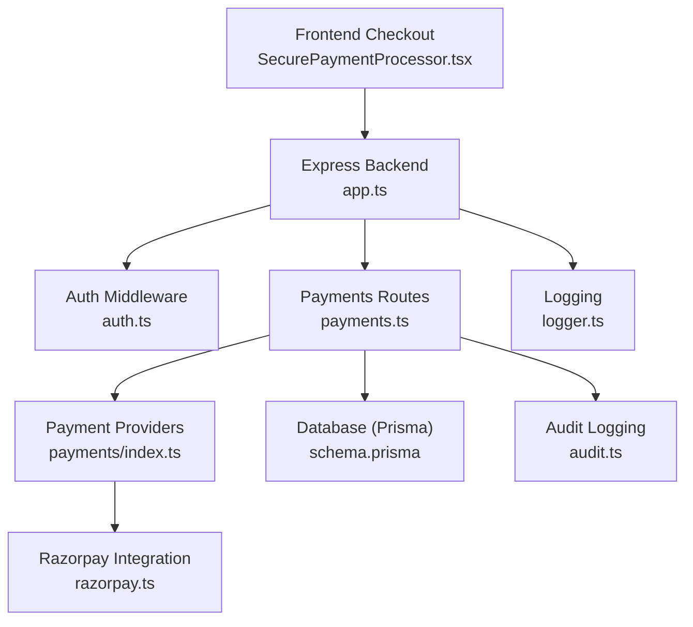
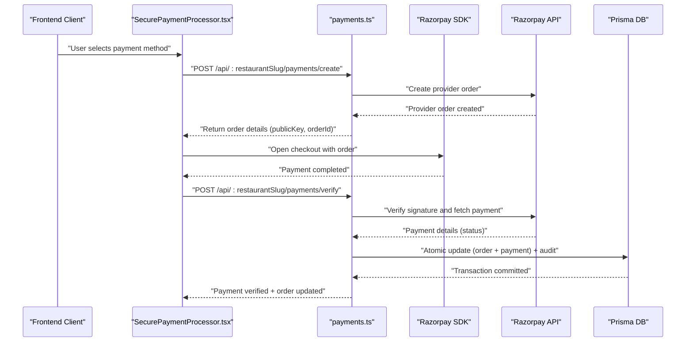
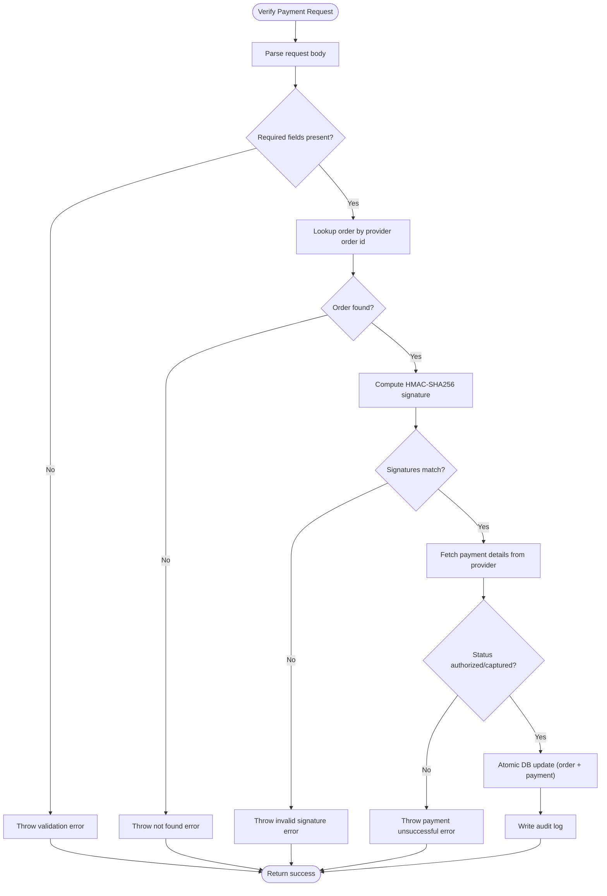
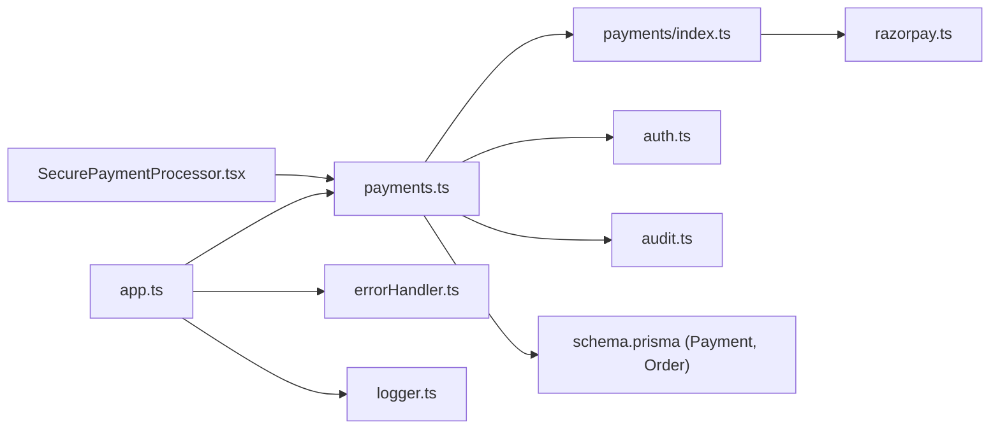

# Payment Security & Fraud Prevention

<cite>
**Referenced Files in This Document**
- [payments.ts](file://restaurant-backend/src/routes/payments.ts)
- [payments/index.ts](file://restaurant-backend/src/lib/payments/index.ts)
- [razorpay.ts](file://restaurant-backend/src/lib/razorpay.ts)
- [auth.ts](file://restaurant-backend/src/middleware/auth.ts)
- [app.ts](file://restaurant-backend/src/app.ts)
- [errorHandler.ts](file://restaurant-backend/src/middleware/errorHandler.ts)
- [audit.ts](file://restaurant-backend/src/utils/audit.ts)
- [logger.ts](file://restaurant-backend/src/utils/logger.ts)
- [env.d.ts](file://restaurant-backend/src/types/env.d.ts)
- [schema.prisma](file://restaurant-backend/prisma/schema.prisma)
- [database.ts](file://restaurant-backend/src/config/database.ts)
- [SecurePaymentProcessor.tsx](file://restaurant-frontend/src/components/SecurePaymentProcessor.tsx)
</cite>

## Table of Contents
1. [Introduction](#introduction)
2. [Project Structure](#project-structure)
3. [Core Components](#core-components)
4. [Architecture Overview](#architecture-overview)
5. [Detailed Component Analysis](#detailed-component-analysis)
6. [Dependency Analysis](#dependency-analysis)
7. [Performance Considerations](#performance-considerations)
8. [Troubleshooting Guide](#troubleshooting-guide)
9. [Conclusion](#conclusion)
10. [Appendices](#appendices)

## Introduction
This document provides comprehensive payment security and fraud prevention guidance for DeQ-Bite’s payment processing. It focuses on server-side verification, signature validation, transaction integrity, PCI DSS-aligned handling, fraud controls, gateway security, refund authorization, and operational monitoring. Implementation examples are linked to concrete source files to enable precise auditing and remediation.

## Project Structure
DeQ-Bite’s payment security spans backend Express routes, middleware, payment provider integrations, and frontend checkout components. The backend enforces authentication, validates inputs, performs cryptographic signature verification, and maintains audit trails. The frontend securely initiates payments via a provider SDK and verifies outcomes server-side.

**Diagram sources**
- [app.ts:1-148](file://restaurant-backend/src/app.ts#L1-L148)
- [auth.ts:1-137](file://restaurant-backend/src/middleware/auth.ts#L1-L137)
- [payments.ts:1-731](file://restaurant-backend/src/routes/payments.ts#L1-L731)
- [payments/index.ts:1-124](file://restaurant-backend/src/lib/payments/index.ts#L1-L124)
- [razorpay.ts:1-219](file://restaurant-backend/src/lib/razorpay.ts#L1-L219)
- [schema.prisma:1-402](file://restaurant-backend/prisma/schema.prisma#L1-L402)
- [audit.ts:1-17](file://restaurant-backend/src/utils/audit.ts#L1-L17)
- [logger.ts:1-56](file://restaurant-backend/src/utils/logger.ts#L1-L56)

**Section sources**
- [app.ts:1-148](file://restaurant-backend/src/app.ts#L1-L148)
- [payments.ts:1-731](file://restaurant-backend/src/routes/payments.ts#L1-L731)
- [payments/index.ts:1-124](file://restaurant-backend/src/lib/payments/index.ts#L1-L124)
- [razorpay.ts:1-219](file://restaurant-backend/src/lib/razorpay.ts#L1-L219)
- [schema.prisma:1-402](file://restaurant-backend/prisma/schema.prisma#L1-L402)

## Core Components
- Authentication and authorization ensure only authorized users can initiate or verify payments.
- Payment provider abstraction supports pluggable gateways with consistent verification and refund flows.
- Cryptographic signature verification for payment authenticity.
- Transaction integrity enforced via atomic database updates and audit logs.
- PCI-aligned handling by delegating card data to a PCI-compliant provider and avoiding raw PAN storage.
- Frontend checkout integrates securely with provider-hosted UI and verifies outcomes server-side.

**Section sources**
- [auth.ts:1-137](file://restaurant-backend/src/middleware/auth.ts#L1-L137)
- [payments/index.ts:1-124](file://restaurant-backend/src/lib/payments/index.ts#L1-L124)
- [payments.ts:1-731](file://restaurant-backend/src/routes/payments.ts#L1-L731)
- [razorpay.ts:1-219](file://restaurant-backend/src/lib/razorpay.ts#L1-L219)
- [audit.ts:1-17](file://restaurant-backend/src/utils/audit.ts#L1-L17)

## Architecture Overview
End-to-end payment flow with strong server-side verification and auditability.

**Diagram sources**
- [SecurePaymentProcessor.tsx:1-347](file://restaurant-frontend/src/components/SecurePaymentProcessor.tsx#L1-L347)
- [payments.ts:195-407](file://restaurant-backend/src/routes/payments.ts#L195-L407)
- [payments/index.ts:40-81](file://restaurant-backend/src/lib/payments/index.ts#L40-L81)
- [razorpay.ts:33-105](file://restaurant-backend/src/lib/razorpay.ts#L33-L105)
- [schema.prisma:278-296](file://restaurant-backend/prisma/schema.prisma#L278-L296)

## Detailed Component Analysis

### Authentication and Authorization Controls
- Token extraction supports Authorization header and fallbacks to body/query.
- JWT verification requires a configured secret; otherwise, server configuration errors are raised.
- Role-based access ensures only owners/admins can manually confirm cash payments or update statuses.

Implementation highlights:
- Token parsing and verification: [auth.ts:7-75](file://restaurant-backend/src/middleware/auth.ts#L7-L75)
- Optional auth variant: [auth.ts:91-137](file://restaurant-backend/src/middleware/auth.ts#L91-L137)
- Cash confirmation route with role gating: [payments.ts:570-646](file://restaurant-backend/src/routes/payments.ts#L570-L646)
- Payment status update with role gating: [payments.ts:648-728](file://restaurant-backend/src/routes/payments.ts#L648-L728)

**Section sources**
- [auth.ts:1-137](file://restaurant-backend/src/middleware/auth.ts#L1-L137)
- [payments.ts:570-646](file://restaurant-backend/src/routes/payments.ts#L570-L646)
- [payments.ts:648-728](file://restaurant-backend/src/routes/payments.ts#L648-L728)

### Payment Provider Abstraction and Signature Validation
- Provider selection based on configuration and order context.
- Signature validation uses HMAC-SHA256 over concatenated order/payment identifiers.
- Payment status fetched from provider to ensure finality before marking completed.

Key flows:
- Provider factory and verification: [payments/index.ts:40-81](file://restaurant-backend/src/lib/payments/index.ts#L40-L81)
- Signature verification logic: [razorpay.ts:65-105](file://restaurant-backend/src/lib/razorpay.ts#L65-L105)
- Verification endpoint and transactional updates: [payments.ts:294-407](file://restaurant-backend/src/routes/payments.ts#L294-L407)

**Diagram sources**
- [payments.ts:294-407](file://restaurant-backend/src/routes/payments.ts#L294-L407)
- [payments/index.ts:60-77](file://restaurant-backend/src/lib/payments/index.ts#L60-L77)
- [razorpay.ts:65-105](file://restaurant-backend/src/lib/razorpay.ts#L65-L105)

**Section sources**
- [payments/index.ts:1-124](file://restaurant-backend/src/lib/payments/index.ts#L1-L124)
- [payments.ts:294-407](file://restaurant-backend/src/routes/payments.ts#L294-L407)
- [razorpay.ts:65-105](file://restaurant-backend/src/lib/razorpay.ts#L65-L105)

### Transaction Integrity and Atomicity
- Payments endpoint uses Prisma transactions to ensure order and payment records are written atomically.
- Audit logs are created after successful verification to maintain immutable records.
- Cash payment confirmation and manual status updates also use transactions.

References:
- Atomic verification and payment creation: [payments.ts:330-374](file://restaurant-backend/src/routes/payments.ts#L330-L374)
- Cash confirmation transaction: [payments.ts:593-617](file://restaurant-backend/src/routes/payments.ts#L593-L617)
- Manual status update transaction: [payments.ts:688-699](file://restaurant-backend/src/routes/payments.ts#L688-L699)
- Audit logging wrapper: [audit.ts:5-16](file://restaurant-backend/src/utils/audit.ts#L5-L16)

**Section sources**
- [payments.ts:330-374](file://restaurant-backend/src/routes/payments.ts#L330-L374)
- [payments.ts:593-617](file://restaurant-backend/src/routes/payments.ts#L593-L617)
- [payments.ts:688-699](file://restaurant-backend/src/routes/payments.ts#L688-L699)
- [audit.ts:1-17](file://restaurant-backend/src/utils/audit.ts#L1-L17)

### PCI DSS Compliance and Secure Data Handling
- Cardholder data is handled by the provider; the backend receives only non-card identifiers and signatures.
- Environment variables store secrets (provider keys, JWT secret).
- Logging avoids exposing sensitive data; partial hashes/signature segments are logged for diagnostics.

Evidence:
- Provider secret usage for HMAC: [razorpay.ts:72-75](file://restaurant-backend/src/lib/razorpay.ts#L72-L75)
- Webhook signature validation with secret: [razorpay.ts:206-209](file://restaurant-backend/src/lib/razorpay.ts#L206-L209)
- Environment variable schema: [env.d.ts:10-11](file://restaurant-backend/src/types/env.d.ts#L10-L11)
- Logging safeguards: [logger.ts:1-56](file://restaurant-backend/src/utils/logger.ts#L1-L56)

**Section sources**
- [razorpay.ts:65-105](file://restaurant-backend/src/lib/razorpay.ts#L65-L105)
- [razorpay.ts:200-218](file://restaurant-backend/src/lib/razorpay.ts#L200-L218)
- [env.d.ts:1-39](file://restaurant-backend/src/types/env.d.ts#L1-L39)
- [logger.ts:1-56](file://restaurant-backend/src/utils/logger.ts#L1-L56)

### Fraud Prevention Mechanisms
- Input validation with Zod schemas prevents malformed requests.
- Strict correlation of provider order IDs to orders prevents replay attacks.
- Signature mismatch logging enables quick detection of tampering attempts.
- Role-gated cash confirmation and status updates reduce internal abuse.
- Audit logs record all payment actions with metadata for forensic analysis.

References:
- Request schemas: [payments.ts:16-42](file://restaurant-backend/src/routes/payments.ts#L16-L42)
- Correlation by provider order ID: [payments.ts:298-304](file://restaurant-backend/src/routes/payments.ts#L298-L304)
- Signature mismatch logging: [razorpay.ts:87-94](file://restaurant-backend/src/lib/razorpay.ts#L87-L94)
- Role gating: [payments.ts:570-646](file://restaurant-backend/src/routes/payments.ts#L570-L646), [payments.ts:648-728](file://restaurant-backend/src/routes/payments.ts#L648-L728)
- Audit trail: [payments.ts:376-388](file://restaurant-backend/src/routes/payments.ts#L376-L388), [payments.ts:470-481](file://restaurant-backend/src/routes/payments.ts#L470-L481)

**Section sources**
- [payments.ts:16-42](file://restaurant-backend/src/routes/payments.ts#L16-L42)
- [payments.ts:298-304](file://restaurant-backend/src/routes/payments.ts#L298-L304)
- [razorpay.ts:87-94](file://restaurant-backend/src/lib/razorpay.ts#L87-L94)
- [payments.ts:570-646](file://restaurant-backend/src/routes/payments.ts#L570-L646)
- [payments.ts:648-728](file://restaurant-backend/src/routes/payments.ts#L648-L728)
- [payments.ts:376-388](file://restaurant-backend/src/routes/payments.ts#L376-L388)
- [payments.ts:470-481](file://restaurant-backend/src/routes/payments.ts#L470-L481)

### Payment Gateway Security
- API key protection: stored in environment variables and validated before use.
- Secure communication: provider SDK initialized with configured keys.
- Webhook signature validation: separate HMAC validation for incoming events.

References:
- Provider initialization and validation: [razorpay.ts:7-19](file://restaurant-backend/src/lib/razorpay.ts#L7-L19)
- Webhook signature validation: [razorpay.ts:200-218](file://restaurant-backend/src/lib/razorpay.ts#L200-L218)

**Section sources**
- [razorpay.ts:7-19](file://restaurant-backend/src/lib/razorpay.ts#L7-L19)
- [razorpay.ts:200-218](file://restaurant-backend/src/lib/razorpay.ts#L200-L218)

### Refund Processing Security
- Authorization: only completed/partially paid orders can be refunded; requires payment transaction ID.
- Amount validation: refund amount is rounded to paise and bounded by paid amount.
- Atomic refund updates: order and payment records updated in a single transaction.
- Audit trail: refund action recorded with amount and reason.

References:
- Refund endpoint and validation: [payments.ts:409-516](file://restaurant-backend/src/routes/payments.ts#L409-L516)
- Atomic refund transaction: [payments.ts:444-468](file://restaurant-backend/src/routes/payments.ts#L444-L468)
- Audit log for refunds: [payments.ts:470-481](file://restaurant-backend/src/routes/payments.ts#L470-L481)

**Section sources**
- [payments.ts:409-516](file://restaurant-backend/src/routes/payments.ts#L409-L516)
- [payments.ts:444-468](file://restaurant-backend/src/routes/payments.ts#L444-L468)
- [payments.ts:470-481](file://restaurant-backend/src/routes/payments.ts#L470-L481)

### Frontend Payment Security
- Secure checkout uses provider-hosted UI with a public key returned by the backend.
- Verification races against a timeout to prevent hanging UI states.
- Error messaging distinguishes signature failures, timeouts, and provider status issues.

References:
- Frontend checkout flow: [SecurePaymentProcessor.tsx:83-206](file://restaurant-frontend/src/components/SecurePaymentProcessor.tsx#L83-L206)

**Section sources**
- [SecurePaymentProcessor.tsx:1-347](file://restaurant-frontend/src/components/SecurePaymentProcessor.tsx#L1-L347)

## Dependency Analysis

**Diagram sources**
- [payments.ts:1-731](file://restaurant-backend/src/routes/payments.ts#L1-L731)
- [payments/index.ts:1-124](file://restaurant-backend/src/lib/payments/index.ts#L1-L124)
- [razorpay.ts:1-219](file://restaurant-backend/src/lib/razorpay.ts#L1-L219)
- [auth.ts:1-137](file://restaurant-backend/src/middleware/auth.ts#L1-L137)
- [audit.ts:1-17](file://restaurant-backend/src/utils/audit.ts#L1-L17)
- [schema.prisma:278-296](file://restaurant-backend/prisma/schema.prisma#L278-L296)
- [app.ts:1-148](file://restaurant-backend/src/app.ts#L1-L148)
- [errorHandler.ts:1-82](file://restaurant-backend/src/middleware/errorHandler.ts#L1-L82)
- [logger.ts:1-56](file://restaurant-backend/src/utils/logger.ts#L1-L56)
- [SecurePaymentProcessor.tsx:1-347](file://restaurant-frontend/src/components/SecurePaymentProcessor.tsx#L1-L347)

**Section sources**
- [payments.ts:1-731](file://restaurant-backend/src/routes/payments.ts#L1-L731)
- [payments/index.ts:1-124](file://restaurant-backend/src/lib/payments/index.ts#L1-L124)
- [razorpay.ts:1-219](file://restaurant-backend/src/lib/razorpay.ts#L1-L219)
- [auth.ts:1-137](file://restaurant-backend/src/middleware/auth.ts#L1-L137)
- [audit.ts:1-17](file://restaurant-backend/src/utils/audit.ts#L1-L17)
- [schema.prisma:278-296](file://restaurant-backend/prisma/schema.prisma#L278-L296)
- [app.ts:1-148](file://restaurant-backend/src/app.ts#L1-L148)
- [errorHandler.ts:1-82](file://restaurant-backend/src/middleware/errorHandler.ts#L1-L82)
- [logger.ts:1-56](file://restaurant-backend/src/utils/logger.ts#L1-L56)
- [SecurePaymentProcessor.tsx:1-347](file://restaurant-frontend/src/components/SecurePaymentProcessor.tsx#L1-L347)

## Performance Considerations
- Signature verification and payment fetch are O(1) operations with minimal overhead.
- Database transactions ensure consistency but add latency; keep payloads minimal and avoid unnecessary writes.
- Logging includes timing metrics for provider calls to aid performance tuning.
- Rate limiting protects endpoints from abuse while allowing normal traffic.

[No sources needed since this section provides general guidance]

## Troubleshooting Guide
Common issues and remediation steps:
- Invalid signature errors: verify provider secret configuration and signature computation alignment.
  - Reference: [razorpay.ts:65-105](file://restaurant-backend/src/lib/razorpay.ts#L65-L105)
- Payment not successful: ensure provider status indicates authorized/captured before marking complete.
  - Reference: [payments.ts:326-327](file://restaurant-backend/src/routes/payments.ts#L326-L327)
- Missing order or mismatched provider order ID: confirm frontend created order with backend and used correct order ID.
  - Reference: [payments.ts:298-304](file://restaurant-backend/src/routes/payments.ts#L298-L304)
- Audit log table missing: migration may not have run; logs are safely skipped to avoid blocking.
  - Reference: [audit.ts:5-16](file://restaurant-backend/src/utils/audit.ts#L5-L16)
- Production logging and error handling: review structured logs and ensure secrets are not exposed.
  - Reference: [logger.ts:1-56](file://restaurant-backend/src/utils/logger.ts#L1-L56), [errorHandler.ts:22-76](file://restaurant-backend/src/middleware/errorHandler.ts#L22-L76)

**Section sources**
- [razorpay.ts:65-105](file://restaurant-backend/src/lib/razorpay.ts#L65-L105)
- [payments.ts:326-327](file://restaurant-backend/src/routes/payments.ts#L326-L327)
- [payments.ts:298-304](file://restaurant-backend/src/routes/payments.ts#L298-L304)
- [audit.ts:5-16](file://restaurant-backend/src/utils/audit.ts#L5-L16)
- [logger.ts:1-56](file://restaurant-backend/src/utils/logger.ts#L1-L56)
- [errorHandler.ts:22-76](file://restaurant-backend/src/middleware/errorHandler.ts#L22-L76)

## Conclusion
DeQ-Bite’s payment system emphasizes server-side verification, cryptographic integrity, and auditability. By delegating card data to a PCI-compliant provider, enforcing strict authorization and validation, and maintaining immutable logs, the system reduces risk and supports compliance. Operational improvements include stronger rate limits, proactive monitoring, and periodic security reviews.

[No sources needed since this section summarizes without analyzing specific files]

## Appendices

### Implementation Examples (by file reference)
- Payment verification flow: [payments.ts:294-407](file://restaurant-backend/src/routes/payments.ts#L294-L407)
- Signature validation logic: [razorpay.ts:65-105](file://restaurant-backend/src/lib/razorpay.ts#L65-L105)
- Atomic refund update: [payments.ts:444-468](file://restaurant-backend/src/routes/payments.ts#L444-L468)
- Audit trail creation: [payments.ts:376-388](file://restaurant-backend/src/routes/payments.ts#L376-L388)
- Frontend checkout and verification: [SecurePaymentProcessor.tsx:83-206](file://restaurant-frontend/src/components/SecurePaymentProcessor.tsx#L83-L206)

### Security Headers and Transport
- Helmet-enabled CSP and COEP toggles for hardened transport defaults.
- Allowed origins and headers configured for frontend domains and API keys.
- Rate limiting applied to mitigate brute-force and abuse.

References:
- Security middleware and CORS: [app.ts:37-65](file://restaurant-backend/src/app.ts#L37-L65)
- Rate limiting: [app.ts:67-77](file://restaurant-backend/src/app.ts#L67-L77)

**Section sources**
- [app.ts:37-65](file://restaurant-backend/src/app.ts#L37-L65)
- [app.ts:67-77](file://restaurant-backend/src/app.ts#L67-L77)