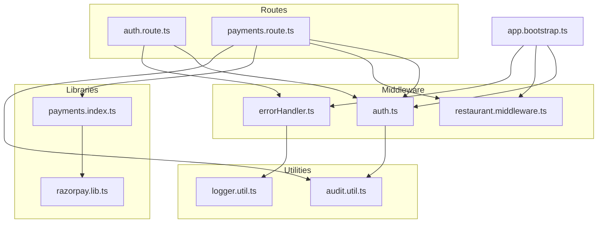
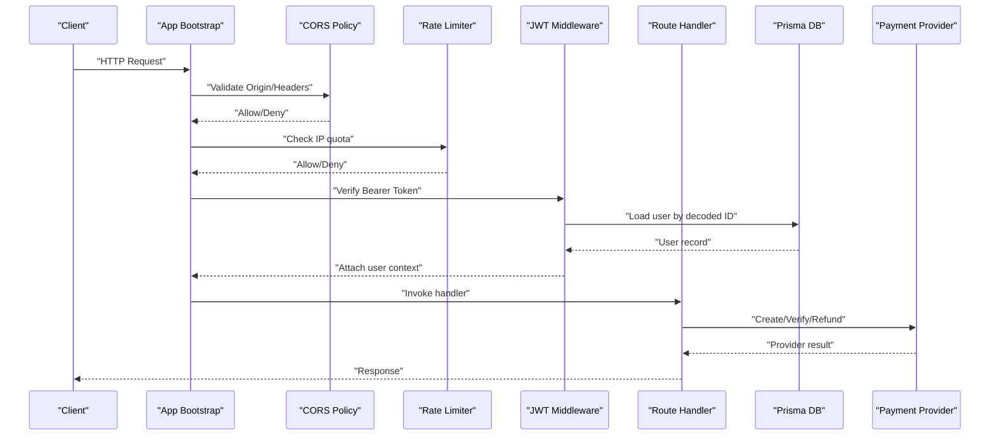
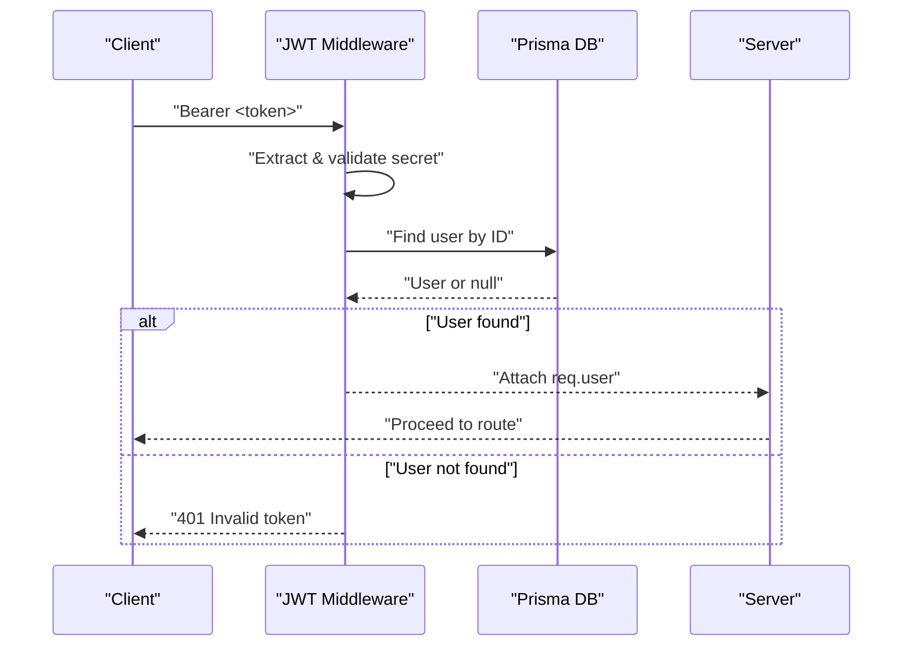
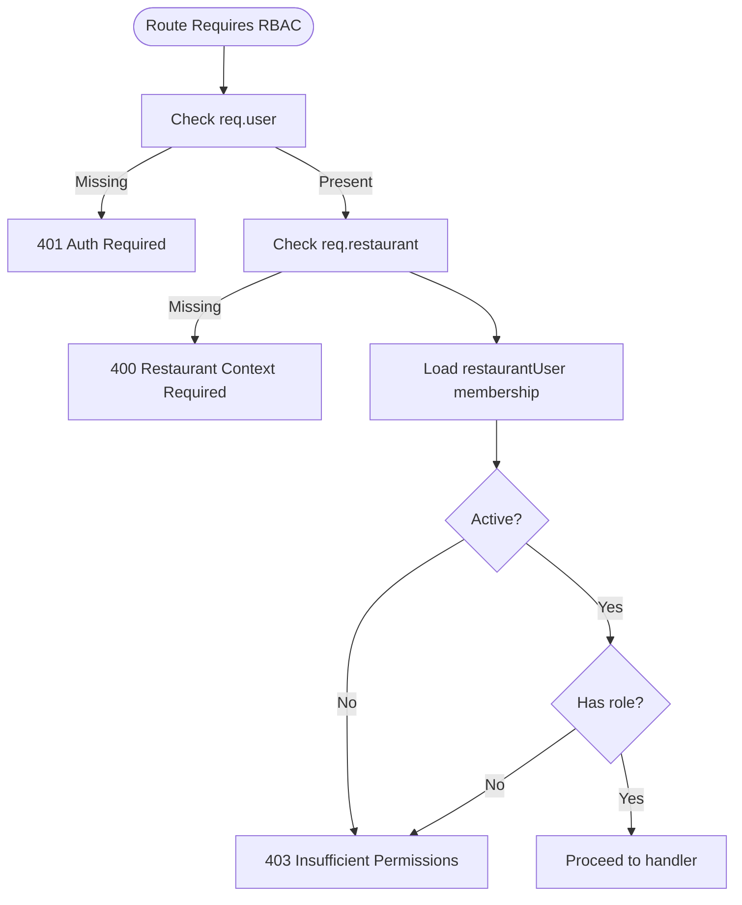
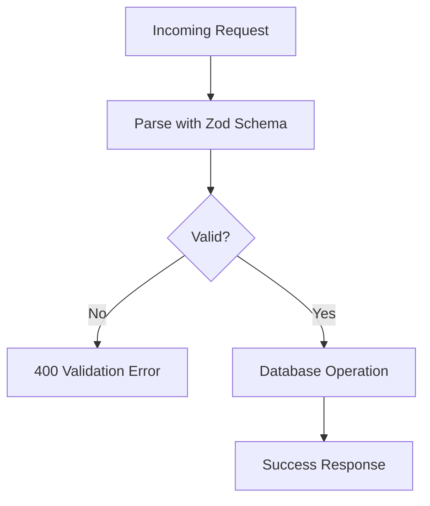
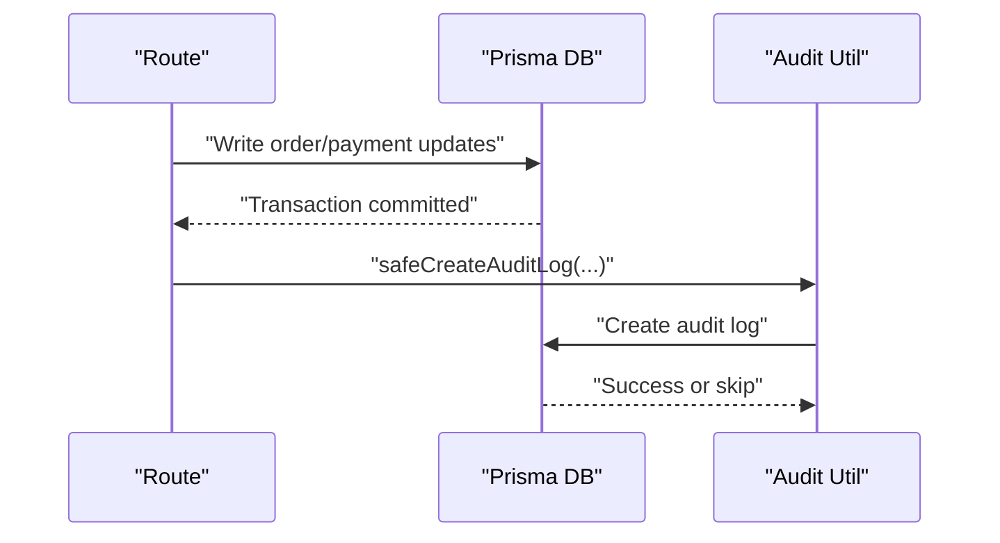
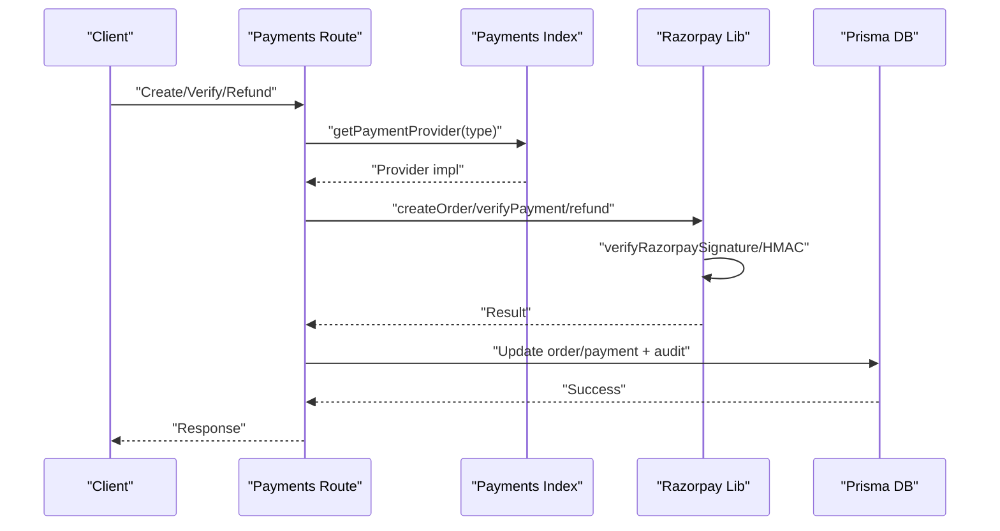
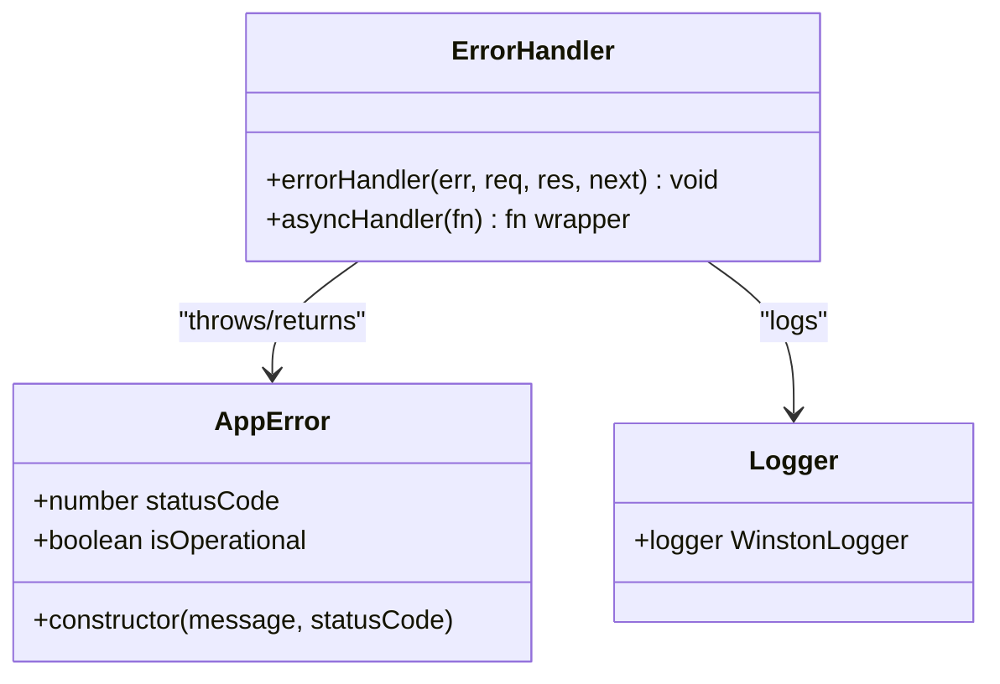
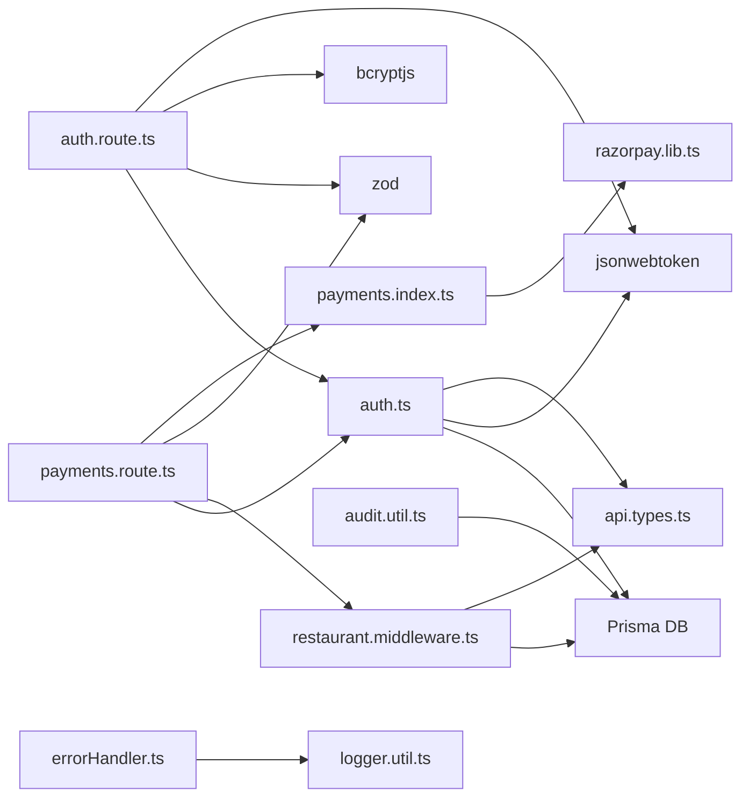

# Security Implementation

<cite>
**Referenced Files in This Document**
- [auth.ts](file://restaurant-backend/src/middleware/auth.ts)
- [errorHandler.ts](file://restaurant-backend/src/middleware/errorHandler.ts)
- [auth.route.ts](file://restaurant-backend/src/routes/auth.ts)
- [payments.route.ts](file://restaurant-backend/src/routes/payments.ts)
- [payments.index.ts](file://restaurant-backend/src/lib/payments/index.ts)
- [razorpay.lib.ts](file://restaurant-backend/src/lib/razorpay.ts)
- [restaurant.middleware.ts](file://restaurant-backend/src/middleware/restaurant.ts)
- [api.types.ts](file://restaurant-backend/src/types/api.ts)
- [audit.util.ts](file://restaurant-backend/src/utils/audit.ts)
- [logger.util.ts](file://restaurant-backend/src/utils/logger.ts)
- [app.bootstrap.ts](file://restaurant-backend/dist/app.js)
</cite>

## Table of Contents
1. [Introduction](#introduction)
2. [Project Structure](#project-structure)
3. [Core Components](#core-components)
4. [Architecture Overview](#architecture-overview)
5. [Detailed Component Analysis](#detailed-component-analysis)
6. [Dependency Analysis](#dependency-analysis)
7. [Performance Considerations](#performance-considerations)
8. [Troubleshooting Guide](#troubleshooting-guide)
9. [Conclusion](#conclusion)
10. [Appendices](#appendices)

## Introduction
This document provides comprehensive security implementation documentation for DeQ-Bite’s multi-layered security architecture. It covers JWT authentication and refresh mechanisms, role-based access control (RBAC), input validation via Zod schemas, rate limiting, CORS protection, audit logging, payment security with server-side signature verification, security middleware, error handling, monitoring, testing, vulnerability assessment, incident response, and production deployment best practices.

## Project Structure
Security-critical components are organized across middleware, routes, utilities, and libraries:
- Authentication and RBAC middleware
- Route handlers enforcing validation and authorization
- Payment provider abstraction with secure signature verification
- Audit logging and centralized error handling
- Application bootstrap configuring CORS and rate limiting

**Diagram sources**
- [auth.ts](file://restaurant-backend/src/middleware/auth.ts#L1-L137)
- [restaurant.middleware.ts](file://restaurant-backend/src/middleware/restaurant.ts#L1-L246)
- [errorHandler.ts](file://restaurant-backend/src/middleware/errorHandler.ts#L1-L82)
- [auth.route.ts](file://restaurant-backend/src/routes/auth.ts#L1-L390)
- [payments.route.ts](file://restaurant-backend/src/routes/payments.ts#L1-L731)
- [payments.index.ts](file://restaurant-backend/src/lib/payments/index.ts#L1-L124)
- [razorpay.lib.ts](file://restaurant-backend/src/lib/razorpay.ts#L1-L219)
- [audit.util.ts](file://restaurant-backend/src/utils/audit.ts#L1-L17)
- [logger.util.ts](file://restaurant-backend/src/utils/logger.ts#L1-L56)
- [app.bootstrap.ts](file://restaurant-backend/dist/app.js#L56-L98)

**Section sources**
- [auth.ts](file://restaurant-backend/src/middleware/auth.ts#L1-L137)
- [restaurant.middleware.ts](file://restaurant-backend/src/middleware/restaurant.ts#L1-L246)
- [errorHandler.ts](file://restaurant-backend/src/middleware/errorHandler.ts#L1-L82)
- [auth.route.ts](file://restaurant-backend/src/routes/auth.ts#L1-L390)
- [payments.route.ts](file://restaurant-backend/src/routes/payments.ts#L1-L731)
- [payments.index.ts](file://restaurant-backend/src/lib/payments/index.ts#L1-L124)
- [razorpay.lib.ts](file://restaurant-backend/src/lib/razorpay.ts#L1-L219)
- [audit.util.ts](file://restaurant-backend/src/utils/audit.ts#L1-L17)
- [logger.util.ts](file://restaurant-backend/src/utils/logger.ts#L1-L56)
- [app.bootstrap.ts](file://restaurant-backend/dist/app.js#L56-L98)

## Core Components
- JWT Authentication Middleware: Extracts tokens from headers/body/query, validates against environment-secret, loads user context, and handles token errors.
- Role-Based Access Control: Enforces role checks per route and restaurant membership.
- Input Validation: Zod schemas define strict request contracts for all sensitive endpoints.
- Payment Security: Provider abstraction with server-side signature verification and secure HMAC computation.
- Audit Logging: Centralized safe logging with migration-resilient writes.
- Error Handling: Structured error responses, operational error classification, and logging.
- CORS and Rate Limiting: Application-level CORS policy and request throttling.

**Section sources**
- [auth.ts](file://restaurant-backend/src/middleware/auth.ts#L7-L137)
- [restaurant.middleware.ts](file://restaurant-backend/src/middleware/restaurant.ts#L213-L245)
- [auth.route.ts](file://restaurant-backend/src/routes/auth.ts#L12-L45)
- [payments.route.ts](file://restaurant-backend/src/routes/payments.ts#L16-L42)
- [payments.index.ts](file://restaurant-backend/src/lib/payments/index.ts#L40-L81)
- [razorpay.lib.ts](file://restaurant-backend/src/lib/razorpay.ts#L65-L105)
- [audit.util.ts](file://restaurant-backend/src/utils/audit.ts#L5-L16)
- [errorHandler.ts](file://restaurant-backend/src/middleware/errorHandler.ts#L9-L82)
- [app.bootstrap.ts](file://restaurant-backend/dist/app.js#L56-L72)

## Architecture Overview
The security architecture enforces layered protections:
- Transport and API-level: CORS and rate limiting at bootstrap.
- Identity and session: JWT bearer tokens validated server-side.
- Authorization: Global and restaurant-scoped roles.
- Data integrity: Zod schemas and sanitized queries.
- Payments: Signature verification and provider-specific checks.
- Observability: Structured logging and audit trails.

**Diagram sources**
- [app.bootstrap.ts](file://restaurant-backend/dist/app.js#L56-L72)
- [auth.ts](file://restaurant-backend/src/middleware/auth.ts#L7-L75)
- [payments.route.ts](file://restaurant-backend/src/routes/payments.ts#L195-L292)
- [payments.index.ts](file://restaurant-backend/src/lib/payments/index.ts#L40-L81)
- [razorpay.lib.ts](file://restaurant-backend/src/lib/razorpay.ts#L33-L60)

## Detailed Component Analysis

### JWT Authentication and Refresh
- Token extraction supports Authorization header and fallbacks to body/query.
- Secret validation ensures JWT_SECRET is configured before verifying.
- Decoded payload is used to load user context; missing user yields invalid token.
- Token generation uses environment-controlled expiration.
- Optional authentication mode attaches user context when present, otherwise continues.

**Diagram sources**
- [auth.ts](file://restaurant-backend/src/middleware/auth.ts#L7-L75)
- [auth.route.ts](file://restaurant-backend/src/routes/auth.ts#L31-L45)

**Section sources**
- [auth.ts](file://restaurant-backend/src/middleware/auth.ts#L7-L137)
- [auth.route.ts](file://restaurant-backend/src/routes/auth.ts#L31-L45)

### Role-Based Access Control (RBAC)
- Global roles enforced via authorize(role...) middleware.
- Restaurant-scoped roles via authorizeRestaurantRole('OWNER'|'ADMIN'|'STAFF').
- Membership checks include active status and role presence.
- Restaurant context attached via subdomain/header/path detection with fallbacks.

**Diagram sources**
- [restaurant.middleware.ts](file://restaurant-backend/src/middleware/restaurant.ts#L213-L245)
- [restaurant.middleware.ts](file://restaurant-backend/src/middleware/restaurant.ts#L76-L200)

**Section sources**
- [restaurant.middleware.ts](file://restaurant-backend/src/middleware/restaurant.ts#L213-L245)
- [restaurant.middleware.ts](file://restaurant-backend/src/middleware/restaurant.ts#L76-L200)

### Input Validation with Zod
- Strict schemas for registration, login, password changes, payment operations, and status updates.
- Schemas enforce minimum lengths, email formats, numeric constraints, and enum values.
- Handlers parse and validate payloads before database operations.

**Diagram sources**
- [auth.route.ts](file://restaurant-backend/src/routes/auth.ts#L12-L28)
- [payments.route.ts](file://restaurant-backend/src/routes/payments.ts#L16-L42)

**Section sources**
- [auth.route.ts](file://restaurant-backend/src/routes/auth.ts#L12-L28)
- [payments.route.ts](file://restaurant-backend/src/routes/payments.ts#L16-L42)

### Rate Limiting
- Express-rate-limit configured with a 15-minute window and a maximum request threshold.
- Standard headers enabled; messages returned for overload conditions.

**Section sources**
- [app.bootstrap.ts](file://restaurant-backend/dist/app.js#L63-L71)

### CORS Protection
- Allowed methods include GET, POST, PUT, DELETE, PATCH, OPTIONS.
- Credentials supported; allowed headers include Content-Type, Authorization, x-api-key, x-restaurant-subdomain, x-restaurant-slug.
- Origin enforcement prevents cross-origin misuse.

**Section sources**
- [app.bootstrap.ts](file://restaurant-backend/dist/app.js#L56-L62)

### Audit Logging System
- Safe audit log writer tolerates missing tables via migration checks.
- Logs include actor, restaurant, action, entity, and metadata.
- Used after payment verification, refunds, cash confirmations, and status updates.

**Diagram sources**
- [payments.route.ts](file://restaurant-backend/src/routes/payments.ts#L376-L388)
- [payments.route.ts](file://restaurant-backend/src/routes/payments.ts#L470-L482)
- [payments.route.ts](file://restaurant-backend/src/routes/payments.ts#L619-L631)
- [payments.route.ts](file://restaurant-backend/src/routes/payments.ts#L701-L712)
- [audit.util.ts](file://restaurant-backend/src/utils/audit.ts#L5-L16)

**Section sources**
- [audit.util.ts](file://restaurant-backend/src/utils/audit.ts#L5-L16)
- [payments.route.ts](file://restaurant-backend/src/routes/payments.ts#L376-L388)
- [payments.route.ts](file://restaurant-backend/src/routes/payments.ts#L470-L482)
- [payments.route.ts](file://restaurant-backend/src/routes/payments.ts#L619-L631)
- [payments.route.ts](file://restaurant-backend/src/routes/payments.ts#L701-L712)

### Payment Security Measures
- Provider abstraction centralizes payment operations.
- Razorpay signature verification uses HMAC-SHA256 with server-side key.
- Webhook signature validation supports configurable webhook secret.
- Payment capture and refund operations logged with sanitized identifiers.
- Payment status transitions validated and audited.

**Diagram sources**
- [payments.route.ts](file://restaurant-backend/src/routes/payments.ts#L195-L292)
- [payments.route.ts](file://restaurant-backend/src/routes/payments.ts#L294-L407)
- [payments.route.ts](file://restaurant-backend/src/routes/payments.ts#L409-L516)
- [payments.index.ts](file://restaurant-backend/src/lib/payments/index.ts#L40-L81)
- [razorpay.lib.ts](file://restaurant-backend/src/lib/razorpay.ts#L65-L105)
- [razorpay.lib.ts](file://restaurant-backend/src/lib/razorpay.ts#L198-L218)

**Section sources**
- [payments.index.ts](file://restaurant-backend/src/lib/payments/index.ts#L40-L81)
- [razorpay.lib.ts](file://restaurant-backend/src/lib/razorpay.ts#L65-L105)
- [razorpay.lib.ts](file://restaurant-backend/src/lib/razorpay.ts#L198-L218)
- [payments.route.ts](file://restaurant-backend/src/routes/payments.ts#L294-L407)
- [payments.route.ts](file://restaurant-backend/src/routes/payments.ts#L409-L516)

### Security Middleware and Error Handling
- AppError class encapsulates operational/non-operational errors with status codes.
- errorHandler maps JWT and Prisma errors to appropriate HTTP responses.
- asyncHandler wraps route handlers to centralize promise error propagation.
- Logger configured with structured JSON output and file transports.

**Diagram sources**
- [errorHandler.ts](file://restaurant-backend/src/middleware/errorHandler.ts#L9-L82)
- [logger.util.ts](file://restaurant-backend/src/utils/logger.ts#L50-L56)

**Section sources**
- [errorHandler.ts](file://restaurant-backend/src/middleware/errorHandler.ts#L9-L82)
- [logger.util.ts](file://restaurant-backend/src/utils/logger.ts#L50-L56)

### Monitoring Strategies
- Centralized logging with timestamps, stack traces (dev), and contextual metadata.
- Audit logs for security-relevant actions (payment verification, refunds, status updates).
- Health endpoint for uptime and environment diagnostics.

**Section sources**
- [logger.util.ts](file://restaurant-backend/src/utils/logger.ts#L50-L56)
- [audit.util.ts](file://restaurant-backend/src/utils/audit.ts#L5-L16)
- [app.bootstrap.ts](file://restaurant-backend/dist/app.js#L83-L90)

## Dependency Analysis

**Diagram sources**
- [auth.ts](file://restaurant-backend/src/middleware/auth.ts#L1-L10)
- [restaurant.middleware.ts](file://restaurant-backend/src/middleware/restaurant.ts#L1-L6)
- [auth.route.ts](file://restaurant-backend/src/routes/auth.ts#L1-L10)
- [payments.route.ts](file://restaurant-backend/src/routes/payments.ts#L1-L14)
- [payments.index.ts](file://restaurant-backend/src/lib/payments/index.ts#L1-L8)
- [razorpay.lib.ts](file://restaurant-backend/src/lib/razorpay.ts#L1-L4)
- [audit.util.ts](file://restaurant-backend/src/utils/audit.ts#L1-L4)
- [errorHandler.ts](file://restaurant-backend/src/middleware/errorHandler.ts#L1-L3)
- [logger.util.ts](file://restaurant-backend/src/utils/logger.ts#L1-L4)
- [api.types.ts](file://restaurant-backend/src/types/api.ts#L1-L18)

**Section sources**
- [auth.ts](file://restaurant-backend/src/middleware/auth.ts#L1-L10)
- [restaurant.middleware.ts](file://restaurant-backend/src/middleware/restaurant.ts#L1-L6)
- [auth.route.ts](file://restaurant-backend/src/routes/auth.ts#L1-L10)
- [payments.route.ts](file://restaurant-backend/src/routes/payments.ts#L1-L14)
- [payments.index.ts](file://restaurant-backend/src/lib/payments/index.ts#L1-L8)
- [razorpay.lib.ts](file://restaurant-backend/src/lib/razorpay.ts#L1-L4)
- [audit.util.ts](file://restaurant-backend/src/utils/audit.ts#L1-L4)
- [errorHandler.ts](file://restaurant-backend/src/middleware/errorHandler.ts#L1-L3)
- [logger.util.ts](file://restaurant-backend/src/utils/logger.ts#L1-L4)
- [api.types.ts](file://restaurant-backend/src/types/api.ts#L1-L18)

## Performance Considerations
- JWT verification occurs per request; keep secret length reasonable and cache decoded claims minimally.
- Zod parsing adds CPU overhead; ensure schemas are concise and reused.
- Audit writes are best-effort; consider batching for high-throughput scenarios.
- Rate limiter thresholds should align with expected traffic patterns to avoid false positives.

## Troubleshooting Guide
Common issues and resolutions:
- Invalid token or expired token: Verify JWT_SECRET is set and token not expired.
- Missing user context: Ensure authentication middleware runs before protected routes.
- RBAC failures: Confirm restaurant membership active and role matches required scope.
- Payment signature mismatch: Validate provider keys and webhook secrets; check HMAC construction.
- Audit log table missing: Apply migrations; safeCreateAuditLog will skip gracefully.

**Section sources**
- [auth.ts](file://restaurant-backend/src/middleware/auth.ts#L67-L74)
- [errorHandler.ts](file://restaurant-backend/src/middleware/errorHandler.ts#L48-L64)
- [restaurant.middleware.ts](file://restaurant-backend/src/middleware/restaurant.ts#L213-L245)
- [razorpay.lib.ts](file://restaurant-backend/src/lib/razorpay.ts#L65-L105)
- [audit.util.ts](file://restaurant-backend/src/utils/audit.ts#L9-L13)

## Conclusion
DeQ-Bite’s backend implements a robust, layered security model combining strong identity verification, strict input validation, granular authorization, secure payment processing, and comprehensive observability. Adhering to the recommended best practices and configurations will further strengthen resilience against common threats.

## Appendices

### Security Testing Procedures
- Authentication: Validate token issuance, refresh, expiry, and malformed token handling.
- Authorization: Test role-based access across restaurant contexts and global roles.
- Input validation: Fuzz Zod schemas with invalid types, boundary values, and oversized payloads.
- Payments: End-to-end flows with provider sandbox; simulate signature mismatches and webhook validation failures.
- Rate limiting: Exceed limits and confirm throttling behavior.
- CORS: Attempt cross-origin requests with disallowed origins/headers.

### Vulnerability Assessment
- Secrets management: Ensure JWT_SECRET, provider keys, and webhook secrets are environment-managed and rotated periodically.
- Least privilege: Roles and restaurant memberships should be minimal per job function.
- Logging hygiene: Avoid logging sensitive data; sanitize identifiers in logs.
- Dependencies: Regularly audit and update packages, especially express-rate-limit, cors, jsonwebtoken, bcryptjs, zod, razorpay, and winston.

### Incident Response Protocols
- Token compromise: Rotate JWT_SECRET, invalidate cached tokens, and notify affected users.
- Payment discrepancies: Trigger reconciliation, verify signatures, and escalate provider disputes.
- Audit gaps: Investigate missing audit entries post-migration and restore continuity.
- DDoS attempts: Increase rate limits temporarily, monitor logs, and engage CDN/WAF if available.

### Security Configuration Guidelines (Production)
- Environment variables:
  - JWT_SECRET: High-entropy value; rotate regularly.
  - JWT_EXPIRES_IN: Short-lived tokens with refresh endpoints.
  - RAZORPAY_KEY_ID, RAZORPAY_KEY_SECRET, RAZORPAY_WEBHOOK_SECRET: Secure storage and rotation.
  - BASE_DOMAIN: For restaurant subdomain routing.
- Network:
  - Restrict CORS to trusted origins; enable credentials only when necessary.
  - Deploy behind a WAF/CDN for DDoS mitigation.
- Logging:
  - Enable structured logs; ship to SIEM for correlation.
  - Retain logs per policy; protect log storage.
- Monitoring:
  - Alert on repeated 401/403, signature mismatches, and audit write failures.
  - Track rate-limit hits and unusual spikes.