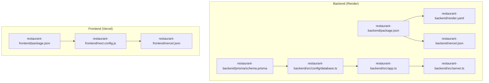
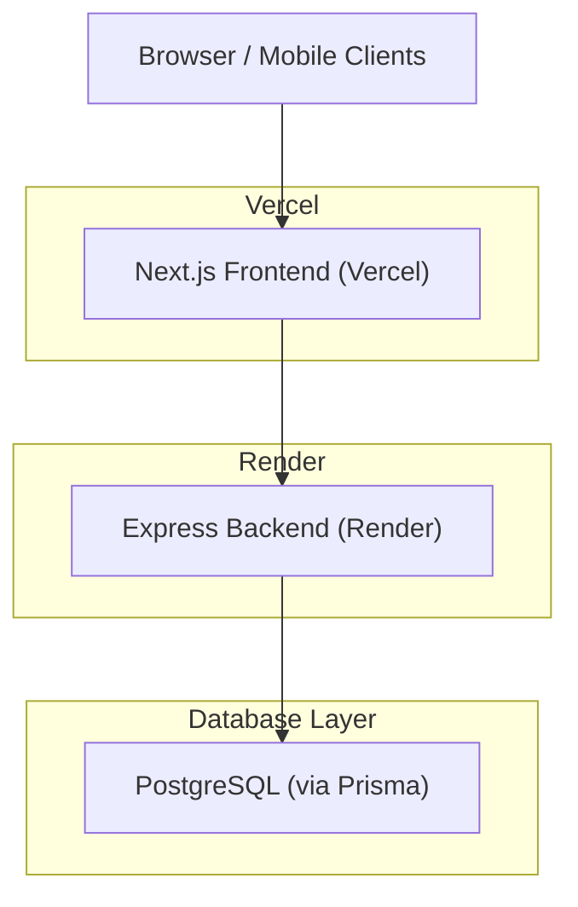
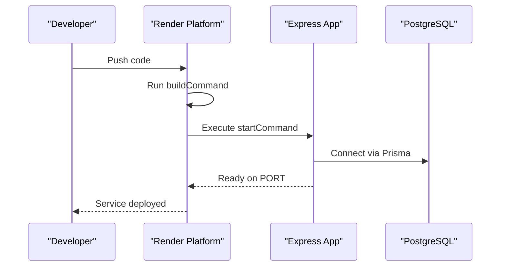
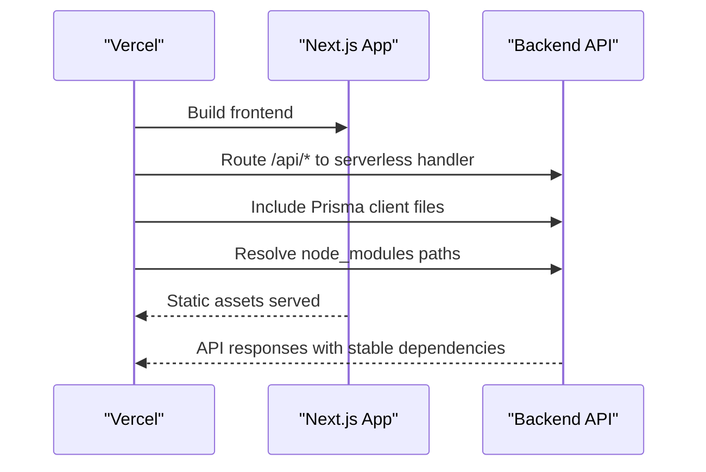
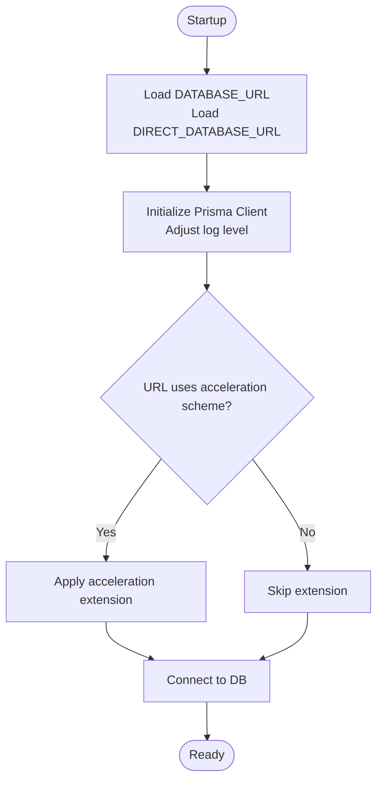
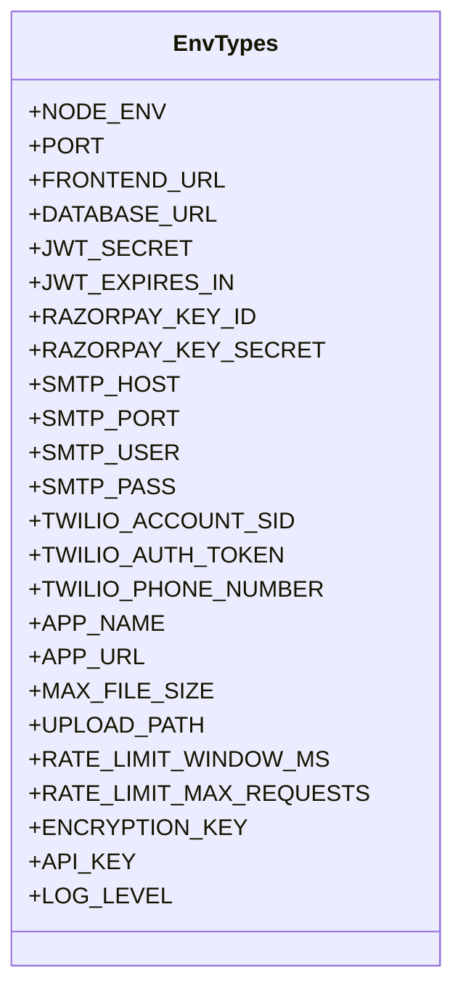
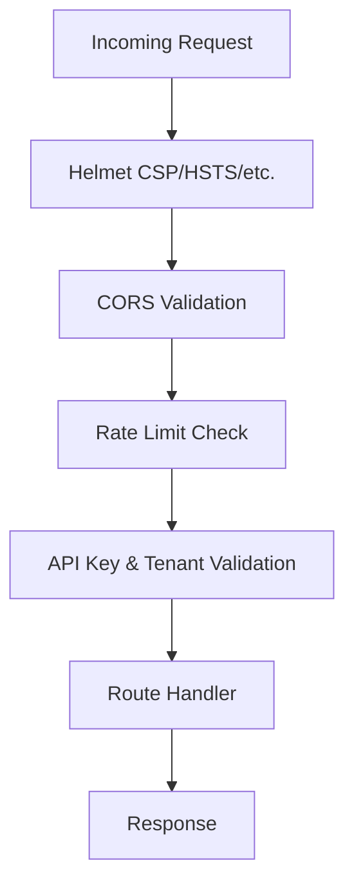
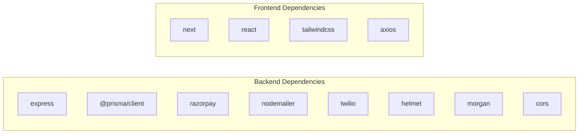

# Deployment Configuration

<cite>
**Referenced Files in This Document**
- [render.yaml](file://restaurant-backend/render.yaml)
- [vercel.json](file://restaurant-backend/vercel.json)
- [package.json](file://restaurant-backend/package.json)
- [schema.prisma](file://restaurant-backend/prisma/schema.prisma)
- [database.ts](file://restaurant-backend/src/config/database.ts)
- [env.d.ts](file://restaurant-backend/src/types/env.d.ts)
- [server.ts](file://restaurant-backend/src/server.ts)
- [app.ts](file://restaurant-backend/src/app.ts)
- [email.ts](file://restaurant-backend/src/lib/email.ts)
- [sms.ts](file://restaurant-backend/src/lib/sms.ts)
- [next.config.js](file://restaurant-frontend/next.config.js)
- [vercel.json](file://restaurant-frontend/vercel.json)
- [package.json](file://restaurant-frontend/package.json)
- [index.js](file://restaurant-backend/dist/api/index.js)
</cite>

## Update Summary
**Changes Made**
- Updated Vercel deployment configuration section to reflect enhanced reliability measures
- Added explicit Prisma client inclusion in deployment bundle configuration
- Updated build and deployment process documentation to address node_modules path resolution improvements
- Enhanced troubleshooting guidance for Vercel deployment issues

## Table of Contents
1. [Introduction](#introduction)
2. [Project Structure](#project-structure)
3. [Core Components](#core-components)
4. [Architecture Overview](#architecture-overview)
5. [Detailed Component Analysis](#detailed-component-analysis)
6. [Dependency Analysis](#dependency-analysis)
7. [Performance Considerations](#performance-considerations)
8. [Troubleshooting Guide](#troubleshooting-guide)
9. [Conclusion](#conclusion)
10. [Appendices](#appendices)

## Introduction
This document provides a comprehensive deployment configuration guide for DeQ-Bite's cloud infrastructure. It covers backend deployment on Render, frontend deployment on Vercel, database setup with PostgreSQL, CI/CD considerations, environment-specific configurations, domain and SSL management, CDN setup, security controls, and operational runbooks for production.

## Project Structure
The repository is split into two primary applications:
- Backend: Express.js application with TypeScript, Prisma ORM, and payment integrations.
- Frontend: Next.js application with React, Tailwind CSS, and API client integration.

**Diagram sources**
- [render.yaml](file://restaurant-backend/render.yaml)
- [vercel.json](file://restaurant-backend/vercel.json)
- [schema.prisma](file://restaurant-backend/prisma/schema.prisma)
- [database.ts](file://restaurant-backend/src/config/database.ts)
- [app.ts](file://restaurant-backend/src/app.ts)
- [server.ts](file://restaurant-backend/src/server.ts)
- [next.config.js](file://restaurant-frontend/next.config.js)
- [vercel.json](file://restaurant-frontend/vercel.json)
- [package.json](file://restaurant-frontend/package.json)

**Section sources**
- [render.yaml](file://restaurant-backend/render.yaml)
- [vercel.json](file://restaurant-backend/vercel.json)
- [package.json](file://restaurant-backend/package.json)
- [schema.prisma](file://restaurant-backend/prisma/schema.prisma)
- [database.ts](file://restaurant-backend/src/config/database.ts)
- [app.ts](file://restaurant-backend/src/app.ts)
- [server.ts](file://restaurant-backend/src/server.ts)
- [next.config.js](file://restaurant-frontend/next.config.js)
- [vercel.json](file://restaurant-frontend/vercel.json)
- [package.json](file://restaurant-frontend/package.json)

## Core Components
- Backend (Express.js on Render):
  - Build and start commands, environment variables, and runtime configuration are defined in the Render manifest.
  - Application entrypoint initializes Prisma client, connects to the database, and starts the HTTP server.
  - Security middleware includes Helmet, CORS, rate limiting, and structured logging.
  - Environment variables are typed and validated at runtime.

- Frontend (Next.js on Vercel):
  - Next.js configuration exposes environment variables to the client and defines image remote patterns.
  - Vercel configuration is minimal, relying on Next.js defaults.

- Database:
  - Prisma schema defines a PostgreSQL datasource with environment-driven URLs.
  - Client initialization supports optional acceleration extension and production-safe logging.

**Section sources**
- [render.yaml](file://restaurant-backend/render.yaml)
- [server.ts](file://restaurant-backend/src/server.ts)
- [app.ts](file://restaurant-backend/src/app.ts)
- [env.d.ts](file://restaurant-backend/src/types/env.d.ts)
- [schema.prisma](file://restaurant-backend/prisma/schema.prisma)
- [database.ts](file://restaurant-backend/src/config/database.ts)
- [next.config.js](file://restaurant-frontend/next.config.js)
- [vercel.json](file://restaurant-frontend/vercel.json)

## Architecture Overview
The deployment architecture separates concerns across platforms:
- Backend: Render-managed Node.js web service with automated build and start commands.
- Frontend: Vercel-managed Next.js application with static assets and serverless routes.
- Database: PostgreSQL via Prisma client with environment-driven connection URLs.

**Diagram sources**
- [render.yaml](file://restaurant-backend/render.yaml)
- [vercel.json](file://restaurant-backend/vercel.json)
- [schema.prisma](file://restaurant-backend/prisma/schema.prisma)

## Detailed Component Analysis

### Backend Deployment on Render
- Platform configuration:
  - Service type: Web
  - Runtime: Node.js
  - Build command: runs the project build script
  - Start command: launches the compiled server
  - Environment variables:
    - NODE_ENV set to production
    - PORT configured for the service
    - JWT_SECRET defined as a secret variable (sync disabled)

- Build and start lifecycle:
  - Build generates Prisma client, compiles TypeScript, aliases paths, and prepares static assets.
  - Start runs the compiled server entrypoint.

- Health checks:
  - Exposes a /health endpoint returning environment, uptime, and timestamp.

- Scaling and runtime:
  - No explicit scaling configuration is present in the Render manifest; defaults apply.

**Diagram sources**
- [render.yaml](file://restaurant-backend/render.yaml)
- [server.ts](file://restaurant-backend/src/server.ts)
- [database.ts](file://restaurant-backend/src/config/database.ts)

**Section sources**
- [render.yaml](file://restaurant-backend/render.yaml)
- [package.json](file://restaurant-backend/package.json)
- [server.ts](file://restaurant-backend/src/server.ts)
- [app.ts](file://restaurant-backend/src/app.ts)

### Frontend Deployment on Vercel
- Build and routing:
  - Vercel build pipeline targets the compiled server entrypoint from the backend distribution.
  - Routes forward all paths to the backend serverless handler.

- Next.js configuration:
  - Client-side environment variables are exposed via Next.js configuration.
  - Image optimization allows HTTPS remote patterns.

- Static site generation:
  - The frontend configuration does not enable SSG; defaults apply.

**Updated** Enhanced Vercel deployment reliability through improved node_modules path resolution and explicit Prisma client inclusion in deployment bundle

- Enhanced deployment configuration:
  - Explicit inclusion of Prisma client and database engine files in deployment bundle
  - Improved node_modules path resolution system for reliable module loading
  - Comprehensive file inclusion patterns for production stability

**Diagram sources**
- [vercel.json](file://restaurant-backend/vercel.json)
- [next.config.js](file://restaurant-frontend/next.config.js)

**Section sources**
- [vercel.json](file://restaurant-backend/vercel.json)
- [vercel.json](file://restaurant-frontend/vercel.json)
- [next.config.js](file://restaurant-frontend/next.config.js)

### Database Deployment and Connection Management
- Data source definition:
  - PostgreSQL provider with environment-driven URLs for both primary and direct connections.

- Client initialization:
  - Conditional logging levels based on environment.
  - Optional acceleration extension activation when a specialized URL scheme is detected.
  - Global singleton pattern for the Prisma client in development and production.

- Connection lifecycle:
  - Connect/disconnect helpers ensure proper resource management during startup/shutdown.

**Diagram sources**
- [schema.prisma](file://restaurant-backend/prisma/schema.prisma)
- [database.ts](file://restaurant-backend/src/config/database.ts)

**Section sources**
- [schema.prisma](file://restaurant-backend/prisma/schema.prisma)
- [database.ts](file://restaurant-backend/src/config/database.ts)

### Environment Variables and Secrets
- Backend environment variables:
  - Typed in the environment declaration file.
  - Includes JWT, database, payment providers, email, SMS, rate limiting, encryption, and API keys.
  - Production validation enforces presence of critical secrets.

- Frontend environment variables:
  - Exposed client-side via Next.js configuration.
  - Remote image patterns allow HTTPS domains.

- Secret management:
  - JWT_SECRET is configured as a Render secret variable.
  - Other secrets are referenced via environment variables and loaded at runtime.

**Diagram sources**
- [env.d.ts](file://restaurant-backend/src/types/env.d.ts)

**Section sources**
- [env.d.ts](file://restaurant-backend/src/types/env.d.ts)
- [render.yaml](file://restaurant-backend/render.yaml)
- [app.ts](file://restaurant-backend/src/app.ts)
- [next.config.js](file://restaurant-frontend/next.config.js)

### Security Controls
- Transport security:
  - Helmet middleware enabled with configurable policies.
  - Rate limiting applied globally to mitigate abuse.

- Access control:
  - CORS configuration restricts origins and headers, with credentials support.
  - Tenant-aware routing and API key header enforced.

- Communication security:
  - SMTP transport configured with secure flag based on port.
  - Twilio client initialized conditionally when credentials are present.

**Diagram sources**
- [app.ts](file://restaurant-backend/src/app.ts)

**Section sources**
- [app.ts](file://restaurant-backend/src/app.ts)
- [email.ts](file://restaurant-backend/src/lib/email.ts)
- [sms.ts](file://restaurant-backend/src/lib/sms.ts)

### CI/CD Pipeline Configuration
- Build automation:
  - Backend build script compiles TypeScript, generates Prisma client, and aliases paths.
  - Frontend build script compiles Next.js application.

- Deployment triggers:
  - Render and Vercel deployments are triggered by pushing to the configured branches.
  - No explicit CI/CD pipeline configuration files were found in the repository.

- Testing integration:
  - No dedicated test scripts or CI job definitions were identified in the provided manifests.

**Section sources**
- [package.json](file://restaurant-backend/package.json)
- [package.json](file://restaurant-frontend/package.json)
- [render.yaml](file://restaurant-backend/render.yaml)
- [vercel.json](file://restaurant-backend/vercel.json)

### Environment-Specific Configurations
- Development:
  - Logging includes verbose Prisma queries and info logs.
  - Localhost origins permitted in CORS.

- Staging/Production:
  - Logging restricted to warnings and errors.
  - JWT_SECRET validated for production readiness.
  - Port and environment explicitly configured.

- Multi-environment alignment:
  - Frontend Next.js configuration exposes environment variables to the client.

**Section sources**
- [database.ts](file://restaurant-backend/src/config/database.ts)
- [app.ts](file://restaurant-backend/src/app.ts)
- [server.ts](file://restaurant-backend/src/server.ts)
- [next.config.js](file://restaurant-frontend/next.config.js)

### Domain Configuration, SSL, and CDN
- Domains and SSL:
  - Render-managed domains and certificates are handled by the platform; no custom domain configuration was found in the backend manifest.
  - Vercel-managed domains and TLS termination are handled by the platform; no custom domain configuration was found in the frontend manifest.

- CDN:
  - No explicit CDN configuration was identified in the repository.

**Section sources**
- [render.yaml](file://restaurant-backend/render.yaml)
- [vercel.json](file://restaurant-backend/vercel.json)
- [vercel.json](file://restaurant-frontend/vercel.json)

## Dependency Analysis
- Backend dependencies:
  - Express, Prisma client, payment providers, email/SMS libraries, security middleware, and logging utilities.
  - Build-time dependencies include TypeScript compiler, Prisma generator, and alias resolution.

- Frontend dependencies:
  - Next.js, React, Tailwind CSS, and API client library.
  - Build-time dependencies include PostCSS, Tailwind, and TypeScript.

**Diagram sources**
- [package.json](file://restaurant-backend/package.json)
- [package.json](file://restaurant-frontend/package.json)

**Section sources**
- [package.json](file://restaurant-backend/package.json)
- [package.json](file://restaurant-frontend/package.json)

## Performance Considerations
- Database:
  - Consider enabling Prisma Accelerate when using supported providers to reduce query latency.
  - Monitor query logs in development and restrict to warnings/errors in production.

- Application:
  - Adjust rate limit windows and thresholds based on traffic patterns.
  - Enable gzip/HTTP compression at the platform layer if not already handled.

- Observability:
  - Utilize structured logging and health endpoints for proactive monitoring.

## Troubleshooting Guide
- Database connectivity:
  - Verify environment variables for database URLs and credentials.
  - Confirm Prisma client initialization and connection lifecycle hooks.

- CORS and API access:
  - Ensure FRONTEND_URL matches the deployed frontend origin.
  - Validate API key and tenant headers for protected endpoints.

- Email and SMS delivery:
  - Confirm SMTP host/port/user/pass and Twilio credentials.
  - Review logs for transport errors and missing configuration.

- Health and liveness:
  - Use the /health endpoint to confirm service readiness.
  - Check graceful shutdown signals for container lifecycle events.

**Updated** Enhanced Vercel deployment troubleshooting for improved reliability

- Vercel deployment issues:
  - Verify Prisma client files are included in deployment bundle
  - Check node_modules path resolution for production dependencies
  - Ensure serverless-http handler loads correctly
  - Validate environment variable loading in Vercel runtime

- Build process verification:
  - Confirm Prisma client generation completes successfully
  - Verify TypeScript compilation produces expected output
  - Check tsc-alias resolves path aliases correctly
  - Validate serverless handler creation with proper configuration

**Section sources**
- [database.ts](file://restaurant-backend/src/config/database.ts)
- [app.ts](file://restaurant-backend/src/app.ts)
- [email.ts](file://restaurant-backend/src/lib/email.ts)
- [sms.ts](file://restaurant-backend/src/lib/sms.ts)
- [server.ts](file://restaurant-backend/src/server.ts)
- [index.js](file://restaurant-backend/dist/api/index.js)

## Conclusion
DeQ-Bite's deployment leverages Render for the backend and Vercel for the frontend, with PostgreSQL managed via Prisma. The configuration emphasizes security through middleware, strict CORS, and environment-driven secrets. Recent enhancements to Vercel deployment reliability through improved node_modules path resolution and explicit Prisma client inclusion provide better production stability. Operational readiness can be improved by adding CI/CD automation, explicit domain/SSL configuration, and CDN integration. Monitoring and alerting should be integrated with platform-native observability tools.

## Appendices

### A. Backend Environment Variables Reference
- Required for production:
  - NODE_ENV, PORT, FRONTEND_URL, DATABASE_URL, JWT_SECRET, JWT_EXPIRES_IN
- Payment and communication:
  - RAZORPAY_KEY_ID, RAZORPAY_KEY_SECRET, SMTP_HOST, SMTP_PORT, SMTP_USER, SMTP_PASS, TWILIO_ACCOUNT_SID, TWILIO_AUTH_TOKEN, TWILIO_PHONE_NUMBER
- Application metadata:
  - APP_NAME, APP_URL, MAX_FILE_SIZE, UPLOAD_PATH, RATE_LIMIT_WINDOW_MS, RATE_LIMIT_MAX_REQUESTS, ENCRYPTION_KEY, API_KEY, LOG_LEVEL

**Section sources**
- [env.d.ts](file://restaurant-backend/src/types/env.d.ts)
- [render.yaml](file://restaurant-backend/render.yaml)

### B. Deployment Checklist
- Backend
  - Set environment variables on Render (NODE_ENV, PORT, JWT_SECRET, DATABASE_URL, FRONTEND_URL).
  - Configure secrets for sensitive keys.
  - Verify build and start commands.
  - Confirm health endpoint availability.
- Frontend
  - Configure environment variables on Vercel (NEXT_PUBLIC_API_URL, NEXT_PUBLIC_APP_NAME).
  - Validate route handling to backend.
  - Verify Prisma client inclusion in deployment bundle.
  - Confirm node_modules path resolution works correctly.
- Database
  - Confirm Prisma datasource URLs and permissions.
  - Test connection and migrations.
- Security
  - Review CORS allowed origins and headers.
  - Validate rate limits and API key enforcement.
- Operations
  - Add CI/CD triggers.
  - Configure domain and SSL on respective platforms.
  - Set up monitoring and alerts.
  - Verify Vercel deployment reliability metrics.