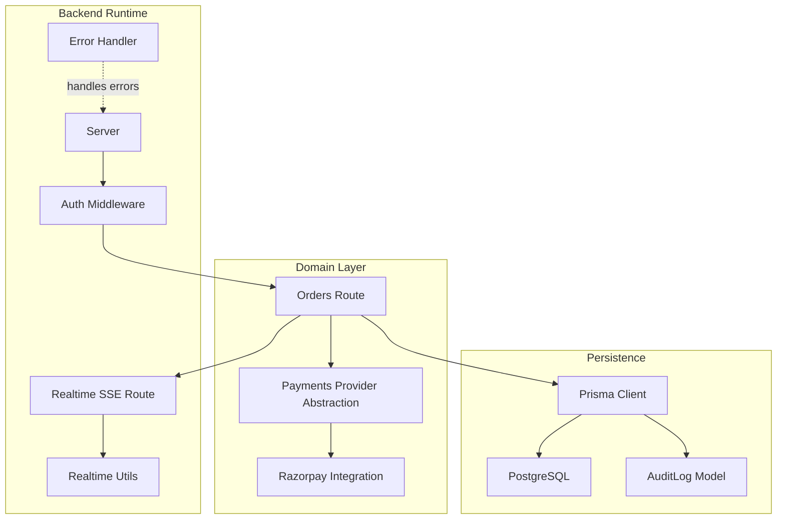
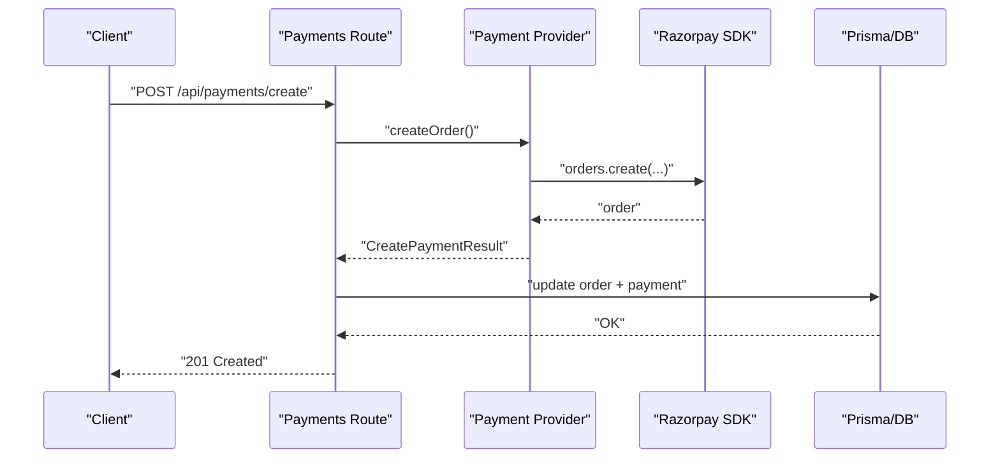
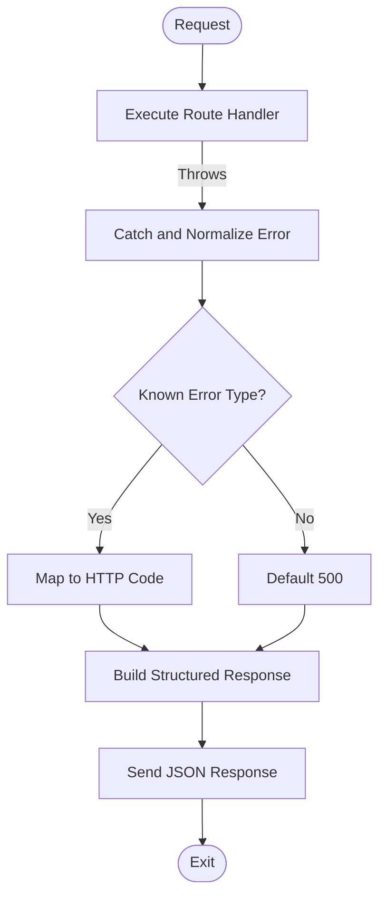
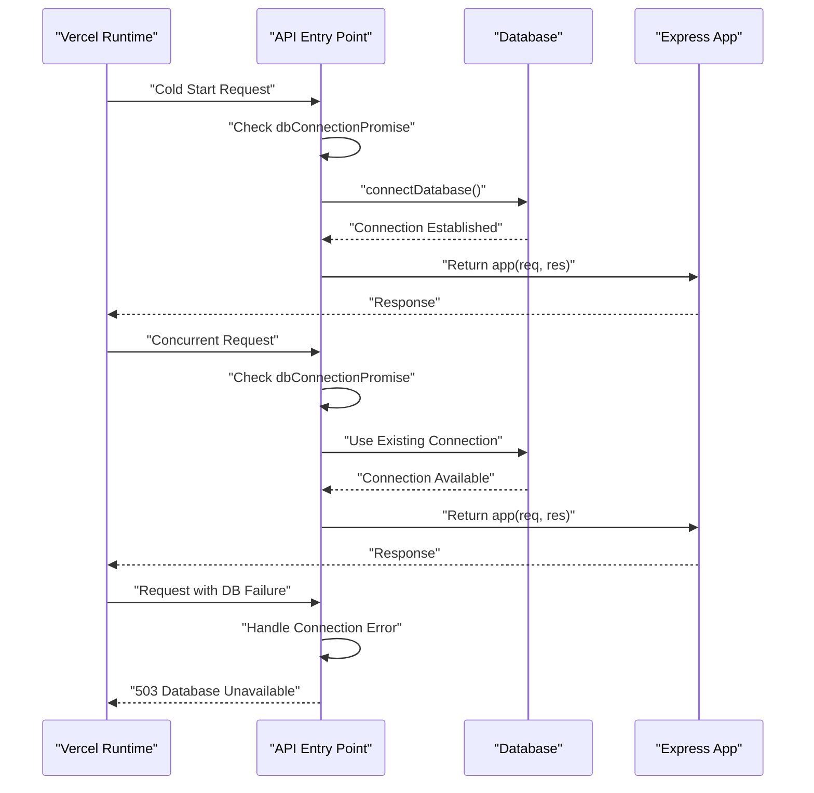
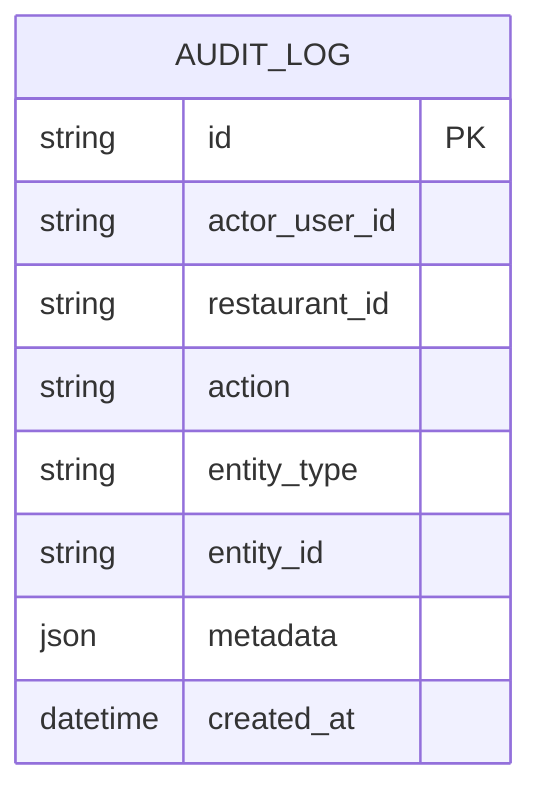
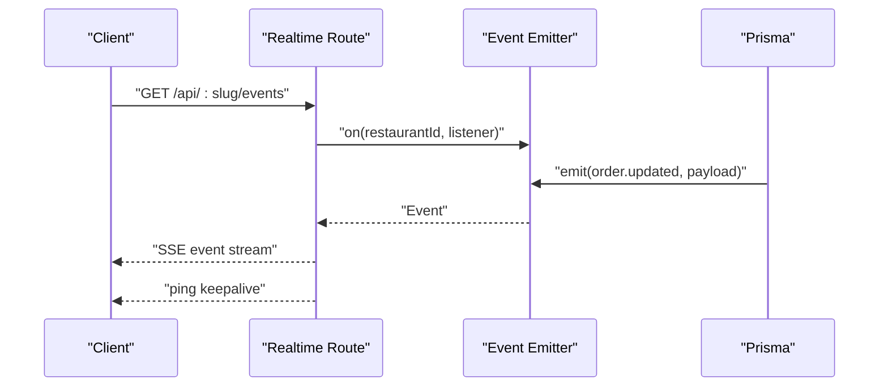
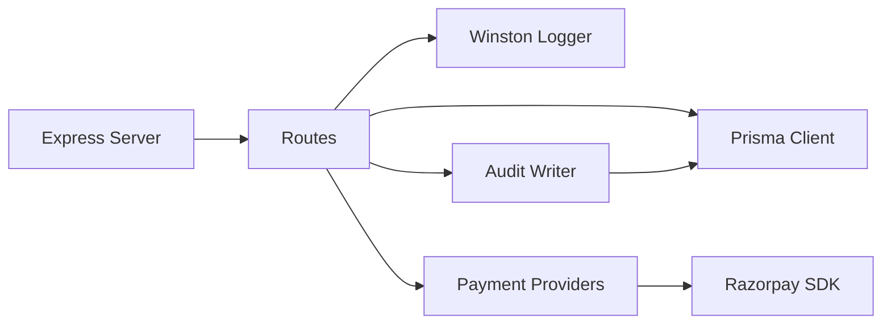

# Production Operations

<cite>
**Referenced Files in This Document**
- [logger.ts](file://restaurant-backend/src/utils/logger.ts)
- [errorHandler.ts](file://restaurant-backend/src/middleware/errorHandler.ts)
- [audit.ts](file://restaurant-backend/src/utils/audit.ts)
- [schema.prisma](file://restaurant-backend/prisma/schema.prisma)
- [database.ts](file://restaurant-backend/src/config/database.ts)
- [payments.ts](file://restaurant-backend/src/routes/payments.ts)
- [razorpay.ts](file://restaurant-backend/src/lib/razorpay.ts)
- [index.ts](file://restaurant-backend/src/lib/payments/index.ts)
- [realtime.ts](file://restaurant-backend/src/utils/realtime.ts)
- [realtime-route.ts](file://restaurant-backend/src/routes/realtime.ts)
- [auth.ts](file://restaurant-backend/src/middleware/auth.ts)
- [package.json](file://restaurant-backend/package.json)
- [render.yaml](file://restaurant-backend/render.yaml)
- [vercel.json](file://restaurant-backend/vercel.json)
- [app.ts](file://restaurant-backend/src/app.ts)
- [server.ts](file://restaurant-backend/src/server.ts)
- [index.js](file://restaurant-backend/api/index.js)
</cite>

## Update Summary
**Changes Made**
- Enhanced API entry point error handling with improved database connection management
- Strengthened error logging patterns with better context capture
- Improved database connection lifecycle management for both server and serverless deployments
- Added comprehensive error handling for cold start scenarios in Vercel serverless environment

## Table of Contents
1. [Introduction](#introduction)
2. [Project Structure](#project-structure)
3. [Core Components](#core-components)
4. [Architecture Overview](#architecture-overview)
5. [Detailed Component Analysis](#detailed-component-analysis)
6. [Dependency Analysis](#dependency-analysis)
7. [Performance Considerations](#performance-considerations)
8. [Troubleshooting Guide](#troubleshooting-guide)
9. [Conclusion](#conclusion)
10. [Appendices](#appendices)

## Introduction
This document provides production operations guidance for DeQ-Bite's live system. It covers monitoring and logging, error handling and exception management, audit trails, database operations, real-time monitoring, scaling and peak load handling, security operations, runbooks, and disaster recovery. The content is grounded in the repository's backend implementation and deployment configurations.

## Project Structure
The backend is a Node.js/Express application with TypeScript, Prisma ORM, and payment integrations. Key operational areas include:
- Logging and error handling via Winston and a dedicated Express error handler
- Audit logging persisted to PostgreSQL via Prisma
- Payment orchestration with Razorpay and pluggable provider abstraction
- Real-time event streaming for order updates
- Environment-specific runtime configuration for Render and Vercel

**Diagram sources**
- [payments.ts:1-731](file://restaurant-backend/src/routes/payments.ts#L1-L731)
- [index.ts:1-124](file://restaurant-backend/src/lib/payments/index.ts#L1-L124)
- [razorpay.ts:1-219](file://restaurant-backend/src/lib/razorpay.ts#L1-L219)
- [realtime.ts:1-23](file://restaurant-backend/src/utils/realtime.ts#L1-L23)
- [realtime-route.ts:1-40](file://restaurant-backend/src/routes/realtime.ts#L1-L40)
- [database.ts:1-66](file://restaurant-backend/src/config/database.ts#L1-L66)
- [schema.prisma:313-324](file://restaurant-backend/prisma/schema.prisma#L313-L324)

**Section sources**
- [payments.ts:1-731](file://restaurant-backend/src/routes/payments.ts#L1-L731)
- [index.ts:1-124](file://restaurant-backend/src/lib/payments/index.ts#L1-L124)
- [razorpay.ts:1-219](file://restaurant-backend/src/lib/razorpay.ts#L1-L219)
- [realtime.ts:1-23](file://restaurant-backend/src/utils/realtime.ts#L1-L23)
- [realtime-route.ts:1-40](file://restaurant-backend/src/routes/realtime.ts#L1-L40)
- [database.ts:1-66](file://restaurant-backend/src/config/database.ts#L1-L66)
- [schema.prisma:313-324](file://restaurant-backend/prisma/schema.prisma#L313-L324)

## Core Components
- Centralized logging: Winston-based logger with console and file transports, JSON formatting, and environment-aware log levels.
- Error handling: Express error handler with structured error reporting, environment-specific detail leakage, and async wrapper.
- Audit trail: Safe audit log writer that gracefully handles missing migration tables.
- Payments: Pluggable provider abstraction with Razorpay integration, signature verification, refunds, and webhook validation.
- Real-time events: Event emitter-backed SSE endpoint for order updates.
- Database: Prisma client with production logging and optional acceleration extension.

**Section sources**
- [logger.ts:1-56](file://restaurant-backend/src/utils/logger.ts#L1-L56)
- [errorHandler.ts:1-82](file://restaurant-backend/src/middleware/errorHandler.ts#L1-L82)
- [audit.ts:1-17](file://restaurant-backend/src/utils/audit.ts#L1-L17)
- [index.ts:1-124](file://restaurant-backend/src/lib/payments/index.ts#L1-L124)
- [razorpay.ts:1-219](file://restaurant-backend/src/lib/razorpay.ts#L1-L219)
- [realtime.ts:1-23](file://restaurant-backend/src/utils/realtime.ts#L1-L23)
- [realtime-route.ts:1-40](file://restaurant-backend/src/routes/realtime.ts#L1-L40)
- [database.ts:1-66](file://restaurant-backend/src/config/database.ts#L1-L66)

## Architecture Overview
The production runtime integrates Express routes with domain logic, persistence, and external payment providers. Error handling and logging are centralized, while audit logs persist critical actions. Real-time updates are streamed to clients.

**Diagram sources**
- [payments.ts:195-292](file://restaurant-backend/src/routes/payments.ts#L195-L292)
- [index.ts:40-81](file://restaurant-backend/src/lib/payments/index.ts#L40-L81)
- [razorpay.ts:33-60](file://restaurant-backend/src/lib/razorpay.ts#L33-L60)

## Detailed Component Analysis

### Monitoring and Logging Setup
- Logger configuration:
  - JSON-formatted logs with timestamps and stacks in development.
  - Console transport always enabled; file transport appended in non-serverless environments with rotation.
  - Environment variable controls log level.
- Error reporting:
  - Structured error payloads include request context (URL, method, IP, user agent in development).
  - Production suppresses internal stack traces and unknown details.
- Recommendations:
  - Centralize logs to a SIEM or log aggregation platform.
  - Add correlation IDs per request for traceability.
  - Configure log shipping to cloud providers or on-prem collectors.

**Section sources**
- [logger.ts:1-56](file://restaurant-backend/src/utils/logger.ts#L1-L56)
- [errorHandler.ts:22-76](file://restaurant-backend/src/middleware/errorHandler.ts#L22-L76)

### Error Handling and Exception Management
- Error types:
  - AppError with status code and operational flag.
  - Specialized handling for validation, auth, and Prisma client errors.
- Async wrapper:
  - Ensures uncaught exceptions in async handlers are routed to the error handler.
- Incident response:
  - Use structured logs to triage issues.
  - Alert thresholds for error rate and latency.

**Diagram sources**
- [errorHandler.ts:22-82](file://restaurant-backend/src/middleware/errorHandler.ts#L22-L82)

**Section sources**
- [errorHandler.ts:1-82](file://restaurant-backend/src/middleware/errorHandler.ts#L1-L82)

### Enhanced API Entry Point Error Handling
**Updated** Improved error handling patterns in API entry point with better logging and database connection management

The API entry point now features enhanced error handling and database connection management designed to improve reliability in both server and serverless environments:

- **Database Connection Management**: Implemented connection promise caching to prevent race conditions during cold starts and ensure consistent database connectivity across concurrent requests.
- **Enhanced Error Logging**: Added comprehensive logging throughout the API entry point lifecycle including request processing, response handling, and error scenarios.
- **Graceful Degradation**: Implemented fallback mechanisms for database connection failures with proper error responses and retry logic.
- **Serverless Optimization**: Optimized for Vercel serverless deployment with proper module resolution and cold start handling.

**Diagram sources**
- [index.js:36-55](file://restaurant-backend/api/index.js#L36-L55)
- [server.ts:17-30](file://restaurant-backend/src/server.ts#L17-L30)

**Section sources**
- [index.js:1-56](file://restaurant-backend/api/index.js#L1-L56)
- [server.ts:17-30](file://restaurant-backend/src/server.ts#L17-L30)

### Audit Trail Implementation
- Audit log model supports actor, restaurant, action, entity, and metadata.
- Safe writer tolerates missing tables (migration gap) and logs warnings instead of failing core flows.
- Payment route emits audit entries for verification, refund, cash confirmation, and status updates.

**Diagram sources**
- [schema.prisma:313-324](file://restaurant-backend/prisma/schema.prisma#L313-L324)

**Section sources**
- [audit.ts:1-17](file://restaurant-backend/src/utils/audit.ts#L1-L17)
- [payments.ts:376-481](file://restaurant-backend/src/routes/payments.ts#L376-L481)
- [payments.ts:619-630](file://restaurant-backend/src/routes/payments.ts#L619-L630)
- [payments.ts:701-712](file://restaurant-backend/src/routes/payments.ts#L701-L712)

### Database Maintenance Procedures
- Connection lifecycle:
  - Connect/disconnect helpers with logging.
  - Production logging tuned to warn/error only.
- Acceleration:
  - Optional Prisma Accelerate extension when DATABASE_URL uses the prisma+ scheme.
- Migration and seeding:
  - Scripts for migrations, studio, seed, and reset are defined in package scripts.
- Operational recommendations:
  - Schedule periodic migrations in maintenance windows.
  - Monitor slow queries and tune indexes based on Prisma logs.
  - Back up Postgres regularly and test restore procedures.

**Section sources**
- [database.ts:1-66](file://restaurant-backend/src/config/database.ts#L1-L66)
- [package.json:13-16](file://restaurant-backend/package.json#L13-L16)

### Real-Time Monitoring for Orders and Payments
- SSE endpoint streams order updates to authenticated restaurant users.
- Events include order status, payment status, and amounts.
- Keep-alive pings maintain connection health.

**Diagram sources**
- [realtime-route.ts:9-37](file://restaurant-backend/src/routes/realtime.ts#L9-L37)
- [realtime.ts:12-22](file://restaurant-backend/src/utils/realtime.ts#L12-L22)

**Section sources**
- [realtime-route.ts:1-40](file://restaurant-backend/src/routes/realtime.ts#L1-L40)
- [realtime.ts:1-23](file://restaurant-backend/src/utils/realtime.ts#L1-L23)

### Security Operations
- Authentication:
  - JWT-based middleware with robust token extraction and verification.
  - Role-based authorization helpers.
- Payments security:
  - Signature verification for payments and webhooks.
  - Masked logging of signatures.
- Recommendations:
  - Enforce HTTPS/TLS termination at ingress.
  - Rotate secrets regularly and restrict access to JWT_SECRET and payment keys.
  - Conduct periodic penetration tests scoped to payment flows and SSE endpoints.

**Section sources**
- [auth.ts:1-137](file://restaurant-backend/src/middleware/auth.ts#L1-L137)
- [razorpay.ts:65-105](file://restaurant-backend/src/lib/razorpay.ts#L65-L105)
- [razorpay.ts:198-218](file://restaurant-backend/src/lib/razorpay.ts#L198-L218)

### Scaling and Peak Load Management
- Current runtime:
  - Render and Vercel configurations define start commands and environment variables.
- Recommendations:
  - Horizontal pod autoscaling (if containerized) or platform autoscaling.
  - Queue-based decoupling for payment confirmations and invoice generation.
  - CDN caching for static assets; monitor cache hit ratios.
  - Implement circuit breakers for external provider calls.

**Section sources**
- [render.yaml:1-13](file://restaurant-backend/render.yaml#L1-L13)
- [vercel.json:1-12](file://restaurant-backend/vercel.json#L1-L12)

### Backup and Disaster Recovery
- Database backups:
  - Use managed Postgres snapshot/backup features.
  - Store backups offsite and encrypt at rest.
- Restore drills:
  - Periodic restoration tests to validate PITR and backup integrity.
- Data retention:
  - Define retention periods for logs, audit records, and analytics.
- Business continuity:
  - Multi-region deployments and failover routing.
  - Runbooks for DB failover and payment provider outages.

### Runbook Procedures
- Common issues and remediation:
  - Payment signature mismatch: recheck shared secrets and request payloads; inspect logs around verification.
  - Missing audit table: apply migrations; safe writer will resume logging after schema availability.
  - Database connection failures: verify credentials and network; check Prisma logs and connection pool limits.
  - SSE client disconnects: ensure keep-alive pings and client reconnection logic.
  - API entry point cold start failures: check database connection logs and verify connection promise initialization.
- Emergency procedures:
  - Isolate failing payment provider by disabling it in environment variables.
  - Roll back recent schema changes if audit or order flows degrade.
  - Engage provider support channels for payment gateway incidents.
  - Monitor API entry point error rates and implement circuit breaker patterns.

### Enhanced API Entry Point Monitoring
**Updated** Added comprehensive monitoring and logging for API entry point operations

The API entry point now includes extensive monitoring capabilities to track performance and reliability:

- **Connection Lifecycle Tracking**: Detailed logging of database connection establishment, reuse, and failure scenarios.
- **Request Processing Metrics**: Comprehensive timing and status tracking for all incoming requests.
- **Error Pattern Recognition**: Structured error logging with context information for faster troubleshooting.
- **Serverless Cold Start Optimization**: Optimized module loading and connection management for Vercel serverless environment.

**Section sources**
- [index.js:36-55](file://restaurant-backend/api/index.js#L36-L55)
- [server.ts:17-30](file://restaurant-backend/src/server.ts#L17-L30)

## Dependency Analysis
The backend depends on Express, Prisma, Winston, and payment SDKs. Providers are pluggable, enabling future integrations.

**Diagram sources**
- [payments.ts:1-731](file://restaurant-backend/src/routes/payments.ts#L1-L731)
- [index.ts:1-124](file://restaurant-backend/src/lib/payments/index.ts#L1-L124)
- [razorpay.ts:1-219](file://restaurant-backend/src/lib/razorpay.ts#L1-L219)
- [audit.ts:1-17](file://restaurant-backend/src/utils/audit.ts#L1-L17)
- [database.ts:1-66](file://restaurant-backend/src/config/database.ts#L1-L66)
- [logger.ts:1-56](file://restaurant-backend/src/utils/logger.ts#L1-L56)

**Section sources**
- [package.json:18-44](file://restaurant-backend/package.json#L18-L44)
- [payments.ts:1-731](file://restaurant-backend/src/routes/payments.ts#L1-L731)
- [index.ts:1-124](file://restaurant-backend/src/lib/payments/index.ts#L1-L124)
- [razorpay.ts:1-219](file://restaurant-backend/src/lib/razorpay.ts#L1-L219)
- [audit.ts:1-17](file://restaurant-backend/src/utils/audit.ts#L1-L17)
- [database.ts:1-66](file://restaurant-backend/src/config/database.ts#L1-L66)
- [logger.ts:1-56](file://restaurant-backend/src/utils/logger.ts#L1-L56)

## Performance Considerations
- Logging overhead:
  - Reduce file transport verbosity in production; rely on centralized collection.
- Database:
  - Enable Prisma Accelerate when appropriate; monitor slow queries.
- Payments:
  - Cache provider public keys; measure provider latency and set timeouts.
- Real-time:
  - Tune keep-alive intervals and handle client churn efficiently.
- API Entry Point:
  - Optimize connection pooling and reuse strategies for serverless environments.
  - Monitor cold start performance and implement connection caching patterns.

## Troubleshooting Guide
- Payment verification fails:
  - Validate webhook secret and signature; confirm provider status.
- Audit writes fail:
  - Confirm migrations applied; safe writer logs warnings and continues.
- SSE not updating:
  - Check client connectivity and server keep-alive; verify restaurant scope.
- API entry point failures:
  - Monitor database connection logs; check connection promise initialization.
  - Verify Vercel module resolution and cold start timing.
- Database connection issues:
  - Check connection pool limits and timeout settings.
  - Monitor Prisma client logs for connection errors.

**Section sources**
- [razorpay.ts:65-105](file://restaurant-backend/src/lib/razorpay.ts#L65-L105)
- [audit.ts:8-15](file://restaurant-backend/src/utils/audit.ts#L8-L15)
- [realtime-route.ts:32-36](file://restaurant-backend/src/routes/realtime.ts#L32-L36)
- [index.js:36-55](file://restaurant-backend/api/index.js#L36-L55)

## Conclusion
DeQ-Bite's backend includes robust logging, error handling, audit logging, and payment security. Recent enhancements to the API entry point provide improved error handling patterns with better logging and database connection management, particularly beneficial for serverless deployments. Operational excellence requires centralizing logs, enforcing strict secrets management, automating migrations, and establishing clear runbooks for scaling and DR. The modular provider abstraction and SSE streaming enable extensibility and real-time observability.

## Appendices
- Environment variables to review:
  - JWT_SECRET, DATABASE_URL, DIRECT_DATABASE_URL, LOG_LEVEL, NODE_ENV, RAZORPAY_* and PAYMENT_* keys.
- Deployment targets:
  - Render web service and Vercel Node runtime routes.
- API Entry Point Monitoring:
  - Monitor database connection lifecycle and cold start performance.
  - Track request processing metrics and error patterns.

**Section sources**
- [render.yaml:7-12](file://restaurant-backend/render.yaml#L7-L12)
- [vercel.json:1-12](file://restaurant-backend/vercel.json#L1-L12)
- [index.js:36-55](file://restaurant-backend/api/index.js#L36-L55)