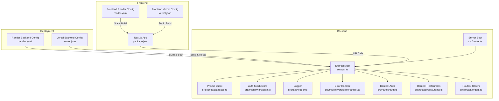
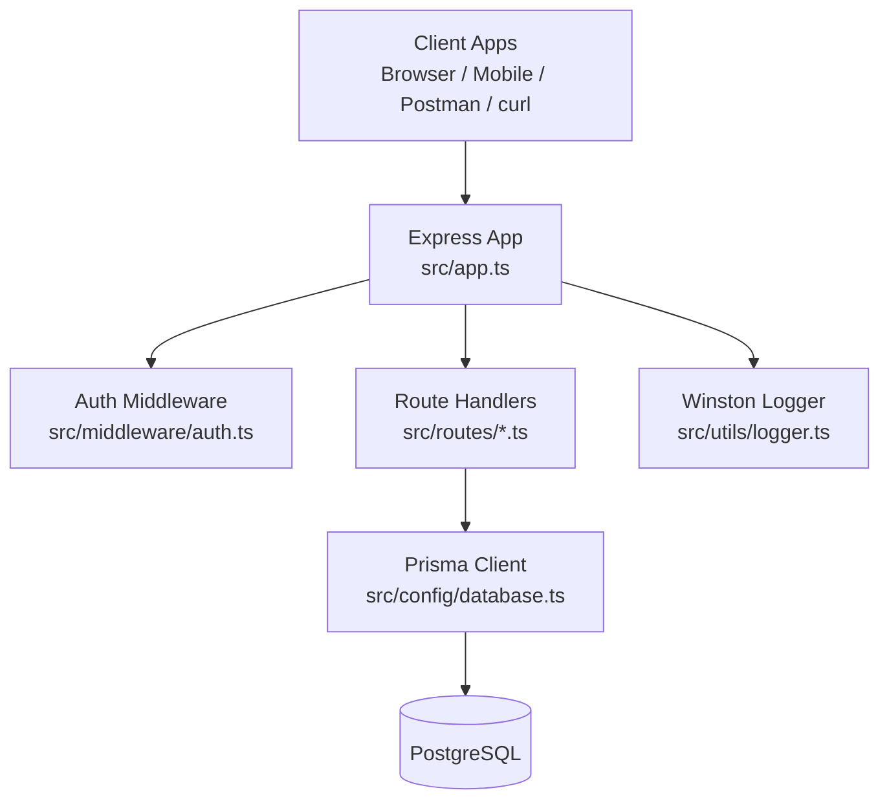
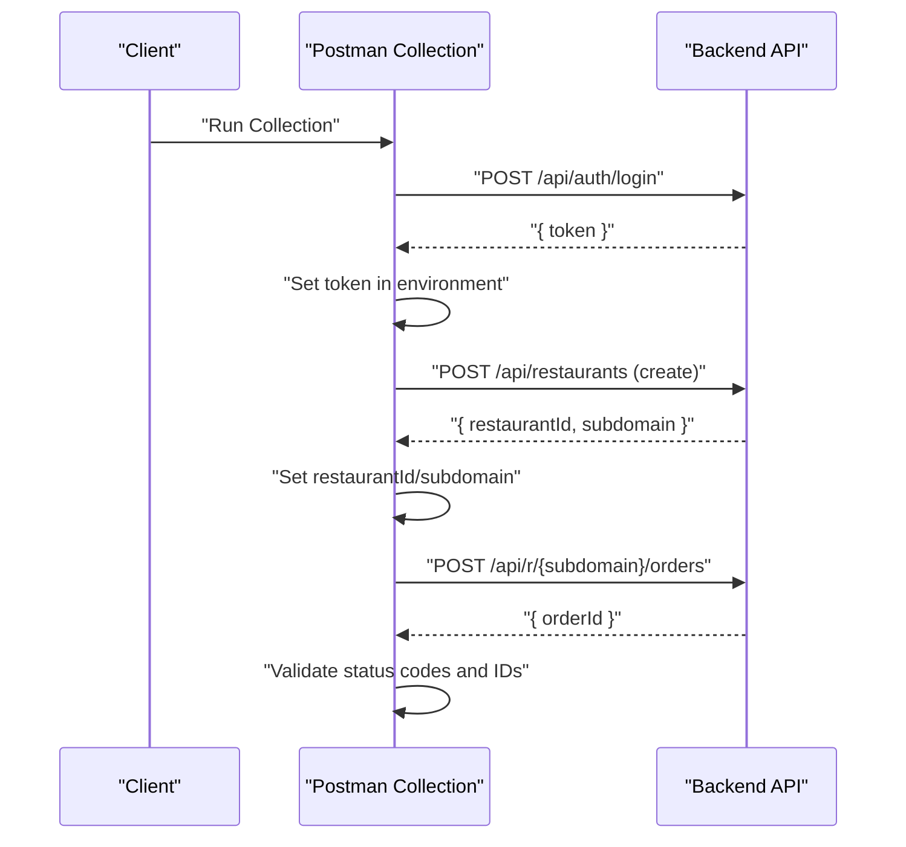
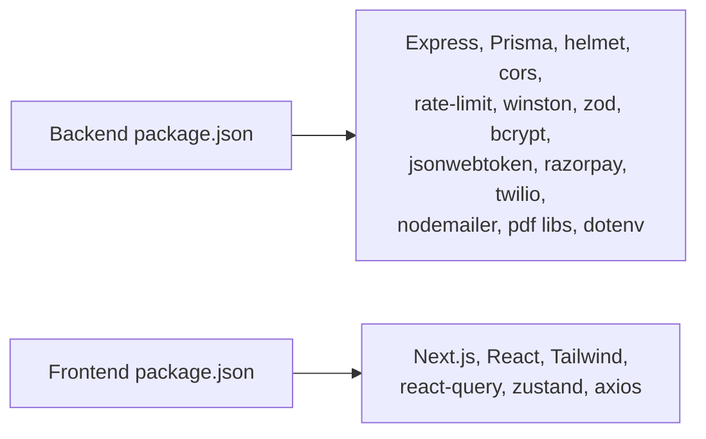

# Testing & Deployment

<cite>
**Referenced Files in This Document**
- [restaurant-backend/package.json](file://restaurant-backend/package.json)
- [restaurant-backend/render.yaml](file://restaurant-backend/render.yaml)
- [restaurant-backend/vercel.json](file://restaurant-backend/vercel.json)
- [restaurant-backend/prisma/schema.prisma](file://restaurant-backend/prisma/schema.prisma)
- [restaurant-backend/src/app.ts](file://restaurant-backend/src/app.ts)
- [restaurant-backend/src/server.ts](file://restaurant-backend/src/server.ts)
- [restaurant-backend/src/config/database.ts](file://restaurant-backend/src/config/database.ts)
- [restaurant-backend/src/utils/logger.ts](file://restaurant-backend/src/utils/logger.ts)
- [restaurant-backend/src/middleware/auth.ts](file://restaurant-backend/src/middleware/auth.ts)
- [restaurant-backend/src/middleware/errorHandler.ts](file://restaurant-backend/src/middleware/errorHandler.ts)
- [restaurant-backend/src/routes/auth.ts](file://restaurant-backend/src/routes/auth.ts)
- [restaurant-backend/src/routes/restaurants.ts](file://restaurant-backend/src/routes/restaurants.ts)
- [restaurant-backend/src/routes/orders.ts](file://restaurant-backend/src/routes/orders.ts)
- [restaurant-backend/postman/DeQ-Restaurants-API.postman_collection.json](file://restaurant-backend/postman/DeQ-Restaurants-API.postman_collection.json)
- [test-order.mjs](file://test-order.mjs)
- [restaurant-frontend/render.yaml](file://restaurant-frontend/render.yaml)
- [restaurant-frontend/vercel.json](file://restaurant-frontend/vercel.json)
- [restaurant-frontend/package.json](file://restaurant-frontend/package.json)
</cite>

## Table of Contents
1. [Introduction](#introduction)
2. [Project Structure](#project-structure)
3. [Core Components](#core-components)
4. [Architecture Overview](#architecture-overview)
5. [Detailed Component Analysis](#detailed-component-analysis)
6. [Dependency Analysis](#dependency-analysis)
7. [Performance Considerations](#performance-considerations)
8. [Troubleshooting Guide](#troubleshooting-guide)
9. [Conclusion](#conclusion)
10. [Appendices](#appendices)

## Introduction
This document provides a comprehensive guide to testing and deployment for DeQ-Bite’s development lifecycle. It covers backend API testing with curl and Postman, frontend testing procedures, integration testing approaches, automated testing and CI considerations, and deployment configuration for Render and Vercel. It also includes production deployment checklists, database migration and rollback procedures, monitoring and logging, performance optimization, DevOps practices, security considerations, backups, and disaster recovery planning.

## Project Structure
DeQ-Bite consists of two primary modules:
- Backend API server built with Express and TypeScript, using Prisma for database operations.
- Frontend application built with Next.js, TypeScript, and React.

Key characteristics:
- Backend exposes REST endpoints under a tenant-aware routing model and supports health checks.
- Frontend integrates with the backend via an API client and manages user sessions and state.
- Both modules support deployment to Render (web services) and Vercel (Node and static builds).

**Diagram sources**
- [restaurant-backend/src/app.ts](file://restaurant-backend/src/app.ts#L1-L148)
- [restaurant-backend/src/server.ts](file://restaurant-backend/src/server.ts#L1-L33)
- [restaurant-backend/src/config/database.ts](file://restaurant-backend/src/config/database.ts#L1-L66)
- [restaurant-backend/src/utils/logger.ts](file://restaurant-backend/src/utils/logger.ts#L1-L56)
- [restaurant-backend/src/middleware/auth.ts](file://restaurant-backend/src/middleware/auth.ts#L1-L137)
- [restaurant-backend/src/middleware/errorHandler.ts](file://restaurant-backend/src/middleware/errorHandler.ts#L1-L82)
- [restaurant-backend/src/routes/auth.ts](file://restaurant-backend/src/routes/auth.ts#L1-L390)
- [restaurant-backend/src/routes/restaurants.ts](file://restaurant-backend/src/routes/restaurants.ts#L1-L554)
- [restaurant-backend/src/routes/orders.ts](file://restaurant-backend/src/routes/orders.ts#L1-L694)
- [restaurant-backend/render.yaml](file://restaurant-backend/render.yaml#L1-L13)
- [restaurant-backend/vercel.json](file://restaurant-backend/vercel.json#L1-L12)
- [restaurant-frontend/render.yaml](file://restaurant-frontend/render.yaml#L1-L10)
- [restaurant-frontend/vercel.json](file://restaurant-frontend/vercel.json#L1-L3)
- [restaurant-frontend/package.json](file://restaurant-frontend/package.json#L1-L54)

**Section sources**
- [restaurant-backend/src/app.ts](file://restaurant-backend/src/app.ts#L1-L148)
- [restaurant-backend/src/server.ts](file://restaurant-backend/src/server.ts#L1-L33)
- [restaurant-backend/render.yaml](file://restaurant-backend/render.yaml#L1-L13)
- [restaurant-backend/vercel.json](file://restaurant-backend/vercel.json#L1-L12)
- [restaurant-frontend/render.yaml](file://restaurant-frontend/render.yaml#L1-L10)
- [restaurant-frontend/vercel.json](file://restaurant-frontend/vercel.json#L1-L3)
- [restaurant-frontend/package.json](file://restaurant-frontend/package.json#L1-L54)

## Core Components
- Express application initialization, middleware stack, and routing:
  - Security headers, CORS, rate limiting, request parsing, and logging.
  - Health endpoint and root endpoint.
  - Tenant-aware routing for restaurant-specific endpoints.
- Authentication and authorization:
  - JWT-based authentication with robust token extraction and verification.
  - Role-based authorization for restaurant-scoped resources.
- Error handling:
  - Centralized error handler with environment-aware logging and response shaping.
- Logging:
  - Winston-based structured logging with console and file transports.
- Database connectivity:
  - Prisma client with production logging and optional Prisma Accelerate extension.
- API coverage:
  - Authentication, restaurants, menus, categories, tables, orders, coupons, offers, payments, invoices, PDF generation, and real-time events.

**Section sources**
- [restaurant-backend/src/app.ts](file://restaurant-backend/src/app.ts#L1-L148)
- [restaurant-backend/src/middleware/auth.ts](file://restaurant-backend/src/middleware/auth.ts#L1-L137)
- [restaurant-backend/src/middleware/errorHandler.ts](file://restaurant-backend/src/middleware/errorHandler.ts#L1-L82)
- [restaurant-backend/src/utils/logger.ts](file://restaurant-backend/src/utils/logger.ts#L1-L56)
- [restaurant-backend/src/config/database.ts](file://restaurant-backend/src/config/database.ts#L1-L66)
- [restaurant-backend/src/routes/auth.ts](file://restaurant-backend/src/routes/auth.ts#L1-L390)
- [restaurant-backend/src/routes/restaurants.ts](file://restaurant-backend/src/routes/restaurants.ts#L1-L554)
- [restaurant-backend/src/routes/orders.ts](file://restaurant-backend/src/routes/orders.ts#L1-L694)

## Architecture Overview
The backend follows a layered architecture:
- HTTP layer: Express app with middleware and routes.
- Domain layer: Route handlers orchestrating Prisma queries and business logic.
- Persistence layer: Prisma client connecting to PostgreSQL.
- Observability: Winston logger and Morgan integration.

**Diagram sources**
- [restaurant-backend/src/app.ts](file://restaurant-backend/src/app.ts#L1-L148)
- [restaurant-backend/src/middleware/auth.ts](file://restaurant-backend/src/middleware/auth.ts#L1-L137)
- [restaurant-backend/src/routes/auth.ts](file://restaurant-backend/src/routes/auth.ts#L1-L390)
- [restaurant-backend/src/routes/restaurants.ts](file://restaurant-backend/src/routes/restaurants.ts#L1-L554)
- [restaurant-backend/src/routes/orders.ts](file://restaurant-backend/src/routes/orders.ts#L1-L694)
- [restaurant-backend/src/config/database.ts](file://restaurant-backend/src/config/database.ts#L1-L66)
- [restaurant-backend/src/utils/logger.ts](file://restaurant-backend/src/utils/logger.ts#L1-L56)

## Detailed Component Analysis

### Backend API Testing Strategy
- Local development:
  - Use curl to exercise endpoints such as health, root, authentication, and order creation.
  - Example flows:
    - Login to obtain a token.
    - Create an order against a tenant subdomain.
- Postman collection:
  - Predefined variables for baseUrl, token, subdomain, restaurantId, orderId, invoiceId, and others.
  - Automated tests set environment variables for dynamic IDs and validate response codes.
- Integration testing:
  - Seed database for repeatable scenarios.
  - Use tenant-aware subdomain headers and bearer tokens.
  - Validate order lifecycle transitions and coupon application.

**Diagram sources**
- [restaurant-backend/postman/DeQ-Restaurants-API.postman_collection.json](file://restaurant-backend/postman/DeQ-Restaurants-API.postman_collection.json#L1-L1079)
- [restaurant-backend/src/routes/auth.ts](file://restaurant-backend/src/routes/auth.ts#L104-L158)
- [restaurant-backend/src/routes/restaurants.ts](file://restaurant-backend/src/routes/restaurants.ts#L307-L375)
- [restaurant-backend/src/routes/orders.ts](file://restaurant-backend/src/routes/orders.ts#L82-L267)

**Section sources**
- [restaurant-backend/postman/DeQ-Restaurants-API.postman_collection.json](file://restaurant-backend/postman/DeQ-Restaurants-API.postman_collection.json#L1-L1079)
- [test-order.mjs](file://test-order.mjs#L1-L58)
- [restaurant-backend/src/routes/auth.ts](file://restaurant-backend/src/routes/auth.ts#L104-L158)
- [restaurant-backend/src/routes/orders.ts](file://restaurant-backend/src/routes/orders.ts#L82-L267)

### Frontend Testing Procedures
- Unit/integration testing:
  - Use Next.js testing utilities and React Testing Library to test components and hooks.
  - Mock API client calls to isolate frontend logic.
- End-to-end testing:
  - Cypress or Playwright to automate user journeys (authentication, menu browsing, placing orders).
- Environment isolation:
  - Configure environment variables per environment (development, staging, production).
- API client testing:
  - Validate axios interceptors, error handling, and token refresh flows.

[No sources needed since this section provides general guidance]

### Integration Testing Approaches
- Database seeding:
  - Use Prisma seed scripts to provision test data for restaurants, users, tables, menu items, and coupons.
- Tenant isolation:
  - Use subdomain headers to simulate tenant contexts during tests.
- Real-time events:
  - Validate emitted events for order updates and kitchen notifications.
- Payment simulation:
  - Use mock providers or sandbox APIs for payment flows.

**Section sources**
- [restaurant-backend/prisma/schema.prisma](file://restaurant-backend/prisma/schema.prisma#L1-L384)
- [restaurant-backend/src/routes/orders.ts](file://restaurant-backend/src/routes/orders.ts#L82-L267)

### Automated Testing Setup and Continuous Integration
- Scripts:
  - Backend: lint, build, start, db migrations, studio, seed, reset.
  - Frontend: lint, type-check, build, start.
- CI considerations:
  - Lint and type-check steps.
  - Database migration in CI with Prisma migrate deploy.
  - Run Postman/newman tests after backend deployment.
  - Frontend build and artifact upload.
- Secrets management:
  - Store JWT_SECRET, DATABASE_URL, and other secrets in CI/CD environment variables.

**Section sources**
- [restaurant-backend/package.json](file://restaurant-backend/package.json#L1-L80)
- [restaurant-frontend/package.json](file://restaurant-frontend/package.json#L1-L54)

### Deployment Configuration: Render
- Backend:
  - Type: web, env: node, buildCommand: npm run build, startCommand: npm start.
  - Environment variables: NODE_ENV=production, PORT=5000, JWT_SECRET (sync=false).
- Frontend:
  - Type: static, env: static, buildCommand: npm run build, startCommand: npm start.
  - staticPublishPath: .next.
  - Environment variables: NODE_ENV=production.

**Section sources**
- [restaurant-backend/render.yaml](file://restaurant-backend/render.yaml#L1-L13)
- [restaurant-frontend/render.yaml](file://restaurant-frontend/render.yaml#L1-L10)

### Deployment Configuration: Vercel
- Backend:
  - Build: @vercel/node targets dist/server.js and routes all paths to it.
- Frontend:
  - Static build with Next.js defaults.

**Section sources**
- [restaurant-backend/vercel.json](file://restaurant-backend/vercel.json#L1-L12)
- [restaurant-frontend/vercel.json](file://restaurant-frontend/vercel.json#L1-L3)

### Production Deployment Checklist
- Pre-deployment
  - Run database migrations and seed if needed.
  - Verify environment variables (JWT_SECRET, DATABASE_URL, FRONTEND_URL).
  - Confirm CORS origins and allowed headers.
- Deploy
  - Trigger Render/Vercel builds and monitor logs.
  - Health check endpoints must return OK.
- Post-deployment
  - Smoke tests via curl and Postman.
  - Validate order creation and payment flow.
  - Monitor logs and error rates.

**Section sources**
- [restaurant-backend/src/app.ts](file://restaurant-backend/src/app.ts#L92-L105)
- [restaurant-backend/src/config/database.ts](file://restaurant-backend/src/config/database.ts#L44-L62)
- [restaurant-backend/src/utils/logger.ts](file://restaurant-backend/src/utils/logger.ts#L1-L56)

### Database Migration and Rollback Procedures
- Migrations
  - Use Prisma migrate dev for local development.
  - Use Prisma migrate deploy in CI/CD for production.
- Rollback
  - Prisma migrate reset (with caution) or manual migration down scripts.
  - Ensure data safety and downtime windows.
- Seed and Studio
  - Use seed scripts for test data; studio for local inspection.

**Section sources**
- [restaurant-backend/package.json](file://restaurant-backend/package.json#L13-L16)
- [restaurant-backend/prisma/schema.prisma](file://restaurant-backend/prisma/schema.prisma#L1-L384)

### Monitoring, Logs, and Performance Optimization
- Monitoring
  - Health endpoint for basic liveness/readiness checks.
  - Application logs via Winston; file rotation in non-serverless environments.
- Log management
  - Console transport plus rotating files; adjust LOG_LEVEL via environment.
- Performance
  - Helmet for security headers; rate limiting to prevent abuse.
  - Optimize Prisma queries and consider Accelerate extension when appropriate.
  - Use CDN for static assets (Vercel/Render).

**Section sources**
- [restaurant-backend/src/app.ts](file://restaurant-backend/src/app.ts#L92-L105)
- [restaurant-backend/src/utils/logger.ts](file://restaurant-backend/src/utils/logger.ts#L1-L56)
- [restaurant-backend/src/config/database.ts](file://restaurant-backend/src/config/database.ts#L1-L66)

### DevOps Practices: CI/CD Pipeline, Automated Deployments, Health Checks
- CI pipeline
  - Lint, type-check, build, test, and database migration.
  - Postman/newman tests against staging or ephemeral environments.
- Automated deployments
  - Branch rules on Render/Vercel to auto-deploy main branch.
  - Use environment-specific configs and secrets.
- Health checks
  - Use GET /health for automated probes.

**Section sources**
- [restaurant-backend/src/app.ts](file://restaurant-backend/src/app.ts#L92-L99)
- [restaurant-backend/package.json](file://restaurant-backend/package.json#L12-L16)

### Security Considerations
- Secrets
  - Never commit JWT_SECRET or DATABASE_URL; manage via platform dashboards.
- Headers and CORS
  - Strict origin validation and allowed headers; block unsafe CSP directives.
- Authentication
  - Require Authorization headers for protected routes; validate tokens.
- Rate limiting
  - Prevent brute force and abuse.

**Section sources**
- [restaurant-backend/src/app.ts](file://restaurant-backend/src/app.ts#L28-L65)
- [restaurant-backend/src/middleware/auth.ts](file://restaurant-backend/src/middleware/auth.ts#L1-L137)

### Backup and Disaster Recovery Planning
- Backups
  - Database snapshots via hosting provider; export Prisma data if needed.
- DR
  - Multi-region deployments; failover DNS; immutable infrastructure.
  - Test restore procedures regularly.

[No sources needed since this section provides general guidance]

## Dependency Analysis
- Backend dependencies include Express, Prisma, helmet, cors, rate limiting, winston, zod, bcrypt, jsonwebtoken, razorpay, twilio, nodemailer, pdf generation libraries, and dotenv.
- Frontend depends on Next.js, React, Tailwind, react-query, zustand, and axios.

**Diagram sources**
- [restaurant-backend/package.json](file://restaurant-backend/package.json#L1-L80)
- [restaurant-frontend/package.json](file://restaurant-frontend/package.json#L1-L54)

**Section sources**
- [restaurant-backend/package.json](file://restaurant-backend/package.json#L1-L80)
- [restaurant-frontend/package.json](file://restaurant-frontend/package.json#L1-L54)

## Performance Considerations
- Optimize Prisma queries with selective field projections and pagination.
- Enable Prisma Accelerate when appropriate and monitor impact.
- Use compression and caching for static assets.
- Tune rate limits and timeouts based on traffic patterns.

[No sources needed since this section provides general guidance]

## Troubleshooting Guide
- Common issues
  - Missing JWT_SECRET in production leads to authentication failures.
  - CORS errors due to unconfigured origins or missing headers.
  - Database connection failures; verify DATABASE_URL/DIRECT_DATABASE_URL.
  - 401/403 responses from unauthorized or insufficient roles.
- Logging
  - Review Winston logs for error stacks and request context.
- Health checks
  - Use GET /health to confirm service availability.

**Section sources**
- [restaurant-backend/src/app.ts](file://restaurant-backend/src/app.ts#L28-L65)
- [restaurant-backend/src/middleware/auth.ts](file://restaurant-backend/src/middleware/auth.ts#L40-L75)
- [restaurant-backend/src/config/database.ts](file://restaurant-backend/src/config/database.ts#L44-L62)
- [restaurant-backend/src/utils/logger.ts](file://restaurant-backend/src/utils/logger.ts#L1-L56)

## Conclusion
This guide outlines a robust testing and deployment strategy for DeQ-Bite, covering backend API testing with curl and Postman, frontend testing, integration testing, automated CI/CD, and production-grade deployment to Render and Vercel. It emphasizes observability, security, database migrations, and operational resilience to ensure reliable and scalable delivery.

## Appendices
- API testing quick-start
  - Use the Postman collection to automate login, restaurant creation, and order flow.
  - Validate environment variables and tenant subdomains.
- Environment variables reference
  - Backend: NODE_ENV, PORT, JWT_SECRET, DATABASE_URL, DIRECT_DATABASE_URL, FRONTEND_URL, LOG_LEVEL.
  - Frontend: NODE_ENV.

[No sources needed since this section provides general guidance]