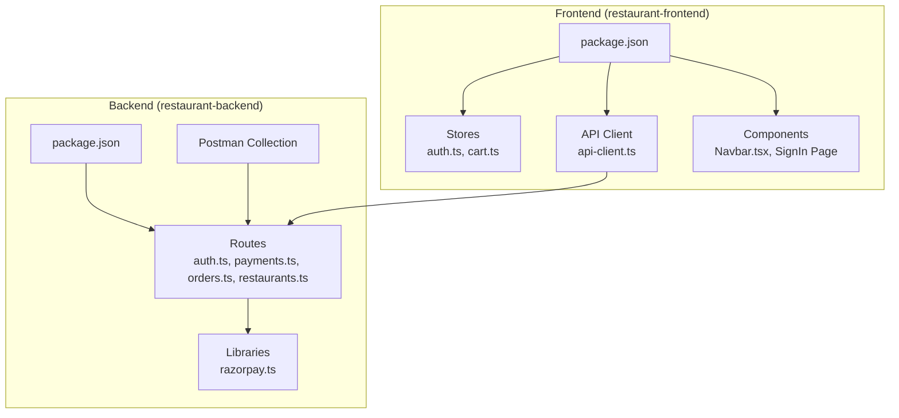
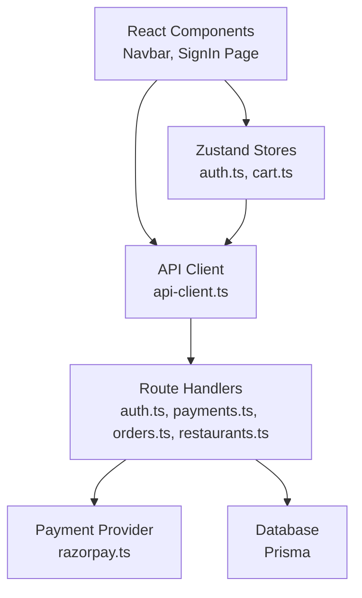
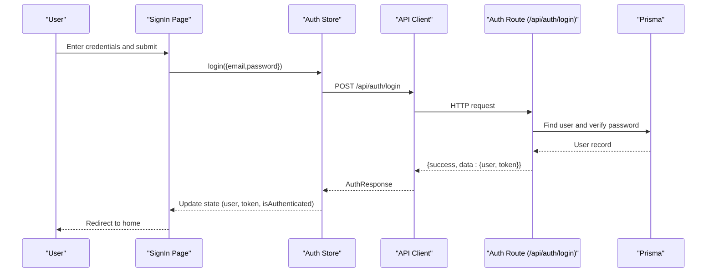
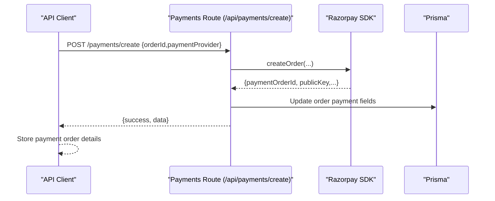
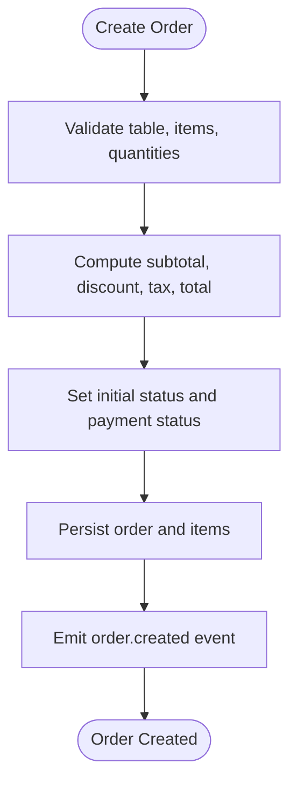
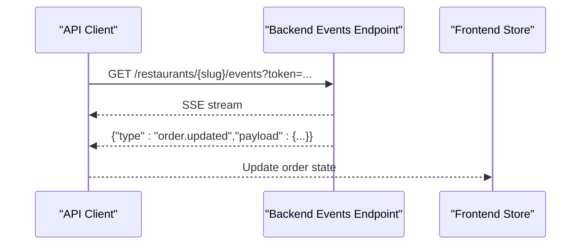
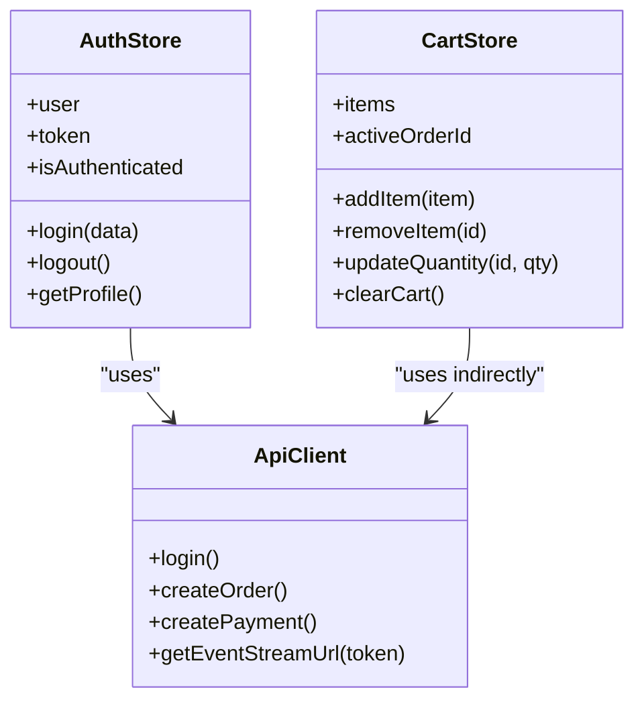
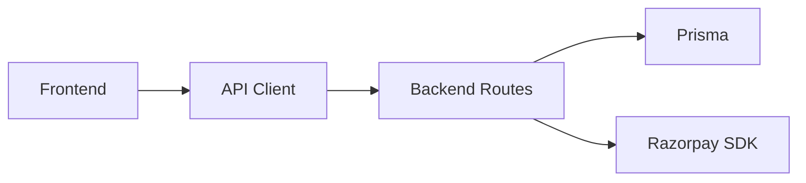

# Testing Strategy

<cite>
**Referenced Files in This Document**
- [README.md](file://README.md)
- [restaurant-backend/package.json](file://restaurant-backend/package.json)
- [restaurant-backend/src/route/auth.ts](file://restaurant-backend/src/route/auth.ts)
- [restaurant-backend/src/route/payments.ts](file://restaurant-backend/src/route/payments.ts)
- [restaurant-backend/src/route/orders.ts](file://restaurant-backend/src/route/orders.ts)
- [restaurant-backend/src/route/restaurants.ts](file://restaurant-backend/src/route/restaurants.ts)
- [restaurant-backend/src/lib/razorpay.ts](file://restaurant-backend/src/lib/razorpay.ts)
- [restaurant-backend/postman/DeQ-Restaurants-API.postman_collection.json](file://restaurant-backend/postman/DeQ-Restaurants-API.postman_collection.json)
- [test-order.mjs](file://test-order.mjs)
- [restaurant-frontend/package.json](file://restaurant-frontend/package.json)
- [restaurant-frontend/src/store/auth.ts](file://restaurant-frontend/src/store/auth.ts)
- [restaurant-frontend/src/store/cart.ts](file://restaurant-frontend/src/store/cart.ts)
- [restaurant-frontend/src/lib/api-client.ts](file://restaurant-frontend/src/lib/api-client.ts)
- [restaurant-frontend/src/components/Navbar.tsx](file://restaurant-frontend/src/components/Navbar.tsx)
- [restaurant-frontend/src/app/auth/signin/page.tsx](file://restaurant-frontend/src/app/auth/signin/page.tsx)
</cite>

## Table of Contents
1. [Introduction](#introduction)
2. [Project Structure](#project-structure)
3. [Core Components](#core-components)
4. [Architecture Overview](#architecture-overview)
5. [Detailed Component Analysis](#detailed-component-analysis)
6. [Dependency Analysis](#dependency-analysis)
7. [Performance Considerations](#performance-considerations)
8. [Troubleshooting Guide](#troubleshooting-guide)
9. [Conclusion](#conclusion)
10. [Appendices](#appendices)

## Introduction
This document defines a comprehensive testing strategy for DeQ-Bite’s restaurant management system. It covers multi-layered testing across:
- Unit tests for backend route handlers and frontend stores
- Integration tests for API endpoints and tenant-aware routes
- End-to-end tests for complete user workflows (authentication, ordering, payment, invoicing)
- Manual validation using curl and Postman
- Automated test scripts for order placement, payment processing, and real-time updates
- Frontend testing strategies for React components, Zustand stores, and authentication flows
- Best practices for database operations, payment gateway testing, and real-time feature validation
- Test data management, mocking external services, and performance testing approaches
- Environment setup, seeding, and regression testing procedures

## Project Structure
The system is split into two independent services:
- Backend API server (Express.js + TypeScript + Prisma) under restaurant-backend/
- Frontend application (Next.js + React + TypeScript) under restaurant-frontend/

**Diagram sources**
- [restaurant-backend/package.json:1-80](file://restaurant-backend/package.json#L1-L80)
- [restaurant-backend/src/route/auth.ts:1-390](file://restaurant-backend/src/route/auth.ts#L1-L390)
- [restaurant-backend/src/route/payments.ts:1-731](file://restaurant-backend/src/route/payments.ts#L1-L731)
- [restaurant-backend/src/route/orders.ts:1-694](file://restaurant-backend/src/route/orders.ts#L1-L694)
- [restaurant-backend/src/route/restaurants.ts:1-554](file://restaurant-backend/src/route/restaurants.ts#L1-L554)
- [restaurant-backend/src/lib/razorpay.ts:1-219](file://restaurant-backend/src/lib/razorpay.ts#L1-L219)
- [restaurant-backend/postman/DeQ-Restaurants-API.postman_collection.json:1-1079](file://restaurant-backend/postman/DeQ-Restaurants-API.postman_collection.json#L1-L1079)
- [restaurant-frontend/package.json:1-54](file://restaurant-frontend/package.json#L1-L54)
- [restaurant-frontend/src/store/auth.ts:1-177](file://restaurant-frontend/src/store/auth.ts#L1-L177)
- [restaurant-frontend/src/store/cart.ts:1-92](file://restaurant-frontend/src/store/cart.ts#L1-L92)
- [restaurant-frontend/src/lib/api-client.ts:1-894](file://restaurant-frontend/src/lib/api-client.ts#L1-L894)
- [restaurant-frontend/src/components/Navbar.tsx:1-197](file://restaurant-frontend/src/components/Navbar.tsx#L1-L197)
- [restaurant-frontend/src/app/auth/signin/page.tsx:1-165](file://restaurant-frontend/src/app/auth/signin/page.tsx#L1-L165)

**Section sources**
- [README.md:65-99](file://README.md#L65-L99)
- [restaurant-backend/package.json:1-80](file://restaurant-backend/package.json#L1-L80)
- [restaurant-frontend/package.json:1-54](file://restaurant-frontend/package.json#L1-L54)

## Core Components
- Backend routes: Authentication, Payments, Orders, Restaurants, and supporting utilities
- Frontend stores: Authentication and Cart state management with persistence
- API client: Tenant-aware HTTP client with interceptors and event stream support
- Payment gateway: Razorpay integration with order creation, verification, capture, refund, and webhook validation
- Manual test harnesses: curl commands and Postman collection
- Automated test script: Order placement automation

**Section sources**
- [restaurant-backend/src/route/auth.ts:1-390](file://restaurant-backend/src/route/auth.ts#L1-L390)
- [restaurant-backend/src/route/payments.ts:1-731](file://restaurant-backend/src/route/payments.ts#L1-L731)
- [restaurant-backend/src/route/orders.ts:1-694](file://restaurant-backend/src/route/orders.ts#L1-L694)
- [restaurant-backend/src/route/restaurants.ts:1-554](file://restaurant-backend/src/route/restaurants.ts#L1-L554)
- [restaurant-backend/src/lib/razorpay.ts:1-219](file://restaurant-backend/src/lib/razorpay.ts#L1-L219)
- [restaurant-frontend/src/store/auth.ts:1-177](file://restaurant-frontend/src/store/auth.ts#L1-L177)
- [restaurant-frontend/src/store/cart.ts:1-92](file://restaurant-frontend/src/store/cart.ts#L1-L92)
- [restaurant-frontend/src/lib/api-client.ts:1-894](file://restaurant-frontend/src/lib/api-client.ts#L1-L894)
- [restaurant-backend/postman/DeQ-Restaurants-API.postman_collection.json:1-1079](file://restaurant-backend/postman/DeQ-Restaurants-API.postman_collection.json#L1-L1079)
- [test-order.mjs:1-58](file://test-order.mjs#L1-L58)

## Architecture Overview
The testing strategy aligns with the layered architecture:
- Presentation layer: React components and stores
- Application layer: API client and route handlers
- Domain and infrastructure: Prisma ORM, payment provider SDKs, and logging

**Diagram sources**
- [restaurant-frontend/src/components/Navbar.tsx:1-197](file://restaurant-frontend/src/components/Navbar.tsx#L1-L197)
- [restaurant-frontend/src/app/auth/signin/page.tsx:1-165](file://restaurant-frontend/src/app/auth/signin/page.tsx#L1-L165)
- [restaurant-frontend/src/store/auth.ts:1-177](file://restaurant-frontend/src/store/auth.ts#L1-L177)
- [restaurant-frontend/src/store/cart.ts:1-92](file://restaurant-frontend/src/store/cart.ts#L1-L92)
- [restaurant-frontend/src/lib/api-client.ts:1-894](file://restaurant-frontend/src/lib/api-client.ts#L1-L894)
- [restaurant-backend/src/route/auth.ts:1-390](file://restaurant-backend/src/route/auth.ts#L1-L390)
- [restaurant-backend/src/route/payments.ts:1-731](file://restaurant-backend/src/route/payments.ts#L1-L731)
- [restaurant-backend/src/route/orders.ts:1-694](file://restaurant-backend/src/route/orders.ts#L1-L694)
- [restaurant-backend/src/route/restaurants.ts:1-554](file://restaurant-backend/src/route/restaurants.ts#L1-L554)
- [restaurant-backend/src/lib/razorpay.ts:1-219](file://restaurant-backend/src/lib/razorpay.ts#L1-L219)

## Detailed Component Analysis

### Authentication Flow Testing
Manual validation:
- Health checks and login via curl
- Postman collection includes register, login, profile, and token refresh flows

Automated validation:
- Frontend sign-in form triggers Zustand auth store actions
- API client sets Authorization headers and handles 401 redirects

**Diagram sources**
- [restaurant-frontend/src/app/auth/signin/page.tsx:1-165](file://restaurant-frontend/src/app/auth/signin/page.tsx#L1-L165)
- [restaurant-frontend/src/store/auth.ts:1-177](file://restaurant-frontend/src/store/auth.ts#L1-L177)
- [restaurant-frontend/src/lib/api-client.ts:332-378](file://restaurant-frontend/src/lib/api-client.ts#L332-L378)
- [restaurant-backend/src/route/auth.ts:104-158](file://restaurant-backend/src/route/auth.ts#L104-L158)

**Section sources**
- [README.md:159-178](file://README.md#L159-L178)
- [restaurant-backend/postman/DeQ-Restaurants-API.postman_collection.json:74-196](file://restaurant-backend/postman/DeQ-Restaurants-API.postman_collection.json#L74-L196)
- [restaurant-frontend/src/app/auth/signin/page.tsx:1-165](file://restaurant-frontend/src/app/auth/signin/page.tsx#L1-L165)
- [restaurant-frontend/src/store/auth.ts:1-177](file://restaurant-frontend/src/store/auth.ts#L1-L177)
- [restaurant-frontend/src/lib/api-client.ts:332-378](file://restaurant-frontend/src/lib/api-client.ts#L332-L378)
- [restaurant-backend/src/route/auth.ts:104-158](file://restaurant-backend/src/route/auth.ts#L104-L158)

### Payment Processing Testing
Manual validation:
- Create payment order and verify payment via curl
- Postman collection includes payment providers, create, verify, status, and cash confirmation endpoints

Automated validation:
- API client methods for createPayment, verifyPayment, getPaymentStatus
- Razorpay integration with order creation, signature verification, capture, refund, and webhook validation

**Diagram sources**
- [restaurant-frontend/src/lib/api-client.ts:380-440](file://restaurant-frontend/src/lib/api-client.ts#L380-L440)
- [restaurant-backend/src/route/payments.ts:195-292](file://restaurant-backend/src/route/payments.ts#L195-L292)
- [restaurant-backend/src/lib/razorpay.ts:33-60](file://restaurant-backend/src/lib/razorpay.ts#L33-L60)

**Section sources**
- [README.md:116-125](file://README.md#L116-L125)
- [restaurant-backend/postman/DeQ-Restaurants-API.postman_collection.json:562-714](file://restaurant-backend/postman/DeQ-Restaurants-API.postman_collection.json#L562-L714)
- [restaurant-frontend/src/lib/api-client.ts:380-440](file://restaurant-frontend/src/lib/api-client.ts#L380-L440)
- [restaurant-backend/src/route/payments.ts:195-292](file://restaurant-backend/src/route/payments.ts#L195-L292)
- [restaurant-backend/src/lib/razorpay.ts:33-60](file://restaurant-backend/src/lib/razorpay.ts#L33-L60)

### Order Management Testing
Manual validation:
- Create orders and manage order lifecycle via curl
- Postman collection includes order creation, add items, apply coupon, status updates, and cancellation

Automated validation:
- API client methods for createOrder, addOrderItems, applyCouponToOrder, updateOrderStatus, cancelOrder
- Order calculation logic (tax, discount, totals) and payment collection timing enforcement

**Diagram sources**
- [restaurant-backend/src/route/orders.ts:82-267](file://restaurant-backend/src/route/orders.ts#L82-L267)

**Section sources**
- [restaurant-backend/postman/DeQ-Restaurants-API.postman_collection.json:562-714](file://restaurant-backend/postman/DeQ-Restaurants-API.postman_collection.json#L562-L714)
- [restaurant-frontend/src/lib/api-client.ts:594-647](file://restaurant-frontend/src/lib/api-client.ts#L594-L647)
- [restaurant-backend/src/route/orders.ts:82-267](file://restaurant-backend/src/route/orders.ts#L82-L267)

### Real-Time Communication Testing
Manual validation:
- Event stream URL construction and token-based access
- Emit and listen to order events for real-time updates

Automated validation:
- API client exposes getEventStreamUrl(token)
- Backend emits order.created and order.updated events

**Diagram sources**
- [restaurant-frontend/src/lib/api-client.ts:324-329](file://restaurant-frontend/src/lib/api-client.ts#L324-L329)
- [restaurant-backend/src/route/orders.ts:254-257](file://restaurant-backend/src/route/orders.ts#L254-L257)

**Section sources**
- [restaurant-frontend/src/lib/api-client.ts:324-329](file://restaurant-frontend/src/lib/api-client.ts#L324-L329)
- [restaurant-backend/src/route/orders.ts:254-257](file://restaurant-backend/src/route/orders.ts#L254-L257)

### Frontend Component Testing Strategies
- Navbar: Navigation, cart badge, and user dropdown rendering and behavior
- SignIn Page: Form submission, credential filling, and error handling
- Zustand stores: Isolated unit tests for store actions and selectors

**Diagram sources**
- [restaurant-frontend/src/store/auth.ts:1-177](file://restaurant-frontend/src/store/auth.ts#L1-L177)
- [restaurant-frontend/src/store/cart.ts:1-92](file://restaurant-frontend/src/store/cart.ts#L1-L92)
- [restaurant-frontend/src/lib/api-client.ts:194-894](file://restaurant-frontend/src/lib/api-client.ts#L194-L894)

**Section sources**
- [restaurant-frontend/src/components/Navbar.tsx:1-197](file://restaurant-frontend/src/components/Navbar.tsx#L1-L197)
- [restaurant-frontend/src/app/auth/signin/page.tsx:1-165](file://restaurant-frontend/src/app/auth/signin/page.tsx#L1-L165)
- [restaurant-frontend/src/store/auth.ts:1-177](file://restaurant-frontend/src/store/auth.ts#L1-L177)
- [restaurant-frontend/src/store/cart.ts:1-92](file://restaurant-frontend/src/store/cart.ts#L1-L92)
- [restaurant-frontend/src/lib/api-client.ts:194-894](file://restaurant-frontend/src/lib/api-client.ts#L194-L894)

## Dependency Analysis
- Backend depends on Prisma for data access and Razorpay SDK for payment operations
- Frontend depends on Axios for HTTP requests and Zustand for state management
- Tenant routing: Backend routes accept restaurant identifiers via URL or headers; API client builds tenant endpoints dynamically

**Diagram sources**
- [restaurant-frontend/src/lib/api-client.ts:194-322](file://restaurant-frontend/src/lib/api-client.ts#L194-L322)
- [restaurant-backend/src/route/restaurants.ts:307-375](file://restaurant-backend/src/route/restaurants.ts#L307-L375)
- [restaurant-backend/src/lib/razorpay.ts:1-219](file://restaurant-backend/src/lib/razorpay.ts#L1-L219)

**Section sources**
- [restaurant-backend/src/route/restaurants.ts:307-375](file://restaurant-backend/src/route/restaurants.ts#L307-L375)
- [restaurant-frontend/src/lib/api-client.ts:305-322](file://restaurant-frontend/src/lib/api-client.ts#L305-L322)

## Performance Considerations
- API response caching strategies and optimized database queries are part of the documented performance optimizations
- Frontend uses React Query and efficient state management to minimize re-renders
- Recommendations:
  - Use database connection pooling with Prisma
  - Implement CDN-ready frontend assets
  - Apply code splitting and lazy loading
  - Monitor backend logs and payment audit trails

[No sources needed since this section provides general guidance]

## Troubleshooting Guide
Common issues and resolutions:
- Backend logs and error tracking with Winston logger and file rotation
- Payment audit logs and security event tracking
- Environment configuration verification
- API endpoint testing and payment gateway settings review

**Section sources**
- [README.md:207-213](file://README.md#L207-L213)

## Conclusion
This testing strategy ensures robust coverage across authentication, ordering, payment, and real-time features. It combines manual validation with automated scripts and structured Postman collections, while leveraging frontend stores and tenant-aware API client patterns. The approach supports regression testing, environment setup, and performance validation aligned with the system’s architecture.

[No sources needed since this section summarizes without analyzing specific files]

## Appendices

### Manual Testing Procedures
- Health checks and authentication via curl
- Postman collection for comprehensive endpoint validation

**Section sources**
- [README.md:159-178](file://README.md#L159-L178)
- [restaurant-backend/postman/DeQ-Restaurants-API.postman_collection.json:53-72](file://restaurant-backend/postman/DeQ-Restaurants-API.postman_collection.json#L53-L72)

### Automated Testing Setup
- Order placement automation script
- API client methods for tenant-aware endpoints

**Section sources**
- [test-order.mjs:1-58](file://test-order.mjs#L1-L58)
- [restaurant-frontend/src/lib/api-client.ts:594-647](file://restaurant-frontend/src/lib/api-client.ts#L594-L647)

### Database Operations and Seeding
- Prisma schema and seed scripts for test data
- Scripts for migration, studio, seed, and reset

**Section sources**
- [restaurant-backend/package.json:13-16](file://restaurant-backend/package.json#L13-L16)

### Payment Gateway Testing
- Razorpay order creation, verification, capture, refund, and webhook validation
- Signature verification and error logging

**Section sources**
- [restaurant-backend/src/lib/razorpay.ts:33-105](file://restaurant-backend/src/lib/razorpay.ts#L33-L105)
- [restaurant-backend/src/route/payments.ts:294-407](file://restaurant-backend/src/route/payments.ts#L294-L407)

### Real-Time Feature Validation
- Event stream URL construction and token-based access
- Order event emission and consumption

**Section sources**
- [restaurant-frontend/src/lib/api-client.ts:324-329](file://restaurant-frontend/src/lib/api-client.ts#L324-L329)
- [restaurant-backend/src/route/orders.ts:254-257](file://restaurant-backend/src/route/orders.ts#L254-L257)

### Frontend Testing Strategies
- Zustand store unit tests for auth and cart
- Component tests for Navbar and SignIn Page
- API client interceptors and tenant endpoint building

**Section sources**
- [restaurant-frontend/src/store/auth.ts:1-177](file://restaurant-frontend/src/store/auth.ts#L1-L177)
- [restaurant-frontend/src/store/cart.ts:1-92](file://restaurant-frontend/src/store/cart.ts#L1-L92)
- [restaurant-frontend/src/components/Navbar.tsx:1-197](file://restaurant-frontend/src/components/Navbar.tsx#L1-L197)
- [restaurant-frontend/src/app/auth/signin/page.tsx:1-165](file://restaurant-frontend/src/app/auth/signin/page.tsx#L1-L165)
- [restaurant-frontend/src/lib/api-client.ts:194-322](file://restaurant-frontend/src/lib/api-client.ts#L194-L322)